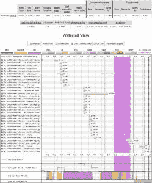
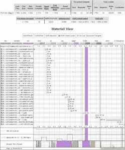
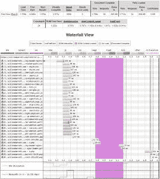

# 用 WordPress 激活 HTTP/2 服务器推送

> 原文:[https://dev . to/Collin Barrett/activating-http-2-server-push-with-WordPress-40ic](https://dev.to/collinbarrett/activating-http-2-server-push-with-wordpress-40ic)

[T2】](https://collinmbarrett.com/http2-server-push-wordpress/)

## HTTP/2 服务器推送引物

新 HTTP/2 规范的一个好处是[服务器推送](https://httpwg.org/specs/rfc7540.html#PushResources)。我断断续续地尝试了这个特性一段时间，但我想实际运行一些快速的性能分析，并记录一种在 NGINX 托管的 WordPress 站点上实现它的方法。传统上，加载页面的核心过程包括以下内容:

1.  浏览器请求页面根文档
2.  服务器发送页面根文档
3.  浏览器解析根文档并请求任何附加资源
4.  服务器发送附加资源

有了 HTTP/2 服务器推送，第 3 步基本上就不用做了。当服务器收到对文档的请求时，它现在可以预测浏览器将请求哪些附加资源来完成页面的呈现，并在浏览器请求它们之前发送这些资源。这听起来像是理论上的性能提升；但是，在我的快速测试中，我发现里程数有所不同。

## 初始测试结果

使用神奇的 [WebPageTest](https://www.webpagetest.org/) 工具，我执行了三个测试批次，每个批次运行九次。

### 汇总数据

下表显示了每批中值运行的汇总结果(标记为“平均值”的行除外，该行是所有九次运行的平均值)。对于第一批测试，我使用我构建到我的站点中的所有其他性能特性来运行测试，包括 HTTP/2、为 HTTP/2 服务器推送保存。第二批对所有脚本和样式表使用 HTTP/2 服务器推送。最后一批添加了 HTTP/2 服务器推。woff 和. woff2 字体文件以及站点 logo .png。

| 中位数游程 | [无](https://www.webpagetest.org/result/170615_1Q_2JV/3/details/#waterfall_view_step1) | [JS & CSS](https://www.webpagetest.org/result/170615_2A_2H5/7/details/#waterfall_view_step1) | [JS，CSS，字体，Logo](https://www.webpagetest.org/result/170615_8F_2CP/9/details/#waterfall_view_step1) |
| --- | --- | --- | --- |
| 装入时间 | 1.588 秒 | 1.709 秒 | One point seven zero six |
| 加载时间(9 次运行的平均值) | 1.401 秒 | 1.834s | 1.897 秒 |
| 第一个字节 | 0.250 秒 | 0.236 秒 | 0.286 秒 |
| 开始渲染 | 1.366 秒 | 1.282 秒 | 1.579 秒 |
| 视觉上完整 | 2.168 秒 | 2.171 秒 | 2.571 秒 |
| 网页测试速度指数 | One thousand seven hundred and eighty-nine | One thousand seven hundred and forty | Two thousand and fifty-nine |
| 文件完成时间 | 1.588 秒 | 1.709 秒 | 1.706 秒 |
| 满载时间 | 1.631s | 1.750 秒 | 1.712 秒 |

我期望在那个表中速度从左到右提高。不幸的是，情况并非如此。可以说，第二批(推送脚本和样式表)在某些指标上确实优于 WebPageTest 速度指数，但是对于这个特定的页面来说，完全不使用 HTTP/2 服务器推送似乎是性能最好的。

### 瀑布

瀑布图(点击放大)是你能真正看到这个特性在做什么的地方。当没有资产被推送时，资源由整个往返请求/响应生命周期接收，而不是全部并行。

<figure>[](https://collinmbarrett.com/media/noServerPush_collinmbarrett.jpg) 

<figcaption id="caption-attachment-4222">无 HTTP/2 服务器推送瀑布—[网页测试](https://www.webpagetest.org/result/170615_1Q_2JV/3/details/#waterfall_view_step1)</figcaption>

</figure>

对脚本和样式表应用 HTTP/2 服务器推送可以并行下载所有这些资源，并且它们需要的获取时间要少得多。现在，从浏览器的角度来看，文件下载的平均时间约为 10 毫秒，相比之下，不推送时的下载时间更接近 25 毫秒。如果我没有使用全局 CDN (Cloudflare)从客户端附近的节点交付资产，这种差异可能会更大。

<figure>[](https://collinmbarrett.com/media/scriptsStylesheetsServerPush_collinmbarrett.jpg) 

<figcaption id="caption-attachment-4223">HTTP/2 服务器推送脚本&样式表瀑布-[网页测试](https://www.webpagetest.org/result/170615_2A_2H5/7/details/#waterfall_view_step1)</figcaption>

</figure>

当我对字体和徽标应用 HTTP/2 服务器推送时，真正的中值运行。巴布亚新几内亚也产生了一点异常瀑布。正如您在下面看到的，所有这些资产都像我们预期的那样被立即并行下载。然而，资产的下载时间比预期的要长得多。但是，如果我们查看批处理中的[所有其他运行，这似乎是由于某种侥幸(比如网络拥塞)。](https://www.webpagetest.org/result/170615_8F_2CP/)

<figure>[](https://collinmbarrett.com/media/allServerPush_collinmbarrett.jpg) 

<figcaption id="caption-attachment-4224">HTTP/2 服务器推送脚本、样式表、字体、& Logo 瀑布—[web page test](https://www.webpagetest.org/result/170615_8F_2CP/9/details/#waterfall_view_step1)</figcaption>

</figure>

当然，这是一个快速的不科学的测试，但它似乎表明，至少对于这个特定的页面，HTTP/2 服务器推送产生了关于性能变化的混合反馈。我需要在多种设备和多种网络连接上测试这一点，以更好地了解它是否是一个守护者。

## WordPress 实现

不幸的是，对资源应用 HTTP/2 服务器推送并不是自动的。目前，您必须提示手动推送哪些资源。关键的先决条件是您的 web 服务器支持 HTTP/2。

对于 WordPress，我测试过的两个插件可以自动处理脚本和样式表。HTTP/2 服务器推送是一个出色的独立插件。安装并激活它，它应该立即生效。

如果你是 CloudFlare 用户， [CloudfLare 插件](https://wordpress.org/plugins/cloudflare/)可以做基本相同的事情，而不需要安装第二个插件。要用这个插件启用 HTTP/2 服务器推送，只需将下面的代码行添加到 wp-config.php。更多信息[在这里](https://support.cloudflare.com/hc/en-us/articles/115002816808-How-do-I-enable-HTTP-2-Server-Push-in-WordPress)。

```
define('CLOUDFLARE_HTTP2_SERVER_PUSH_ACTIVE', true); 
```

<svg width="20px" height="20px" viewBox="0 0 24 24" class="highlight-action crayons-icon highlight-action--fullscreen-on"><title>Enter fullscreen mode</title></svg> <svg width="20px" height="20px" viewBox="0 0 24 24" class="highlight-action crayons-icon highlight-action--fullscreen-off"><title>Exit fullscreen mode</title></svg>

然而，这些插件只能对脚本和样式表应用必要的提示。我的理解是，这是由于 WordPress 资源当前的排队架构。但是，如果您使用 NGINX 作为 web 服务器，您可以通过 NGINX 的服务器块中的头来添加提示。会议文件。像下面这样的应该可以做到。

```
add_header link "</media/logo_collinmbarrett.png>; rel=preload; as=image";
add_header link "</wp-content/themes/collinmbarrett/fonts/lato-regular-webfont.woff2>; rel=preload; as=font; crossorigin"; 
```

<svg width="20px" height="20px" viewBox="0 0 24 24" class="highlight-action crayons-icon highlight-action--fullscreen-on"><title>Enter fullscreen mode</title></svg> <svg width="20px" height="20px" viewBox="0 0 24 24" class="highlight-action crayons-icon highlight-action--fullscreen-off"><title>Exit fullscreen mode</title></svg>

## 总结

我还没有决定我的策略是推进这个功能。我想爱它，但我更爱结果。我认为这需要具体情况具体分析和调整。尝试一下你的网站，让我知道它是如何为你工作的。