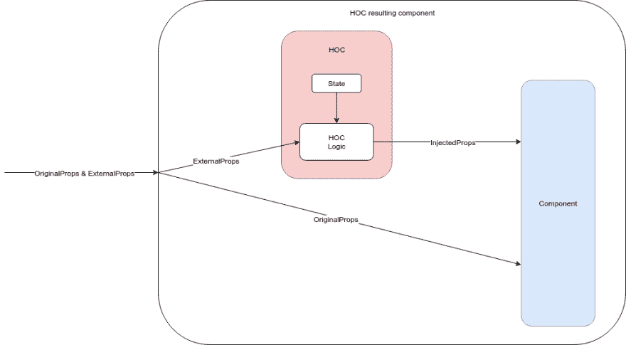

# 使 TypeScript 中的高阶组件反应变得简单

> 原文:[https://dev . to/danhomola/react-higher-order-components-in-typescript-make-simple](https://dev.to/danhomola/react-higher-order-components-in-typescript-made-simple)

*注:此[帖](https://medium.com/@DanHomola/react-higher-order-components-in-typescript-made-simple-6f9b55691af1)原载于[我的媒体简介](https://medium.com/@DanHomola)T5*

在工作中重构 TypeScript 项目中的高阶组件(HOC)时，对于如何正确地编写它们存在一些困惑。在和我的朋友兼同事 [Marek](https://github.com/Murmand) 讨论之后，我决定写下这篇指南以供将来参考。希望对你也有帮助。

## 什么是 hoc？

根据[正式文件](https://facebook.github.io/react/docs/higher-order-components.html)，HOC 为

> 高阶分量是接受一个分量并返回一个新分量的函数

它们用于将多个组件共有的模式提取到一个地方，从而使代码更加[枯燥](https://en.wikipedia.org/wiki/Don%27t_repeat_yourself)。最“著名”的 HOC 是来自 [`react-redux`](https://github.com/reactjs/react-redux) 包的`connect`。

## 怎么写它们？

出于本文的目的，我们将创建自己的 HOC `ClickCounted`来计算点击次数，并将这些点击次数作为道具传递给子组件(我们称之为*包装的*组件)。它还会显示当前的点击次数，并且可以使用`style`道具进行样式化，类似于`div`。最后，我们可以配置组件`console.log`是否每次点击。选择这些属性来说明 HOC 的所有方面，同时尽可能保持 HOC 的简单性。

### 道具

在创建特设时，我们需要考虑三种类型的道具:`OriginalProps`、`ExternalProps`和`InjectedProps`。

*   `OriginalProps`是被包裹组件的道具。它们是直接通过的，特设机构对它们一无所知。

*   `ExternalProps`是由 HOC 创建的组件的道具。它们不会传递给包装的组件。不一定要有。

*   `InjectedProps`是 HOC 添加到包装组件中的道具。它们是基于特设状态和`ExternalProps`计算的。不一定要有。

下图显示了支柱类型之间的关系

[T2】](https://res.cloudinary.com/practicaldev/image/fetch/s--V2oeP1Yv--/c_limit%2Cf_auto%2Cfl_progressive%2Cq_auto%2Cw_880/https://cdn.rawgit.com/no23reason/typescript-hoc-tutorial/89885489561a7f9105226acdb8a3af655621842f/article/props-diagram.svg)

正如我们所看到的，结果组件的道具是类型`OriginalProps & ExternalProps`(即两者的联合)。

对于我们说明性的`ClickCounted` HOC，道具类型有:

```
interface ExternalProps {
    style?: React.CSSProperties;
}

export interface InjectedProps {
    clickCount: number;
} 
```

<svg width="20px" height="20px" viewBox="0 0 24 24" class="highlight-action crayons-icon highlight-action--fullscreen-on"><title>Enter fullscreen mode</title></svg> <svg width="20px" height="20px" viewBox="0 0 24 24" class="highlight-action crayons-icon highlight-action--fullscreen-off"><title>Exit fullscreen mode</title></svg>

需要导出`InjectedProps`,因为我们在使用 HOC 时需要它们(见后面)。HOC 的状态很简单，只是点击次数:

```
interface State {
    clickCount: number;
} 
```

<svg width="20px" height="20px" viewBox="0 0 24 24" class="highlight-action crayons-icon highlight-action--fullscreen-on"><title>Enter fullscreen mode</title></svg> <svg width="20px" height="20px" viewBox="0 0 24 24" class="highlight-action crayons-icon highlight-action--fullscreen-off"><title>Exit fullscreen mode</title></svg>

### 选项

如前所述，HOC 是一个接受一个组件并返回一个组件的函数。

```
Component => Component 
```

<svg width="20px" height="20px" viewBox="0 0 24 24" class="highlight-action crayons-icon highlight-action--fullscreen-on"><title>Enter fullscreen mode</title></svg> <svg width="20px" height="20px" viewBox="0 0 24 24" class="highlight-action crayons-icon highlight-action--fullscreen-off"><title>Exit fullscreen mode</title></svg>

虽然这是真的，但是许多 HOC 采取了 curried HOC factories 的形式(就像前面提到的`react-redux`中的`connect`),它接受一个配置对象并返回一个 HOC:

```
options => Component => Component 
```

<svg width="20px" height="20px" viewBox="0 0 24 24" class="highlight-action crayons-icon highlight-action--fullscreen-on"><title>Enter fullscreen mode</title></svg> <svg width="20px" height="20px" viewBox="0 0 24 24" class="highlight-action crayons-icon highlight-action--fullscreen-off"><title>Exit fullscreen mode</title></svg>

这些选项用于修改特设本身，提供一些*静态*配置值。请注意，这些值不能访问属性或状态，它们只在调用特设工厂时计算一次。如果您需要从这里与道具或状态进行交互，唯一的方法是将选项指定为函数，将道具或状态作为参数。

对于`ClickCounted`来说，选项很简单——一个指示是否点击`console.log`的标志:

```
interface Options {
    debug?: boolean;
} 
```

<svg width="20px" height="20px" viewBox="0 0 24 24" class="highlight-action crayons-icon highlight-action--fullscreen-on"><title>Enter fullscreen mode</title></svg> <svg width="20px" height="20px" viewBox="0 0 24 24" class="highlight-action crayons-icon highlight-action--fullscreen-off"><title>Exit fullscreen mode</title></svg>

## 把所有的东西放在一起

声明了所有必要的类型后，我们可以编写我们的特设签名:

```
export const clickCounted = ({ debug = false }: Options = {}) =>
    <TOriginalProps extends {}>(
        Component: (React.ComponentClass<TOriginalProps & InjectedProps>
                  | React.StatelessComponent<TOriginalProps & InjectedProps>)
    ) => {
        // body
    } 
```

<svg width="20px" height="20px" viewBox="0 0 24 24" class="highlight-action crayons-icon highlight-action--fullscreen-on"><title>Enter fullscreen mode</title></svg> <svg width="20px" height="20px" viewBox="0 0 24 24" class="highlight-action crayons-icon highlight-action--fullscreen-off"><title>Exit fullscreen mode</title></svg>

乍一看这似乎有点复杂，但是让我们一部分一部分地剖析它。

```
({ debug = false }: Options = {}) => 
```

<svg width="20px" height="20px" viewBox="0 0 24 24" class="highlight-action crayons-icon highlight-action--fullscreen-on"><title>Enter fullscreen mode</title></svg> <svg width="20px" height="20px" viewBox="0 0 24 24" class="highlight-action crayons-icon highlight-action--fullscreen-off"><title>Exit fullscreen mode</title></svg>

第一行开始一个 lambda 函数，它接受一个参数，被分解成键(在本例中是`debug`键),同时为它们提供默认值。这意味着调用者可以调用这个函数，或者不带参数，或者只带一个`Options`参数，当没有提供特定键的值时，将使用指定的默认值。

```
<TOriginalProps extends {}>(
        Component: (React.ComponentClass<TOriginalProps & InjectedProps>
                  | React.StatelessComponent<TOriginalProps & InjectedProps>)
    ) => 
```

<svg width="20px" height="20px" viewBox="0 0 24 24" class="highlight-action crayons-icon highlight-action--fullscreen-on"><title>Enter fullscreen mode</title></svg> <svg width="20px" height="20px" viewBox="0 0 24 24" class="highlight-action crayons-icon highlight-action--fullscreen-off"><title>Exit fullscreen mode</title></svg>

第二部分是一个通用的 lambda 函数，带有一个类型参数`TOriginalProps`，表示上面讨论的`OriginalProps`类型。`extends {}`只是一个语法噪音，用来说明这是一个通用的 lambda，而不是一个 JSX 组件标签。lambda 只接受一个名为`Component`的参数(注意它的名字以大写字母开头，这是有意的，我们将在后面的文本中解释原因)，它可以是两种类型之一:

*   `React.ComponentClass<TOriginalProps & InjectedProps>` —用`TOriginalProps & InjectedProps`类型的道具反应类组件
*   `React.StatelessComponent<TOriginalProps & InjectedProps>` —具有相同 props 类型的功能性无状态组件

props 类型对应于图表，其中两种类型的 props 被传递给包装的组件。现在我们有了签名，剩下的就是实现特设的了:

```
export const clickCounted = ({ debug = false }: Options = {}) =>
    <TOriginalProps extends {}>(
        Component: (React.ComponentClass<TOriginalProps & InjectedProps>
                  | React.StatelessComponent<TOriginalProps & InjectedProps>)
    ) => {
        type ResultProps = TOriginalProps & ExternalProps;
        const result = class ClickCounted extends React.Component<ResultProps, State> {
            static displayName = `ClickCounted(${Component.displayName || Component.name})`;

            constructor(props: ResultProps) {
                super(props);
                this.state = {
                    clickCount: 0,
                };
            }

            handleClick = (e: React.MouseEvent<HTMLDivElement>) => {
                if (debug) {
                    console.log('Clicked');
                }
                this.setState(state => ({ clickCount: state.clickCount + 1 }));
            }

            render(): JSX.Element {
                return (
                    <div onClick={this.handleClick} style={this.props.style}>
                        <span>Clicked {this.state.clickCount} times</span>
                        <Component {...this.props} {...this.state} />
                    </div>
                );
            }
        };

        return result;
    }; 
```

<svg width="20px" height="20px" viewBox="0 0 24 24" class="highlight-action crayons-icon highlight-action--fullscreen-on"><title>Enter fullscreen mode</title></svg> <svg width="20px" height="20px" viewBox="0 0 24 24" class="highlight-action crayons-icon highlight-action--fullscreen-off"><title>Exit fullscreen mode</title></svg>

首先，我们为结果组件的 props 定义类型别名——`TOriginalProps & ExternalProps`,以简化其重用。然后，我们将结果组件的类定义为具有这种类型的属性和适当类型的状态。

我们引入了一个名为`displayName`的静态属性，它通过告诉我们被包装组件的名称来帮助我们在调试时识别组件(例如在 ReactDev 工具中)。接下来，我们定义一个简单的构造函数来初始化状态。

定义了`handleClick`方法来增加点击计数，如果`debug`是`options`中的`true`，它会向控制台写入一条消息。

最后，`render`方法被指定返回一个带有`style`属性的`div`和一个指定的点击处理程序。在 div 中，呈现具有当前点击计数的`span`以及包装的组件。这就是`Component`参数以大写字母开始的原因，否则我们就不能这样表达它。道具和状态与来自特设状态的`OriginalProps`和`clickCount`一起传递给它。

## 使用特设

为了说明如何使用我们的 HOC，我们创建了一个`Demo`组件，它根据点击量和自定义消息显示不同的文本。

```
import { clickCounted, InjectedProps } from './ClickCounted';

interface DemoProps {
    text: string;
}

const DemoComponent = (props: DemoProps & InjectedProps): JSX.Element => {
    return (
        <div>
            <p>{props.text}</p>
            <p>
                {
                    props.clickCount >= 5
                        ? 'Easy there!'
                        : 'Bring it!'
                }
            </p>
        </div>
    );
};

export const Demo = clickCounted()(DemoComponent);
export const DemoWithDebug = clickCounted({ debug: true })(DemoComponent); 
```

<svg width="20px" height="20px" viewBox="0 0 24 24" class="highlight-action crayons-icon highlight-action--fullscreen-on"><title>Enter fullscreen mode</title></svg> <svg width="20px" height="20px" viewBox="0 0 24 24" class="highlight-action crayons-icon highlight-action--fullscreen-off"><title>Exit fullscreen mode</title></svg>

注意`props`参数的类型——它由`DemoProps`(即`OriginalProps`)和`InjectedProps`组成。这样，它可以使用从特设或消费者直接传递的道具。

然后我们导出组件的两个包装版本——一个没有调试日志，另一个有调试日志。然后，我们可以像使用任何其他组件一样使用它们，由于 TypeScript，我们可以从类型检查和代码完成等好处中受益。

## 结论

在一个简单的例子中，我们讨论了 TypeScript 中 hoc 的各个方面。有一个包含这个演示的 GitHub 库，您可以下载并使用它来更好地熟悉这些概念:

## [no 23 原因](https://github.com/no23reason) / [打字稿-特设-教程](https://github.com/no23reason/typescript-hoc-tutorial)

### 我的“使 TypeScript 变得简单”一文的代码示例

<article class="markdown-body entry-content container-lg" itemprop="text">

# 在 TypeScript 中反应特别演示

这是与我的关于 React 高阶组件的[中型文章](https://medium.com/@DanHomola/react-higher-order-components-in-typescript-made-simple-6f9b55691af1)相关的回购。

## 如何使用

要自己尝试，只需克隆这个存储库，然后运行

```
yarn install
yarn start 
```

为了获得最佳体验，我推荐使用 [Visual Studio 代码](https://code.visualstudio.com/)。

## 承认

这个项目是用 [Create React App](https://github.com/facebookincubator/create-react-app) 引导的，使用了精彩的 [TypeScript-React-Starter](https://github.com/Microsoft/TypeScript-React-Starter) 项目。

</article>

[View on GitHub](https://github.com/no23reason/typescript-hoc-tutorial)

还有，可以把所有的概念放在一起做一个简单的 HOC 模板(复制一下，填在评论指示的空白处就行):

```
import * as React from 'react';

// State of the HOC you need to compute the InjectedProps
interface State {
}

// Props you want the resulting component to take (besides the props of the wrapped component)
interface ExternalProps {
}

// Props the HOC adds to the wrapped component
export interface InjectedProps {
}

// Options for the HOC factory that are not dependent on props values
interface Options {
    key?: string;
}

export const yourHocFactoryName = ({ key = 'Default value' }: Options = {}) =>
    <TOriginalProps extends {}>(
        Component: (React.ComponentClass<TOriginalProps & InjectedProps>
            | React.StatelessComponent<TOriginalProps & InjectedProps>)
    ) => {
        // Do something with the options here or some side effects

        type ResultProps = TOriginalProps & ExternalProps;
        const result = class YourComponentName extends React.Component<ResultProps, State> {
            // Define how your HOC is shown in ReactDevTools
            static displayName = `YourComponentName(${Component.displayName || Component.name})`;

            constructor(props: ResultProps) {
                super(props);
                this.state = {
                    // Init the state here
                };
            }

            // Implement other methods here

            render(): JSX.Element {
                // Render all your added markup
                return (
                    <div>
                        {/* render the wrapped component like this, passing the props and state */}
                        <Component {...this.props} {...this.state} />
                    </div>
                );
            }
        };

        return result;
    }; 
```

<svg width="20px" height="20px" viewBox="0 0 24 24" class="highlight-action crayons-icon highlight-action--fullscreen-on"><title>Enter fullscreen mode</title></svg> <svg width="20px" height="20px" viewBox="0 0 24 24" class="highlight-action crayons-icon highlight-action--fullscreen-off"><title>Exit fullscreen mode</title></svg>

希望这篇文章对你有用。如有任何问题，欢迎评论。