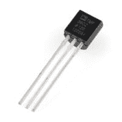
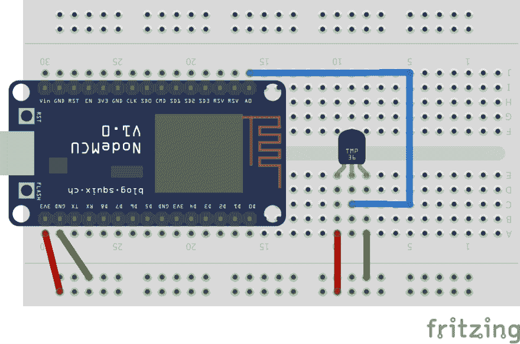
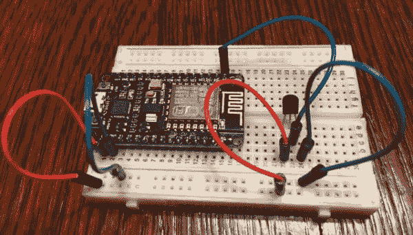
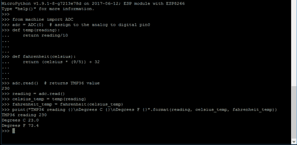

# 微型 Python 温度传感器

> 原文:[https://dev.to/kenwalger/micropython-temperature-sensor](https://dev.to/kenwalger/micropython-temperature-sensor)

在这篇[帖子](https://www.kenwalger.com/blog/iot/micropython-and-nodemcu-esp8266/)中，我展示了一个 IoT 中“Hello World”的例子，一个闪烁的灯。闪烁的灯光很棒，有助于获得良好的视觉体验，但如果我们想用物联网设备做些什么，比如超越视觉的[节点 MCU ESP8266](https://www.amazon.com/gp/product/B01N0B48NI/ref=as_li_tl?ie=UTF8&amp;tag=kenwalgersite-20&amp;camp=1789&amp;creative=9325&amp;linkCode=as2&amp;creativeASIN=B01N0B48NI&amp;linkId=dc1e9f82e2beb42bca36616a22b8820d) 呢？让我们用 NodeMCU 添加一个温度传感器。然后，用 [MicroPython](http://www.micropython.org) ，我们将得到我们的读数。

### 所需设备

要开始这个项目，你需要以下设备:

*   NodeMCU ESP8266
*   [TMP36 模拟](https://www.amazon.com/gp/product/B011NEQ7J4/ref=as_li_tl?ie=UTF8&camp=1789&creative=9325&creativeASIN=B011NEQ7J4&linkCode=as2&tag=kenwalgersite-20&linkId=c8ee5dcc279985c2897c08b0ef5a504f) 温度传感器
*   迷你[试验板 5.5 度—8.2 度—0.85 厘米](https://www.amazon.com/gp/product/B0135IQ0ZC/ref=as_li_tl?ie=UTF8&camp=1789&creative=9325&creativeASIN=B0135IQ0ZC&linkCode=as2&tag=kenwalgersite-20&linkId=bbc58c90bb19ac2c27c2637e36945ee1)T2】
*   [公对公跳线](https://www.amazon.com/gp/product/B005TZJ0AM/ref=as_li_tl?ie=UTF8&camp=1789&creative=9325&creativeASIN=B005TZJ0AM&linkCode=as2&tag=kenwalgersite-20&linkId=92661e6db23b8ee403829d8aa5dfb7ba) 

我发现[这个基本电子元件的套件](https://www.amazon.com/gp/product/B01IH4VJRI/ref=as_li_tl?ie=UTF8&camp=1789&creative=9325&creativeASIN=B01IH4VJRI&linkCode=as2&tag=kenwalgersite-20&linkId=3326e2a9ffcc5d2da8294511c4512f95) [](//ir-na.amazon-adsystem.com/e/ir?t=kenwalgersite-20&l=am2&o=1&a=B01IH4VJRI) 非常适合开始一个人的物联网设备之旅。它不包括 TMP36 温度传感器之类的东西，但它有各种各样最终有用的其他器件。

##### TMP36 规格

由于本项目将使用 TMP36，我们简单讨论一下。

[T2】](https://www.kenwalger.com/blog/wp-content/uploads/2017/06/TMP36-e1497222851900.jpg)

该温度传感器是一个低压传感器，需要 2.7 V 至 5.5 VDC 输入。它从 Vout 引脚返回摄氏温度读数，工作温度范围为-40°C 至+125°C，相当精确，尤其适用于精度为±2°C 的业余爱好/演示场合。你可以在这里下载 TMP36 的规格。

### 温度传感器项目

##### 硬件配置

进行连接时，确保 NodeMCU 与 USB 断开连接。

[T2】](https://www.kenwalger.com/blog/wp-content/uploads/2017/06/temp-sensor-schematic.png)

1.  要将 TMP36 传感器添加到 NodeMCU，我们需要确保其方向正确。温度传感器的平面应该朝向电路板的底部。
2.  将 a8 位置的最右侧引脚连接到电路板上的负供电轨。
3.  负供电轨然后连接到 NodeMCU 上的 GND 引脚(引脚 a29)。
4.  将 TMP36 最左边的引线(a10)连接到正供电轨。
5.  将 NodeMCU 上的 3v3 引脚(a30)连接到正供电轨。
6.  最后，在中心引线(c9)和 NodecMCU (j16)上的 A0 引脚之间连接一根跳线。

[T2】](https://www.kenwalger.com/blog/wp-content/uploads/2017/06/bread_board.png)

NodeMCU 上的 A0 引脚是模数转换(ADC)引脚。

##### 密码

有了硬件方面的东西，让我们看看在 MicroPython 中我们能做些什么来获得温度！幸运的是，MicroPython 的`machine`库让这变得非常简单。

我将在控制台 REPL 工作。然而，如果您在 [WebREPL](https://www.kenwalger.com/blog/iot/micropython-webrepl-esp8266/) 环境中工作，代码应该是相同的。

我们的第一步是处理我们的进口

```
from machine import ADC
```

这带来了我们必需的 ADC 连接，我们可以为此将一个变量赋给`pin 0`

```
adc = ADC(0)
```

我们现在可以用`adc.read()`打印出 TMP36 的值，它返回摄氏温度，差不多。它返回的值是温度的十倍。让我们编写一个函数来处理这种转换。

```
def temp(value):
    return value/10 
```

现在，让我们写一个函数来转换成华氏温度。

```
def fahrenheit(celsius):
    return (celsius * (9/5)) + 32 
```

有了这些，我们就可以得到并显示我们的读数。

```
reading = adc.read()

celsius_temp = temp(reading)

fahrenheit_temp = fahrenheit(celsius_temp)

print("TMP36 reading {}\nDegrees Celsius {}\nDegrees Fahrenheit {}".format(reading, celsius_temp, fahrenheit_temp))
```

在执行完我们的打印语句后，我们应该得到我们的读数。MicroPython 无疑为我们使用 ADC 方法提供了便利。

[T2】](https://www.kenwalger.com/blog/wp-content/uploads/2017/06/temp_sensor_code.png)

为了您的方便，我在 GitHub 上也包含了[代码作为要点。](https://gist.github.com/kenwalger/f94dc82a2e797da372dcbae46fe78ddc)

### 包裹

在本文中，我展示了如何从 TMP36 等模拟温度传感器获取温度读数。只需几行 MicroPython 代码，我们就能获得相当多的功能。这是 MicroPython 的众多优点之一，直接访问硬件通常非常容易。

我认为探索 MicroPython 和 NodeMCU 的下一步将是获取这些温度读数，看看我们是否可以将它们连接到一个服务，如 [Losant](https://www.losant.com) 并生成一些我们温度的可视化。

* * *

在 Twitter [@kenwalger](https://www.twitter.com/kenwalger) 上关注我，获取我在 MicroPython 和 IoT 上发布的最新消息，让我知道你正在用 MicroPython 构建什么。如果你喜欢这篇文章，或者有问题，请在下面留下评论。或者在我的[博客](https://www.kenwalger.com/blog)上看到原文。