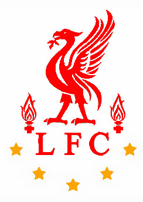
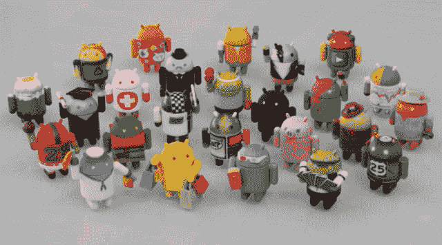

# 嗨，我是 Yossi elk call

> 原文:# t0【https://dev . to/matrix y/hi-im-Yossi-elk call】

我已经工作和编码 11 年了。

你可以在 GitHub 上找到我的名字 [MaTriXy](https://github.com/MaTriXy)

已婚，是两个孩子的骄傲的父亲。我住在啤酒舍瓦。
担任安卓专家和移动团队负责人 [@ Tikal Knowledge](http://www.tikalk.com/)

我创立了 GDG·贝尔舍娃公司，目前领导着该公司

利物浦足球俱乐部球迷:

安卓收藏品收藏家:

也就是母体

很高兴见到你。