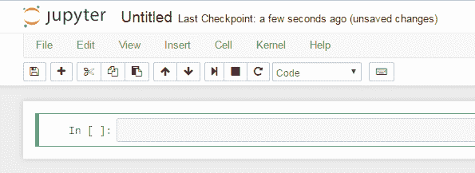
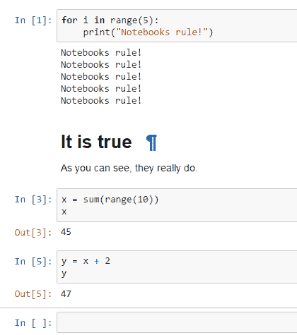
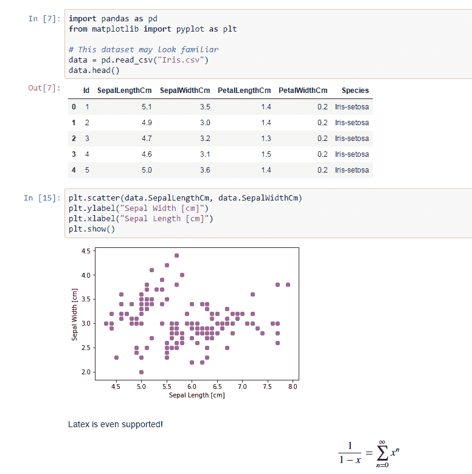
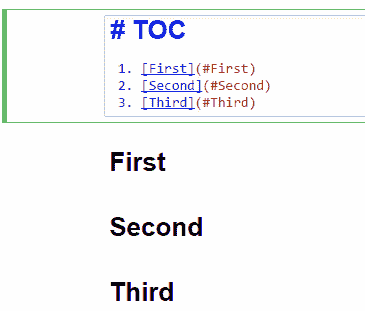
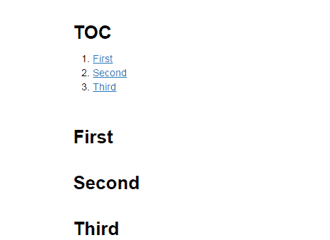

# Jupyter 笔记本是业务

> 原文：<https://dev.to/rpalo/jupyter-notebooks-are-the-business>

这是我知道存在的事情之一，但是我想“哦，这只是科学家和数据人员做科学和数据的事情。”然后我用它为一个讲座(我希望有一天能给它)编写了交互式代码片段，现在我的想法被打破了，从现在开始我可能会用这种方式写我所有的博客帖子。所以事不宜迟:

## Jupyter 笔记本

你可能知道这些。如果你是一名数据科学家，或者学过一些 Python，你可能会看到这些，你可能知道它以前的名字:IPython 笔记本。对于不知道的人来说，它看起来是这样的。

[T2】](https://res.cloudinary.com/practicaldev/image/fetch/s--WbQzslKh--/c_limit%2Cf_auto%2Cfl_progressive%2Cq_auto%2Cw_880/http://assertnotmagic.com/img/jupyter-introduction.png)

太牛逼了。它有单独的单元格，可以编码或降价。代码单元独立运行，但是在同一个名称空间中，因此您可以将变量和数据从一个单元传递到下一个单元。你可以这样做:

[T2】](https://res.cloudinary.com/practicaldev/image/fetch/s--Bw6M2W8h--/c_limit%2Cf_auto%2Cfl_progressive%2Cq_auto%2Cw_880/http://assertnotmagic.com/img/jupyter-1.png)

注意单元格如何输出最后一次评估，而不需要打印语句，就像 REPL 一样。这里还有一些其他很酷的东西。

## 输出漂亮的数据

如果你*正在*处理大量数据，笔记本会内嵌漂亮的表格和图表输出。

[T2】](https://res.cloudinary.com/practicaldev/image/fetch/s--8dgOI4ek--/c_limit%2Cf_auto%2Cfl_progressive%2Cq_auto%2Cw_880/http://assertnotmagic.com/img/jupyter-2.png)

## 内部链接

这个:

[T2】](https://res.cloudinary.com/practicaldev/image/fetch/s--coB7Sevp--/c_limit%2Cf_auto%2Cfl_progressive%2Cq_auto%2Cw_880/http://assertnotmagic.com/img/jupyter-3.png)

渲染到此:

[T2】](https://res.cloudinary.com/practicaldev/image/fetch/s--24QmVC2e--/c_limit%2Cf_auto%2Cfl_progressive%2Cq_auto%2Cw_880/http://assertnotmagic.com/img/jupyter-4.png)

和内部链接工作！

## 不再有清理脚本

同样，如果您正在处理数据，您不必使用单独的脚本来清理数据并将其重新输出到 csv(或任何其他文件)中。每个单元格都会记住它的状态，因此您可以运行顶部的单元格，该单元格需要花费很长时间来清理一次数据，然后重新运行并重新修改下面的单元格，而不必重新运行清理单元格。

## 大量输入和输出

虽然我是通过 Python 发现它的——我想最初它只支持 Python——但现在社区提供了大约十亿种不同的内核供您运行。点击查看完整列表[。](https://github.com/jupyter/jupyter/wiki/Jupyter-kernels)

就我的目的而言，我喜欢它直接输出到博客帖子的 markdown，但它也输出到 Python 文件、重构文本、LaTex、PDF 和 HTML！

## 更

我还发现了一个叫做 [nbgrader](https://github.com/jupyter/nbgrader) 的东西，它本质上是 Jupyter 笔记本的一个作业/自动评分框架。我还没用过它，但它看起来像是构成梦的东西。还支持将笔记本转换成 html 幻灯片。[这个插件](http://bollwyvl.github.io/live_reveal/#/)允许类似 powerpoint 的感觉，同时仍然能够执行单元格，用于预先构建的准实时编码演示。老实说，随着我不断发现这些特征，我越来越兴奋。

我真的很想看看我是否能在课堂上更多地使用它。如果你在教室里使用笔记本，请告诉我！此外，让我知道你为教学所做的一切，因为在课堂上教编码是我目前的梦想目标。

长话短说，Jupyter 笔记本就是业务。[今天就买。](http://jupyter.org/install.html)