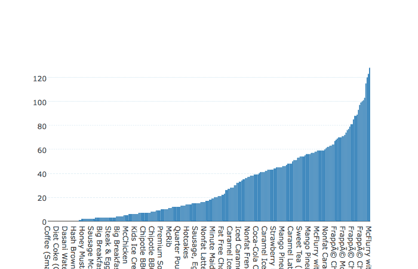
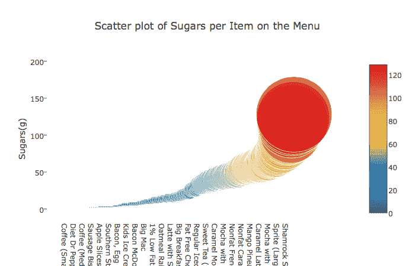
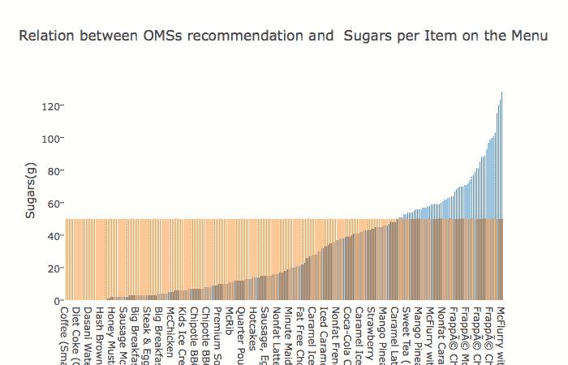

# 分析麦当劳菜单中的糖

> 原文:[https://dev . to/PaCO CP/analyzing-sugar-in-McDonald-menus-items](https://dev.to/pacocp/analyzing-sugar-in-mcdonald-menus-items)

最近我在 Kaggle 中发现了一个数据集，它由麦当劳菜单中每一项的营养成分组成([数据集](https://www.kaggle.com/mcdonalds/nutrition-facts))。

我知道我们生活中糖的消耗量远远超过了卫生保健组织推荐的量，所以我想分析一下麦当劳菜单上的糖含量，以及哪些是没有添加糖的。

为此，我用了一个 **Jupyter 笔记本**和以下库: **plotly 和熊猫**。在这里，我将解释我所遵循的不同步骤，但是完整的笔记本可以在我的 [Github 库](https://github.com/pacocp/Sugars-in-McDonalds-Menu/blob/master/sugarsinMcdonalds.ipynb)中查看。

信息在简历里。首先，让我们加载信息，看看它是如何组织的:

```
menu = pd.read_csv('./menu.csv')
menu.head(10) 
```

这样我们就可以看到数据集的信息。这意味着列和行。

好的，我感兴趣的是糖，所以我将创建一个新的熊猫数据框，由包含物品名称和糖含量的列组成，我将按升序对它们进行排序:

```
df_sugars = pd.DataFrame(columns=('Item','Sugars'))
df_sugars['Item'] = menu['Item']
df_sugars['Sugars'] = menu['Sugars']
print("Let's sort them by the amount of sugar they have in a ascending order: ")
df_sugars = df_sugars.sort_values('Sugars', ascending=[True])
print(df_sugars.head(10)) 
```

现在我有了这个，我想检查哪些菜单项没有任何糖:

```
print("Number of items in the menu: "+str(len(menu.index)))
print("Number of items without sugar in the menu: "+str(len(df_sugars.loc[df_sugars['Sugars'] == 0])))
print(df_sugars.loc[df_sugars['Sugars'] == 0]) 
```

我得到了以下结果:

```
Number of items in the menu: 260
Number of items without sugar in the menu: 25
                             Item  Sugars
145                Coffee (Small)       0
99              Kids French Fries       0
96             Small French Fries       0
81   Chicken McNuggets (20 piece)       0
114             Diet Coke (Small)       0
115            Diet Coke (Medium)       0
116             Diet Coke (Large)       0
117             Diet Coke (Child)       0
122        Diet Dr Pepper (Small)       0
123       Diet Dr Pepper (Medium)       0
124        Diet Dr Pepper (Large)       0
98             Large French Fries       0
80   Chicken McNuggets (10 piece)       0
79    Chicken McNuggets (6 piece)       0
136           Dasani Water Bottle       0
137              Iced Tea (Small)       0
138             Iced Tea (Medium)       0
139              Iced Tea (Large)       0
140              Iced Tea (Child)       0
78    Chicken McNuggets (4 piece)       0
146               Coffee (Medium)       0
38                     Hash Brown       0
147                Coffee (Large)       0
125        Diet Dr Pepper (Child)       0
97            Medium French Fries       0 
```

所以 260 中只有 25 种元素，也就是说麦当劳里只有 9.61%的东西不含糖。现在，让我们绘制图形来看一下，为此我将使用 Plotly 库:

```
print("Let's start with the bar chart")

data = [go.Bar(
             y = df_sugars['Sugars'].values,
            x = df_sugars['Item'].values,
    )]

py.iplot(data, filename='basic-bar') 
```

[T2】](https://res.cloudinary.com/practicaldev/image/fetch/s--d7wazbNl--/c_limit%2Cf_auto%2Cfl_progressive%2Cq_auto%2Cw_880/https://raw.githubusercontent.com/pacocp/Sugars-in-McDonalds-Menu/master/img/barchart.png)

另外，我将绘制一个散点图:

```
# Now let's plot a scatter plot
# This plot is based on the one made by Anisotropic:
# https://www.kaggle.com/arthurtok/super-sized-we-mcdonald-s-nutritional-metrics 
trace = go.Scatter(
    y = df_sugars['Sugars'].values,
    x = df_sugars['Item'].values,
    mode='markers',
    marker=dict(
        size= df_sugars['Sugars'].values,
        #color = np.random.randn(500), #set color equal to a variable
        color = df_sugars['Sugars'].values,
        colorscale='Portland',
        showscale=True
    ),
    text = menu['Item'].values
)
data = [trace]

layout= go.Layout(
    autosize= True,
    title= 'Scatter plot of Sugars per Item on the Menu',
    hovermode= 'closest',
    xaxis=dict(
        showgrid=False,
        zeroline=False,
        showline=False
    ),
    yaxis=dict(
        title= 'Sugars(g)',
        ticklen= 5,
        gridwidth= 2,
        showgrid=False,
        zeroline=False,
        showline=False
    ),
    showlegend= False
)
fig = go.Figure(data=data, layout=layout)
py.iplot(fig,filename='scatterChol') 
```

[T2】](https://res.cloudinary.com/practicaldev/image/fetch/s--7iQqBLiB--/c_limit%2Cf_auto%2Cfl_progressive%2Cq_auto%2Cw_880/https://raw.githubusercontent.com/pacocp/Sugars-in-McDonalds-Menu/master/img/scatterplot.png)

OMS 告诉我们，每天糖的最大量应该是 50 克。让我们看看菜单上的项目超过了这个阈值:

```
# First let's add a new column to the dataframe, all equal to 50 df_sugars['Amount of Sugar recommended (g)'] = 50

# Let's plot them 
trace1 = go.Bar(
    y = df_sugars['Sugars'].values,
    x = df_sugars['Item'].values,
    name='Sugars(g)'
)
trace2 = go.Bar(
    y = df_sugars['Amount of Sugar recommended (g)'].values,
    x = df_sugars['Item'].values,
    name='Recommended value of sugar OMS (g)'
)

data = [trace1, trace2]
layout = go.Layout(
    barmode='group'
)

layout= go.Layout(
    autosize= True,
    title= 'Relation between OMSs recommendation and  Sugars per Item on the Menu',
    hovermode= 'closest',
    xaxis=dict(
        showgrid=False,
        zeroline=False,
        showline=False
    ),
    yaxis=dict(
        title= 'Sugars(g)',
        ticklen= 5,
        gridwidth= 2,
        showgrid=False,
        zeroline=False,
        showline=False
    ),
    showlegend= False
)
fig = go.Figure(data=data, layout=layout)
graph = py.iplot(fig, filename='grouped-bar') 
```

[T2】](https://res.cloudinary.com/practicaldev/image/fetch/s--gzrtIek2--/c_limit%2Cf_auto%2Cfl_progressive%2Cq_auto%2Cw_880/https://raw.githubusercontent.com/pacocp/Sugars-in-McDonalds-Menu/master/img/relationoms.png)

如你所见，菜单上有很多项目对我们的健康有害，因为没有全部说出来。为了以更详细的方式查看项目，您可以检查笔记本，因为情节是交互式的。

我希望你喜欢我做的这个简短的分析。查看 Github 中的存储库！:)