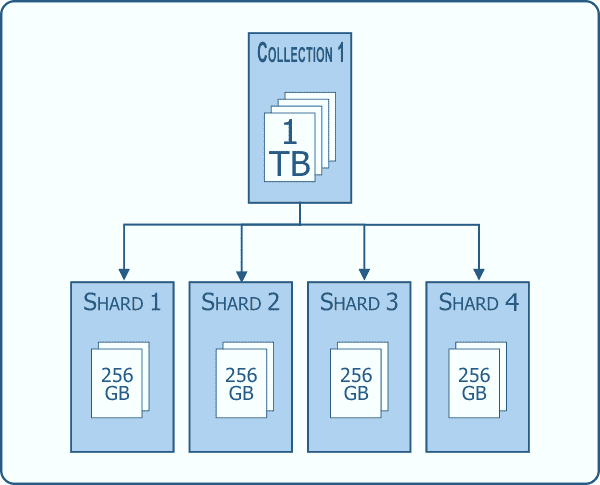
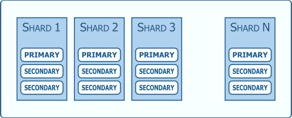
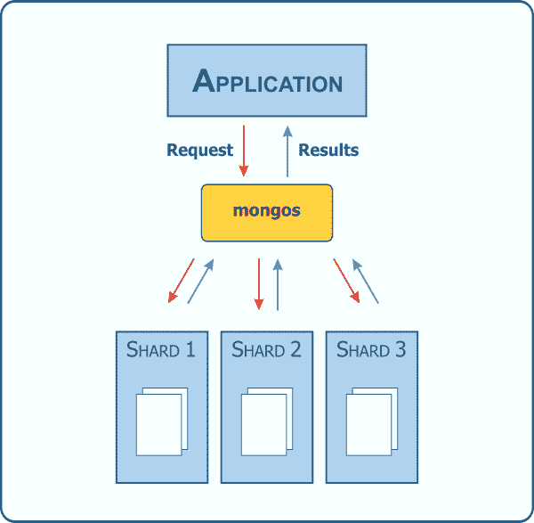
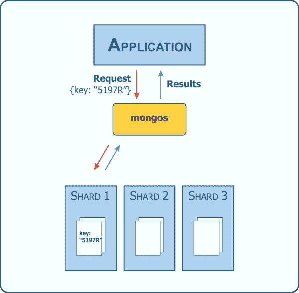

# 通过分片实现 MongoDB 水平扩展

> 原文:[https://dev . to/kenwalger/MongoDB-水平缩放-通过分片](https://dev.to/kenwalger/mongodb-horizontal-scaling-through-sharding)

在许多[MongoDB](https://www.mongodb.com)数据库或任何数据库的生命周期中，我们的数据会超过我们的服务器。要么是物理容量超过存储容量，要么是数据增长过大，导致性能下降。即使用更强大的 CPU、更多的 RAM 或硬盘(垂直扩展)来扩展我们的物理服务器也可能不够。这就是通过分片实现水平缩放的地方。

### 分片

到底什么是分片？它是将数据分布在多台机器上的实践。在 MongoDB 中，它支持具有大型数据集和高吞吐量操作的实例。数据分布在所有碎片上，允许平均分担工作负载。这有可能比单个服务器的效率更高。

[T2】](https://www.kenwalger.com/blog/wp-content/uploads/2017/06/sharding-example.png)

为了冗余，每个集群还应该是具有[主服务器](https://docs.mongodb.com/manual/core/replica-set-primary/)和[辅助服务器](https://docs.mongodb.com/manual/core/replica-set-members/#replica-set-secondary-members)的[副本集](https://docs.mongodb.com/manual/replication/)。

[T2】](https://www.kenwalger.com/blog/wp-content/uploads/2017/06/clusters.png)

MongoDB 数据是在一个[集合](https://docs.mongodb.com/manual/reference/glossary/)级别上分片的，因此没有必要将整个数据库分布在一个分片的环境中。

### 集群配置

我们需要的[分片集群](https://docs.mongodb.com/manual/reference/glossary/#term-sharded-cluster)有三个组成部分。我们需要碎片本身，一个像 [mongos](https://docs.mongodb.com/manual/core/sharded-cluster-query-router/) 服务器那样的查询路由器，以及配置或[配置服务器](https://docs.mongodb.com/manual/core/sharded-cluster-config-servers/)。

碎片是存储数据子集的东西。配置服务器存储关于集群的所有元数据，以及哪个碎片存放什么数据。数据存储在每个碎片上的[块](https://docs.mongodb.com/manual/core/sharding-data-partitioning/)中，配置服务器跟踪所有这些信息。

mongos 作为查询路由器，充当应用程序和数据之间的接口。它将查询和写操作路由到适当的碎片。因此，应用程序将只访问 mongos 中的数据——从*到*,而不会接触数据本身。查询通过 mongos 路由到所有的碎片**，除非**可以确定数据驻留在特定的碎片上。

[T2】](https://www.kenwalger.com/blog/wp-content/uploads/2017/06/shard-broadcast-operation.png)

肯定有比向所有碎片广播请求更好的方法，对吗？正如您所想象的，这种“分散/收集”的查询方法会导致一些长时间运行的操作。嗯，我之前用“除非”来限定它，所以有一个更好的方法！输入[碎片键](https://docs.mongodb.com/manual/core/sharding-shard-key/)。

### 碎片密钥

碎片键决定了集合中的[文档](https://docs.mongodb.com/manual/core/document/)如何跨碎片分布。它是一个索引字段或索引复合字段，存在于集合中的每个文档的**中。回想一下，MongoDB 允许在[文档模型](https://www.kenwalger.com/blog/nosql/document-model/)中使用[灵活模式](https://docs.mongodb.com/manual/core/data-modeling-introduction/)。这是选择分片密钥时要考虑的一个因素；每个文档都必须有索引字段。**

如果在查询期间提供了一个 shard 键，mongos 知道如何路由请求。

[T2】](https://www.kenwalger.com/blog/wp-content/uploads/2017/06/shard-targets-operation.png)

这可以大大提高性能。然而，选择一个好的分片密钥是非常重要的。我将在未来的[文章](https://www.kenwalger.com/blog/nosql/choosing-good-shard-key-mongodb/)中介绍如何选择一个好的分片密钥。

### 对分片的权衡

俗话说，天下没有免费的午餐。分片也是一样。对数据集进行分片会增加基础架构的复杂性和维护。帮助缓解这两个问题的一个解决方案是利用 DBaaS，如 [Atlas](https://www.mongodb.com/atlas) ,来托管您的 MongoDB 数据。

如果查询运行时没有包含 shard 键，则使用“分散/收集”方法。这可能会导致查询速度变慢，因此在编写应用程序时一定要记住这一点。

一旦集合被分片，就不能取消共享。同样，一旦选择了碎片键，就不能更改。因此，这些步骤需要仔细规划。

如果您自己在自己的硬件上处理事情，我在以前的帖子中简要讨论了一些可以用来检查分片集合性能的工具。具体在 [MongoDB CLI 工具](https://www.kenwalger.com/blog/nosql/mongodb-cli-tools/)和简要在 [MongoDB explain()解释](https://www.kenwalger.com/blog/nosql/mongodb/mongodb-explain-explained/)。

### 包裹

当您的数据已经超出单个服务器的处理能力时，分片是保持数据库良好运行的一个很好的方法。尽管如此，还是有一些事情需要注意。确保您选择了一个好的分片密钥，并及时更新数据库维护。

这篇文章中有很多 MongoDB 特定的术语。我为[亚马逊 Echo](https://www.amazon.com/gp/product/B01DFKC2SO/ref=as_li_tl?ie=UTF8&camp=1789&creative=9325&creativeASIN=B01DFKC2SO&linkCode=as2&tag=kenwalgersite-20&linkId=f9e513223de2525a72b95cf9561db55b) 系列产品创建了一个 [MongoDB 字典](https://www.echoskillstore.com/MongoDB-Dictionary/45103)技能。检查一下，你可以说“Alexa，问 MongoDB 什么是碎片？”并得到有益的回应。

* * *

*在 Twitter [@kenwalger](https://www.twitter.com/kenwalger) 上关注我，获取我发布的最新消息，或者在我的[博客](https://www.kenwalger.com/blog)上查看原始帖子。*