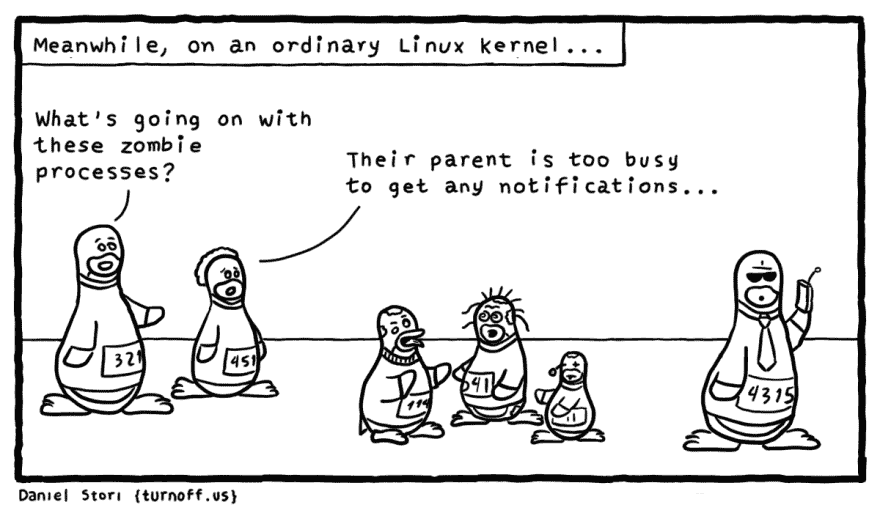

# 行尸走肉(但有流程)

> 原文：<https://dev.to/captainkrtek/the-walking-dead-but-with-processes>

## 什么是僵尸？

[T2】](https://res.cloudinary.com/practicaldev/image/fetch/s--c-giVExS--/c_limit%2Cf_auto%2Cfl_progressive%2Cq_auto%2Cw_880/http://turnoff.us/image/en/zombies.png)

当采访系统工程师时，一个常见的回答是“什么是僵尸进程？”是“一个死的没有父进程的进程”还是类似于“你可以用`kill -9 <pid>`杀死它”。似乎对僵尸进程有误解。让我们深入研究僵尸到底是什么，以及 Linux 应该如何处理它们*。*

 *僵尸进程是具有`exit()`d 并且其父进程没有针对其进程 id (PID)调用`wait()/waitpid()` [系统调用](https://linux.die.net/man/2/waitpid)的进程。也就是说，进程退出并留下一个状态代码供父进程读取，但是父进程还没有从进程表中读取它。每一个终止的进程都是短暂的僵尸，当它们停留太久的时候就会成为一个问题。

一些要点:

*   它们不能被“杀死”——SIGKILL、SIGTERM 是无效的，因为进程已经死了。
*   它们不是孤立的进程。
*   在 init 采用该过程的情况下，它们可以通过孤儿移除(通过杀死父节点)。
*   它们不利用任何资源，只是占用一个进程表条目。
*   每个进程在终止时都是僵尸，直到它们的父进程调用`wait()`。

这个小片段演示了如何创建僵尸:

```
int main(void)
{
    pid_t pid;
    int status;

    if ((pid = fork()) < 0) {
        // Failed to fork
        exit(1);
    }
    // Child process starts execution from here, child pid == 0
    if (pid == 0)
        // All the child does is exit
        exit(0);

    // Parent continues from here. A zombie roams for 100 seconds..brains..
    sleep(100);

    // After 100 seconds, the parent removes the zombie by calling wait()
    pid = wait(&status);

    return 0;
} 
```

Enter fullscreen mode Exit fullscreen mode

当运行上面的代码片段时，一个僵尸在`ps`的输出中显示为`<defunct>`。

```
129274  \_ ./zombie 
129275    \_ [zombie] <defunct> 
```

Enter fullscreen mode Exit fullscreen mode

这意味着父进程(PID 129274)没有调用 PID 129275 上的`wait()/waitpid()`。在它调用 wait 之前，129275 将吃掉一个进程表条目。因为它们不占用任何资源，所以通常不会成为问题。

当太多的进程存在而你用完了 PID 时，问题就出现了，这意味着没有更多的新进程(例如:不能`ssh`到一个不能给你生成 shell 的服务器..)

您可以使用以下命令查看最大 PID。

```
# cat /proc/sys/kernel/pid_max
131072 
```

Enter fullscreen mode Exit fullscreen mode

#### 监控机器上的进程数量是个好主意。如果你有一个长时间运行的进程泄漏僵尸，它最终会填充进程表，这可能会关闭你的服务，阻止远程访问等。

移除僵尸的一种方法是杀死僵尸的父进程，然后将进程重新父化为 init(PID 1 ), init*应该*定期调用其子进程的`wait()`。

如果一个程序有缺陷，没有调用其子程序的`wait()`，僵尸通常就会出现。如果进程陷入了某个无限循环，并且从未调用 wait()，那该怎么办？如果这个进程被命名为 init 呢？

## 当 init 不工作时...

不久前，我遇到了许多具有数千个僵尸进程的服务器。我的团队只是重启了这些机器来清理它们，但我注意到一些奇怪的事情后变得很好奇:

#### 所有的僵尸进程都有 init 作为父进程！

这意味着进程正在退出，而 init(作为它们的父进程)从未调用过`wait()`。此外，如果你要杀死一个僵尸的父母，使 init 的父母，init 不会做任何事情来帮助你。

作为它的核心函数之一，init 应该在它的子进程上调用`wait()`来清除僵尸，那么发生了什么呢？

```
% sudo strace -p 1 -r -s 500
Process 1 attached - interrupt to quit
     0.000000 write(8, "init: serial-ttyS main process ended, respawning\r\n", 50) = ? ERESTARTSYS (To be restarted)
   273.565117 --- SIGCHLD (Child exited) @ 0 (0) ---
     0.000062 write(4, "\0", 1)         = 1
     0.000066 rt_sigreturn(0x4)         = 1
     0.000046 write(8, "init: serial-ttyS main process ended, respawning\r\n", 50) = ? ERESTARTSYS (To be restarted)
     0.003033 --- SIGCHLD (Child exited) @ 0 (0) ---
     0.000026 write(4, "\0", 1)         = 1
     0.000048 rt_sigreturn(0x4)         = 1
     0.000039 write(8, "init: serial-ttyS main process ended, respawning\r\n", 50) = ? ERESTARTSYS (To be restarted)
     7.825845 --- SIGCHLD (Child exited) @ 0 (0) --- 
```

Enter fullscreen mode Exit fullscreen mode

stracing 显示 init 陷入了一个试图写入 tty 设备的循环中，并且每次写入都返回`ERESTARTSYS`(意思是:请重试该写入)。Init 没有处理该错误的机制，所以它陷入了无限循环。

至于它为什么变得`ERESTARTSYS`，在这种情况下，它写入的 tty 是一个串行 tty。找到`ERESTARTSYS`的串行 tty 驱动程序代码:

```
/**
 *  tty_send_xchar  -   send priority character
 *
 *  Send a high priority character to the tty even if stopped
 *
 *  Locking: none for xchar method, write ordering for write method.
 */

int tty_send_xchar(struct tty_struct *tty, char ch)
{
    int was_stopped = tty->stopped;

    if (tty->ops->send_xchar) {
        tty->ops->send_xchar(tty, ch);
        return 0;
    }

    if (tty_write_lock(tty, 0) < 0)
        return -ERESTARTSYS;

    if (was_stopped)
        start_tty(tty);
    tty->ops->write(tty, &ch, 1);
    if (was_stopped)
        stop_tty(tty);
    tty_write_unlock(tty);
    return 0;
} 
```

Enter fullscreen mode Exit fullscreen mode

写入一个串行 tty 需要一个`atomic_write_lock`形式的锁。在搜索关于这个锁的信息时，我发现了一个[错误](http://bit.ly/2rOkSAE) :

```
>>  Possible unsafe locking scenario:
>>
>>        CPU0                    CPU1
>>        ----                    ----
>>   lock(&tty->termios_rwsem);
>>                                lock(&tty->atomic_write_lock);
>>                                lock(&tty->termios_rwsem);
>>   lock(&tty->atomic_write_lock); 
```

Enter fullscreen mode Exit fullscreen mode

将所有这些打包在一起发现了一个新的 bug，这是由于一个不同的 bug。

如果串行 tty 陷入死锁，init 试图对其执行的任何日志记录都会使 init 陷入一个循环`write -> ERESTARTSYS -> write`...

如果 init 停留在这种状态足够长的时间，没有 tty 重置，那么僵尸将堆积起来，你将耗尽 PID。

## init 应该如何处理子进程？

查看 src/init.c 中的 sysvinit 源代码，我们可以看到 init 处理其子进程的几种不同方式。这里我们看到 init 为`SIGCHLD`
建立了一个信号处理器

```
SETSIG(sa, SIGCHLD,  chld_handler, SA_RESTART);

void chld_handler(int sig)
        CHILD           *ch;
        int             pid, st;
        int             saved_errno = errno;

        /*
         *      Find out which process(es) this was (were)
         */
        while((pid = waitpid(-1, &st, WNOHANG)) != 0) {
                if (errno == ECHILD) break;
                for( ch = family; ch; ch = ch->next )
                        if ( ch->pid == pid && (ch->flags & RUNNING) ) {
                                INITDBG(L_VB,
                                        "chld_handler: marked %d as zombie",
                                        ch->pid);
                                ADDSET(got_signals, SIGCHLD);
                                ch->exstat = st;
                                ch->flags |= ZOMBIE;
                                if (ch->new) {
                                        ch->new->exstat = st;
                                        ch->new->flags |= ZOMBIE;
                                }
                                break;
                        }
                if (ch == NULL) {
                        INITDBG(L_VB, "chld_handler: unknown child %d exited.",
                                pid);
                }
        } 
```

Enter fullscreen mode Exit fullscreen mode

检查`chld_handler`，如果 init 得到一个`SIGCHLD`信号，当他们的孩子死去时，这个信号被发送给一个父母，那么它就会执行。Init 在这里通过调用`waitpid()`来处理推模型中的僵尸，并将进程标记为僵尸，以便以后清理

`ch->flags |= ZOMBIE;`

前面我说过，当 init 陷入这种状态时，它将无法获得任何退出的子进程，但是它有一个信号处理程序来处理这个问题？这是怎么回事？

`initlog()`功能在记录时阻止所有信号:

```
/*
 *      Re-establish connection with syslogd every time.
 *      Block signals while talking to syslog.
 */
sigfillset(&nmask);
sigprocmask(SIG_BLOCK, &nmask, &omask);
openlog("init", 0, LOG_DAEMON);
syslog(LOG_INFO, "%s", buf);
closelog();
sigprocmask(SIG_SETMASK, &omask, NULL); 
```

Enter fullscreen mode Exit fullscreen mode

因此，当我们在主循环中的任何地方调用 initlog()并调用`syslog(LOG_INFO, "%s", buf);`时，我们遇到了之前的错误。`syslog()`尊重`write()`的`ERESTARTSYS`，所以我们被困在这里，我们屏蔽了所有信号(包括`SIGCHLD`)。

在`chld_handler`收割僵尸的机制之外，主循环的其余部分处理一个名为`family`的变量，该变量存储 init 的所有子进程。它循环遍历这些进程，寻找要终止的进程，如果进程已经终止，则从进程表中获取。*