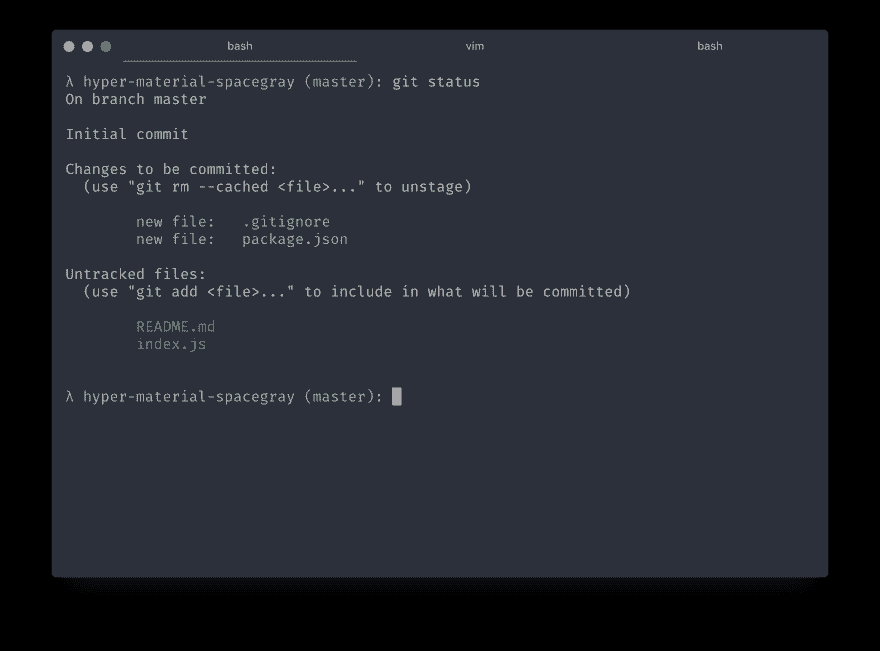

# 在 Node.js 中构建一个跨平台命令行可执行文件

> 原文:[https://dev . to/anapt fox/build-a-cross-platform-command-line-executable-innodjs](https://dev.to/anaptfox/build-a-cross-platform-command-line-executable-innodejs)

在我们开始之前，本文假设您知道一些事情: [Javascript](http://eloquentjavascript.net/) 、[终端](https://www.learnenough.com/command-line-tutorial)和 [Node.js](https://github.com/sindresorhus/awesome-nodejs#tutorials) 。

[T2】](https://res.cloudinary.com/practicaldev/image/fetch/s--i4SgGlEg--/c_limit%2Cf_auto%2Cfl_progressive%2Cq_auto%2Cw_880/https://thepracticaldev.s3.amazonaws.com/i/af338yzsh908thgwyr47.png)

在 Node.js 中创建命令行工具很容易，尤其是使用像 [yargs](https://www.npmjs.com/package/yargs) 、 [commander](https://medium.freecodecamp.com/writing-command-line-applications-in-nodejs-2cf8327eee2) 、 [inquirer](https://www.npmjs.com/package/inquirer) 这样的工具。

不过，暗地里我一直嫉妒 [Go](http://golang.org/) 内置的 [CLI 工具](https://github.com/mkideal/cli)。Go 中内置的 CLI 工具作为单个二进制文件提供，没有依赖性。

然后，当我开始使用 [Zeit 的](https://zeit.co/)工具时，我遇到了 pkg。有了 [pkg](http://zeit.co/pkg) ，我可以在 Node.js 中创建我的工具，但是作为一个单独的二进制文件发布。🙌ðŸ

例如，让我们创建一个简单的命令行工具:

```
#!/usr/bin/env node const argv = require('yargs').argv

if (argv.digit) {
  console.log(argv.digit + 1)
} else {
  console.log('Hmmm. I\'m confused')
} 
```

<svg width="20px" height="20px" viewBox="0 0 24 24" class="highlight-action crayons-icon highlight-action--fullscreen-on"><title>Enter fullscreen mode</title></svg> <svg width="20px" height="20px" viewBox="0 0 24 24" class="highlight-action crayons-icon highlight-action--fullscreen-off"><title>Exit fullscreen mode</title></svg>

这个程序会将`1`添加到名为`digit`的参数中。如果你把它放在一个名为`add.j` s 的文件中(确保你运行了`npm install yargs`，你会有一个命令行工具:

```
$ ./add.js --digit=1
2
$ ./add.js --digit=12
13 
```

<svg width="20px" height="20px" viewBox="0 0 24 24" class="highlight-action crayons-icon highlight-action--fullscreen-on"><title>Enter fullscreen mode</title></svg> <svg width="20px" height="20px" viewBox="0 0 24 24" class="highlight-action crayons-icon highlight-action--fullscreen-off"><title>Exit fullscreen mode</title></svg>

现在，说说魔术。安装，包:

```
$ npm i -g pkg 
```

<svg width="20px" height="20px" viewBox="0 0 24 24" class="highlight-action crayons-icon highlight-action--fullscreen-on"><title>Enter fullscreen mode</title></svg> <svg width="20px" height="20px" viewBox="0 0 24 24" class="highlight-action crayons-icon highlight-action--fullscreen-off"><title>Exit fullscreen mode</title></svg>

要将你的程序转换成二进制，运行:

```
$ pkg add.js 
```

<svg width="20px" height="20px" viewBox="0 0 24 24" class="highlight-action crayons-icon highlight-action--fullscreen-on"><title>Enter fullscreen mode</title></svg> <svg width="20px" height="20px" viewBox="0 0 24 24" class="highlight-action crayons-icon highlight-action--fullscreen-off"><title>Exit fullscreen mode</title></svg>

运行该命令将生成三个文件:

```
$ ls 
add-linux   add-macos   add-win.exe 
```

<svg width="20px" height="20px" viewBox="0 0 24 24" class="highlight-action crayons-icon highlight-action--fullscreen-on"><title>Enter fullscreen mode</title></svg> <svg width="20px" height="20px" viewBox="0 0 24 24" class="highlight-action crayons-icon highlight-action--fullscreen-off"><title>Exit fullscreen mode</title></svg>

您已经为 Linux、Mac OS X 和 Windows 创建了一个二进制文件。

您也可以像运行任何其他二进制文件一样运行它:

```
./add-macos 
```

<svg width="20px" height="20px" viewBox="0 0 24 24" class="highlight-action crayons-icon highlight-action--fullscreen-on"><title>Enter fullscreen mode</title></svg> <svg width="20px" height="20px" viewBox="0 0 24 24" class="highlight-action crayons-icon highlight-action--fullscreen-off"><title>Exit fullscreen mode</title></svg>

如果你和我一样，对这是如何工作的感到好奇，这个视频很有启发性:

[https://www.youtube.com/embed/eORpB-bXcbs](https://www.youtube.com/embed/eORpB-bXcbs)

这个工具不是我做的。我只是想让其他人享受 Javascript 的美妙。

我将在即将到来的项目中使用这个工具。

* * *

嗨，感谢阅读。我是[福克斯](https://twitter.com/anaptfox)，一名 [Losant](https://www.losant.com) 的技术宣传员。我的梦想是翻译技术，让人们学习、热爱和受到启发。欢迎在[推特](https://twitter.com/anaptfox)上关注我。