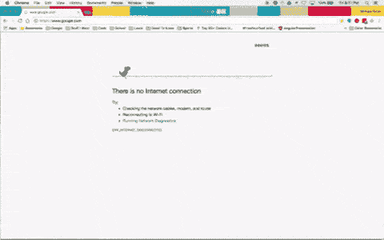
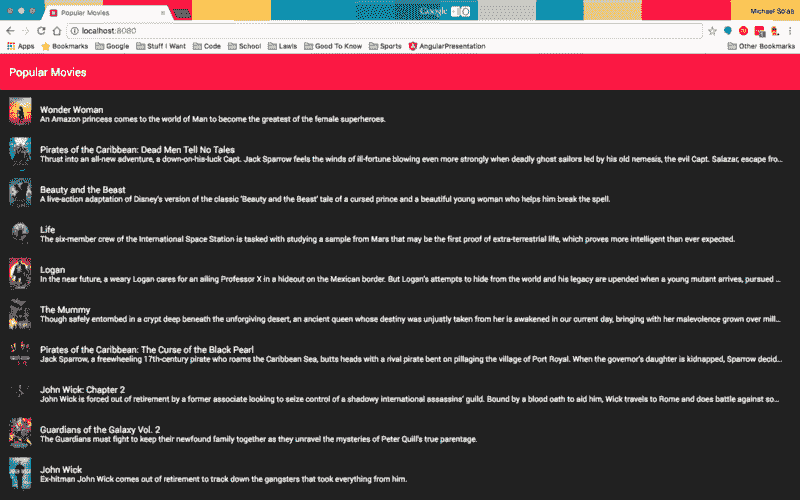
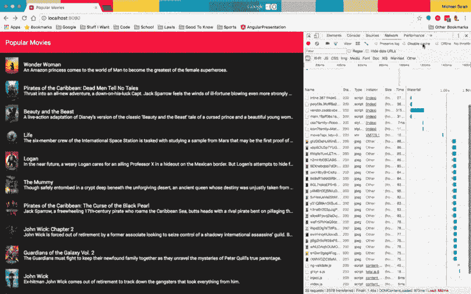
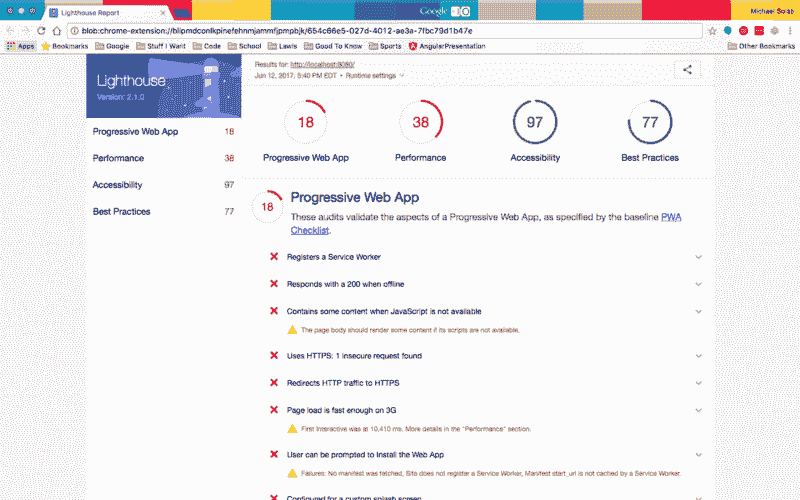
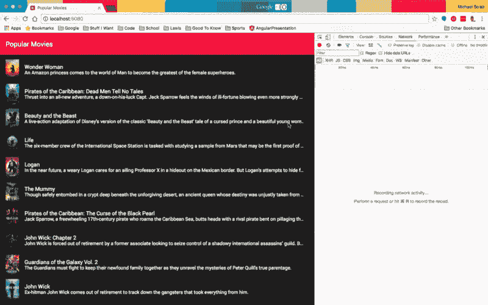
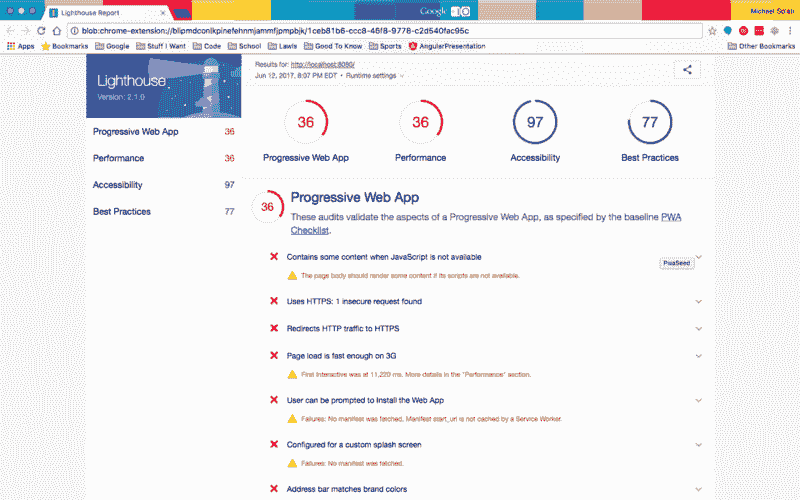
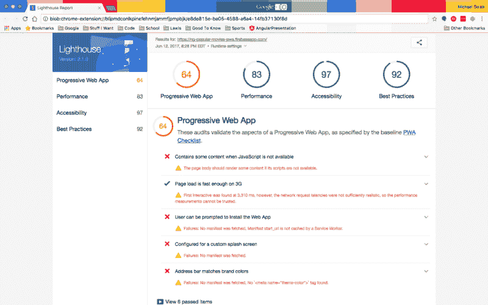

# 带角度的 PWAs:可靠

> 原文:[https://dev . to/michaelsolati/pwas-with-angular-being reliable](https://dev.to/michaelsolati/pwas-with-angular-beingreliable)

如果你在过去的两年中一直在从事 web 开发，你可能听说过术语 Progressive Web Apps(简称 PWAs)。pwa 本质上是在移动设备上提供近似本地体验的 web 应用程序。根据谷歌的说法，他们一定是:

*   **可靠** -即时加载，即使在不确定的网络条件下也不会出现宕机。
*   **快速** -以丝滑流畅的动画快速响应用户交互，没有笨拙的滚动。
*   **引人入胜** -感觉像是设备上的一个自然应用程序，具有身临其境的用户体验。

那么，我们如何确保我们的角度应用程序遵循这些原则，并提供最佳的用户体验呢？

[T2】](https://res.cloudinary.com/practicaldev/image/fetch/s--UhlmUIMo--/c_limit%2Cf_auto%2Cfl_progressive%2Cq_66%2Cw_880/https://cdn-images-1.medium.com/max/800/1%2AO9qLQnmW8mmasCJzS-66OA.gif)

* * *

让我们用一个我已经写好的简单应用程序，把它变成一个 PWA。

```
git clone --branch v0.0 https://github.com/MichaelSolati/ng-popular-movies-pwa.git
cd ng-popular-movies-pwa
npm install 
```

*这个应用依赖于[电影](https://www.themoviedb.org/)的 API。获取一个 API 键( [check this out](https://www.themoviedb.org/faq/api?language=en) )并将其作为 moviedb 环境变量放入您的* `src/environments/environment.ts` *和* `src/environments/environment.prod.ts` *中。*

现在我们已经设置好了一切，让我们运行我们的应用程序`npm run start:pwa`，打开 Chrome 并进入`localhost:8080`看看它做了什么。

[T2】](https://res.cloudinary.com/practicaldev/image/fetch/s--Qan6psPv--/c_limit%2Cf_auto%2Cfl_progressive%2Cq_auto%2Cw_880/https://cdn-images-1.medium.com/max/800/1%2AQ2pWrQrHdqAOjCBLV_2edg.png)

它可以运行，如果你点击一部电影，我们可以得到更多的细节。厉害！但是当我们离线时会发生什么呢？

[T2】](https://res.cloudinary.com/practicaldev/image/fetch/s--wDsXNrxe--/c_limit%2Cf_auto%2Cfl_progressive%2Cq_66%2Cw_880/https://cdn-images-1.medium.com/max/800/1%2AXeh-z7rWjlT_EjsfL6L2pg.gif)

嗯…那不太好。如果有 PWAs 的测试，那肯定会失败…

等一下！有一个关于 PWAs 的测试！谷歌为 Chrome 提供了一个名为 [Lighthouse](https://chrome.google.com/webstore/detail/lighthouse/blipmdconlkpinefehnmjammfjpmpbjk?hl=en) 的扩展(安装！)这将对我们的应用程序进行一系列测试，并生成一份关于应用程序表现如何的报告。而且，正如我所料，这个应用失败了。

[T2】](https://res.cloudinary.com/practicaldev/image/fetch/s--R52mhygx--/c_limit%2Cf_auto%2Cfl_progressive%2Cq_auto%2Cw_880/https://cdn-images-1.medium.com/max/800/1%2AHu0GAISU5Dg5uswkb32-Mg.png)

* * *

我们可以做得更好，所以让我们使这个应用程序更可靠！

要解决这些问题，我们可以做的第一件事就是使用服务人员。无论网络状态如何，服务人员都能让我们的 PWA 立即加载。它充当我们的应用程序和外部世界之间的代理，让我们控制缓存以及如何响应资源请求。我们的服务人员允许我们缓存必要的资源，以减少我们对网络的依赖，即使在没有互联网的情况下，也能为您的用户提供即时可靠的体验。

现在，Angular 团队实际上为我们提供了一个简单的工具来添加一个服务人员以及另一组工具(我们将在后面讨论它们)，所以让我们用下面的内容来安装我们的工具。

```
npm install --save @angular/service-worker @angular/platform-server ng-pwa-tools 
```

这很容易，但是我们还需要更新我们的。angular-cli.json 告诉它我们想要包含一个服务人员。这样，每次我们进行生产构建时，都会包括我们的服务人员。

```
ng set apps.0.serviceWorker=true 
```

现在，如果我们运行一个生产构建`ng build --prod`并检查我们的`dist/`文件夹，我们将看到一个名为`ngsw-manifest.json`的文件，如果我们仔细查看，我们将看到我们的服务人员缓存的所有资产。

```
{  "static":  {  "urls":  {  "/polyfills.859f19db95d9582e19d4.bundle.js":  "afac7bb7a75d8e31bca1d0a21bc8a8b8d5c8043c",  "/main.9058c5e7c9cdfe8d2b7e.bundle.js":  "93293a45586e8923695e614746ae61d658cde5ed",  "/sw-register.e4d0fe23aa9c2f3a68bb.bundle.js":  "2a8aea5c32b446b61dab2d7c18231c4527f04bdc",  "/vendor.1fd4688f90e61a7dc14d.bundle.js":  "92513639a29f19b868733d40bb37732fc051b326",  "/inline.6e6ae94836243f3c1fa2.bundle.js":  "7e89339e980b3fe1ac59ed6ee44800ad1c647084",  "/styles.b11de945749bdbf0b1ca.bundle.css":  "3e920bb539d1da98370748436c09677e81a50d46",  "/assets/.DS_Store":  "edc93fc6e9f594928b74bd2e15a23417aa68ac5d",  "/assets/app-icon.png":  "cd65256eb15ba9d4150e783ddaf93399799f605f",  "/favicon.ico":  "c31b53fba70406741520464040435aabaaed370e",  "/index.html":  "3953d6c604ff7dc6b9e77e8310cd7877d2b49b0d"  },  "_generatedFromWebpack":  true  }  } 
```

但是这不包括我们的路由配置，所以我们可以用`ngu-sw-manifest`工具(我们之前安装的`ng-pwa-tools`的一部分)创建一个。

```
./node_modules/.bin/ngu-sw-manifest --module src/app/app.module.ts 
```

现在，你可能会得到这样一个错误…

```
ENOENT: no such file or directory, open 'app.component.html' ; 
```

当组件的模板和样式表有相对路径时，我们的`ngu-sw-manifest`工具不能遍历我们的应用程序。所以我们将把`moduleId: module.id`添加到我们三个组件的`@Component`装饰器中。(`src/app/app.component.ts`、`src/app/home/home.component.ts`、`src/app/movie/movie.component.ts`)所以我们应该有这样的装修工。

```
@Component({
  moduleId: module.id,
  selector: 'app-root',
  templateUrl: './app.component.html',
  styleUrls: ['./app.component.scss']
}) 
```

如果我们再次运行失败的`ngu-sw-manifest`命令，我们应该看到:

```
{  "routing":  {  "index":  "/index.html",  "routes":  {  "/":  {  "match":  "exact"  },  "^/movie/[^/]+$":  {  "match":  "regex"  },  "/movie":  {  "match":  "exact"  },  "^/.*$":  {  "match":  "regex"  }  }  },  "static":  {  "urls":  {  "/favicon.ico":  "c31b53fba70406741520464040435aabaaed370e",  "/index.html":  "551a50f7e2847f7ed85cda1f8e4b7877bfdbb492",  "/inline.341ede62d3a808c130e1.bundle.js":  "79d61daf91c3d745aac6c274fadc4ac826332358",  "/main.07650488997a7b2dfcc1.bundle.js":  "49be3a9f04ebc4383806652e13f3be4ca58b3902",  "/ngsw-manifest.json":  "29a96adf2f918b27cc37be64b7ee24d15d095963",  "/polyfills.859f19db95d9582e19d4.bundle.js":  "afac7bb7a75d8e31bca1d0a21bc8a8b8d5c8043c",  "/styles.b11de945749bdbf0b1ca.bundle.css":  "3e920bb539d1da98370748436c09677e81a50d46",  "/sw-register.e4d0fe23aa9c2f3a68bb.bundle.js":  "2a8aea5c32b446b61dab2d7c18231c4527f04bdc",  "/vendor.f47d925e37c84559515b.bundle.js":  "cd70a6deaa413652cc98b444f793f5cf1e837be6",  "/worker-basic.min.js":  "93904d94c0bef0479f1ec0b182788f4301d9f28e",  "/assets/.DS_Store":  "edc93fc6e9f594928b74bd2e15a23417aa68ac5d",  "/assets/app-icon.png":  "cd65256eb15ba9d4150e783ddaf93399799f605f"  }  }  } 
```

我们一会儿将使用上面的对象，但是首先在我们的`src/`目录中，我们将创建一个`ngsw-manifest.json`文件，并像这样填充它。

```
{  "dynamic":  {  "group":  [  {  "name":  "firebase",  "urls":  {  "https://ng-popular-movies-pwa.firebaseapp.com/":  {  //  Our  deployed  app  url  "match":  "prefix"  }  },  "cache":  {  "optimizeFor":  "performance",  //  grabs  data  from  cache  only  if  data  is  stale  "maxAgeMs":  3600000,  //  cache  for  about  an  hour  "maxEntries":  20,  //  minimize  cache  size  "strategy":  "lru"  //  tells  service  worker  how  to  remove  cached  date  (least  recently  used  first)  }  }  ]  }  } 
```

这设置了我们的默认缓存策略。(根据您计划如何托管您的应用程序来修改`dynamic.groups[0].name`和`dynamic.groups[0].urls`)只需删除包含的注释，现在我们可以运行`ngu-sw-manifest`工具来获取我们的资产、路由和自定义清单文件，并将其输出到我们的`dist/ngsw-manifest.json`中。

```
./node_modules/.bin/ngu-sw-manifest --module src/app/app.module.ts \
   --out dist/ngsw-manifest.json 
```

所以现在我们将快速更新我们的`npm`脚本到如下:

```
{  "ng":  "ng",  "start":  "ng serve",  "start:pwa":  "npm run build && cd dist && http-server",  "build":  "ng build --prod && npm run ngu-sw-manifest",  "test":  "ng test",  "lint":  "ng lint",  "e2e":  "ng e2e",  "ngu-sw-manifest":  "./node_modules/.bin/ngu-sw-manifest --module src/app/app.module.ts --out dist/ngsw-manifest.json"  } 
```

然后我们可以运行我们的应用程序`npm run start:pwa`。尝试在 Chrome Dev 控制台中禁用网络连接后运行该应用程序，我们甚至可以在其上再次运行 Lighthouse！

[T2】](https://res.cloudinary.com/practicaldev/image/fetch/s--EBdWZYqr--/c_limit%2Cf_auto%2Cfl_progressive%2Cq_66%2Cw_880/https://cdn-images-1.medium.com/max/800/1%2ANqoMN2P8irB-O-RjG0M0dg.gif)

[T2】](https://res.cloudinary.com/practicaldev/image/fetch/s--TXakgH65--/c_limit%2Cf_auto%2Cfl_progressive%2Cq_auto%2Cw_880/https://cdn-images-1.medium.com/max/800/1%2AMr_-An7gmWOuWYVOjGUdRA.png)

因此，我们做得稍微好一点(有些事情，如 HTTPS，我们无法修复，直到我们部署了这个)。但至少我们已经把 PWA 分数提高了一倍！下周，我们将通过提高我们的速度(感知的和真实的)来提高这个分数。

* * *

要查看从我们开始到现在的代码差异[，请单击此处](https://github.com/MichaelSolati/ng-popular-movies-pwa/compare/v0.0...v1.0?expand=1)。此外，如果你觉得如此倾向，我邀请你部署你的应用程序到 Firebase。如果你在已部署的应用上运行 Lighthouse，你会得到更高的分数:

[T2】](https://res.cloudinary.com/practicaldev/image/fetch/s--xoKF53as--/c_limit%2Cf_auto%2Cfl_progressive%2Cq_auto%2Cw_880/https://cdn-images-1.medium.com/max/800/1%2AmyNhaw95jrj4dGDbj9jjuQ.png)

* * *

第二部分，标题为“有角度的 PWAs:快速”，在这里可以找到[。](https://dev.to/michaelsolati/pwas-with-angular-beingfast)