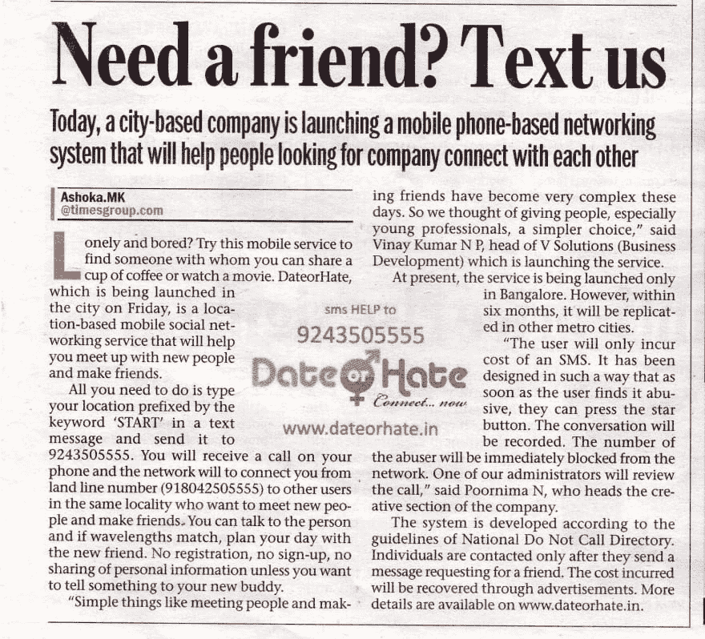

# 3 个月内超过 40，000 名用户...我制作的产品的故事

> 原文：<https://dev.to/vinay20045/40000-users-in-3-months-story-of-a-product-i-built>

这是我和 poor nima(T1)从零开始开发一个产品的故事，遗憾的是，从我们有了第一个用户开始，大约三个月后不得不关闭它。

那是 2010 年的初夏。我在看《星世界》的《识骨寻踪》深夜集(第四季第二十集)。剧情基本上围绕着团队在一个纸箱回收中心发现一具女尸，以及寻找凶手的日常琐事展开。在这一集中间的某个地方，当其中一个医生打开受害者的手机时，房间里另一个医生的手机响了，对方手机上有他们的个人资料照片。找到了。！我只是对自己说，我要构建这个应用程序。我打电话给我的叔叔，他很友好地拿起电话，听我漫谈一些疯狂的想法，甚至给了一些有用的提示。第二天早上，我见到了 Poornima，并向她解释了这个想法。她对此表示怀疑，但她同意了。

基本上，从这一集获得灵感，我整晚坐着思考一个应用程序(不是典型的移动应用程序),它...

*   基于位置吗
*   应该适用于所有手机(智能手机或智能手机)
*   应该是有趣的和上瘾的使用
*   对用户是免费的
*   有稳定的收入模式(我不喜欢先获得用户再考虑收入的战略)

我只有一个应用程序需要完成的用例(梦想)。想象一下...一个人独自坐在咖啡馆里，很无聊；发送一条约会或憎恨的信息，在 5 分钟内，应用程序将他连接到咖啡馆里坐在他后面的一个女孩或几个街区外的某个人，这种可能性将是无穷无尽的。

然后我们坐下来完善这个想法。这相当简单。用户必须发送 SMS，根据一些预先定义和理解的关键字或 PIN 码(例如:Market Street 或 91785)给出他们的位置，系统将应用匹配算法，并根据他们位置的接近程度连接两个用户，给他们回电，让他们参加会议，并允许他们通话 3 分钟。因为这是一项电话服务，只在早上 6 点到晚上 10 点提供。没有争论。完全匿名，因为没有共享号码。它是免费的。只是把正在附近寻找其他人的人联系起来。

收入模式也很简单。我们将采取的路线是在电话广告中插入简短的位置特定的内容和优惠等。在等待期间和两次呼叫之间。大致来说，调用的开头应该是这样的...“欢迎约会或者讨厌。这个电话是由 xyz 赞助的。

建立该系统的技术细节如下...

*   服务器是阿帕奇。
*   数据库是 MySQL(部分原因是我在那之前没有使用过任何其他数据库)。
*   所有 API 端点都是用 PHP 编写的。
*   短信服务是由一个外部供应商提供的，他给了我们一个 10 位数的号码，所有发送到这个号码的短信都会被推送到我们的 API 上。
*   调用 API 构建在 Asterisk 之上。这被部署在一个单独的服务器集群上(由 2 个服务器组成，在内部设置，通过静态 IP 访问),该集群有一个 2 端口 Sangoma PRI 卡。简而言之，这个 API...
    *   将接受 2 个 10 位数的手机号码和一个广告文件名作为输入。
    *   给这两个号码打电话，一旦接通就召开会议。
    *   播放欢迎信息
    *   在会议开始之前，播放由作为输入发送的文件所标识的广告。
    *   如果报告了滥用，请记录通话(通话期间按*将触发滥用报告)。
    *   返回呼叫终止后的状态
*   广告文件存储在本地呼叫服务器上，以实现优化/快速交付。
*   电话线是由 Airtel 提供的。总共使用了大约 40 条线路(超过 3 条 PRI 线路)。
*   号码匹配器将每五分钟运行一次，或者如果由于有空闲电话线而有足够多的号码对等待呼叫，则基于位置代码匹配号码，并向呼叫服务器发出带有号码对和广告文件的请求。
*   匹配算法将采用基于半径的匹配技术。
*   我已经建立了一个粗糙的报告暨监测暨让我们感觉良好的仪表板，这将查询数据库和星号服务器，并在各种标题下显示一些数字。

所有这些花费了我们大约 6 周的时间来完成。Poornima 打电话给我们的一位记者朋友，向他解释了整个概念，并做了一个演示。他听到这个消息很兴奋，因为我们可能是当时国内第一个制造这种产品的公司。他同意在他工作的报纸上写一篇关于我们产品的小文章。

[T2】](https://res.cloudinary.com/practicaldev/image/fetch/s--05wuEFPb--/c_limit%2Cf_auto%2Cfl_progressive%2Cq_auto%2Cw_880/https://askvinay.com/uploads/date-or-hate-in-bangalore-mirror.jpg)

2010 年 7 月 30 日早上，向世界介绍我们产品的文章(如上所示)出现了。因为我们得到了关于文章何时发布的提示，所以我们整个晚上都醒着，反复检查设置等。我优化了 MySQL 服务器。很自然地，我们在早上 6 点左右回家梳洗一番，拿几份报纸，并计划在上午 11 点左右回到办公室。我忘记把笔记本电脑带回家了。

在我继续讲下去之前，让我告诉你们我们期望什么样的数字以及我们已经做了什么样的计划。由于我们没有与我们的产品类似的先例，我们估计我们可能会在前 3 个月获得大约 3000 到 5000 个用户。我们可以把服务带到其他城市。我们还认为，直到这个阶段，我们将不会播放广告，但只有欢迎信息。这也会给我们足够的时间来准备一个合适的广告工具包和类似于广告词的后端，并把它带给可以和我们一起做广告的公司。

我们大约在中午回到办公室。我打开笔记本电脑，却发现监控面板显示有 670 个用户。这是一个令人愉快的惊喜，因为我们从未料到会有这么多用户。但是，我们认为“好吧，人们可能是好奇和尝试”。仪表板被设置为每 10 分钟刷新一次。但是 20 分钟过去了，用户数还是一样。我们认为我们的产品很失败，人们不喜欢它。我很失望。然后，我登录到 VPS 服务器，关闭它，因为它正在花费我们的钱，让我们惊恐的是，我们发现有 1700 个 api 调用被拒绝，因为我们已经超过了我们的带宽限制。恐怖！！！我的估计是错误的。我们有上百个用户在使用我们的产品。我立即升级了计划，重启了服务器，我们重新上线了。一天下来，我们有 1400 多个用户，服务了 1000 多个会议。还有，我第一次被 Poornima 说愚蠢。唉！！

你一定觉得，这是一个快乐的问题，对吗？！对于一个资金充足的初创企业来说也许是真的，但对我们来说不是，我们只是刚刚毕业的毕业生，资金有限，业务成熟。我们本可以找一个天使投资人来投资这个项目，但我并不羞于承认，在那个时候，我所知道的天使的唯一定义是出现在卡通和小说作品中的长着翅膀的女神。此外，我们陷入困境的另一个原因是，我把这个想法藏在心里，甚至拒绝和我的朋友讨论这个问题。

用户日复一日，每小时都在增长。我们不知道该怎么办？？我们自己有些钱，很快就花光了。我们开始从 F&F 借款，大约 3 个月后，我们已经借了，比方说，一个普通政府雇员一生的工资，但仍然没有一个明确的战略或前进的方式来接近广告商或任何其他筹集资金的想法。

2010 年 11 月的某一天(不记得具体是哪一天了)，我们坐在那里，想着如何支付前几个月的电话费。这一刻到了。那一刻，我的生活，在未来的岁月里，在我眼前闪过。有点像未来闪影。我的企业家精神一直在告诉我...你手头有一个超级想法，向前推进，事情就会水到渠成。我内心的工程师一直在告诉我...如果你能造出这个，你也能造出别的东西，想想那些数字，就是没有。关掉它。我站起来，走到我们放电话服务器的房间，把手放在其中一个服务器上，做了一会儿深呼吸，从墙上的插座中拔出电线。Poornima 就在我身后。我们俩都没说一句话，默默地回家了。

许多用户写信给我们，询问为什么没有任何东西可以工作了。因此，在那之后不久，我确实放了一个网页，解释我们已经关闭了所有的服务器/服务。在 2012 年底的某个时候，我们确实试图恢复这个项目，因为许多投资者朋友和咨询顾问听说过这个项目，对这个项目表现出一定程度的兴趣。但是这种应用现在需要一个全新的思维过程和大量的时间投入。由于 Poornima 正在进行她的创业，而我则在 [CommonFloor](https://www.commonfloor.com/) 全职工作，这是不可能的。因此我们最终放弃了这个项目。

这个项目，日期或仇恨，是一个不断提醒我失败的时间，可怕的。但是，我确实学到了很多。很多。我小心翼翼地保存了所有的代码、数据库转储等，以提醒人们可能会发生什么。我仍在努力，用各种方式，把这件事抛在脑后，但这真的真的很难。这很难，因为即使这个项目已经改变了我的生活，我的观点，我未来很多年的态度，我也没有机会看到这个用例实现。尽管在不到 3 个月的时间里，我的产品已经有了 42，524 个用户，几乎没有营销，我还是不得不关闭它。

我想，我熬过这一天的时候，可能就是我再次成为全职企业家的时候了！！

*这篇文章最初发表在我的[博客](https://askvinay.com/post/40000-users-in-3-months--story-of-a-product-i-built-23-august-2014.html)T3 上*