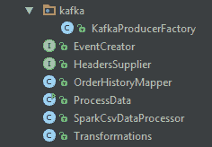
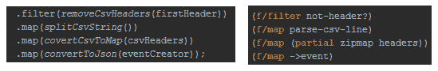

# Java 可能很啰嗦，但是谁在乎呢？

> 原文:[https://dev.to/danlebrero/java-maybe-verbose-but-who-cares](https://dev.to/danlebrero/java-maybe-verbose-but-who-cares)

*本文原载于 [IG 的博客](https://labs.ig.com/lines-of-code-matter)*

在超过 15 年的 Java 经验之后，我倾向于用下面的一个论点来无视关于 Java 冗长的评论:

*   代码行数(LOC)是一个伪指标；
*   ide 生成我 90%的 Java 代码；
*   从 PERL 臭名昭著和难以理解的简洁性中吸取的教训。

LOC 指标根本不重要。

## 还是他们？

不久前，我们开始建立我们的第一个 [Spark](http://spark.apache.org) 岗位。我们写的前两个基本相同:

1.  从 [HDFS](https://hadoop.apache.org/) 读取 CSV 文件
2.  将每一行转换成 JSON
3.  将每个 JSON 推送到 [Kafka](http://kafka.apache.org/)

碰巧我们用 [Clojure](http://www.clojure.org) 写了一个，用 Java 写了一个。当我们检查代码时，Java 版本看起来是这样的:

[T2】](https://res.cloudinary.com/practicaldev/image/fetch/s--mwMw2oxY--/c_limit%2Cf_auto%2Cfl_progressive%2Cq_auto%2Cw_880/https://labs.ig.com/sites/default/files/java_version.png)

一开始我很惊讶有这么多课。

然后我很惊讶，我很惊讶找了这么多课。毕竟，这些代码是我们所有人都来编写的非常地道的 Java 代码。

但为什么一开始我会感到惊讶呢？可能是因为 Clojure 版本看起来像这样:

[T2】](https://res.cloudinary.com/practicaldev/image/fetch/s--CMvLVcjv--/c_limit%2Cf_auto%2Cfl_progressive%2Cq_auto%2Cw_880/https://labs.ig.com/sites/default/files/clj_version.png)

但也许它是一个包含数百行代码的大文件呢？不。只有 58 行代码。

也许 Clojure 版本是一个完全不可读的胡言乱语，到处都是魔法变量和括号？以下是两个版本之间的主要转换逻辑:

[T2】](https://res.cloudinary.com/practicaldev/image/fetch/s--ZnWzvePr--/c_limit%2Cf_auto%2Cfl_progressive%2Cq_auto%2Cw_880/https://labs.ig.com/sites/default/files/transform.png)

可读性方面唯一的区别是 Java 版本有更多的括号。

## 代码审查

我通常不会注意 Java 的冗长，但是在 Java 代码审查期间，我发现自己在思考:

*   我应该从哪个班级开始？
*   接下来该去哪个班？
*   这些课程是如何组合在一起的？
*   依赖图是什么样子的？
*   谁实现这些接口？它们有必要吗？
*   每个班的职责是什么？
*   数据转换在哪里？
*   数据转换是否正确？​

而 Clojure 代码审查是关于:

*   数据转换是否正确？​

这让我意识到 Clojure 版本更容易理解，并且拥有一个包含 58 行代码的文件是一个非常重要的原因。

## b igger 项目呢？

我没有任何更大的项目，其中的要求与这里完全相同，但我们的 Clojure 微服务不超过 10 个文件，通常是 3 或 4 个，而我们最简单的 Java 微服务有几十个。

根据经验，我们知道理解一个 4 个小类的代码库和理解一个 50 个类的代码库需要的时间是不一样的。

## 附带的复杂性

因此，假设问题的固有复杂性是相同的，Clojure 版本能够用 58 行代码表达解决方案，而 Java 版本需要 441 行代码，Clojure 版本更容易理解，那么这些额外的 383 行(占代码库的 87%)完全地道的 Java 代码是关于什么的呢？

答案是，所有这些额外的代码行都属于[附带复杂性](http://pressupinc.com/blog/2014/05/root-causes-software-complexity/)范畴——我们(程序员)通过不使用正确的工具自己创造的复杂性，我们的业务付钱给我们创造的复杂性，付钱给我们维护的复杂性，但从来没有真正要求过。

代码行重要吗？不是作为生产力的度量，而是作为复杂性的度量，特别是如果这种复杂性是偶然的而不是固有的。

想象一下删除 87%你必须维护的代码！