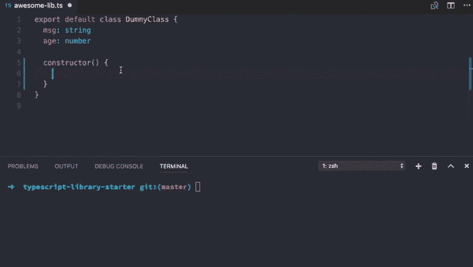

# 用 TSLint 更漂亮，开心

> 原文：<https://dev.to/alexjoverm/use-prettier-with-tslint-and-be-happy-ec3>

[更漂亮](https://github.com/prettier/prettier)支持[打字稿](https://www.typescriptlang.org/)刚刚登陆。让我们看看[ts lint-config-appellister](https://github.com/alexjoverm/tslint-config-prettier)如何帮助它与 [TSLint](https://palantir.github.io/tslint/) 无缝结合。

***等等，一个解释“用 TSLint 更漂亮”的视频？*是的！在 [Egghead.io](https://egghead.io/lessons/typescript-use-prettier-with-tslint-without-conflicts-c39670eb) 上看看吧！**

最近，《更漂亮》的作者之一， [@vjeux](https://twitter.com/Vjeux) ，在下面的推文中宣布了对 TypeScript 的支持:

这太神奇了！我刚刚去试了一下。这种神奇的体验给我留下了深刻的印象，以至于我已经从 [TypeScript library starter](https://github.com/alexjoverm/typescript-library-starter) 中彻底删除了 TSLint 。

## 问题

更漂亮和 TSLint 冲突，因为他们都处理格式。对于下面的代码，TSLint 将给出错误`[tslint] Multiple spaces found before '{'. (no-multi-spaces)` :

```
class DummyClass { food = 'sandwitch'} 
```

Enter fullscreen mode Exit fullscreen mode

但是，当我们运行得更漂亮时，代码会自动格式化:

```
class DummyClass { food = 'sandwitch'} 
```

Enter fullscreen mode Exit fullscreen mode

这使得工作流变得非常无用，因为我们得到了林挺错误，这是更漂亮的解决方案。

## 解

很简单:

> 让 pretty 负责代码格式化，其余的由 TSLint 负责

这就是为什么我创建了[tslint-config-appellister](https://github.com/alexjoverm/tslint-config-prettier)。它禁用所有与 TSLint 格式相关的规则，以及 [tslint-react](https://github.com/palantir/tslint-react) 和 [tslint-eslint-rules](https://github.com/buzinas/tslint-eslint-rules) 。

安装很简单，只要你设置好 [TSLint](https://palantir.github.io/tslint/) 和[better](https://github.com/prettier/prettier):

```
npm i -D tslint-config-prettier 
```

Enter fullscreen mode Exit fullscreen mode

将其添加到您的`tslint.json`文件的末尾:

```
{ "extends": ["tslint:latest", "tslint-config-prettier"]} 
```

Enter fullscreen mode Exit fullscreen mode

现在我们可以毫无问题地使用更漂亮的和 TSLint 了！

[T2】](https://res.cloudinary.com/practicaldev/image/fetch/s--v0h8v7pP--/c_limit%2Cf_auto%2Cfl_progressive%2Cq_66%2Cw_880/http://alexjoverm.github.io/2017/06/12/Use-Prettier-with-TSLint-and-be-happy/prettier.gif)

我必须感谢 [@vjeux 为我指出了](https://twitter.com/Vjeux/status/871796320792608768)这个解决方案，并感谢 [@JBlack](https://twitter.com/JBlaak) 抽出时间[查看 ts lint-config-prettle](https://github.com/alexjoverm/tslint-config-prettier/pull/1)。