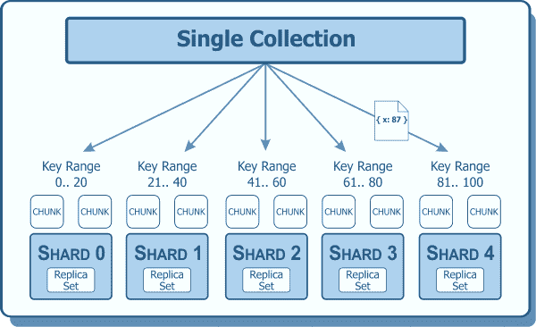

# 在 MongoDB 中选择一个好的分片密钥

> 原文:[https://dev . to/kenwalger/choosing-a-good-shard-key-in-MongoDB](https://dev.to/kenwalger/choosing-a-good-shard-key-in-mongodb)

我在[的上一篇文章](https://www.kenwalger.com/blog/nosql/mongodb-horizontal-scaling-sharding/)中，从高层次上讨论了 [MongoDB](https://www.mongodb.com) 中共享的概念。我提到过我会在后面讨论什么是好的分片密钥，现在我们来了。在我们讨论如何选择一个好的分片密钥之前，让我们先讨论一下它的用途。

### 我们什么时候需要碎片？

我们想要共享一个集合有三个典型的原因。

1.  单台服务器上的写工作负载超过了该服务器的容量。
2.  工作集不再适合内存。
3.  单个服务器不再能够处理数据集的大小。

然而，在应用程序的生命周期中，越早分片越好。对现有集合进行分片时，有一些重要的性能考虑因素。

### 为什么我们需要一个碎片密钥？

shard 键决定了数据，特别是集合的[文档](https://docs.mongodb.com/manual/reference/glossary/#term-document)，将如何在 MongoDB 中的[分片集群](https://docs.mongodb.com/manual/reference/glossary/#term-shard)中分布。在分片集合中，MongoDB 使用分片键根据键的范围对数据进行分区。分片键值的每个范围定义了一个不重叠的值范围。此外，每个范围被分配给集群上的特定[块](https://docs.mongodb.com/manual/reference/glossary/#term-chunk)。分片环境通常会平均分配块。

[T2】](https://www.kenwalger.com/blog/wp-content/uploads/2017/06/ShardingExample.png)

当应用程序请求数据时，查询路由器( [mongos](https://docs.mongodb.com/manual/reference/program/mongos/) 服务器)将查询定向到适当的块。它对写请求做同样的事情，基于它指示写入适当块的碎片键。

### 选择碎片密钥

与 MongoDB [模式设计](https://www.kenwalger.com/blog/nosql/document-model/)考虑事项一样，选择一个分片键在很大程度上取决于您的应用程序。需要从数据库中读取和/或写入数据库的最频繁的信息应该是一个关键的影响因素。根据应用程序的不同，使用散列 ObjectId 可能就足够了。在其他应用程序中，单个字段可能不够，需要一个复合分片键。

选择碎片键时，它会影响集群平衡器和数据在碎片间的分布。这对分片集群的性能和效率有很大的影响。理想的碎片键将允许文档在整个集群中均匀分布。除了特定于应用程序的要求之外，在选择分片密钥时，还有几个技术因素需要考虑。一旦为集合选择了 shard 键，就不能更改，所以这些考虑很重要。

#### 技术考虑

首先要考虑的是[基数](https://docs.mongodb.com/manual/reference/glossary/#term-cardinality)。具有高基数的分片键允许更好的水平伸缩。但是，它不能保证数据在分片集群中均匀分布。

数据的频率是好的分片密钥的另一个因素。如果索引字段是，比如说用户名，并且数据集是关于阿尔杰  家族的[家谱数据，则可以预期“阿尔杰”比其他名字出现得更频繁。这将导致碎片之间的文档平衡不均匀。人们希望选择一个频率低的密钥，但这本身也不能保证均匀的数据分布。](https://www.amazon.com/gp/product/1460903404/ref=as_li_tl?ie=UTF8&camp=1789&creative=9325&creativeASIN=1460903404&linkCode=as2&tag=kenwalgersite-20&linkId=9383b6bb9334665f74c500b0b5805df8)

高基数和低频率确实是碎片键选择的重要因素。变化率是碎片键选择凳子的第三条腿。选择一个不单调增加或减少的键也很重要。一个*总是*增加的键导致插入以`maxKey`为上限被路由到碎片。因此，碎片会变得不平衡。以`minKey`为下限，递减的结果将被路由到那个碎片。

我们凳子的这三条腿都有助于数据分布。选择密钥时，我们需要考虑每个因素。

### 示例分片密钥

现在我们已经了解了一些因素对分片性能的影响，让我们来看一些例子。借用一个好莱坞电影的片名，好的[，坏的&，丑的](https://www.amazon.com/gp/product/6301971272/ref=as_li_tl?ie=UTF8&camp=1789&creative=9325&creativeASIN=6301971272&linkCode=as2&tag=kenwalgersite-20&linkId=fa8bf8fb3c4c453fc62b81d763c7e41a)  ，这对我们的钥匙也是适用的。

碎片键必须基于存在于所有文档中的集合中的索引字段。它们也可以在一个[复合索引](https://docs.mongodb.com/manual/reference/glossary/#term-compound-index)上生成，其中分片键是该索引的一个[前缀](https://docs.mongodb.com/manual/core/index-compound/#compound-index-prefix)。我之前在 MongoDB [中介绍过索引，因为它本身就是一个主题。因为索引时需要考虑一些事情，所以它也会影响分片键。](https://www.kenwalger.com/blog/nosql/mongodb/indexing-in-mongodb/)

##### 丑陋的

我会说,*丑陋的*碎片键不仅不能*帮助*你的应用程序，而且实际上会导致比开始时更差的性能。这类似于使用没有[散列](https://docs.mongodb.com/manual/core/hashed-sharding/)的`_id`字段。由于`_id`是单调递增的，这将导致系统不平衡。

##### 坏事

我认为碎片键是不好的，它们没有充分利用碎片的概念。例如，如果集合分布在碎片和块中，但是应用程序的读取请求通常使用不同于碎片键索引的索引，虽然它们可能不会对物理数据分布产生负面影响，但是它们没有得到适当的优化。

这导致了对查询的分散/聚集方法。mongos 服务器会将请求分散到所有碎片。然后收集结果并发送给应用程序。作为目标的单个服务器应该接收带有精心选择的密钥的查询。

##### 好人

这是我们都想住的地方，对吗？在高性能的系统环境中，一切都是高度可伸缩和高效的。这可以通过为集合选择一个分片键来实现，该集合使用上面列出的技术策略来优化应用程序的需求。

### 包裹

选择正确的分片密钥和开发分片策略并不总是容易的。不要因为一个应用程序是以一种特殊的方式用一个特殊的分片键分片的，就误认为这是一种通用的方法。您的应用程序的策略可能完全不同，或者分片可能不是特定集合的正确解决方案。

请记住，尽早建立一个分片密钥并拆分数据是非常重要的。在大型数据集的生产中，分片变得更具挑战性。

这篇文章中有很多 MongoDB 特定的术语。我为[亚马逊 Echo](https://www.amazon.com/gp/product/B01DFKC2SO/ref=as_li_tl?ie=UTF8&camp=1789&creative=9325&creativeASIN=B01DFKC2SO&linkCode=as2&tag=kenwalgersite-20&linkId=f9e513223de2525a72b95cf9561db55b) 系列产品创建了一个 [MongoDB 字典](https://www.echoskillstore.com/MongoDB-Dictionary/45103)技能。检查一下，你可以说“Alexa，问 MongoDB 什么是碎片密钥？”并得到有益的回应。

* * *

*在 Twitter [@kenwalger](https://www.twitter.com/kenwalger) 上关注我，获取我发布的最新消息。*