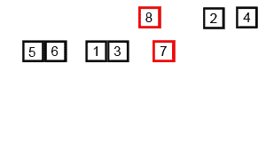
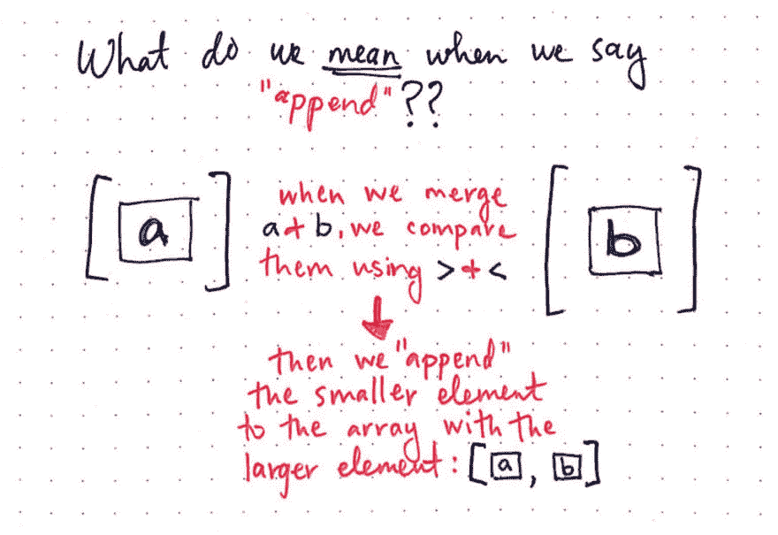
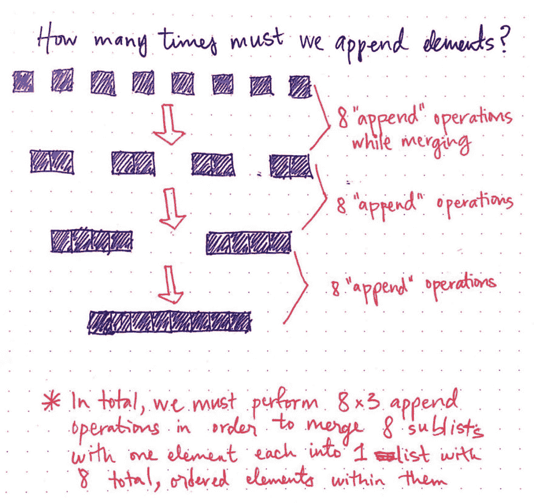
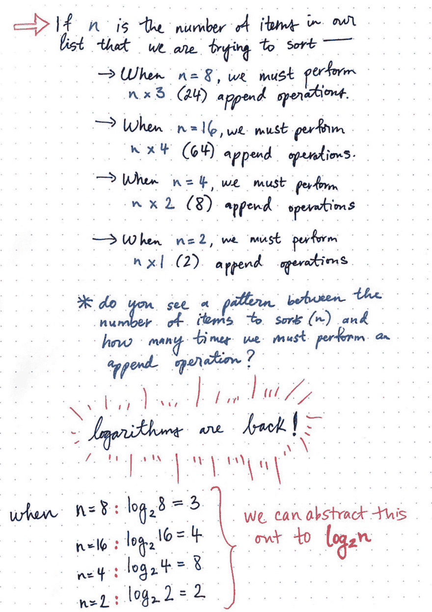
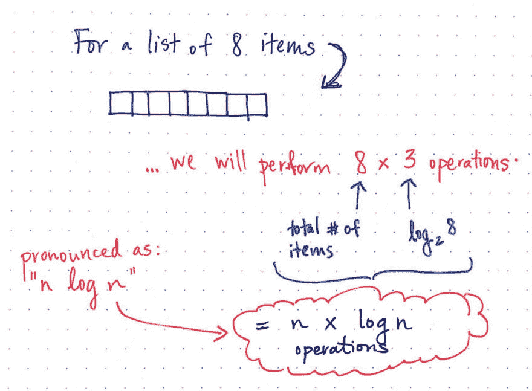
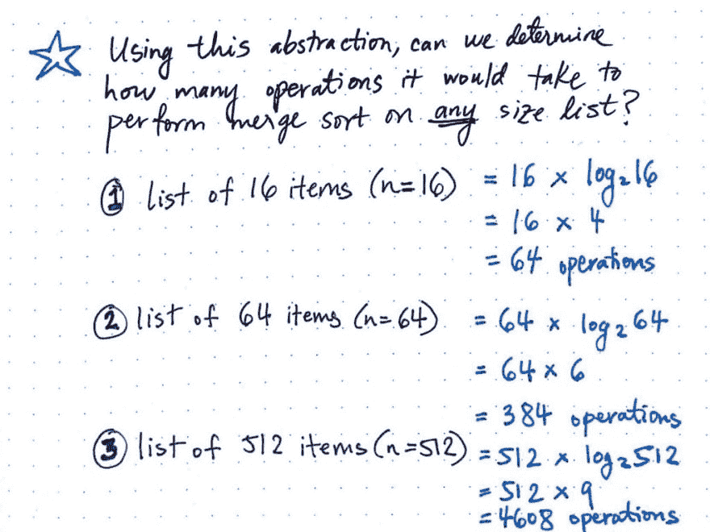
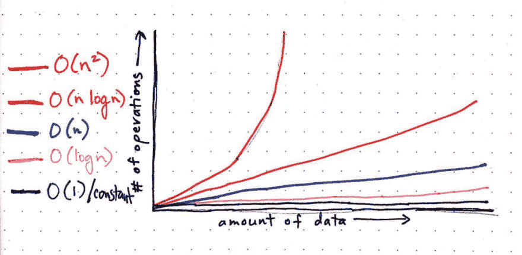
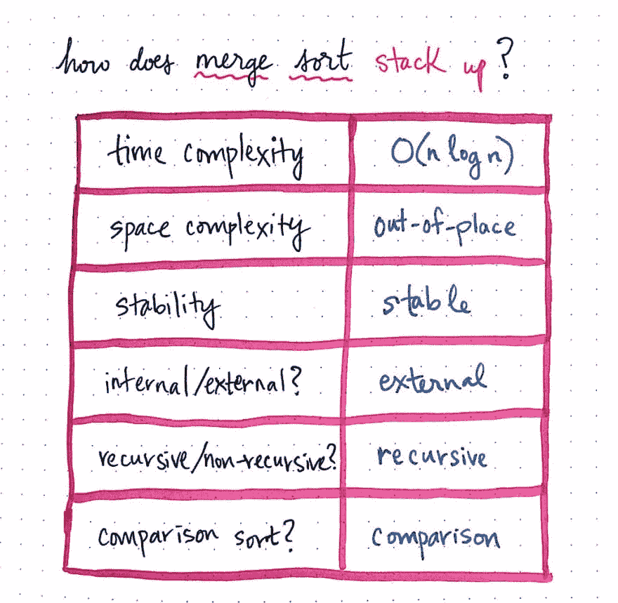

# 理解合并排序[第 2 部分]

> 原文:[https://dev . to/vaidehijoshi/making-sense-of-merge-sort-part-2](https://dev.to/vaidehijoshi/making-sense-of-merge-sort-part-2)

这是关于合并排序的两部分系列的第二部分。如果你还没有读过这个系列的第一部分，我建议你先看看！

上周，在本系列的第 1 部分中，我们发现了一种新型的排序算法，它不同于我们目前所了解的任何算法。我说的当然是归并排序！合并排序不同于我们已经讨论过的其他排序算法。

首先，合并排序是一种分治算法，这意味着它通过将一组数据分成两半来对其进行排序，并将相同的排序逻辑应用于小的“子部分”或“子问题”，以便对较大的数据集进行排序。其次，我们知道归并排序是一个自作聪明的算法，它使用了*递归*；换句话说，它从自身内部的*调用自己！我们还了解到，合并排序不同于其他排序算法，如[插入排序](https://dev.to/vaidehijoshi/inching-towards-insertion-sort)、[选择排序](https://dev.to/vaidehijoshi/exponentially-easy-selection-sort)和[冒泡排序](https://dev.to/vaidehijoshi/bubbling-up-with-bubble-sorts)，因为它在运行时间上比其他三种算法都要快得多。*

好吧，好吧，好吧，等一下——我们怎么知道这是事实呢？我们不能因为别人告诉我们事情是真的就相信它！不，不，不，我们必须自己理解这一点，否则，有什么意义呢？我们必须弄清楚*为什么*合并排序更快。当我们说它更快时……那么到底有多快呢？在其他方面，合并排序与其他算法相比如何？我们为什么要关心？

是时候找出答案了！

### 返回日志

在我们开始回答所有这些深奥的问题之前，让我们首先提醒自己合并排序算法到底是什么。如果你需要快速复习，简短的故事是一个 ***合并排序算法*** 将一个集合分成两半，递归排序每一半，然后将它们合并在一起。

这个算法有两个重要的核心概念。第一个是“分而治之”，它以同样的方式将这两个部分分开，在开始将它们重新合并在一起之前，将子列表分成一个元素。第二个是递归，在一个代码示例中我们可以看得更清楚。在我们上周的 mergeSort 函数中(改编自 Rosetta Code 对 mergeSort 的 JavaScript [实现](https://rosettacode.org/wiki/Sorting_algorithms/Merge_sort#JavaScript))，我们可以看到 merge sort 函数实际上*调用了自己。*

```
function mergeSort(array) {
  // Determine the size of the input array.
  var arraySize = array.length;

  // If the array being passed in has only one element
  // within it, it is considered to be a sorted array.
  if (arraySize === 1) { 
    return; 
  }

  // If array contains more than one element,
  // split it into two parts (left and right arrays).
  var midpoint = Math.floor(arraySize / 2);
  var leftArray = array.slice(0, midpoint);
  var rightArray = array.slice(midpoint);

  // Recursively call mergeSort() on
  // leftArray and rightArray sublists.
  mergeSort(leftArray);
  mergeSort(rightArray);

  // After the mergeSort functions above finish executing,
  // merge the sorted leftArray and rightArray together.
  merge(leftArray, rightArray, array);

  // Return the fully sorted array.
  return array;
}

function merge(leftArray, rightArray, array) {
  var index = 0;

  while (leftArray.length && rightArray.length) {
    console.log('array is: ', array);
    if (rightArray[0] < leftArray[0]) {
      array[index++] = rightArray.shift();
    } else {
      array[index++] = leftArray.shift();
    }
  }

  while (leftArray.length) {
    console.log('left array is: ', leftArray);
    array[index++] = leftArray.shift();
  }

  while (rightArray.length) {
    console.log('right array is: ', rightArray);
    array[index++] = rightArray.shift();
  }

  console.log('** end of merge function ** array is: ', array);
} 
```

当我们运行这段代码时会发生什么？好吧，让我们尝试排序一个包含八个元素的数组:[5，1，7，3，2，8，6，4]。我添加了一些 console.log 以便更容易看到这个算法是如何工作的。

```
var array = [5, 1, 7, 3, 2, 8, 6, 4];

mergeSort(array);

> array is:  (2) [5, 1]
> left array is:  [5]
> ** end of merge function ** array is:  (2) [1, 5]
> array is:  (2) [7, 3]
> left array is:  [7]
> ** end of merge function ** array is:  (2) [3, 7]
> array is:  (4) [5, 1, 7, 3]
> array is:  (4) [1, 1, 7, 3]
> array is:  (4) [1, 3, 7, 3]
> right array is:  [7]
> ** end of merge function ** array is:  (4) [1, 3, 5, 7]
> array is:  (2) [2, 8]
> right array is:  [8]
> ** end of merge function ** array is:  (2) [2, 8]
> array is:  (2) [6, 4]
> left array is:  [6]
> ** end of merge function ** array is:  (2) [4, 6]
> array is:  (4) [2, 8, 6, 4]
> array is:  (4) [2, 8, 6, 4]
> array is:  (4) [2, 4, 6, 4]
> left array is:  [8]
> ** end of merge function ** array is:  (4) [2, 4, 6, 8]
> array is:  (8) [5, 1, 7, 3, 2, 8, 6, 4]
> array is:  (8) [1, 1, 7, 3, 2, 8, 6, 4]
> array is:  (8) [1, 2, 7, 3, 2, 8, 6, 4]
> array is:  (8) [1, 2, 3, 3, 2, 8, 6, 4]
> array is:  (8) [1, 2, 3, 4, 2, 8, 6, 4]
> array is:  (8) [1, 2, 3, 4, 5, 8, 6, 4]
> array is:  (8) [1, 2, 3, 4, 5, 6, 6, 4]
> right array is:  [8]
> ** end of merge function ** array is:  (8) [1, 2, 3, 4, 5, 6, 7, 8]
>> (8) [1, 2, 3, 4, 5, 6, 7, 8]> 
```

拉德。看看所有正在进行的合并！因为我们要注销的所有东西，我们可以看到这个算法如何递归地继续划分元素，直到它有一个单项列表:例如，它从[5]和[1]开始。我们还可以看到，当我们将两个子列表合并在一起并构建我们的数组时，我们也在对元素进行排序，并将它们按正确的顺序排列。请注意[1，5]和[7，3]这两个子列表是如何发生的。该算法使用一个临时结构(通常是一个数组)，并将子列表按排序顺序添加到该临时数组中。只有在子列表被排序和添加之后，它才会真正将那些“排序的子列表”复制到原始数组中。

但是回到我们最初的任务:合并排序的速度和效率。为了让我们理解这一点，我们需要看看合并排序算法完成以下工作需要多少时间:1)划分集合，2)排序集合，3)合并集合。

好吧，既不划分集合也不排序是这个算法最糟糕的部分。因为我们使用递归——因为我们递归地将每一半分成两半——划分集合的工作并不太昂贵。此外，由于我们使用比较运算符(如< or >)一次对两个项目进行排序，我们知道这也不会太昂贵——它应该花费恒定的时间。

<figure>[](https://res.cloudinary.com/practicaldev/image/fetch/s--bIqXewau--/c_limit%2Cf_auto%2Cfl_progressive%2Cq_auto%2Cw_880/https://cdn-images-1.medium.com/max/300/1%2AjLL4xiKrImRYIXUPwGWx-g.png) 

<figcaption>合并排序可视化，[维基共享](https://upload.wikimedia.org/wikipedia/commons/c/cc/Merge-sort-example-300px.gif)</figcaption>

</figure>

相反，任何合并排序算法中最昂贵的部分是*合并*的工作，它本身是将小的子列表按排序格式放回一起的工作。如果我们回头再看看我们的代码，我们可以看到合并工作实际上占用了最多的时间，也是最经常被注销的。

因此，我们将集中在合并方面，因为这是赋予算法时间复杂度的原因。那么，当我们说“合并”时，我们指的是什么呢？

> 当我们使用术语“T0”合并“T1”时，我们实际上指的是将一个项目“按排序顺序”追加到临时数组结构中的行为，随着时间的推移，我们会不断地对其进行排序并追加更多的项目。

在合并排序算法递归地将未排序的列表分割成单个项目的元素后，我们可以说，由于每个列表中只有一个项目，所以所有内容都已排序(但显然还没有连接在一起)。合并的步骤包括比较两个子列表，然后 ***将*** 附加到较小子列表的末尾。

举个例子可能更有意义:

<figure>[](https://res.cloudinary.com/practicaldev/image/fetch/s--E7Xa61iX--/c_limit%2Cf_auto%2Cfl_progressive%2Cq_auto%2Cw_880/https://cdn-images-1.medium.com/max/1024/1%2A_I8Gw1ijSlw5x_IDnVS-2g.jpeg) 

<figcaption>我们说“追加”是什么意思？</figcaption>

</figure>

在上面的例子中，我们可以想象我们正在对一个大型数据集进行排序，现在我们已经将集合划分为递归的基本情况:每个列表中只有一个元素。这里，我们有两个子列表，一个包含元素 a，另一个包含元素 b。为了将这两个项目合并在一起，我们必须确定两者中哪个更小(使用比较运算符)，然后*将一个元素附加到另一个元素上*。

如果我们观察不同的合并排序算法实现，我们可能会很快注意到，人们通常会以略微不同的方式编写他们的合并函数，这取决于他们是使用大于号(>)还是小于号()我们如何进行合并工作往往保持不变。

好的——在这个例子中，我们有两个列表，每个列表中只有一个元素。为了将它们合并在一起，我们必须执行一个附加操作。然而，实际上，我们永远不会真的对两个条目的列表进行排序，对吗？相反，我们将处理一个更大的数据集。让我们看看需要多少次*将*元素添加到一个更大的未排序集合中。在下面的例子中，我们有八个需要排序的项目，而不是两个项目。

<figure>[](https://res.cloudinary.com/practicaldev/image/fetch/s--YLsf5kFu--/c_limit%2Cf_auto%2Cfl_progressive%2Cq_auto%2Cw_880/https://cdn-images-1.medium.com/max/1024/1%2ADfge20nhxURN8l0UsXW6Kg.jpeg) 

<figcaption>我们必须追加元素多少次？</figcaption>

</figure>

我们已经完成了划分的工作，现在我们准备开始将东西合并在一起。我们从八个列表中的八个单独的项目开始——记住，它们被认为是“已排序的”,因为其中只有一个项目！我们想把它们组合在一起，这样我们就有了一半多的列表。如果我们仔细想想，这是有道理的:当我们划分时，我们将列表的数量加倍，直到我们达到每个列表一个项目的基本情况。现在，我们正在做完全相反的事情来建立我们的列表。

首先，如果我们有八个项目，我们需要按照*排序顺序*将它们合并在一起，这样我们只有四个项目。这意味着我们需要执行八次“追加”操作。

请记住,“追加”操作包括两个步骤:

1.  比较我们想要组合在一起的项目，以及
2.  将它们按排序顺序插入到我们的临时数组中

实际上，我们需要对每个项目执行一次追加操作。一旦我们完成了，我们将得到四个列表，每个列表的元素都是有序的。太好了！

下一步:我们需要将四个列表合并在一起，这样我们就只有两个列表了。在比较、排序和将元素插入正确位置的过程中，我们还需要执行八次追加操作。

好了，现在我们只剩下两个列表，每个列表中有四个排序元素！你知道接下来会发生什么，对吧？我们将执行八个追加操作，最终得到一个包含八个元素的单个排序列表。

太好了！我们终于完成分类了！让我们后退一步，看看刚才发生了什么。总的来说，我们执行了(8 + 8 + 8)或 24 次追加操作，以便将单元素子列表变成一个排序列表。换句话说，我们执行了 8°—3 次附加操作。我重复了几次，因为这些数字之间有一种特殊的关系，你*可能*记得以前的帖子。

如果没有，也不用担心！我们将看更多的例子，看看我们是否能确定这种关系和任何模式。

### 对数反击———但就像，以一种好的方式

我最喜欢的一位作者曾经写道“简洁是智慧的灵魂”，我倾向于相信他。因此，与其举例说明一大堆冗长的例子，我只是列出了它们需要多少附加操作。

<figure>[](https://res.cloudinary.com/practicaldev/image/fetch/s--cj73-Gj8--/c_limit%2Cf_auto%2Cfl_progressive%2Cq_auto%2Cw_880/https://cdn-images-1.medium.com/max/1024/1%2AXliY-xk41KCeslN9XVxlqA.jpeg) 

<figcaption>对数回来了！</figcaption>

</figure>

我们已经知道，当列表中的元素数量(我们称之为 *n* )为 8 时，我们的合并排序算法将执行 8°—3 次追加操作。

当 *n* = 16 时，我们必须执行 16°—4 次追加操作。当 *n* = 4 时，合并排序将执行 4°—2 次追加操作。而当 *n* = 2 时，归并排序将执行 2∶1 的追加操作。

如果我们在这些场景中抽象出 *n* ，我们将开始看到一些熟悉的东西出现。

Tada！对数又回来了。如果你不熟悉日志是如何工作的，看看今年早些时候的这篇文章。我保证它会给这里发生的事情提供更多的背景信息。

如果我们抽象出 *n* ，我们会看到在所有这些例子中，一个事实似乎是显而易见的:

> 如果我们将 *n* 的对数乘以 *n 的值，结果就是要执行的追加操作总数*。

那到底是什么意思？我认为这种说法可能有点令人困惑，但如果我们形象化它，它应该(希望)更有意义。让我们回到最初的例子，对一个包含八个元素的列表执行合并排序:

<figure>[](https://res.cloudinary.com/practicaldev/image/fetch/s--ettRv0BY--/c_limit%2Cf_auto%2Cfl_progressive%2Cq_auto%2Cw_880/https://cdn-images-1.medium.com/max/1024/1%2ApTNliEsRnmSo4BMwTz1wcg.jpeg)

<figcaption>(n log n)运算来自哪里？</figcaption>

</figure>

在这里，我们可以更清楚地看到我们是如何将总数 *n* 乘以 n 的*对数的。您可能会看到以几种不同的方式编写的日志，例如( *n* â‹…日志 *n* )、( *n* 日志 *n* )，或者只是( *n* 日志 *n* )。不要被它们绊倒——它们都是等价的。所有这些符号都读作“ *n* log *n* ”，它们在排序算法的上下文中相当常见！*

既然我们知道在合并排序算法中需要(*n*——log*n*)追加操作来完成合并工作，我们可能会有一个问题:这到底意味着什么？比如“这是件好事吗?”？快吗？还是慢？或者……介于两者之间？

好了，现在我们已经抽象出了将 *n* 个元素合并在一起所需要的时间，我们可以尝试不同的 *n* 的值，看看随着 *n* 大小的增加，合并排序是如何变化的！让我们尝试一些更大的数据集，看看合并排序需要多少次操作才能对它们进行排序。

<figure>[](https://res.cloudinary.com/practicaldev/image/fetch/s--6mhDW30k--/c_limit%2Cf_auto%2Cfl_progressive%2Cq_auto%2Cw_880/https://cdn-images-1.medium.com/max/1024/1%2A3scgqOp-70rwHxpf-beJgA.jpeg)

<figcaption>*(n log n)*对于不同大小的数据集表现如何？</figcaption>

</figure>

在这里显示的例子中，我们可以看到随着 *n* 的增长，操作的数量也在增长。然而，它并不像我们在使用[冒泡排序](https://dev.to/vaidehijoshi/bubbling-up-with-bubble-sorts)、[插入排序](https://dev.to/vaidehijoshi/inching-towards-insertion-sort)或[选择排序](https://dev.to/vaidehijoshi/exponentially-easy-selection-sort)时*那么可怕；在每一个算法中，当 *n* 的大小加倍时，执行算法所花费的时间将会是*的四倍*，给每一个算法一个*二次*的运行时间。*

但是这是怎么回事？操作的数量不是二次方增长…但也不是线性增长。事实证明，我们偶然发现了一些全新的东西。而且，如果我们想得更深入一点，它可能会开始变得显而易见。

> 假设合并排序需要运行的时间是(*n*——log*n*)，显然这里既有线性的*也有对数的*。

线性时间和对数时间的组合被称为*线性时间*时间，而这正是合并排序算法的时间复杂度！

<figure>[](https://res.cloudinary.com/practicaldev/image/fetch/s--7HxjXPd---/c_limit%2Cf_auto%2Cfl_progressive%2Cq_auto%2Cw_880/https://cdn-images-1.medium.com/max/1024/1%2ArC_8BDfA-DzTsqMd4LSDhw.jpeg) 

<figcaption>归并排序的时间复杂度是线性和对数时间的结合。</figcaption>

</figure>

你有时可能会看到( *n* log *n* )被称为“准线性”或“对数线性”时间，但这两个术语也用于经济学或数学的上下文中。我倾向于使用“线性算法”这个术语，因为它总是用在算法时间复杂度很高的环境中。

那么，线性算法的运行时间与我们目前所看到的其他时间复杂度相比如何呢？

<figure>[](https://res.cloudinary.com/practicaldev/image/fetch/s--Z93gFBrU--/c_limit%2Cf_auto%2Cfl_progressive%2Cq_auto%2Cw_880/https://cdn-images-1.medium.com/max/1024/1%2Alc4AdXu_5iTxJGNqphsK1Q.jpeg)

<figcaption>Linearithmic 运行时相对于其他时间的复杂性。</figcaption>

</figure>

很明显，它不是一个理想的东西，有一个恒定的运行时间，或 *O(1)* 。尽管合并排序使用类似的分而治之策略，但它也远不如二分搜索法算法快，该策略在对数或 *O(log n)* 运行时运行。它也比以线性时间运行的算法( *O(n)* )稍差。然而，我们可以看到它如何执行*比具有二次运行时间的算法*好得多。事实上，这就是合并排序与我们到目前为止看到的排序算法如此不同的原因！一般来说，很难找到一种排序算法的执行速度比 linearithmic time 更快；正如我们在冒险中发现的那样，它们中的大多数以二次时间运行。

### (合并排序)力觉醒

我们已经完全穷尽了归并排序( ***线性算法*** )的时间复杂度，以及它与其他排序算法的比较。但是当然，时间复杂度不是一切。正如我们所了解的，在选择排序算法时，还有很多其他的考虑因素。

是时候看看合并排序和它的兄弟相比如何了！

<figure>[](https://res.cloudinary.com/practicaldev/image/fetch/s--EWu5jL4O--/c_limit%2Cf_auto%2Cfl_progressive%2Cq_auto%2Cw_880/https://cdn-images-1.medium.com/max/1024/1%2AgBcFx-WSaAaMdA0sIsm0wA.jpeg) 

<figcaption>归并排序与其他排序算法相比如何？</figcaption>

</figure>

之前，当我们运行代码时，我们了解到标准的合并排序算法需要一个临时数组结构来排序和追加元素。换句话说，它需要一个恒定的或 *O(n)* 的空间量——临时缓冲阵列所需的存储器。合并排序需要 *O(n)* 的内存量，以便在排序时复制元素。这可能是合并排序算法的最大缺点:它是一种 ***不合适的*** 排序算法，随着数据集的增长，它需要额外的内存。

然而，合并排序也有一些有用的方面。因为它一次比较两个元素，使用比较运算符，如果两个元素相等，当它将它们合并在一起时，它不会改变它们的顺序。因此，合并排序保持其输入数据集的稳定性，并且可以被归类为 ***稳定的*** 排序算法。而且，因为它使用比较运算符来比较两个元素，所以它也是一种 ***比较*** 排序。我们也非常熟悉合并排序上下文中的递归概念，我们知道算法非常依赖它；由此可见，归并排序是一种 ***递归*** 算法。

除了与其他排序算法相比速度更快这一事实之外，合并排序最有用的一点可能是它在排序大型数据集方面的出色表现。因为合并排序通常被实现为一种 ***外部*** 排序算法，它可以在主存储器之外完成排序工作，然后可以将排序后的数据拉回到内部主存储器中。

事实上，作为一个编程语言的开发者或消费者，你有可能一直在处理合并排序。比如 Ruby 的 Array::Enumerable 类有一个 sort，sort！，以及 sort_by 方法。如果你看一下这些方法的[源代码](https://github.com/rubinius/rubinius/blob/f871e5b83433c9361b9d5e3dca72125d68c16d55/kernel/common/array.rb#L1571)，你会发现它们都依赖于一个叫做 sort_inplace 的方法，这个方法——你猜对了——在幕后实现了合并排序。

更酷的是，如果我们看一下代码中留下的注释，我们会发现这个方法的解释是有效的:

> 就地排序此数组。>根据一些快速测试，在插入排序和合并排序之间进行选择的阈值是 13。

多酷啊！？Ruby 自己的 Array#sort 方法实现得足够智能，它知道对较小的数组使用[插入排序](https://dev.to/vaidehijoshi/inching-towards-insertion-sort)，对较大的数组使用合并排序。事实证明，这在其他编程语言中也很常见。例如，Java 和 Python 都实现了 [Timsort](https://en.wikipedia.org/wiki/Timsort) ，这是插入排序和合并排序的混合，在它们排序方法的掩盖下。

谁知道合并排序一直围绕着我们！？好吧，现在我们都知道了——我们都因此而变得强大。

### 资源

还是得不到足够的合并排序？想了解更多关于对数的知识吗？或者你只是想合并排序所有的东西？这些资源是开始了解更多信息的好地方。

1.  [数据结构-合并排序算法](https://www.tutorialspoint.com/data_structures_algorithms/merge_sort_algorithm.htm)，教程点
2.  线性算法的复杂性凯文·德拉姆
3.  [分而治之:合并排序](http://www.cs.umd.edu/~meesh/351/mount/lectures/lect6-divide-conquer-mergesort.pdf)，米歇尔·雨果教授
4.  [对数计算器](http://www.1728.org/logrithm.htm)，1728 软件系统
5.  [合并排序算法分析](https://www.youtube.com/watch?v=0nlPxaC2lTw&t=323s)，mycodeschool

* * *

*本帖最初发表于[medium.com](https://medium.com/basecs/making-sense-of-merge-sort-part-2-be8706453209)T3】*