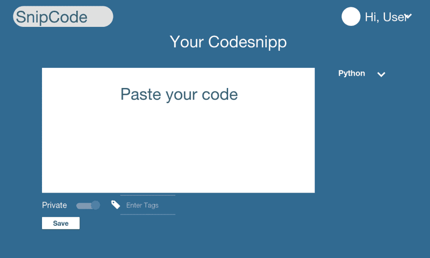
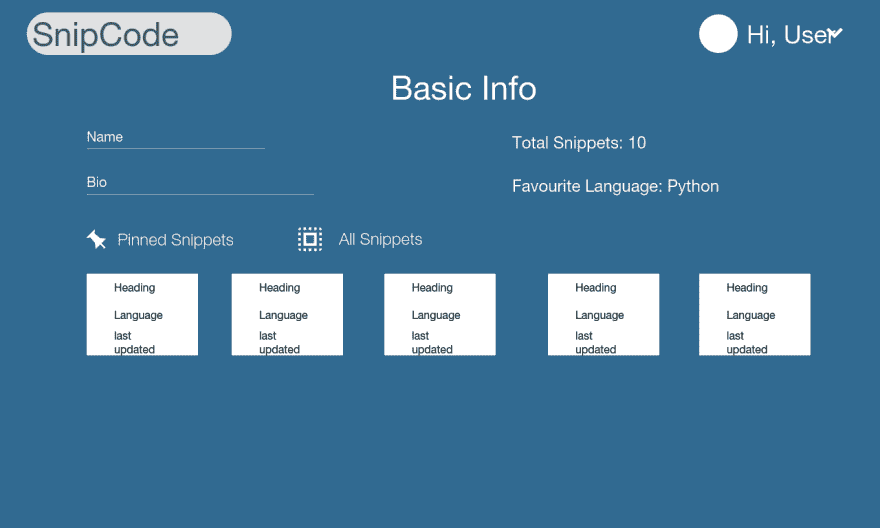

# 应用原型

> 原文:[https://dev.to/sroy8091/app-prototype](https://dev.to/sroy8091/app-prototype)

在我上一篇关于应用程序想法的文章中，我写了这篇关于保存和共享代码片段的原型的文章。

我用 proto.io 做原型，因为它提供了惊人的特性，无需编写一行代码，就能在你的 web 应用中提供你想要的功能。你可以在这里建立你的原型，并验证或听取他人对你想法的反馈。这是构建原型的一个很好的平台。

现在，我的 web 应用程序基本上在 3 个屏幕中结束。

[T2】](https://res.cloudinary.com/practicaldev/image/fetch/s--gorpHwo4--/c_limit%2Cf_auto%2Cfl_progressive%2Cq_auto%2Cw_880/https://thepracticaldev.s3.amazonaws.com/i/bo0v6uxkstrfczywl6gz.png)

这是用户将要输入或粘贴他们的代码的地方，并设置其他人发现它的规则。

[T2】](https://res.cloudinary.com/practicaldev/image/fetch/s--sxHq1uov--/c_limit%2Cf_auto%2Cfl_progressive%2Cq_auto%2Cw_880/https://thepracticaldev.s3.amazonaws.com/i/yiskduylcx6vddt1objb.png)

这是为了搜索我们网站的代码库，以搜索他人提交的代码片段。在未来，将有更多的过滤器被添加到搜索选项中，如按标签或按语言搜索。单击发现的代码片段会将用户发送到屏幕 1，但这次他只能看到代码。编辑权限将只授予提交该代码片段的用户。

[T2】](https://res.cloudinary.com/practicaldev/image/fetch/s--yiwFX4aO--/c_limit%2Cf_auto%2Cfl_progressive%2Cq_auto%2Cw_880/https://thepracticaldev.s3.amazonaws.com/i/t9ncwpmq8lwxyo7t8kgn.png)

这是用户配置文件，他可以看到所有的代码片段和最喜欢的代码片段，并可以编辑提交的代码片段。点击片段列表会将他发送到编辑页面，即屏幕 1

你可以点击这个[链接](https://pr.to/K9J3WD/)
看到我的原型，并在这里评论你的反馈，以便我改进它。

在我的下一篇博客中，我将公布如何设置本地环境，以使这个原型成为真正的 web 应用程序，为像您这样的开发人员服务。同时，你也可以看看我的其他帖子。

*这里是关于这一系列 snipcode 开发的所有帖子的索引*

[第一部分:App Idea](https://dev.to/sroy8091/app-idea-for-hasura-internship)
[第二部分:App 原型](https://dev.to/sroy8091/app-prototype)
[第三部分:本地开发](https://dev.to/sroy8091/hasura-local-development)
[第四部分:G for Git](https://dev.to/sroy8091/g-for-git)
[第五部分:数据建模](https://dev.to/sroy8091/its-modeling-time)
[第六部分:Data&Auth API](https://dev.to/sroy8091/postman-a-major-tool-for-developers)
[第七部分:基本功能](https://dev.to/sroy8091/i-love-cookies-expressjscookies)
[第八部分:App 屏幕 1](https://dev.to/sroy8091/i-built-it-with-codemirror)
[第九部分](https://dev.to/sroy8091/app-screen-2)