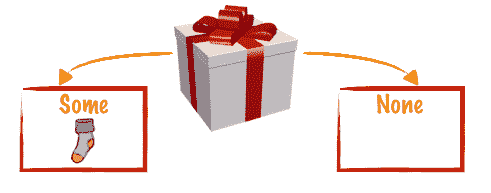
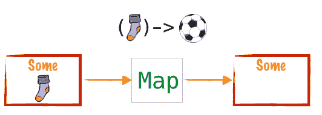
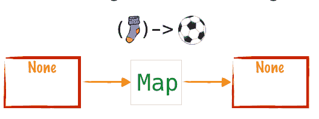

# 保存可选的，停止使用 isPresent

> 原文:[https://dev . to/koenighotze/safe-the-optional-stop-using-is present](https://dev.to/koenighotze/safe-the-optional-stop-using-ispresent)

大多数函数式编程语言都提供了一个叫做*选项*或者*也许是*的概念来处理值的存在或不存在，从而避免了`null`。Java 8 引入了`java.util.Optional`，对于 Java 开发人员来说，这可能是*类型的实现。可悲的是，由于它的灵活性，`Optional`经常被误用，可能是因为开发人员不了解它的功能，也可能是因为缺乏函数式编程的背景。*

在这篇文章中，我想强调一个滥用`Optional`的常见模式以及如何纠正它。

注意，我将使用 Vavr `Option`代替`java.util.Optional`。 [Vavr](http://vavr.io) 是一个轻量级库，为 Java 8 项目带来了类似 Scala 的特性。它专注于通过一致的 API 和丰富的文档提供出色的开发人员体验。请参见[这篇](https://dev.to/koenighotze/in-praise-of-vavrs-option)简短的概述，了解选装件如何以及为什么能帮到你。如果你想了解更多，请访问 http://vavr.io 。

但是，这里的一切都适用于这两种实现。

# 真实世界的例子

我想从一个典型的例子开始，我们可以用它作为重构的候选。

让我们考虑下面的用例:*使用存储库加载用户。如果我们找到一个用户，我们检查是否设置了地址，如果是，我们返回地址的街道，否则返回空字符串*。

使用`null` s，我们编写类似这样的代码:

```
User user = repo.findOne("id");
if (user != null) {
  Address address = user.getAddress();
  if (null != address) {
    return address.getStreet();
  }
  else {
    return "";
  }
} 
```

<svg width="20px" height="20px" viewBox="0 0 24 24" class="highlight-action crayons-icon highlight-action--fullscreen-on"><title>Enter fullscreen mode</title></svg> <svg width="20px" height="20px" viewBox="0 0 24 24" class="highlight-action crayons-icon highlight-action--fullscreen-off"><title>Exit fullscreen mode</title></svg>

Urgs。这就是我所说的*堆积如山的耻辱*。

解决这个问题很简单，只需使用`Option` :

```
Option<User> opt = Option.of(user);

if (opt.isPresent()) {
  Option<Address> address = Option.of(user.getAddress());
  if (address.isPresent()) {
    return address.get().getStreet();
  }
  else {
    return "";
  }
} 
```

<svg width="20px" height="20px" viewBox="0 0 24 24" class="highlight-action crayons-icon highlight-action--fullscreen-on"><title>Enter fullscreen mode</title></svg> <svg width="20px" height="20px" viewBox="0 0 24 24" class="highlight-action crayons-icon highlight-action--fullscreen-off"><title>Exit fullscreen mode</title></svg>

对吗？

不对！每次`Option`被这样使用，就有一个微服务死在生产中。这个修复基本上和上面一样。同样的复杂，同样的 _ *层叠堆积的耻辱*。

相反，我们使用`map`操作符。

# 图-瑞士军刀的功能编程

使用`Option`时`map`是你的好友。把`Option`想象成一个装有东西的精美礼品盒。

假设你是一个优秀的程序员，并且先测试后编写代码。你会得到一个装袜子的礼盒。

[T2】](https://res.cloudinary.com/practicaldev/image/fetch/s--385aFkVb--/c_limit%2Cf_auto%2Cfl_progressive%2Cq_auto%2Cw_880/https://thepracticaldev.s3.amazonaws.com/i/88y9k39meb0fkprr2gey.png)

但是谁想要袜子呢？你想要一个球。所以你`map`给礼品盒一个函数，它获取*袜子*并把它们转换成*球*。然后将结果放入一个新的礼品盒中。你的生日通过单子的力量得救了。

[T2】](https://res.cloudinary.com/practicaldev/image/fetch/s--YNLJKY2s--/c_limit%2Cf_auto%2Cfl_progressive%2Cq_auto%2Cw_880/https://thepracticaldev.s3.amazonaws.com/i/u5pk27u7ihefn1ybaomh.png)

如果你是一个糟糕的程序员，根本不写单元测试，那该怎么办？好吧，那你就不会有好看的袜子了。但是`map`仍然工作正常:

[T2】](https://res.cloudinary.com/practicaldev/image/fetch/s--0HQcGhb1--/c_limit%2Cf_auto%2Cfl_progressive%2Cq_auto%2Cw_880/https://thepracticaldev.s3.amazonaws.com/i/1w2ynj8vnztpbrl1cs0n.png)

如果礼盒是空的，那么`map`甚至不会应用该功能。所以，基本上是“无中生有”。

# 修东西

所以回到最初的问题，让我们用`Option`来重构这个问题。

```
User user = repo.findOne("id");
if (user != null) {
  Address address = user.getAddress();
  if (null != address) {
    return address.getStreet();
  }
} 
```

<svg width="20px" height="20px" viewBox="0 0 24 24" class="highlight-action crayons-icon highlight-action--fullscreen-on"><title>Enter fullscreen mode</title></svg> <svg width="20px" height="20px" viewBox="0 0 24 24" class="highlight-action crayons-icon highlight-action--fullscreen-off"><title>Exit fullscreen mode</title></svg>

首先让`findOne`返回`Option<User>`而不是`null` :

```
Option<User> user = repo.findOne("id");
... 
```

<svg width="20px" height="20px" viewBox="0 0 24 24" class="highlight-action crayons-icon highlight-action--fullscreen-on"><title>Enter fullscreen mode</title></svg> <svg width="20px" height="20px" viewBox="0 0 24 24" class="highlight-action crayons-icon highlight-action--fullscreen-off"><title>Exit fullscreen mode</title></svg>

由于用户的地址是可选的(参见我在那里做的；)`User#getAddress`应该返回`Option<Address>`。这导致了下面的代码:

```
Option<User> user = repo.findOne("id");
user.flatMap(User::getAddress)
... 
```

<svg width="20px" height="20px" viewBox="0 0 24 24" class="highlight-action crayons-icon highlight-action--fullscreen-on"><title>Enter fullscreen mode</title></svg> <svg width="20px" height="20px" viewBox="0 0 24 24" class="highlight-action crayons-icon highlight-action--fullscreen-off"><title>Exit fullscreen mode</title></svg>

为什么`flatMap`...好吧，我把它作为练习。只要记住，`User#getAddress`返回`Option<Address>`并且想想，如果你使用`map`会发生什么？

现在我们已经得到了`Option<Address>`我们可以再次`map`:

```
Option<User> user = repo.findOne("id");
user.flatMap(User::getAddress)
    .map(Address::getStreet)
... 
```

<svg width="20px" height="20px" viewBox="0 0 24 24" class="highlight-action crayons-icon highlight-action--fullscreen-on"><title>Enter fullscreen mode</title></svg> <svg width="20px" height="20px" viewBox="0 0 24 24" class="highlight-action crayons-icon highlight-action--fullscreen-off"><title>Exit fullscreen mode</title></svg>

最后，我们只需要决定如果其他一切都失败了该怎么办:

```
Option<User> user = repo.findOne("id");
user.flatMap(User::getAddress)
    .map(Address::getStreet)
    .getOrElse(""); 
```

<svg width="20px" height="20px" viewBox="0 0 24 24" class="highlight-action crayons-icon highlight-action--fullscreen-on"><title>Enter fullscreen mode</title></svg> <svg width="20px" height="20px" viewBox="0 0 24 24" class="highlight-action crayons-icon highlight-action--fullscreen-off"><title>Exit fullscreen mode</title></svg>

这给我们留下了最终版本:

```
repo.findOne("id")
    .flatMap(User::getAddress)
    .map(Address::getStreet)
    .getOrElse(""); 
```

<svg width="20px" height="20px" viewBox="0 0 24 24" class="highlight-action crayons-icon highlight-action--fullscreen-on"><title>Enter fullscreen mode</title></svg> <svg width="20px" height="20px" viewBox="0 0 24 24" class="highlight-action crayons-icon highlight-action--fullscreen-off"><title>Exit fullscreen mode</title></svg>

如果你从上到下读，这就是字面意思。

```
repo.findOne("id")                // Find a user
    .flatMap(User::getAddress)    //   if an address is available
    .map(Address::getStreet)      //   fetch the addresses street
    .getOrElse("");               //   otherwise use the empty string 
```

<svg width="20px" height="20px" viewBox="0 0 24 24" class="highlight-action crayons-icon highlight-action--fullscreen-on"><title>Enter fullscreen mode</title></svg> <svg width="20px" height="20px" viewBox="0 0 24 24" class="highlight-action crayons-icon highlight-action--fullscreen-off"><title>Exit fullscreen mode</title></svg>

# 总结

我希望这篇短文能说明 Vavr 及其`Option`抽象的用处。如果你只记得一件事，那么请让它成为*不要用`Option#isPresent`或`Option#get`，那个`map`是你的朋友*。

Vavr 作为一个库，为 Java 中的对象函数编程提供了许多惊人的扩展，甚至为棕色地带项目。您可以在有意义的地方利用它的实用程序，而不需要迁移到 Scala 或类似的平台来获得函数式编程的至少一些好处。

当然，这都是句法糖。但正如任何好的库一样，Vavr 修复了一些东西，核心 JDK 无法在不破坏大量代码的情况下轻松处理。

未来的帖子将涵盖它的其他惊人特性，如模式匹配、基于属性的测试、集合和其他功能增强。