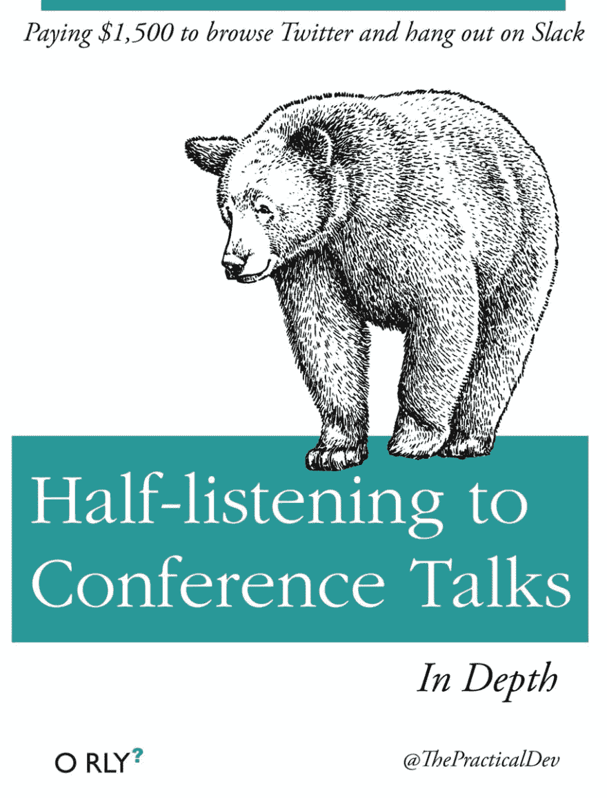
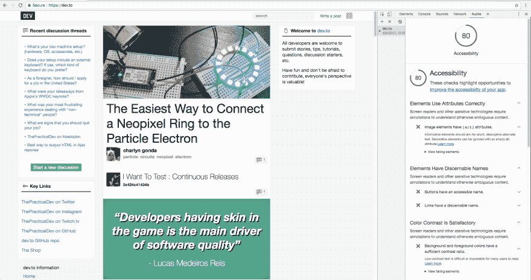
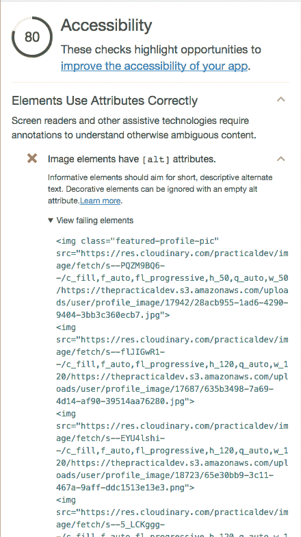

# 可访问性审计很有趣！

> 原文：<https://dev.to/jess/accessibility-audits-are-fun>

在会议上，我总是被易访问性谈话所吸引。我认为这个主题非常有趣，我总是想成为一名倡导者。不幸的是，这些灵感的感觉总是转瞬即逝，我从未真正采取任何行动。或者记得很多。

# 直到..

虽然我确信他们在开发者大会上提到了 Chrome DevTools 中更新的审计标签...

> [@ thepracticaldev](https://dev.to/thepracticaldev)我不是说你什么都没学到，但是...2017 年 04 月 04 日下午 17:3728665116

...直到走进他们的无障碍帐篷，我才知道这件事。在那里，我遇到了 ux 工程师德克·T2，我问他他在帐篷里的角色是什么这是我了解新的`audit`标签的地方，它快速告诉我所有使[开发到](https://dev.to) **而不是**可访问的事情。德克非常耐心，和我一起做了整个演练。以下是我从审计开发到的一些收获:

### 为什么审计选项卡如此精彩

*   它很快。
*   您可以运行审计，而无需下载任何扩展或求助于命令行。
*   报告会告诉你你的元素在哪里失败了，**以及为什么**它们通过是重要的。
*   它让我回来寻找更多。我希望看到我的分数随着我对网站的更改而增加。

### 我学到的东西

*   属性至关重要。视障用户依靠屏幕阅读器浏览网页。如果您的图像包含重要信息，屏幕阅读器将无法确定上下文，除非您添加 alt-tag。
*   如果你没有 alt 标签，它会读取图片的名称。你有多少张图片的标题是`17942/28acb955-1ad6-4290-9404-3bb3c360ecb7.jpg`？是啊，可能很多。现在，您的用户需要听到他们口述的字符串。
*   对于装饰图像(不添加信息内容的图像)，可以将属性留空，即`alt=""`。
*   颜色对比:我了解到我们的薄荷绿色按钮和白色文字没有提供足够的对比，这使得用户很难阅读。在 Saron Yitbarek 的演讲中，我了解到 12 个人中就有一个是色盲。那是很多人。
*   如果你没有通过颜色对比测试，试着使用[这个](http://leaverou.github.io/contrast-ratio/#)工具，它可以让你摆弄颜色，找到最接近的选项。

## 如何审计你的网站

1.  如果你还没有，下载 Chrome Canary ，这是一款面向开发者和早期用户的 Chrome 浏览器。审计标签应该很快就会出现在所有的 chrome 浏览器上，但是他们仍然在解决一些问题。
2.  一旦你到了 Canary，访问你的网站，进入 devtools。
3.  导航至`audit`选项卡。
4.  选择辅助功能，然后单击审核！

你会看到这样的东西:

您可以点击进入报告，查看哪些元素失败:

## 更进一步

如果审计没有激发你采取行动，试着用屏幕阅读器浏览你的网站。在苹果电脑上，这将是`system preferences -> accessibility -> enable voiceover`。您将很快了解到一些用户的用户体验。

我今天还了解了屏幕放大镜，并推荐大家查看 Frederik Creemer 的帖子[如何让使用屏幕放大镜的人能够访问您的网站](https://dev.to/_bigblind/how-to-make-your-website-accessible-to-people-who-use-a-screen-magnifier)。

## 附加资源

*   [谷歌对开发者可访问性的概述](https://developers.google.com/web/fundamentals/accessibility/)
*   [Udacity 网站无障碍课程](https://www.udacity.com/course/web-accessibility--ud891)

## 感谢阅读

我希望我已经鼓励你运行一个可访问性审计，我很高兴地分享，我们已经创建了问题，以解决在开发到ðÿ˜š失败的测试