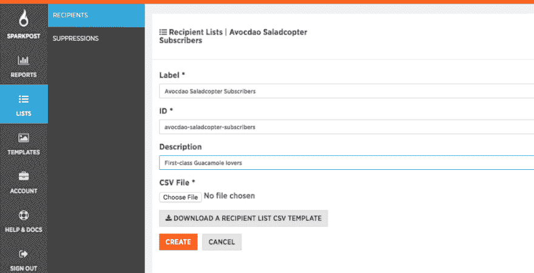

# 用 Python 美化你的 SparkPost 收件人和禁止列表

> 原文：<https://dev.to/sparkpost/charm-your-sparkpost-recipient-and-suppression-lists-with-python>

当开发向客户发送电子邮件的代码时，明智的做法是首先在测试列表上进行尝试。使用我们的[汇域服务](https://www.sparkpost.com/docs/faq/using-sink-server/)可以帮助你避免在测试中对[你的声誉](https://www.sparkpost.com/blog/email-reputation-matters/)产生负面影响。接下来，你会想要检查你的代码是否在真实大小的[接收者列表](https://www.sparkpost.com/docs/user-guide/uploading-recipient-list/)上大规模工作，并清除任何代码性能问题……但是怎么做呢？

你可以用微软的 Excel 来汇总。csv 收件人列表文件，但有实际限制，而且速度很慢。您将使用像“需要 [JSON 编码](https://en.wikipedia.org/wiki/JSON)的 substitution_data”这样的字段，而 Excel 并不帮助您完成这些。就性能而言，Excel 中任何超过几百行的内容都会变得很麻烦。

我们需要的是一个工具，将产生现实的期待测试列表；最好是任何大小，多达几十万个接收者，具有安全的数据宿域地址。Excel 在这方面真的很慢——我们可以通过一些温和的编程做得更好。

第二个要求，可能不太明显，是测试你上传到 SparkPost 内置的[抑制列表功能](https://www.sparkpost.com/docs/user-guide/using-suppression-lists/)。在邮寄之前，上传你以前的提供商的隐藏地址是一个很好的做法——例如，参见我们的[移民指南](https://www.sparkpost.com/blog/?s=migration)。您可能需要在不使用实际抑制地址的情况下预演一次迁移。也许你现在还不能很容易地访问它们，因为你的老供应商表现不好，没有一个好的 API。幸运的是，只需很少的额外代码，我们就可以让这个工具生成“练习抑制列表”。

## 你在我的名单上

CSV 文件在文件的第 1 行有一个“标题”,给出了每个字段的名称。方便的提示:您可以直接从 SparkPost 获得一个示例文件，包括标题行，使用“下载收件人列表 CSV 模板按钮[就在这里](https://app.sparkpost.com/lists/recipients?_ga=2.38487782.456726847.1496187918-424867781.1485888065):

[T2】](https://res.cloudinary.com/practicaldev/image/fetch/s--c-ADRJvm--/c_limit%2Cf_auto%2Cfl_progressive%2Cq_auto%2Cw_880/https://media.sparkpost.com/uploads/2017/05/Recip-list-1024x524.png)

SparkPost 收件人列表。csv 格式看起来是这样的:

```
email,name,return_path,metadata,substitution_data,tags
recipient@example.com,Example Recipient,reply@example.com,"{""foo"": ""bar""}","{""member"": ""Platinum"", ""region"": ""US""}","[""test"", ""example""]"
recipient2@example.com,Jake,reply@example.com,"{""foo"": ""bar""}","{""member"": ""Platinum"", ""region"": ""US""}","[""test"", ""example""]" 
```

Enter fullscreen mode Exit fullscreen mode

`metadata`、`substitution_data`和`tags`字段可以包含您想要的任何内容。

SparkPost 的禁止列表。csv 格式同样好玩，看起来是这样的:

```
recipient,transactional,non_transactional,description,subaccount_id
anon11779856@demo.sink.sparkpostmail.com,true,true,Example data import,0 
```

Enter fullscreen mode Exit fullscreen mode

## 我们来争论一下

一些命令行参数[会很好，所以我们可以改变我们正在生成的列表。以下是我们将接受的论点，它们很好地转化为这个项目的设计目标:](https://www.youtube.com/watch?v=Lvcnx6-0GhA)

*   一个标志，表示我们是在生成收件人列表还是禁止列表
*   我们需要多少条记录(可选，默认为 10 条)
*   要为其生成记录的收件人域(可选–默认为安全的域，如 demo.sink.sparkpostmail.com)。

## 下载和使用工具

首先，你需要安装`python`、`pip`和`git`。如果你还没有，在我的[前一篇博文](https://www.sparkpost.com/blog/sending-scheduled-mailings-simply/)中有一些简单的说明。然后我们用`git clone`下载项目。需要外包装`names`，我们可以用`pip3`安装。

```
$ git clone https://github.com/tuck1s/gen-SparkPost-Lists-python.git
Initialized empty Git repository in /home/stuck/gen-SparkPost-Lists-python/.git/
remote: Counting objects: 32, done.
remote: Total 32 (delta 0), reused 0 (delta 0), pack-reused 32
Unpacking objects: 100% (32/32), done.

$ sudo pip3 install names
Collecting names
Installing collected packages: names
Successfully installed names-0.3.0

$ cd gen-SparkPost-Lists-python/
$ ./gen-sparkpost-lists.py recip 10 
```

Enter fullscreen mode Exit fullscreen mode

在最后一个命令之后，您应该会看到输出到屏幕上的列表。如果你想把它导入一个文件，你只需要使用`>`，就像这样:

```
$ ./gen-sparkpost-lists.py recip 10 > mylist.csv 
```

Enter fullscreen mode Exit fullscreen mode

这就是全部了！如果您在没有参数的情况下运行该工具，它会给出一些使用指南:

```
$ ./gen-sparkpost-lists.py 

NAME
   ./gen-sparkpost-lists.py
   Generate a random, SparkPost-compatible Recipient- or Suppression-List for .CSV import.

SYNOPSIS
  ./gen-sparkpost-lists.py recip|supp|help [count [domain]]

OPTIONAL PARAMETERS
    count = number of records to generate (default 10)
    domain = recipient domain to generate records for (default demo.sink.sparkpostmail.com)
[stuck@ip-172-31-20-126 gen-SparkPost-Lists-python]$ 
```

Enter fullscreen mode Exit fullscreen mode

## 内码-特殊雪花

这是我们希望为测试收件人列表生成的数据类型。

```
email,name,return_path,metadata,substitution_data,tags
anon13061346@demo.sink.sparkpostmail.com,Teddy Lanier,bounce@demo.sink.sparkpostmail.com,"{""custID"": 3156295}","{""memberType"": ""bronze"", ""state"": ""KY""}","[""gwen"", ""bacon"", ""hass"", ""fuerte""]"
anon94133309@demo.sink.sparkpostmail.com,Heriberto Pennell,bounce@demo.sink.sparkpostmail.com,"{""custID"": 78804336}","{""memberType"": ""platinum"", ""state"": ""MT""}","[""bacon""]"
anon14982287@demo.sink.sparkpostmail.com,Terry Smialek,bounce@demo.sink.sparkpostmail.com,"{""custID"": 16745544}","{""memberType"": ""platinum"", ""state"": ""WA""}","[""bacon""]" 
```

Enter fullscreen mode Exit fullscreen mode

元数据、替代数据和标签来自我们的示例公司 Avocado Industries。让我们从中挑出一行，隐藏双引号`””`,这样我们可以看得更清楚:

元数据:

```
{  "custID":  3156295  } 
```

Enter fullscreen mode Exit fullscreen mode

替换 _ 数据:

```
{  "memberType":  "bronze",  "state":  "KY"  } 
```

Enter fullscreen mode Exit fullscreen mode

标签(顺便说一下，这些是[种鳄梨](https://en.wikipedia.org/wiki/Avocado#A_cultivars)！)

```
[  "gwen",  "bacon",  "hass",  "fuerte"  ] 
```

Enter fullscreen mode Exit fullscreen mode

我们希望每个收件人的电子邮件地址都是唯一的，这样当导入到 SparkPost 中时，列表就是要求的长度。听起来很容易——我们可以使用一个随机数生成器来生成一个 ID，就像上面显示的那样。问题是[随机](https://en.wikipedia.org/wiki/Simple_random_sample)函数可以在一次运行中给出相同的 ID，从长远来看这是很有可能发生的。我们需要防止这种情况发生，同时消除重复的地址。

Python 提供了一种很好的 [set()数据类型](https://docs.python.org/3.6/library/stdtypes.html?highlight=set#set)，我们可以使用这种相对高效的数据类型:

```
uniqFlags = set()
:
:
:
dataRow.append(randomRecip(domain, numDigits, uniqFlags)) 
```

Enter fullscreen mode Exit fullscreen mode

我们已经创建了一个全局 set 对象，`uniqFlags`,它将作为我们已经使用过的随机数的暂存区——并以通常的方式将其传递给函数`randomRecip`。

```
# Need to treat ensureUnique only with mutating list methods such as 'add', so the updated value is returned to the calling function def randomRecip(domain, digits, ensureUnique):
   taken = True
   while taken:
       localpartnum = random.randrange(0, 10**digits)
       taken = localpartnum in ensureUnique                    # If already had this number, then pick another one
   ensureUnique.add(localpartnum)
   return 'anon'+str(localpartnum).zfill(digits)+'@'+domain    # Pad the number out to a fixed length of digits 
```

Enter fullscreen mode Exit fullscreen mode

Python 允许使用`.add()`方法对函数内部的`ensureUnique`进行修改，以显示在全局数据中——换句话说，参数是通过引用调用的。

对于其他字段，从一小组选项中选择随机值很容易。例如:

```
def randomMemberType():
   tiers = ['bronze', 'silver', 'gold', 'platinum']
   return random.choice(tiers) 
```

Enter fullscreen mode Exit fullscreen mode

我们可以用完全相同的方式选择随机的美国邮政州。custID 字段只是一个简单的随机数(所以它可能会重复)。如果你愿意，我把它作为一个练习留给读者修改(提示:使用另一套)。

对于标签字段，我们想给每个人分配一个介于零到所有可能的鳄梨品种之间的类别；为了更好的测量，我们也将随机化这些标签的顺序。我们是这样做的:

```
# Compose a random number of tags, in random shuffled order, from a preset short list.
# List of varieties is taken from: http://www.californiaavocado.com/how-tos/avocado-varieties.aspx def randomTags():
   avocadoVarieties = ['bacon', 'fuerte', 'gwen', 'hass', 'lamb hass', 'pinkerton', 'reed', 'zutano']
   k = random.randrange(0, len(avocadoVarieties))
   t = avocadoVarieties[0:k]
   random.shuffle(t)
   return json.dumps(t) 
```

Enter fullscreen mode Exit fullscreen mode

## 名字里有什么？

SparkPost 收件人列表格式支持文本名称字段，以及电子邮件地址。如果能有逼真的数据就好了。幸运的是，有人已经用 1990 年美国人口普查数据制作了一个包，这个包很容易利用。您会记得我们之前安装了`names`包。

```
# Prepare a cache of actual, random names - this enables long lists to be built faster nameList = []
for i in range(100):
   nameList.append( { 'first': names.get_first_name(), 'last': names.get_last_name() } ) 
```

Enter fullscreen mode Exit fullscreen mode

运行库调用需要一点时间，这可能会降低我们创建列表的速度。上面的代码没有为每一行都调用这个函数，而是构建了一个名和姓的名称列表，我们以后可以从中进行选择。出于我们的目的，可以有重复的文本名称(即多个无名氏)，只有电子邮件地址需要严格唯一。

在上面的代码中选择 100 是相当随意的——当我们随机选择一个名字和分别选择一个姓氏时，它会给我们足够的随机性。

## 全速前进

一个快速的本地测试显示，该工具可以在 7 秒钟内创建一个 100，000 条目的收件人列表(约 20MB ),因此即使是大型输出，您也不必等待很长时间。

该工具的输出只是一个文本流，所以您可以使用>将其重定向到一个文件中，就像这样:

```
$ ./gen-sparkpost-lists.py recip 100000 >mylist.csv 
```

Enter fullscreen mode Exit fullscreen mode

您还可以将它传输到其他工具中。 [CSVkit](https://csvkit.readthedocs.io/en/1.0.2/) 非常适合这一点——您可以选择过滤哪些列(使用 csvcut)、显示(使用 csvlook)等。例如，你可以很容易地创建一个只有电子邮件、姓名和替换数据的文件，并查看它:

```
$ ./gen-sparkpost-lists.py recip 10 | csvcut -c1,2,5 | csvlook
|-----------------------------------------------------------------------------------------------------------|
|  email                                    | name             | substitution_data                          |
|-----------------------------------------------------------------------------------------------------------|
|  anon78856278@demo.sink.sparkpostmail.com | Linda Erdmann    | {"memberType": "gold", "state": "MN"}      |
|  anon27569456@demo.sink.sparkpostmail.com | James Glenn      | {"memberType": "platinum", "state": "PA"}  |
|  anon82026154@demo.sink.sparkpostmail.com | Mark Morris      | {"memberType": "bronze", "state": "NC"}    |
|  anon99410317@demo.sink.sparkpostmail.com | Daniel Baldwin   | {"memberType": "platinum", "state": "TX"}  |
|  anon40941199@demo.sink.sparkpostmail.com | Cammie Cornell   | {"memberType": "platinum", "state": "TX"}  |
|  anon81569289@demo.sink.sparkpostmail.com | Mary Pearce      | {"memberType": "bronze", "state": "NC"}    |
|  anon87708262@demo.sink.sparkpostmail.com | Angella Souphom  | {"memberType": "bronze", "state": "NV"}    |
|  anon74282988@demo.sink.sparkpostmail.com | Antonio Erdmann  | {"memberType": "platinum", "state": "MD"}  |
|  anon48883171@demo.sink.sparkpostmail.com | Randolph Maranto | {"memberType": "bronze", "state": "MA"}    |
|  anon17719693@demo.sink.sparkpostmail.com | Jack Hudson      | {"memberType": "silver", "state": "CA"}    |
|-----------------------------------------------------------------------------------------------------------| 
```

Enter fullscreen mode Exit fullscreen mode

## 最后…

下载[代码](https://github.com/tuck1s/gen-SparkPost-Lists-python)并制作自己的测试接收者和抑制列表。请在下面留下评论，让我知道你是如何使用它的，以及你想看到的其他黑客。

这篇文章最初发布在 [SparkPost](https://www.sparkpost.com/blog/recipient-suppression-lists-python/) 上。