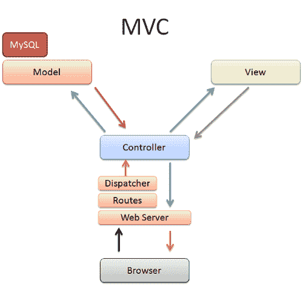
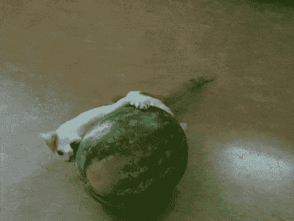
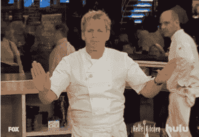

# 欢迎来到 MVC 餐厅

> 原文：<https://dev.to/yechielk/welcome-to-the-mvc-restaurant>

## **推陈出新**

最近有人要求我描述一下 web 应用框架的常见组件。每个组件的用途是什么？将每个组件与其他组件分开的好处是什么？

web 框架遵循的最常见的架构是 MVC(模型、视图、控制器)模式。

到目前为止，我听到的解释 MVC 模式的最好的类比是经常重复的“餐馆类比”我不想再重复了，所以我坐在那里，试图想出一个替代的类比，但我想出的每个类比最终都失败了。有些在开始时听起来很有希望，有些我甚至能说得很长，但最终，没有一个能像餐馆的比喻那样详细地解释 MVC。

看到我别无选择，我只好又发表了一篇 MVC 餐厅的博文。我将尝试在这里或那里添加一两个细节，并且我希望在某种程度上扩展它来回答关于关注点分离的问题的后半部分。

[T2】](https://res.cloudinary.com/practicaldev/image/fetch/s--lCqdCzkv--/c_limit%2Cf_auto%2Cfl_progressive%2Cq_auto%2Cw_880/https://cdn-images-1.medium.com/max/800/1%2AIzQpW2ABs3920TjjaS-82Q.jpeg)

## 最低值咖啡馆

这是漫长的一天；你又饿又暴躁，你只是需要在回家前吃点东西。你溜进你最喜欢的廉价食物点，有点拥挤的最低价值咖啡馆。谢天谢地，那里有一张空桌子。

你坐在餐桌旁，看着熟悉的菜单。有些人喜欢有亮橙色标志的那张，上面有一只红色熊猫拥抱着一片亮蓝色的土地。还有人更喜欢有红黄绿蓝球标的菜单；他们说服务员会更快地为你服务。还有其他的，虽然每个人都同意远离菜单，蓝色的“e”周围有一个金环，但有传言说从那里订购的食物会让太多无辜的顾客患上恶心的胃病…

所以你拿起你选择的菜单。其中一些菜单变得相当高级；他们打开一个页面，上面有你最常点的菜。当你正坐着**浏览**你的菜单时，你吃惊地听到身后传来一个声音“你好，我叫叶切尔，我是你今晚的**管理员**(这里的服务员都有怪癖)，你准备好点菜了吗？”

你指着你最喜欢的金枪鱼鸡蛋三明治、双份浓缩咖啡和甜点奶酪蛋糕。服务员说“当然，只需要几毫秒，我能在这期间给你拿点喝的吗？”在你做出反应之前，服务员(呃… **控制器**)消失在后面。

远离普通人视线的背面是大部分活动发生的地方。**控制器**将你的三明治订单传递给三明治男孩，将咖啡订单传递给咖啡师，将甜点订单传递给糕点师(为什么这些厨房工人喜欢自称为**模特**谁也说不准)。**模特**依次冲向储藏室去取原料，回到她们的位置去烹饪/准备/组装。当一切都准备好了，他们递给服务员(对不起，对不起，我知道你喜欢被称为**控制器**，只是一直记不住，别再那样对我吼了！).然后**控制器**将它们很好地组装在一个大托盘上，上面用草书刻着“视图**”，然后将它们全部拿出来放在你的桌子上。**

 **这整个过程是如此之快；在你把手指从菜单上拿开之前，食物就已经准备好了。

## 那么这一切是什么意思呢？

简单来说就是这样的类比，每次上网都会这样。

[T2】](https://res.cloudinary.com/practicaldev/image/fetch/s--_q_COdtw--/c_limit%2Cf_auto%2Cfl_progressive%2Cq_auto%2Cw_880/https://cdn-images-1.medium.com/max/600/1%2AMQabORXtM4jpME-aH_2rYg.png)

这个过程从你的**浏览器**开始，在那里你输入一个 URL，点击一个链接，提交一个表格，等等。它向服务器发送一个请求，由一个**控制器**接收。**控制器**处理请求，将其传递给适当的**模型**。**模型**是应用程序的主要逻辑发生的地方。**型号**从数据库中检索您需要的数据，并根据用户的请求进行组装。然后**模型**将数据交给**控制器**，控制器使用**视图**中的模板，将数据组装成用户喜欢的格式。然后**控制器**获取组装好的**视图**并将其发送回**浏览器**，在那里用户可以通过无休止地重复猫的 gif 图来获得娱乐。

[T2】](https://res.cloudinary.com/practicaldev/image/fetch/s--8QWFhCXR--/c_limit%2Cf_auto%2Cfl_progressive%2Cq_66%2Cw_880/https://cdn-images-1.medium.com/max/800/1%2AfQXprxQ0IpWtYQcJCROPmw.gif)

## 分离顾虑

在我看来，这个类比真正的亮点在于回答了问题的第二部分:将每个组件与其他组件分开的好处是什么？

让我们仔细看看我们的餐馆。人们可以很容易地想象一个较小的机构，在那里厨师是一个与顾客互动，接受他们的订单，准备他们，并提供服务。类似地，在较小的应用程序中，您可能能够在一个文件中包含所有需要的逻辑(这在小型静态网站中非常常见)。

然而，一旦餐馆发展壮大，开始提供各种菜肴，客户群变得太大，一个人无法应付，每个员工知道自己的位置和工作就变得越来越重要。

想象一下，如果服务员决定在厨房“帮忙”,会有多混乱，没有厨师会接受这样的打扰。

[T2】](https://res.cloudinary.com/practicaldev/image/fetch/s--yHjZ_Zbt--/c_limit%2Cf_auto%2Cfl_progressive%2Cq_66%2Cw_880/https://cdn-images-1.medium.com/max/600/1%2AubimVHPllTJ2KmkPrjFZAQ.gif)

如果厨师决定忙着摆桌子，而订单却堆积在厨房里，顾客会很快变得不耐烦。

最重要的是问责问题。当每个人都有明确的工作时，经理就知道出问题时去哪里。食物烧焦了吗？跟厨师说。顾客是否等了很久才点菜？看看服务员是否需要帮助。

在一个运行良好、定义明确的系统中，每个组件都有自己的工作，当事情需要修复或调整时，您确切地知道去哪里修复它们。

同样，在您的应用程序中。如果代码的每个部分都有自己的工作，并且都在正确的位置，那么捕捉和修复错误、添加功能和提高性能就会变得容易得多，而不必担心会踩到任何其他组件的脚趾。毕竟，你永远不想激怒那些处理你食物的人；)

* * *

*这篇文章是从我的博客 [Coding Hassid](https://blog.yechiel.me/welcome-to-the-mvc-restaurant-fb1709047914)
交叉发布的，你可以在那里阅读更多关于我的编码之旅，或者在 Twitter 上关注我 [@yechielk](https://twitter.com/yechielk)***