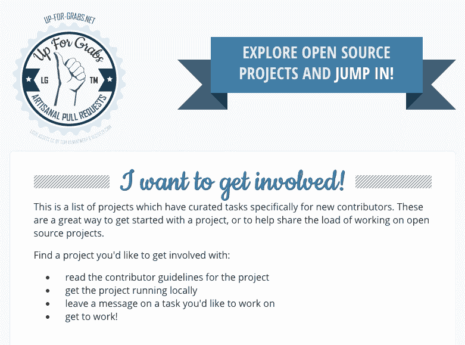

# 面向初学者的开源资源

> 原文：<https://dev.to/jess/open-source-resources-for-beginners>

进入开源领域可能非常令人生畏，尤其是对初级开发人员而言。这里有一个资源列表，似乎降低了新贡献者的门槛。

*   第一次阅读[只有](https://medium.com/@kentcdodds/first-timers-only-78281ea47455)才能对这个世界感觉良好。然后，[在 github](https://github.com/search?utf8=%E2%9C%93&q=label%3Afirst-timers-only+is%3Aopen&type=Issues&ref=searchresults) 上搜索由 Kent 的帖子引发的未决问题列表。

*   [Awesome for 初学者](https://github.com/MunGell/awesome-for-beginners)是一个为初学者或新贡献者列出其他项目问题的项目。它甚至告诉你每个项目如何标记他们的问题。比如 ember.js 的标签是“[对新贡献者](https://github.com/emberjs/ember.js/issues?q=is%3Aopen+is%3Aissue+label%3A%22Good+for+New+Contributors%22)有好处”

*   [待价而沽](http://up-for-grabs.net/#/)是另一种为开源新手寻找任务的方式。
    T3T5】

*   虽然他们不会发太多的微博，但是你的第一个公关是一个发布首发问题的微博账号。

*   一旦你开始，接受 Shubheksha Jalan 的建议，开始写你作为一个新的开源贡献者的经历。

*   如果你读这篇文章是因为你认为这实际上是一个开源项目的指南，那么[如何开始开源](https://dev.to/samjarman/how-to-get-started-with-open-source)就是你正在寻找的。

对杰西·迪特森(Jesse Ditson)大声喊出来，感谢他给我发来这份清单的一大部分，感谢他一直以来的体贴和鼓励。他为 Attic Labs 工作，他们的项目 Noms 是一个分散的数据库，其初始问题被标记为“ [GoodFirstBug](https://github.com/attic-labs/noms/issues?q=is%3Aopen+is%3Aissue+label%3AGoodFirstBug) ”。✌ï