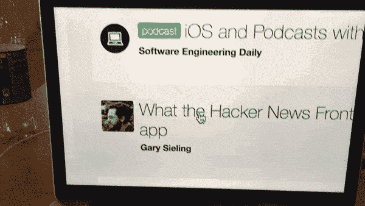
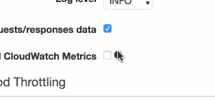
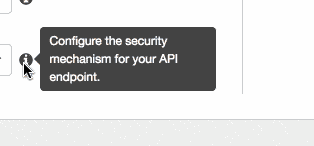
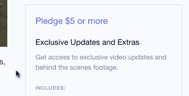
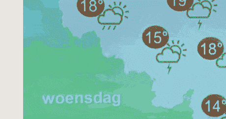
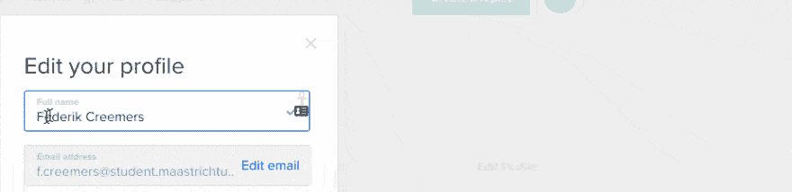
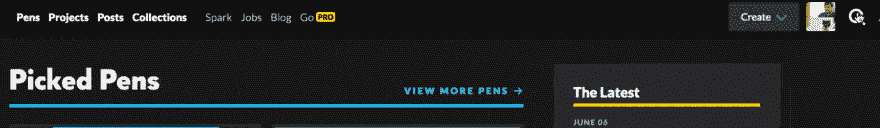

# 如何让使用屏幕放大镜的人能够访问您的网站

> 原文:[https://dev . to/_ big blind/how-to-make your-website-accessible to the people ' s-use a screen-amplifier](https://dev.to/_bigblind/how-to-make-your-website-accessible-to-people-who-use-a-screen-magnifier)

有很多关于如何让你的网站具有可访问性的内容。但是我还没有看到太多关于屏幕放大镜的用户可访问性的主题。我就是其中之一，我经常在网上遇到令人烦恼的问题。

在这篇文章中，我将给出一些提示，告诉你如何让屏幕放大软件的用户更容易访问你的网站。

**免责声明:**

*   这篇文章纯粹是基于多年来使用屏幕放大镜的经验。我没有进行过用户研究(尽管我很想看到这类研究的结果)。
*   我将只讨论我在桌面上的体验，而不是在移动设备上。虽然我偶尔会使用 IOS 内置的屏幕放大镜，但手机屏幕太小，当放大到我想要的程度时，屏幕上的内容很少，所以我通常更喜欢使用 VoiceOver。
*   鉴于让屏幕阅读器更容易访问网站总是一个胜利，因为它不会改变网站的视觉外观，让放大镜用户更容易访问网站可能是一个平衡的行为。我不是一名设计师，所以我可能会在这篇文章中讨论一些事情，这些事情会改善使用放大镜的人的体验，但对 99%的视力正常的访问者来说会更糟。在这种情况下，请留下评论，我很想知道这些。

# 什么是屏幕放大镜

屏幕放大镜是一个放大屏幕的软件(多么出人意料啊！)它将屏幕上的一部分放大显示，或者在整个屏幕上显示，或者在屏幕的一个区域上显示，其余部分不放大。

举个例子，下面是我浏览这个网站主页上的文章的样子:

[T2】](https://res.cloudinary.com/practicaldev/image/fetch/s--Pugj9JJF--/c_limit%2Cf_auto%2Cfl_progressive%2Cq_66%2Cw_880/https://thepracticaldev.s3.amazonaws.com/i/oqoasmqwnnvep9ci2wri.gif)

# 在屏幕上移动放大镜

因为屏幕被放大了，很明显不是所有的都在显示屏上可见，所以当你移动鼠标的时候，你可以在屏幕上移动一个虚拟的矩形放大镜。在 macOS 上，放大镜的移动与鼠标的移动有三种关联方式，如下图所示。

[![The illustration shows 3 rectangles representing computer screens. One represents the option to move the screen image "continuously with the pointer". In this mode, the screen moves as soon as the mouse moves. The position of the mouse on the magnified piece of the screen is proportional to the position of the mouse on the full-sized screen. In the "keep pointer centered" mode, the mouse stays centered as long as it is far away enough from the edge. When near the edge, the magnified image stops moving, so the pointer can move away from the center, towards the edge. In the "only move on edges" mode, the magnified portion of the screen doesn't move until the pointer hits one of the edges of the magnified area.](img/0f69c432de3e764bf793f52342c14a37.png)T2】](https://res.cloudinary.com/practicaldev/image/fetch/s--vouOEaR2--/c_limit%2Cf_auto%2Cfl_progressive%2Cq_66%2Cw_880/https://thepracticaldev.s3.amazonaws.com/i/ket4231nz0m9ma8kogyf.gif)

很抱歉这张 gif 中的字体太小。三个矩形代表未放大的全尺寸屏幕。移动的点代表鼠标光标。左边的屏幕显示了用光标连续移动放大图像的设置。中间的一个显示将光标保持在中心附近的设置，而右边的一个显示仅当指针触及放大区域的边缘时移动放大镜的设置。

# 1。当鼠标在显示的内容上时，保持工具提示和其他鼠标触发的弹出窗口可见。

这是我最大的烦恼，所以我把它放在第一位。如果你只做其中一件事，那就做这件事。以下是 AWS API 网关控制台的一个示例:

[T2】](https://res.cloudinary.com/practicaldev/image/fetch/s--tE0iLXQb--/c_limit%2Cf_auto%2Cfl_progressive%2Cq_66%2Cw_880/https://thepracticaldev.s3.amazonaws.com/i/jwk2eownwngdmirdqetd.gif)

如您所见，当光标悬停在信息图标上时，工具提示可能不完全可见。我需要移动鼠标来获得完整的视图，但这隐藏了工具提示。所以我永远无法在我想要的放大级别上完整地阅读工具提示。

AWS Lambda 控制台展示了如何做得更好:

这个好多了。我可以将鼠标移到语音气泡上来阅读它。另一种选择是在点击时切换工具提示，通过使图标看起来更像一个按钮，让用户清楚地知道图标是可点击的，当光标悬停在它上面时，光标变成一只手。

# 2。当鼠标悬停在内容上时，不要模糊内容。

我最近见过的最烦人的例子是 [Kickstarter 的认捐水平](https://www.kickstarter.com/projects/theproperpeople/forbidden-explorers-urban-exploration-documentary)。【T2

我知道他们想把整个区域做成一个巨大的“行动号召”按钮，当鼠标光标在上面的时候，但是这个覆盖使得下面的津贴列表很难阅读。高对比度边框可能同样具有视觉上的独特性，或者改变文本的背景，使文本以良好的对比度保持可见。

另一个常见的例子是控件在悬停时覆盖转盘/滑块图像或视频。下面是比利时省级电视网 TVL 的一个例子。他们显然想表明，点击视频将暂停它。我认为这是一个如此常见的交互，这样大的控件是没有必要的，即使有必要，也可能有更多可用的方法来实现它。【T2

你可以把这一点和上一点总结为“内容不要依赖鼠标位置。”

# 3 把一个动作的结果放在接近该动作被触发的地方。

这里的一个例子是[数字海洋](https://m.do.co/c/6e1ff92c19c3)。(如果你通过该链接注册，你将获得 10 美元的数字海洋信用，如果你花费 25 美元，我将获得信用)

[T2】](https://res.cloudinary.com/practicaldev/image/fetch/s---_iCpKUQ--/c_limit%2Cf_auto%2Cfl_progressive%2Cq_66%2Cw_880/https://thepracticaldev.s3.amazonaws.com/i/kxtl6wi7npp37avabs8k.gif)

在这个例子中，我在屏幕中央的模态中编辑我的个人资料细节，但是在右上角的 [toast 消息](https://ux.stackexchange.com/questions/11998/what-is-a-toast-notification)中出现了确认。

对于概要文件，您可能还会注意到显示在中间的信息已经更新，但这不会很快被注意到。我最初在他们的仪表盘上遇到这个问题是在我第一次通过 paypal 向我的账户余额添加资金的时候。右上方出现了一条消息，我没有看到，因为我看的是页面的中间部分，它包含了主要内容。我的余额没有立即更新，但我看到交易已经在贝宝上完成，所以有几分钟，我认为数字海洋有一个错误，他们拿了我的钱，但没有给我信用。

在[重新设计](http://codepen.seesparkbox.com/)之后，我在 [CodePen](https://codepen.io) 上使用搜索功能时也遇到了类似的问题。如果你只看到屏幕的右边，点击搜索按钮后你会不清楚你应该去哪里。

[T2】](https://res.cloudinary.com/practicaldev/image/fetch/s--j1kmVUVO--/c_limit%2Cf_auto%2Cfl_progressive%2Cq_66%2Cw_880/https://thepracticaldev.s3.amazonaws.com/i/3uevd9z5zev9d8jkvzdq.gif)

视觉上，我真的很喜欢搜索页面的样子。我第一次用它的时候，有点困惑

# 就是这样！

至少在我看来是这样。但也许我的观点太狭隘了，ðÿ˜š.在这种类型中，你遇到过类似的其他问题吗？你对我谈到的几点有什么意见吗？请在评论中让我知道。