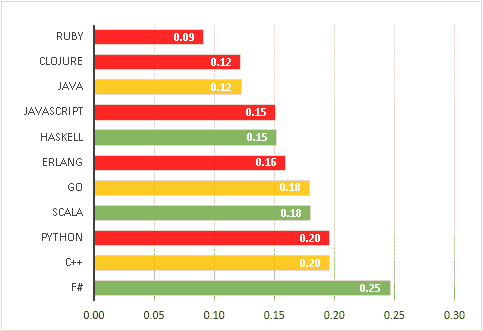
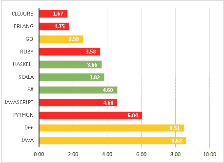
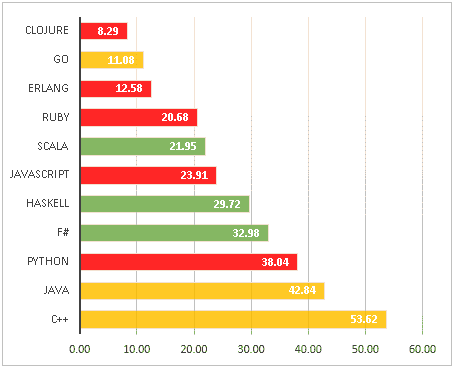

# 静态类型被打破的承诺

> 原文：<https://dev.to/danlebrero/the-broken-promise-of-static-typing>

*本文原载于 [IG 的博客](https://labs.ig.com/static-typing-promise)*

我对鲍伯·马丁叔叔最近的博客文章感到非常惊讶，标题是:“类型战争”，他写道:“因此，我预测，随着测试驱动开发越来越被接受为必要的专业学科，动态语言将成为首选语言。最终，说话不多的人会赢。”

静态类型社区的一些人不同意这种说法，他们认为在足够高级的静态类型语言中，类型是证明，它们使得单元测试变得多余。哈斯克尔甚至[声称](https://wiki.haskell.org/Why_Haskell_just_works)“一旦你的代码编译成功，它通常就能工作”！

无论是更安全的重构、更好的文档、更准确的 IDE 支持还是更容易理解，对我来说，所有这些声明都意味着一个简单的承诺:更少的错误。

我真的很讨厌虫子。我发现它们是项目中最浪费时间和精力的事情之一，没有什么比迭代演示快结束时团队自豪地说“我们做了 X 个故事点，修复了 20 个 bug”更让我恼火的了！万岁！”

对我来说，这听起来像是，“在最后一次迭代中，我们写了 20 多个 bug，但是我们的客户只能找到 20 个！我们因为编写和修复它们而获得报酬！万岁！”

## 制图虫

考虑到这一点，我试图找到一些经验证据来证明静态类型确实有助于避免错误。不幸的是[我找到的最佳来源](http://danluu.com/empirical-pl/)表明我运气不好，所以我不得不满足于一个更**天真的方法:搜索 Github。**

下面是一些比较不同语言的“错误密度”的图表。关于 bug 密度，我指的是 GitHub 中每个存储库中标记为“bug”的问题的平均数量。我还试图通过使用带有星星的库来消除一些噪音，假设没有星星的库意味着没有人在使用它们，所以没有人会报告针对它们的错误。

绿色，在“高级”静态类型语言角落:Haskell，Scala 和 F#。在 orange，在“古老而无聊”的静态类型语言角落:Java、C++和 Go。
红色的，在动态类型化语言角落:JavaScript，Ruby，Python，Clojure，Erlang。

**第一轮。**按 bug 密度排序的 Lang uages。所有回购

[T2】](https://res.cloudinary.com/practicaldev/image/fetch/s--q_okz2AQ--/c_limit%2Cf_auto%2Cfl_progressive%2Cq_auto%2Cw_880/https://labs.ig.com/sites/default/files/bug-density-no-filter.PNG)

**第二轮。**语言 s 按 bug 密度排序。10 多颗星回复

[T2】](https://res.cloudinary.com/practicaldev/image/fetch/s--0798utPb--/c_limit%2Cf_auto%2Cfl_progressive%2Cq_auto%2Cw_880/https://labs.ig.com/sites/default/files/bug-density-5-stars.PNG)

第三轮。按 bug 密度排序的语言。100 多位明星回复

[T2】](https://res.cloudinary.com/practicaldev/image/fetch/s--WmgDnsTz--/c_limit%2Cf_auto%2Cfl_progressive%2Cq_auto%2Cw_880/https://labs.ig.com/sites/default/files/bug-density-100-stars.PNG)

虽然不是结论性的，但是图表中缺乏证据表明更高级的类型语言将使我们免于编写错误，这是非常令人不安的。

## 静态与动态不是问题

这些图表没有显示静态/动态类型有什么不同，但是它们确实显示了，至少在我看来，注重简单性的语言和不注重简单性的语言之间的差距。

罗布·派克(T1)(Go 创造者)和 T2·里奇·希基(T3)(clo jure 创造者)都非常擅长谈论简单性是他们语言的核心部分。

这种简单性意味着您的应用程序将更容易理解、更容易更改、更容易维护、更灵活。所有这些都意味着你将编写更少的 bug。

简单语言的特征是什么？列出 Go、Erlang 和 Clojure 之间的共同点，我们得到:

*   无需手动内存管理
*   没有基于互斥的并发
*   没有课
*   没有遗产
*   没有复杂的类型系统
*   无多级
*   没有太多语法
*   不是学术性的

也许我们在语言中获得的所有这些闪亮的东西实际上是我们最终伤害自己的锋利工具——制造错误和浪费时间——它们所做的只是带来许多额外的复杂性，而我们真正需要的是一种更简单的语言。

正如东尼·霍尔[所说](http://zoo.cs.yale.edu/classes/cs422/2011/bib/hoare81emperor.pdf):

> 有两种方法来构建一个软件设计:一种方法是让它简单到没有明显的缺陷，另一种方法是让它复杂到没有明显的缺陷。