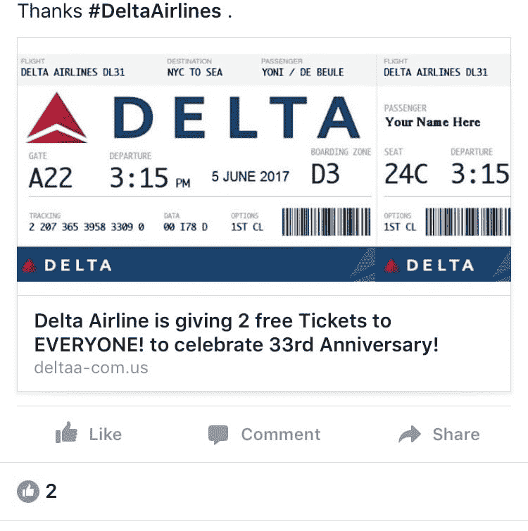
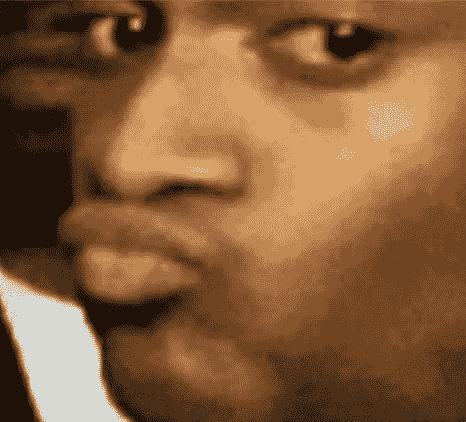
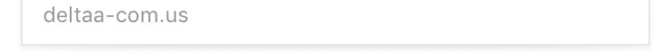
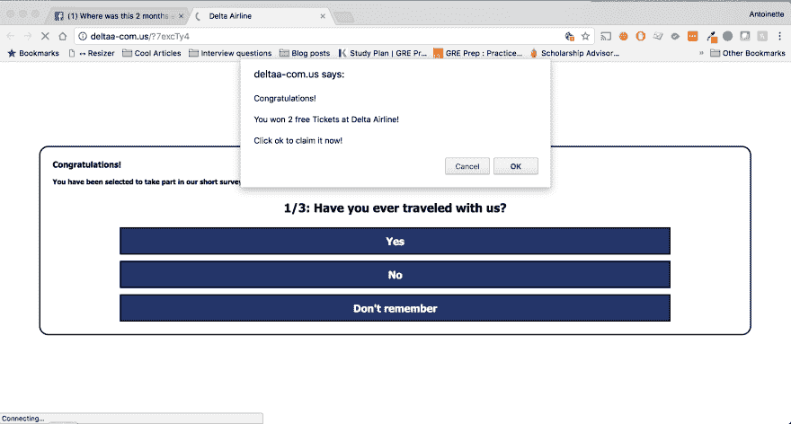
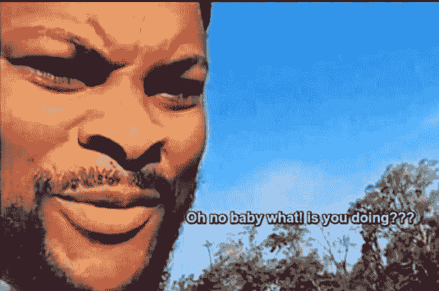
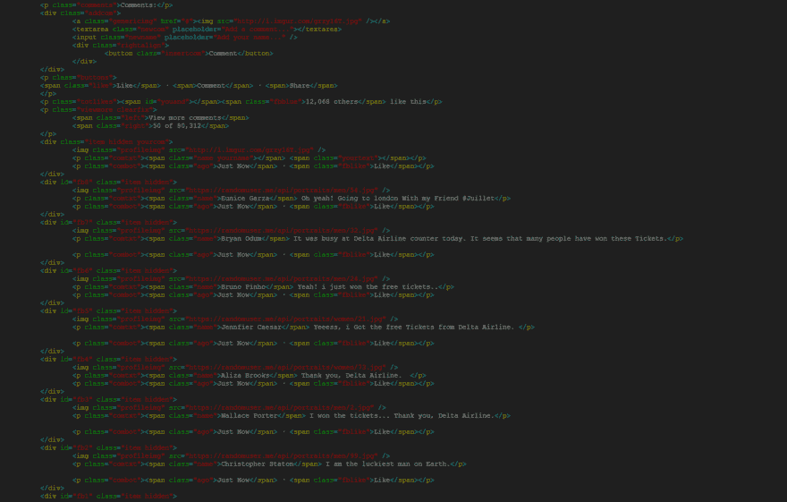
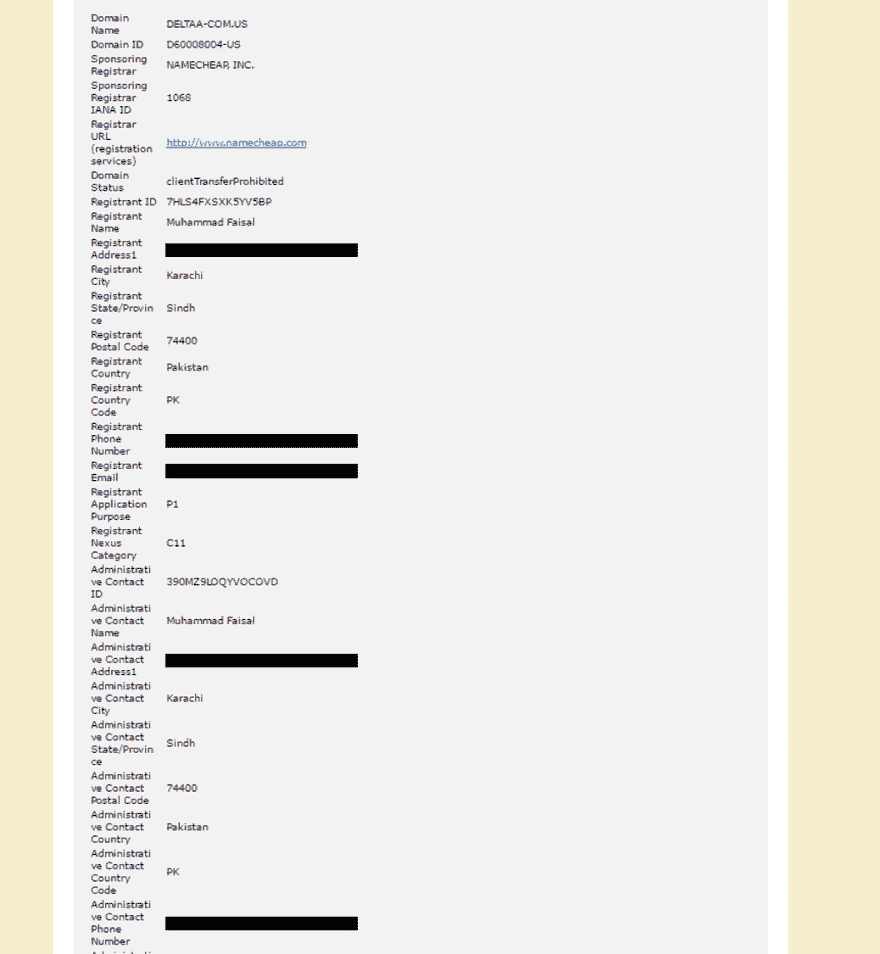

# 我点击了一个脸书骗局，看看会发生什么

> 原文:[https://dev . to/Antoinette 0x 53/I-clicked-on-a-Facebook-scam-to-see-what-could-happen](https://dev.to/antoinette0x53/i-clicked-on-a-facebook-scam-to-see-what-would-happen)

我正在浏览脸书，突然...
[T3】](https://res.cloudinary.com/practicaldev/image/fetch/s--T1Dh1C2b--/c_limit%2Cf_auto%2Cfl_progressive%2Cq_auto%2Cw_880/https://thepracticaldev.s3.amazonaws.com/i/y2eeiu70uu3jxyycwu9u.jpg)

然后我就想...
[T3】](https://res.cloudinary.com/practicaldev/image/fetch/s--TKmloaTX--/c_limit%2Cf_auto%2Cfl_progressive%2Cq_auto%2Cw_880/https://thepracticaldev.s3.amazonaws.com/i/rb8mwv6qgin53gg9ps55.JPG)

你看到这里有什么问题了吗？首先，达美航空公司不会在 33 周年之际向任何人赠送两张免费机票。

接下来，查看图像底部的 URL。
[](https://res.cloudinary.com/practicaldev/image/fetch/s--DZivtFxb--/c_limit%2Cf_auto%2Cfl_progressive%2Cq_auto%2Cw_880/https://thepracticaldev.s3.amazonaws.com/i/k2brlva0903v3kf7u91r.jpg) 
当然，达美航空有可能拥有不同的网站。但是，如果达美航空公司打算为任何事情提供免费机票，可以肯定地说，这是出于营销目的，这意味着他们更有可能希望将流量直接导向位于 Delta 的主网站。

# 表面

现在我很好奇，所以我打开 Wireshark，在浏览网站时开始嗅自己的流量。

> 需要注意的是，我应该在虚拟机中完成这项工作。这很有可能是一个恶意软件攻击的驱动器，这意味着我的电脑会在我访问该网站时被感染...稍后你会明白为什么这很重要。

[T2】](https://res.cloudinary.com/practicaldev/image/fetch/s--Fqj-V_Yx--/c_limit%2Cf_auto%2Cfl_progressive%2Cq_auto%2Cw_880/https://thepracticaldev.s3.amazonaws.com/i/ecvvd6g4xm2hqtu74x2r.png)

我马上发现这个网站不安全(没有 HTTPS)。我点击了这些问题，到达了一个页面，敦促我分享脸书的链接，就像一个页面(我从来没有找到它想要我喜欢的页面)，然后我就可以以某种方式获得门票。因为我没有办法分享这个链接，所以这是我的终点。

> 我查看了是否有可能欺骗网站认为链接是共享的，但我没有看到任何黑客 javascript 来检查这一点。它必须是黑客的东西，因为你不能真正跟踪一个用户是否分享了脸书邮报，而不需要用户使用脸书验证你的网站。(这里说错了请指正。我不是脸书股票跟踪的专家)

在页面底部，有来自“用户”的脸书评论，确认他们收到了门票。这是骗子试图使他们的网站合法化的常用方法。

# 引擎盖下的窥视

我花了一分钟浏览网站的源代码，我注意到的第一件事是所有东西都是硬编码的，甚至是所谓的脸书评论。“用户”图片来自一个名为 randomuser.me 的网站，也就是所谓的库存照片。

[T2】](https://res.cloudinary.com/practicaldev/image/fetch/s--PEdY7F-6--/c_limit%2Cf_auto%2Cfl_progressive%2Cq_auto%2Cw_880/https://thepracticaldev.s3.amazonaws.com/i/jyzfch1w7ozjp0hnspre.jpg)

我知道看起来有点困难(请随意放大)，但这些都是页面上找到的硬编码评论。
[T3】](https://res.cloudinary.com/practicaldev/image/fetch/s--v6T2hRUT--/c_limit%2Cf_auto%2Cfl_progressive%2Cq_auto%2Cw_880/https://thepracticaldev.s3.amazonaws.com/i/cpnsz1n41rfvrv93x4b5.PNG)

这是一个近距离的观察。你可以看到他们在哪里硬编码了评论的赞数，以及评论的年龄。

```
<div id="fb1" class="item hidden">
    
    <p class="comtxt"><span class="name">Radford Sarah</span> Wow, i won a free tickets from Delta Airline. </p>
    <p class="combot"><span class="ago">Just Now</span> · <span class="fblike">Like</span></p>
</div>
<div class="item">
    
    <p class="comtxt"><span class="name">Deleon Sandra</span> Such a Great Service! Thanks Delta Airline.</p>
    <p class="combot"><span class="ago">11 minutes ago</span> · <span class="fblike">Like</span><span class="likes totlikes">267</span></p>
</div>
<div class="item">
    
    <p class="comtxt"><span class="name">Brenda Vaughn</span> I am finally going  to France with my friends.. Thanks Delta Airline!</p>
    <p class="combot"><span class="ago">17 minutes ago</span> · <span class="fblike">Like</span><span class="likes totlikes">63</span></p>
</div> 
```

作为额外的奖励，该页面有一些 Javascript 代码，使新的评论看起来像是脸书的评论被其他用户主动更新和添加的。它还允许用户添加他们自己的评论，并将其淡入评论列表，即使没有任何迹象表明这些评论在任何地方都是持久的。

更有趣的是，该网站从未向我询问任何信息，根据源代码，我认为它永远也不会向我询问。根据下面的代码，看起来主机只是想让你分享链接。它没有办法验证你真的做了，也没有任何条件语句让用户前进到另一个部分。无论用户做什么，当他们试图进行到步骤 2 时，他们总是会得到一个弹出窗口，告诉他们完成步骤 1。如果获取用户的个人信息不是这里的目标，那么这个网站就不是一个钓鱼网站。它很可能被用来发送恶意软件。

```
<div id="final">
    <p align="center" class="prodname">Step 1</p>
    <p align="center" class="prodname">Share this page by clicking "SHARE" button and type "Thanks #Delta Airline!" in the comments field!</p>
    <p align="center">
        <a id="go" href="javascript:void(0)" onClick="gt=window.open('https://www.facebook.com/sharer/sharer.php?u=' + link + '', 'gt','top=176,left=500,toolbar=no,location=yes,directories=no,status=no, menubar=no,scrollbars=no,resizable=no,width=800,height=50'); gt.onload = function () {gt.focus();}; return false;"><strong></strong></a>
    </p>
    <div class="cont clearfix">
        </br>
        </br>
        <p align="center" class="prodname">Step 2</p>
        <div align="center">
            <p align="center" class="prodname">Click Like</a></p>
            <a id="to" href='javascript:window.alert("Complete Step 1 to get the Coupon!");'> <br/> </a>
            <div class="loading-wrap">
                <p align="center" class="prodname">Verifying steps </p>
                
            </div>
        </div>
    </div>
</div> 
```

我还用谷歌 Chrome 的检测工具查看了该网站的网络流量，发现该网站正在获取我的浏览器和操作系统的信息，以及我的鼠标移动信息。该网站还收集了我的地理位置信息。所有这些似乎都符合我关于该网站传播恶意软件的理论。收集关于浏览器版本和操作系统的信息可以用来确定用户的机器是否易受攻击，后端的代码可以决定是否传递恶意软件。

我在一个名为 VxStream 的恶意软件扫描仪(位于 Hybrid-Analysis.com)上运行这个主机，发现如果用户运行的是 Internet Explorer，这个网站实际上会做一些更有趣的事情。它推出了另一款 ie 浏览器。通读一堆注册表设置，包括系统的安全设置。它请求访问 rasman 服务，该服务用于建立到服务的远程连接，并丢弃了一些文件。如果用户正在运行操作系统和浏览器，它看起来确实像是在准备安装什么东西，但我不能完全确定。我在一个沙盒中，如果恶意软件使用规避策略，这并不总是可靠的。

# 结论

*   服务器 IP:104.18.58.70
*   主办单位:Cloudflare
*   Web 服务器:nginx
*   域名:Deltaa-com.us

我在域名上做了 WHOIS 查询，发现我们的注册人并没有刻意隐藏他的个人信息。

[](https://res.cloudinary.com/practicaldev/image/fetch/s--mfgGaM5S--/c_limit%2Cf_auto%2Cfl_progressive%2Cq_auto%2Cw_880/https://thepracticaldev.s3.amazonaws.com/i/kncxi8pm3friopewl6zi.jpg) 
我黑掉了他的电话号码、通讯地址和电子邮箱，但是...你是知道的...这是公开信息，所以如果你想找到它...那不关我的事。
[](https://res.cloudinary.com/practicaldev/image/fetch/s--5X8qVJz4--/c_limit%2Cf_auto%2Cfl_progressive%2Cq_auto%2Cw_880/https://thepracticaldev.s3.amazonaws.com/i/159u0vyousxl3udzat06.png)

对于这次调查，我的结果是不确定的。我相当有信心，这个网站确实分发恶意软件，但我不能说它除了建立到远程主机(可能是僵尸网络)的连接之外是什么类型和做什么？).VirusTotal 现在有 2 个 URL 扫描器将该主机识别为恶意软件(当我第一次检查时，没有任何匹配)。

*   [virustotal.com/en/url/97553c0...](https://www.virustotal.com/en/url/97553c0d99127df64d5fa948df91f7ece116264e7cf10dbc8619c7021899bb2c/analysis/1496672894/)

它现在也被列入了 Sucuri 网站的黑名单。

*   [sitecheck.sucuri.net/results/deltaa-com.us](https://sitecheck.sucuri.net/results/deltaa-com.us)

我认为 Cloudflare 关闭主机只是时间问题，但它可能会以不同的 IP 地址和/或主机名在其他地方再次出现。这是一种在这类网站上经常发生的“打地鼠”游戏。

你们见过脸书有什么特别恶劣的骗局吗？最离谱的说法是什么？

**2012 年 6 月 6 日更新**该主机是一个已知的代销商链接网站。当其他人分享他们的链接时，用户就赚钱了。对使用者无害。