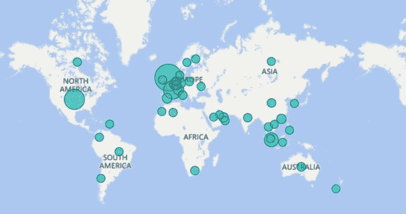
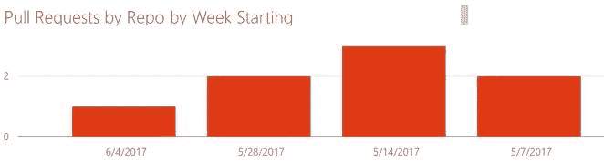

# 什么是商业智能？

> 原文:[https://dev . to/funky si 1701/到底什么是商业智能-28gm](https://dev.to/funkysi1701/what-the-heck-is-business-intelligence-28gm)

术语**商业智能(BI)** 是指收集、整合、分析和展示商业信息的技术、应用和实践。商业智能的目的是支持更好的商业决策。本质上，商业智能系统是数据驱动的决策支持系统(DSS)。商业智能有时与简报、报告和查询工具以及管理信息系统互换使用。

### 什么是权力 BI？

**Power BI** 是微软提供的商业分析服务。它提供了具有自助式商业智能功能的交互式可视化，最终用户可以自己创建报告和仪表板，而不必依赖任何信息技术人员或数据库管理员。

微软是这样描述它的: **Power BI** 是一套商业分析工具，可以为整个组织提供洞察力。连接到数百个数据源，简化数据准备，并推动即席分析。制作精美的报告，然后将其发布，供您的组织在 web 和移动设备上使用。每个人都可以创建个性化的仪表盘，全方位了解自己的业务。并在整个企业中扩展，内置治理和安全性。

### 你能用它做什么？

使用 Power Bi 可以做的第一件事是连接您使用的一些应用程序。

要注册使用 Power BI，请前往[https://powerbi.microsoft.com/en-us/](https://powerbi.microsoft.com/en-us/)

登录后，单击左下角的获取数据链接，浏览您可以使用的应用程序。

如果你的网站使用 google analytics，你可以把它连接到 Power BI，看到一些很酷的分析。下面的地图是由一些谷歌分析数据生成的，你可以看到这个网站的用户遍布全球，其中英国和美国的点击率很高。[T2】](https://res.cloudinary.com/practicaldev/image/fetch/s--vHafZIu3--/c_limit%2Cf_auto%2Cfl_progressive%2Cq_auto%2Cw_880/https://i0.wp.com/www.funkysi1701.com/wp-content/uploads/2017/06/Capture.jpg%3Fresize%3D662%252C349%26ssl%3D1)

你可以做的另一件事是连接 Azure 应用洞察。这为谷歌分析提供了一些关于谁在访问你的网站的类似数据。

如果您的代码托管在 Visual Studio Team Services 中，您可以从提交历史中获得一些很酷的分析。[T2】](https://res.cloudinary.com/practicaldev/image/fetch/s--ssUGhEqK--/c_limit%2Cf_auto%2Cfl_progressive%2Cq_auto%2Cw_880/https://i0.wp.com/www.funkysi1701.com/wp-content/uploads/2017/06/Capture-1.jpg%3Fresize%3D662%252C177%26ssl%3D1)

有一个很长的应用程序列表，您可以连接到 power BI，这样您就可以非常容易地开始获得各种分析。我希望下一次能谈谈如何将定制数据导入 Power BI。

商业智能到底是什么？首次出现在 [Funky Si 的科技谈话](https://www.funkysi1701.com)。