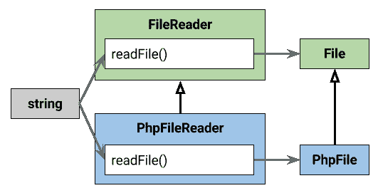
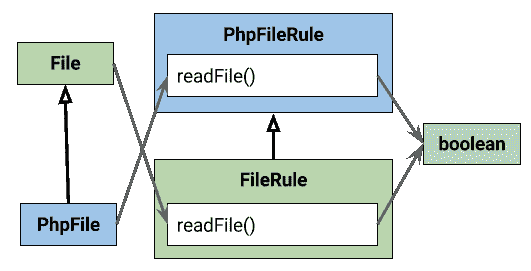
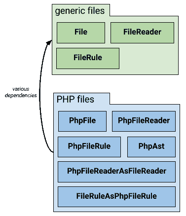

# 论没有泛型的类型安全和包设计的作用

> 原文：<https://dev.to/moxio/on-type-safety-without-generics-and-the-role-of-package-design>

尽管 PHP 社区最近讨论了类型提示是否应该被视为[【可视债务】](https://laracasts.com/series/php-bits/episodes/1) [或](https://ocramius.github.io/blog/eliminating-visual-debt/) [而不是](https://engineering.facile.it/blog/eng/visual-debt-typehints/)，但在 [Moxio](https://www.moxio.com) 我们仍然强烈重视向代码中添加类型。编写类型安全的代码可以让我们尽早发现 bug，支持[静态分析](https://www.moxio.com/blog/tags/static%20analysis)，并达到自我记录的目的。用 PHP 编写类型安全的代码仍然是一个挑战，尤其是它缺少一个被称为“泛型”的特性。在这篇博文中，我将展示(缺少)泛型如何影响类型安全设计，当扩展一个类或接口时，参数类型和返回类型如何改变，以及我们如何在这样做的同时保持我们的包设计良好。

## 扩展和返回类型提示

假设我们有一个表示文件的接口，我们可以从中获取原始内容。这个接口的实例是由一个文件读取器创建的，它接受一个文件路径并返回一个与磁盘上的文件对应的对象:

```
<?php
interface File {
    public function getContents(): string;
}
interface FileReader {
    public function readFile(string $filepath): File;
} 
```

这些接口(以及它们的实现)可能是我们自己代码的一部分，或者它们可以由某个供应商的包来定义。无论哪种方式，我们都希望用一些特定于 PHP 文件的功能来扩展`File`，比如检索它的 PHP 抽象语法树(AST):

```
<?php
interface PhpAst {
    /* (omitted) */
}
interface PhpFile extends File {
    public function getAst(): PhpAst;
} 
```

这和我们的`FileReader`接口有什么关系呢？读取和返回 PHP 文件的类的接口应该是什么样的？我们能在需要一个`FileReader`的地方使用这样的 PHP 文件阅读器吗？

## 同泛型

拥有泛型的语言，比如 Java ，为这个问题提供了一个优雅的解决方案。我们可以用返回的文件类型参数化`FileReader`接口:

```
interface PhpAst {}
interface File {
    public String getContents();
}
interface PhpFile extends File {
    public PhpAst getAst();
}

interface FileReader<T> {
    public T readFile(String filepath);
} 
```

现在，返回`PhpFile`实例的读取器实现了`FileReader<PhpFile>`，而返回更一般的`File`对象的读取器是`FileReader<File>`。如果一些代码需要任何(通用)文件阅读器，它可以声明它为`FileReader<? extends File>`。然后它可以接受`FileReader<File>`和`FileReader<PhpFile>`(或者任何其他返回`File`子类型的读取器)，保证从它返回的对象总是一个`File`，因此至少有一个`getContents()`方法。

## 不带泛型

在没有泛型的语言中，比如 PHP，这有点困难。我们当然可以为 PHP 文件阅读器创建一个单独的接口:

```
<?php
interface PhpFileReader {
    public function readFile(string $filepath): PhpFile;
} 
```

然而，我们能不能将这样一个接口声明为`FileReader`的扩展，从而将它传递到任何需要`FileReader`的地方，尽管`readFile`的签名并不完全相等？在(类型)理论中，答案是肯定的。毕竟，`FileReader`是遵守契约的东西，我们可以用文件名调用`readFile()`来接收`File`，其中`File`是一个对象，保证有一个返回字符串的`getContents()`方法。我们的`PhpFileReader::readFile()`方法返回一个`PhpFile`，它是一个`File`的(特定专门化)。这使得一个`PhpFileReader`服从一个`FileReader`的契约。

这种类型理论原则被称为**协方差**:当扩展一个类型(类或接口)时，我们被允许在不破坏其契约的情况下‘收紧’每个方法返回的值的类型(到一个更具体的子类型)。当消费者希望处理父类型时调用这样的方法，他们仍然会得到他们希望的类型的对象，拥有他们希望在该对象上找到的所有方法。因此，子类型返回的内容可能比它们的父类型更严格。

[T2】](https://res.cloudinary.com/practicaldev/image/fetch/s--4jlqlhbR--/c_limit%2Cf_auto%2Cfl_progressive%2Cq_auto%2Cw_880/https://thepracticaldev.s3.amazonaws.com/i/wa3h3nhx2lt57eqo0hme.png)

这是否意味着我们可以只写`interface PhpFileReader extends FileReader`？不幸的是，实际的答案是“不”。PHP 仅在特定情况下扩展或实现类或接口时支持协方差，在这种情况下，父类型在方法上没有返回类型提示，而子类型添加了一个。我们可以把这看作是把返回类型从字面上的任何东西收紧到一个特定的类型。在所有其他情况下，它要求父级和子级之间的所有返回类型提示都相同。这不允许我们在需要`FileReader`的地方使用`PhpFileReader`而不移除类型提示，这使得我们的代码不那么类型安全。一会儿我会展示这个问题的解决方案。首先，让我们看看子类型如何影响方法的*输入*参数。

## 扩展和参数类型提示

假设在我们的系统中，我们也有对文件进行操作的规则，例如用于检查编码标准或检测错误。我们可以在一个通用文件上使用一个类型安全的接口来模拟这样一个规则，就像这样:

```
<?php
interface FileRule {
    public function check(File $file): bool;
} 
```

实现该接口的规则可以使用`getContents()`检索它们接收到的文件内容，然后检查“@todo”标记或尾随空白。但是，如果我们想使用 AST 中更强大的信息编写特定于 PHP 文件的规则，该怎么办呢？

## 同泛型

在使用泛型的语言中，我们有一个简单的解决方案:我们再次对接口进行参数化，这次是通过我们想要检查的文件参数的类型:

```
interface FileRule<T> {
    public boolean check(T file);
} 
```

对 PHP 文件进行操作的规则实现了`FileRule<PhpFile>`，只能用`PhpFile`的实例调用，并且可以访问 file 对象上的`getAst()`方法。检查任何类型文件的规则可以实现`FileRule<File>`并接受任何`File`实例，但是不知道像`getAst()`这样的方法，它们特定于`PhpFile`子类型。

如果我们的部分代码需要接受(例如作为参数)一个可以检查 PHP 文件的规则，这必须包括`FileRule<File>`的实例。毕竟，由于一个`PhpFile`只是一个`File`的具体例子，它可以在任何期望一个`File`的地方给出。这意味着`FileRule<File>`也可以检查`PhpFile`，因此是`FileRule<PhpFile>`的有效替代品。为了允许规则参数同时接受一个`FileRule<PhpFile>`和一个`FileRule<File>`，我们可以将其声明为一个`FileRule<? super PhpFile>`，即“任何将检查一个`PhpFile`的规则”。

## 不带泛型

在 PHP 中，我们不能求助于在支持泛型的语言中使用的解决方案。同样，对于这种情况，我们可以创建一个单独的接口:

```
<?php
interface PhpFileRule {
    public function check(PhpFile $file): bool;
} 
```

我们可以再次问`FileRule`和`PhpFileRule`之间的关系是什么。`PhpFileRule`是`FileRule`的延伸(子类型)吗？我们可以很容易地看出它不是。毕竟，`FileRule`是可以检查任何`File`对象的东西，而`PhpFileRule`不会接受(比如)一个`PythonFile`。这违反了利斯科夫替换原则，并确定`PhpFileRule`不是`FileRule`的正确子类型。

大多数人感到困惑和惊讶的是，`FileRule`和`PhpFileRule`之间的关系实际上是相反的:`FileRule`是`PhpFileRule`的一个亚型！这是有意义的，因为`FileRule`将接受任何一个`PhpFileRule`作为参数接受的东西(即`PhpFile`的所有实例，它们都是`File`的继承)。这种类型理论原则被称为**逆变**:当扩展一个类型时，我们被允许放松子类型中方法的所有输入参数的类型。因此，子类型可能比它们的父类型在接受什么方面更自由。

[T2】](https://res.cloudinary.com/practicaldev/image/fetch/s--HjNATC9O--/c_limit%2Cf_auto%2Cfl_progressive%2Cq_auto%2Cw_880/https://thepracticaldev.s3.amazonaws.com/i/4rm5pmx6ye4xnwo9izab.png)

这是否意味着在实践中我们可以(并且应该)用 PHP 编写`interface FileRule extends PhpFileRule`？答案是(两次)“没有”。首先，当扩展或实现一个类或接口时，PHP 不支持方法参数的逆变。这意味着，就目前而言，方法参数上的类型提示需要在父类型和子类型之间保持一致。PHP 7.2 已经接受了一个 [RFC](https://wiki.php.net/rfc/parameter-no-type-variance) ，它将允许一种特定类型的逆变(完全放弃参数的类型约束，允许任何输入值)。这个 RFC 主要是为了让库作者在不破坏子类的情况下开始向接口添加标量类型提示。PHP 中完整的协方差和逆变支持在短期内是不可能的，因为它们的实现需要自动加载的改变。

## 包依赖原则

尽管如此，即使 PHP 支持它，声明`FileRule`扩展了`PhpFileRule`也不是一个好主意。这与罗伯特“鲍勃叔叔”马丁描述的[包装设计原则有关。如果我们认为通用文件的功能和接口在一个包中，而 php 文件的功能和接口属于另一个包，那么“PHP 文件”包依赖于“通用文件”包，因为`PhpFile`扩展了`File`。如果我们让`FileRule`扩展`PhpFileRule`，我们也会反过来引入依赖，创建包依赖循环，从而违反非循环依赖原则。](http://butunclebob.com/ArticleS.UncleBob.PrinciplesOfOod)

[T2】](https://res.cloudinary.com/practicaldev/image/fetch/s---F1k63MI--/c_limit%2Cf_auto%2Cfl_progressive%2Cq_auto%2Cw_880/https://thepracticaldev.s3.amazonaws.com/i/p3823sakeyjb1ptcymg3.png)

稳定依赖原则(“依赖于稳定的方向”)和稳定抽象原则(“抽象随着稳定而增加”)为我们指出了“正确的”依赖方向。因为“通用文件”包比“php 文件”包更抽象(因此更稳定)，所以“php 文件”可以依赖于“通用文件”。应该避免相反的依赖性。我们甚至可以想象“通用文件”包是我们使用的第三方库。我们没有资格要求库作者让他的`FileRule`接口扩展我们的`PhpFileRule`接口。

## 适配模式救驾！

那么我们应该如何在需要一个`PhpFileRule`的地方使用一个`FileRule`，或者将一个`PhpFileReader`传递给一个需要一个`FileReader`的方法呢？原来我们可以用一个简单的[适配器设计模式](https://sourcemaking.com/design_patterns/adapter)来解决我们所有的问题。我们创建了两个小班。一个将`FileRule`适配到`PhpFileRule`接口，另一个将`PhpFileReader`适配到`FileReader`:

[](https://res.cloudinary.com/practicaldev/image/fetch/s--GVMsCH7U--/c_limit%2Cf_auto%2Cfl_progressive%2Cq_auto%2Cw_880/https://thepracticaldev.s3.amazonaws.com/i/hxr76guv7aacoe6nokur.png)T3】

```
<?php
class FileRuleAsPhpFileRule implements PhpFileRule {
    private $file_rule;

    public function __construct(FileRule $file_rule) {
        $this->file_rule = $file_rule;
    }

    public function check(PhpFile $file): bool {
        return $this->file_rule->check($file);    
    }
} 
```

[](https://res.cloudinary.com/practicaldev/image/fetch/s--yh5bXOgc--/c_limit%2Cf_auto%2Cfl_progressive%2Cq_auto%2Cw_880/https://thepracticaldev.s3.amazonaws.com/i/9v2ezdhs3qsyrcoqlpxk.png)T3】

```
<?php
class PhpFileReaderAsFileReader implements FileReader {
    private $php_file_reader;

    public function __construct(PhpFileReader $php_file_reader) {
        $this->php_file_reader = $php_file_reader;
    }

    public function readFile(string $filepath): File {
        return $this->php_file_reader->readFile($filepath);
    }
} 
```

如果我们现在想在需要一个`PhpFileRule`的地方使用一个`FileRule`，我们可以直接通过`new FileRuleAsPhpFileRule($file_rule)`。类似地，我们可以使用`new PhpFileReaderAsFileReader($php_file_reader)`让一个 PHP 文件阅读器充当通用文件阅读器。这允许我们以一种类型安全的方式在相关的接口之间进行适配，并且由于适配器都是“php 文件”包的一部分，防止了依赖循环。

[T2】](https://res.cloudinary.com/practicaldev/image/fetch/s--e83R0nDE--/c_limit%2Cf_auto%2Cfl_progressive%2Cq_auto%2Cw_880/https://thepracticaldev.s3.amazonaws.com/i/ea7mdsiw8riqser736pi.png)

当然，这种方法有一个小小的缺点。使用这种模式需要编写两个额外的适配器类和两个特定于 PHP 文件的接口(与使用泛型的实现相比),并且适配器内部的委托调用会产生非常小的运行时开销。然而，与类型安全和适当的包依赖的好处相比，我们认为这些缺点可以忽略不计。

## 总结

扩展类型时，子类型可能会扩大输入参数的类型(**逆变**)并缩小返回值的类型(**协方差**)。换句话说，子类型在接受什么方面可能更自由，在返回什么方面可能更严格。

*   在没有泛型的语言中，类型安全编程可能需要创建单独的协变或逆变接口。
*   PHP 只在非常有限的情况下允许协变和逆变。
*   为矛盾情况增加一个明确的`extends`条款可能会破坏包装设计原则。
*   适配器模式是克服这些情况的简单解决方案。

*这篇文章最初发表在[Moxio 博客](https://www.moxio.com/blog/17/on-type-safety-without-generics-and-the-role-of-package-design)上。*