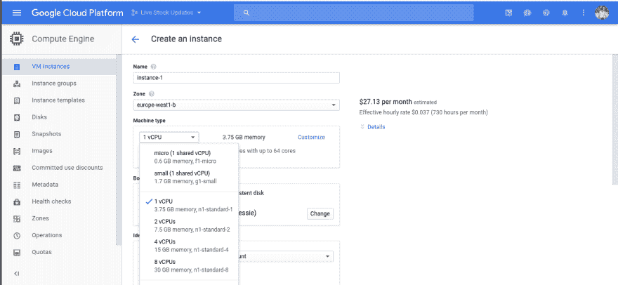
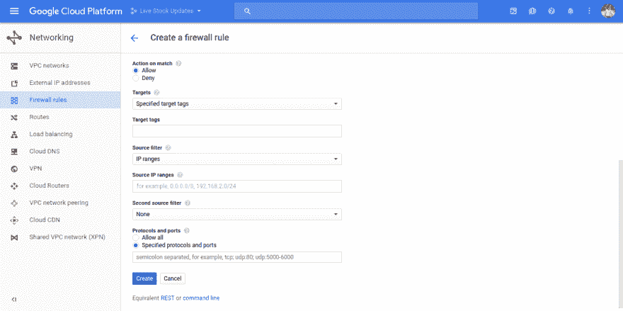

# 免费在 Google Cloud 上部署 Node.js、mongoDB 应用程序

> 原文:[免费的 https://dev.to/dhruv/deploying-your-nodejs 谷歌云应用程序](https://dev.to/dhruv/deploying-your-nodejs--mongodb-app-on-google-cloud-for-free)

这篇文章主要讨论如何在 Google cloud 上部署 node.js 应用程序。是的，它是免费的，技术上来说不是，但你可以在新注册时获得一年 300 美元的免费积分(耶！).
你需要从现有的谷歌账户登录到你的[谷歌云](https://cloud.google.com/)，并进入你的**控制台**。
从创建一个新项目开始。现在，我们可以创建新的应用引擎实例或新的计算引擎实例。我将创建一个计算引擎实例。
从左侧的导航，转到计算**引擎→虚拟机实例**。创建新的虚拟机实例。根据您的需要填写详细信息。虽然想要全年免费只能用 3 种机种。
1)【共享】微 CPU，0.6GB 内存
2)【共享】小 CPU，1.7GB 内存
3) CPU，3.75GB 内存
第三个选项虽然不会持续一整年。

[T2】](https://res.cloudinary.com/practicaldev/image/fetch/s---r10x_6I--/c_limit%2Cf_auto%2Cfl_progressive%2Cq_auto%2Cw_880/https://thepracticaldev.s3.amazonaws.com/i/m8fjiicc4btxbtqls31h.png)

现在，您有了一台需要部署代码的机器。嘘你的方式通过。

## 您现在必须在虚拟机上做的事情

*   **安装 node.js**

安装最新的 node.js 版本或您想要的任何特定版本。你可以按照[这个](https://www.digitalocean.com/community/tutorials/how-to-install-node-js-on-ubuntu-16-04)指南安装 node.js。

*   **安装 mongoDB**

安装最新的 mongoDB 版本或您想要的任何特定版本。你可以按照[这个](https://www.digitalocean.com/community/tutorials/how-to-install-mongodb-on-ubuntu-14-04)指南来安装 mongoDB。

*   **将代码放置到位**

把你的代码放在任何你想放的地方。在你的项目中使用 git 总是更好的，我会在以后的文章中谈到 git 及其重要性。

一旦你完成了所有这些事情，你就可以运行你的应用程序了。但是等一下，你仍然不能从任何外部资源(比如你的浏览器)访问它。您需要打开运行应用程序的端口。

## 从谷歌云控制台打开任意端口

从左侧的导航中，转到网络→防火墙规则。创建一个新的防火墙规则，填写所需的详细信息，然后就可以了！

[T2】](https://res.cloudinary.com/practicaldev/image/fetch/s--nC5px5K6--/c_limit%2Cf_auto%2Cfl_progressive%2Cq_auto%2Cw_880/https://thepracticaldev.s3.amazonaws.com/i/36wybuq4rwf51j1ygb25.png)

IP 范围的源过滤器用于指定在任何写入 0.0.0.0/0 的情况下，您希望从哪些所有 IP 访问它。
恭喜你已经成功地在 Google Cloud 上部署了你的应用。

*最初发表于[媒体](https://medium.com/@nendhruv/deploying-your-node-js-mongodb-app-on-google-cloud-for-free-33547d2f6397)。*