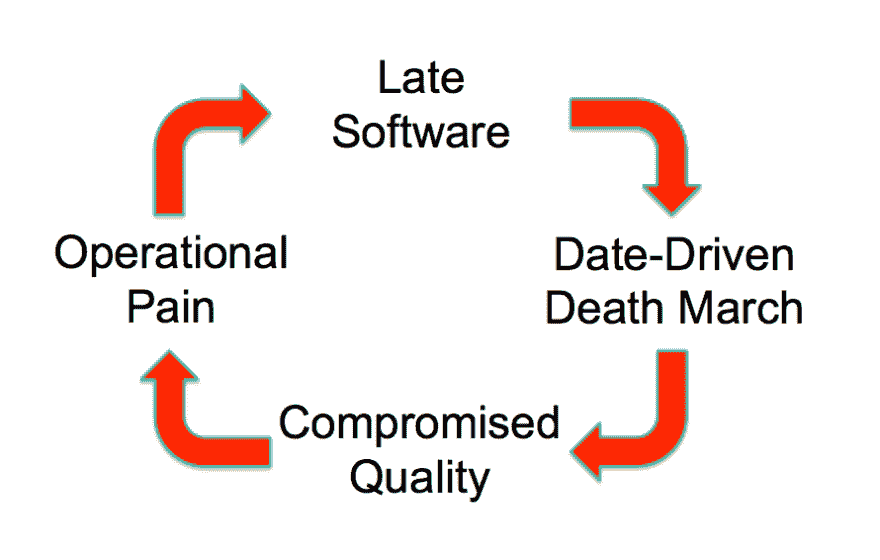
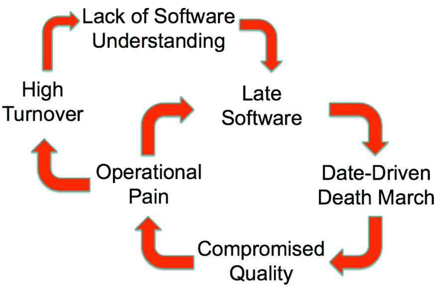

# 我们在学校学到的坏习惯

> 原文:[https://dev.to/jlhcoder/bad-habits-we-learn-in-school](https://dev.to/jlhcoder/bad-habits-we-learn-in-school)

*这篇文章最初发表在[我的博客](http://jlhood.com/bad-habits-we-learn-in-school/)T3 上*

科技行业最普遍的问题之一是工作与生活的平衡不佳。长时间的工作和“死亡行军”似乎是常态，尤其是当你刚从大学毕业，渴望证明自己并开始职业生涯的时候。整个行业要解决这个共同的问题还有很长的路要走。然而，根据我的经验，我发现更常见的是看到个人或团队在不知不觉中做出糟糕的决定，从而加速他们的疲惫。

那么，这些糟糕的决定是什么，是什么让它们如此普遍？我注意到一种模式似乎不成比例地影响了最近的大学招聘，但有经验的工程师绝不是免疫的。我的假设是，这些模式或习惯实际上是在我们上学的时候形成的。不要误解我的意思，学校为你的人生成功做了很多准备，但信不信由你，它也教会你很多坏习惯，这些习惯在学校可能很好，但会让你在行业中失败。

所以我想让你们想象一下自己回到学校的样子，让我们来看一些例子:

## 在求学...

1.  截止日期:在学校，截止日期以截止日期的形式出现。截止日期由你的教授设定，通常是固定的，不可协商。虽然它们可能很难满足，但一般来说，到期日是合理的，可以实现的。
2.  **个人 vs 协作:**在学校里，绝大多数的工作都是个人完成的。当然，我们可能偶尔会有团队项目，但这通常是例外。在这些团队项目中，一两个人最终完成大部分工作，而团队中的其他人则无所事事，这种情况并不罕见。
3.  加班:在学校里，为了考试或者一个大项目而通宵学习被认为是正常的、受到社会鼓励的事情。
4.  作业完成:一旦到期日到了，你就交作业或参加考试，得到一个分数，老实说，你再也不会看它一眼。

## 在工业中...

好吧，你已经在学校呆了几年，最终你在科技行业找到了第一份工作！恭喜你！准备好改变世界了吗？好吧！

你有第一个大项目要做，你有第一个可交付成果的最后期限。你甚至不会质疑它。在学校里，你不能协商预产期。你只要相信它们通常是合理的、可实现的。你开始工作。起初，事情进展得相对较快。向管理层提交的早期报告是“几乎完成了！”的自信版本

随着时间的推移，你会不断发现你没有意识到的额外的复杂性。当你说你几乎完成了，也许你没有考虑到你也必须写测试的事实。交付日期越来越近，你开始有点恐慌。别担心，你可以加班来弥补。也许像在学校那样熬几个通宵...

事实证明，工作量比你最初想象的要多得多，几个通宵似乎并不能让你更接近目标。交付日期过去了，软件还没有完成。在这一点上，你和你的队友可能正在疯狂地工作(可能是管理层要求的)，这令人沮丧，但你可能甚至不会质疑。这就是软件开发的工作方式，对吗？

管理层在这一点上非常沮丧，你看到你的职业抱负一天一天地溜走，所以你做了一个决定:你决定走捷径让事情进展得更快。也许你可以把这些测试留到以后，发布之后。也许你可以在这里或那里做一些事情...

最终，产品终于推出了！唷！你累坏了，但至少你不用再担心了，对吗？在学校里，你只是扔掉旧作业。实际上，你有。不像学校，你必须维护你建造和交付的东西。如果你在质量或者更差的架构上偷工减料，就会有很多 bug。这导致了客户的痛苦，也意味着您的运营痛苦。

当然，当这种操作上的痛苦还在继续的时候，你正在努力工作于项目的下一个可交付成果。在这一点上，下一个可交付产品也很可能会延迟，不仅因为在第一个可交付产品中犯的一些错误可能会重复，而且由于正在进行的操作问题，现在开发团队还增加了随机化的负担。由于在第一个可交付成果上偷工减料，加上技术债务和增加的倒退风险，这个循环不仅会重复，而且实际上每一次都会变得更糟...

## 软件开发的恶性循环

恭喜你！你已经被我称之为软件开发的恶性循环烧伤了。基本循环如下所示:

[T2】](https://res.cloudinary.com/practicaldev/image/fetch/s--VNZ0sIWn--/c_limit,f_auto,fl_progressive,q_auto,w_880/http://jlhood.cimg/vicious-cycle-basic.png)

随着软件越来越晚，它可以变成一个日期驱动的死亡行军，这导致了妥协的质量，这导致了操作上的痛苦，这使得下一个功能推迟，等等。如果这种循环持续很长一段时间，人们会筋疲力尽并离开团队，这给循环增加了以下额外的后果:

[T2】](https://res.cloudinary.com/practicaldev/image/fetch/s--5gbfLNva--/c_limit,f_auto,fl_progressive,q_auto,w_880/http://jlhood.cimg/vicious-cycle-prolonged.png)

人们筋疲力尽，最终离开。他们对软件工作原理的了解也随之消失，这使得及时开发新功能变得更加困难。

诚然，我上面描述的场景是最坏的情况。然而，在我作为软件开发人员的这些年里，我看到团队一次又一次地陷入这种循环。我在几次演讲中描述了这种恶性循环，总是看到观众会心的微笑，人们点头。不管你的经验水平如何，走上这条道路都出奇的容易。

那么我们能做什么呢？这里有一些避免或扭转恶性循环的建议。

提示 1:截止日期应该基于多人的估计，并被视为目标/预测，而不是坚硬的、不可移动的障碍。

还记得我们在学校学到的坏习惯吗？截止日期通常是合理的，不可协商的。软件开发不是这样的！很少有最后期限是硬性的、不可改变的。大多数都是让团队专注于交付的目标。日期可以是侵略性的，但你不应该把它们视为神圣。积极的截止日期的好处是，它迫使优先级和需求决策将可交付成果减少到解决客户需求的最小可行产品。开发团队应该将软件的截止日期视为目标/预测。在整个项目中，应该就实际进度与目标相比如何进行持续、公开的沟通。

请注意，软件评估非常困难，当我们出错时，我们往往会低估错误。因此，通过想出一个涉及多人的评估系统来减少偏差，从而与低估做斗争。

技巧 2:学会如何有效地沟通状态，并作为一个团队围绕未达到的期望做出决策。

在恶性循环场景中，随着截止日期的临近，仍然有大量的工作要做，出现了两个关键错误:没有以有用的方式报告状态(“差不多完成了！”)而开发商在认为项目进度落后时，单方面决定加班加点，通宵达旦。同样，这种行为也符合我们在学校的经历。在学校，我们从来没有处理报告状态。截止日期到了，你交了作业或者参加了考试。此外，由于大部分工作是单独完成的，你习惯于自己做所有的决定，尤其是开夜车的时候。

我已经写了一整篇关于沟通有效状态的文章，所以我将推迟到第一个问题。对于第二个问题，如果现实与预期的时间表不匹配，尽早与您的团队(包括管理层)进行公开对话是至关重要的。你越早发现问题，你就有越多的选择来处理它们。讨论应包括(1)导致事情比预期时间长的根本原因，以及(2)决定前进的道路。

在决定前进的道路时，加班是一种选择，但这应该是最后的选择。还有其他更好的选择可以考虑，例如

1.  重新设定期望——管理层可能不介意时间比计划的晚。
2.  具有挑战性的需求/特性范围——有时有更聪明/更小/更容易的方法来获得客户真正需要的东西。
3.  删除优先级较低的功能

你应该努力建立一种团队文化，在这种文化中，大家可以开诚布公地交流，并作为一个团队一起处理与未达到的期望有关的决策。当采用这种模型时，新的开发人员经常会惊讶于管理层经常可以放弃一些特性或者将事情推到未来的迭代中。如果没有这样的对话，你可能会为了交付一些对业务来说并不重要的东西而筋疲力尽。

技巧 3:将质量视为不可分割的一部分，不能被忽视。

如果你或团队成员曾经考虑过降低质量的优先级，问自己这个问题:你更愿意选择哪个:(1)一个已知的、固定的前期成本，还是(2)一个未知的、可变的成本，当你试图交付其他特性时，这个成本随时可能出现？我希望你选择了选项 1。选项 1 是优先考虑质量。降低质量的优先级会将您带入恶性循环的操作痛苦阶段，这会导致未来软件的延迟。

对我来说,“降低质量”这个词根本没有意义。优先级发生在特征级别，质量是特征不可分割的一部分，不能被取消优先级。当我与管理层讨论优先级时，我总是在特性级别列出事情。这样的话，甚至没有关于降低质量的讨论。尽管值得称赞的是，我发现大多数经理都理解这一点，而且开发人员在试图更快地交付产品时降低质量和偷工减料更为常见。不要陷入那种诱惑！作为一名开发人员，您拥有交付高质量的软件。现在就投入工作，投资质量。从长远来看，它会获得数倍的回报。

秘诀 4:始终努力建立信任和开放沟通的团队文化。

沟通和协作是在行业中取得成功的关键。许多公司的各种项目和软件的范围和规模是如此之大，一个人不可能完全理解。为了成功，你必须学会与他人合作和沟通，尤其是当你真的不想的时候，比如事情没有按计划进展的时候。我如此喜欢 Scrum 的原因之一是，你可以在每天的站立和回顾中不断地练习这些讨论。此外，频繁的迭代周期(理论上)会防止您在没有某种检查点的情况下偏离轨道太远。然而，我也看到团队只是经历 Scrum 的动作，而没有真正实践它。

如果你在对抗或困难的对话中挣扎，我强烈推荐阅读[至关重要的对抗](https://www.amazon.com/Crucial-Confrontations-Resolving-Promises-Expectations/dp/0071446524)。在成长过程中，我没有一个健康沟通的好模式，这本书完全改变了我看待和处理冲突的方式，无论是在我的职业生活还是个人生活中。

* * *

哇，这篇文章比我预想的要长很多，但是我希望你会觉得有帮助！😅你经历过软件开发的恶性循环吗？你有没有额外的技巧来扭转它或完全避免它？