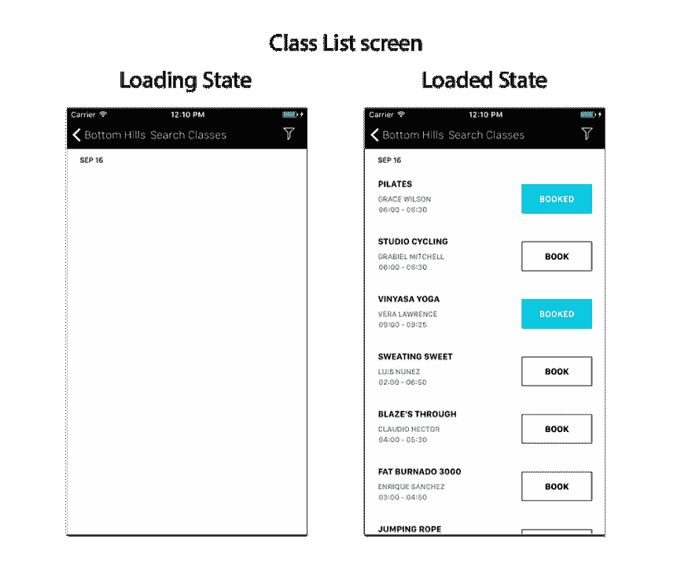

# 一个会让人会心一笑的拉请求

> 原文:[https://dev . to/claudiosanchez/a-pull-request-that-will-make-people-smile-5f 21](https://dev.to/claudiosanchez/a-pull-request-that-will-make-people-smile-5f21)

[T2】](https://res.cloudinary.com/practicaldev/image/fetch/s--HCkr9-5T--/c_limit%2Cf_auto%2Cfl_progressive%2Cq_auto%2Cw_880/https://cdn-images-1.medium.com/max/1024/1%2AkqGRUPF2xmedbs0uE9NKTw.png)

如果你一直在使用任何类型的 [git 工作流](https://www.atlassian.com/git/tutorials/comparing-workflows)的软件团队中工作，我敢打赌你对[拉请求](https://www.atlassian.com/git/tutorials/making-a-pull-request)的概念很熟悉。本文并不打算向您传授创建它的机制，而是介绍构成拉式请求的艺术，这种艺术能给评审者和合作者带来欢笑。

#### 标题

这是你让评审者了解你的拉动式请求(PR)的机会。不要仅仅包括发行号；尽量反映拉动要求的要点。不要假设审稿人会知道，只是根据问题编号。

**拉取请求标题示例:**

*   BOS-8869 引入了脸书、谷歌和 Twitter 的社交登录。
*   MYAPP-0007 修复了在 iOS 中向日历添加项目时的崩溃错误。
*   API-1020 为过滤引入了蔻驰标记。

#### 描述

将有用的描述放在一起将极大地帮助审阅者理解您的更改。特别是如果你改变了许多文件，或者改变不是微不足道的。花点时间精心制作一份详细的描述，因为你最有资格证明你的方法/它所提供的功能；毕竟是你写的。

拉请求的描述字段通常支持某种类型的标记(即:**降价**)。就像你写一篇精心构思的文章一样，一定要利用你所掌握的所有格式来清晰地表达你的想法。

**描述示例:**

*   增加了排序功能:可以按照类别(升序和降序)、发布日期(最新和最早)和数量(升序和降序)进行排序。
*   更改了 GetClubDetails 方法的实现，以异步处理请求。按照惯例，现在返回类型是 Task <clubdetail>，方法名是 GetClubDetailsAsync。</clubdetail>
*   修改了 FilterOptionsService 以按字母顺序对选项进行排序。
*   使用了部署到 Azure 的新位置 API，并且必须更改与位置屏幕关联的代理、服务和数据传输对象。

**加分:**大声说出故事的接受标准，会让你的改变所带来的东西变得明显。此外，在一个功能被分成几个故事的情况下，呼出功能不包括在**中。**

#### 截图

***“一张*** ***图胜千言”*** *。对于拉取请求来说，这再正确不过了。*

如果更改涉及任何 UI 更改，总是在之前包含一个**的表示，在**之后包含一个**的表示。**这为评审人员节省了大量时间，并提供了明确的指导。

**包含截图时的一些小技巧:**

*   将图像调整到易于管理的大小。其目的是提供发生变化的背景，而不是用比生活中更大的图像填满屏幕。
*   突出显示用户界面中预计会发生变化的区域。特别是如果用户界面太忙，并且变化不容易被发现。
*   有用时，将图像插入表格中，以便对图像进行左右对比。

最后，这些都是帮助评审者理解你的改变的背景的提示，从而使评审过程变得令人愉快。

#### 样本拉取请求

**标题:** FITNESS-1039 添加健身俱乐部类别列表屏幕，具有加载状态和预订功能。

**描述:**

新级别列表屏幕提供了所选 健身俱乐部的 ***可用级别列表。***

*   当屏幕从 web 加载数据时，用户看到加载状态。
*   用户能够通过点击 ***预订*** 按钮来预订可用的课程。
*   用户可以通过点击 ***已预订*** 按钮，取消/预订已经预订的课程。
*   未实施过滤**。**

 

<figcaption>截图为屏幕的多种状态提供了直观的帮助。</figcaption>