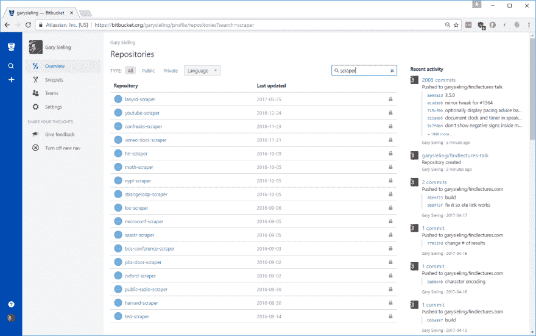
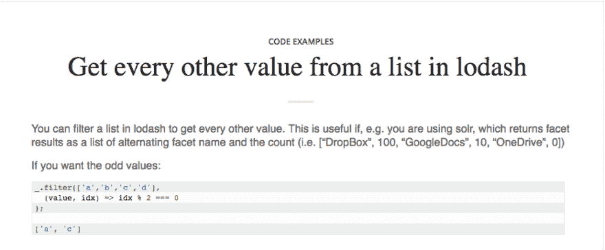

# 辅助项目活跃了软件工程文化

> 原文:[https://dev . to/garyseling/side-projects-搞活-软件-工程-文化](https://dev.to/garysieling/side-projects-invigorate-software-engineering-culture)

梦想、规划、设计和构建副业项目通常会在团队中营造一种充满创造力、好奇心和可能性的清新氛围。作为一名高级工程师，证明你重视探索你直接关注的领域之外的想法会鼓励你团队中的其他人也这样做，这对所有人都有好处。

限制自己只考虑当前项目的软件团队很容易停滞不前、落后和筋疲力尽。领导投入哪怕一小部分时间研究新工具、新概念和新兴实践的团队更有可能在生产力和乐趣之间找到可持续的平衡。

如果你处理的是信息半衰期很短的问题，比如 web 开发，那就更是如此。即使您当前的技术选择是理想的，浏览器和 web 协议也在您周围快速变化，因此您最终被迫进行架构更改。

兼职项目是探索有趣问题的好地方，风险很小。与工作环境不同，你可以中途放弃一个项目，因为没有完成的期望。我在 Bitbucket 中存储了很多我的项目，因为它们有免费的私有 git 托管，所以我可以选择是否以及何时向世界其他地方展示我的工作。

[T2】](https://res.cloudinary.com/practicaldev/image/fetch/s--yAxh03dv--/c_limit%2Cf_auto%2Cfl_progressive%2Cq_auto%2Cw_880/https://www.findlectures.com/articles/2017/05/15/Building-a-Crawler-in-Node-JS/bitbucket.png)

一些公司喜欢看到求职者有兼职项目，但这些项目通常很难直接评估(你 github 上的那个项目运行了吗？)真正的价值来自于你在努力过程中获得的知识。

一旦你在一个项目上走得足够远，可以就这个主题进行写作或演讲，你就可以展示思维领导力。如果你在技术领域处于领先地位，这可能会增加申请你团队职位的人数，但更重要的是，这让那些寻求发展的人更加渴望加入你的团队。

并不是所有的项目都是代码，用 Wordpress 配置和强化一个虚拟机是一个奇妙的学习经历。如果你建立了一个博客，就你的发现写文章是一个很好的个人成长练习。我认识几个在 AWeber 工作的人，他们使用电子邮件营销软件来探索企业与客户互动的新途径(例如[【100 个单词】](http://www.100-words.com/)[【每周咖啡】](http://weekly.coffee/))。如果你更喜欢探索开源来“回馈”，有许多小图书馆的创建者已经筋疲力尽了，他们想要一个缓刑。

在写这篇文章时，我咨询了我的同行，讨论了他们学到的经验:

从头开始构建一个项目会迫使您仔细考虑通常为您制定的架构决策。您可能会发现，您可能会在与您真正想要解决的问题无关的问题上花费大量时间(例如，构建工具、用户帐户管理)。这些问题中的每一个似乎都有无限多的解决方案。这迫使我思考架构决策中固有的权衡，并提高了我的时间管理技能。

如果你为了探索的目的而写代码，你的编码风格很可能是一个移动的目标，你会发现你周期性地离开一个项目，然后回来，很可能忘记你做过的部分事情。几个月后，这是一个非常精确的模拟，模拟了在真实项目中工作的感觉——不同的编码风格和潜在的不熟悉的功能。

我发现把问题记录下来对我以后有帮助——我的博客为我提供了辅助记忆，我定期查阅它来刷新我对某些任务的记忆。

[T2】](https://res.cloudinary.com/practicaldev/image/fetch/s--Atf71GBw--/c_limit%2Cf_auto%2Cfl_progressive%2Cq_auto%2Cw_880/https://thepracticaldev.s3.amazonaws.com/i/3cevt8iwy5223it39t97.png)

如果你想写作，有许多“每周”电子邮件简讯( [JavaScript Weekly](http://javascriptweekly.com/) 等等)——这些总是需要高质量的内容，拥有大量的读者，所以如果你想为演讲写文章，这些都是很好的目标受众。也有一些供稿网站对软件开发人员写他们的工作很友好——例如 [DZone](https://www.DZone.com) 、 [Dev.to](https://Dev.to) 或 [the sideproject subreddit](https://www.reddit.com/r/sideproject) 。如果你的朋友或同行也订阅了这些，当你的作品出现时，看起来真的很好。

在一些行业中，由于安全或知识产权问题，很难或不可能有面向公众的项目。如果你选择做副业，重要的是考虑一下你想要达到什么目标，以及你将如何在自己掌握的限制和机会范围内工作。做得好的话，这对你的职业生涯和团队文化都是一个巨大的推动。

*Gary Sieling 是 Wingspan Technology 的一名软件架构师，他开发了一个兼职项目，可以让你搜索超过 150，000 场讲座:[https://www.findlectures.com](https://www.findlectures.com)，以及[一个包含精选演讲推荐的电子邮件列表](https://www.findlectures.com/emails)。*

[T2】](https://res.cloudinary.com/practicaldev/image/fetch/s--5GnrmbnH--/c_limit%2Cf_auto%2Cfl_progressive%2Cq_auto%2Cw_880/https://www.findlectures.com/articles/cimg/banner.jpg)