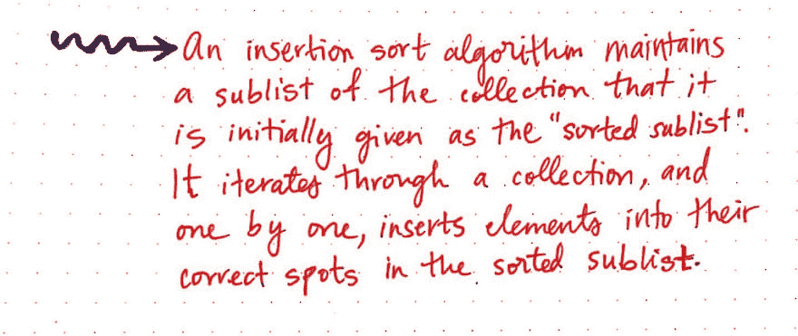
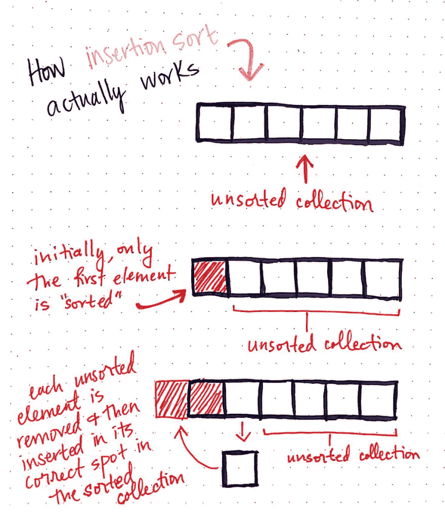
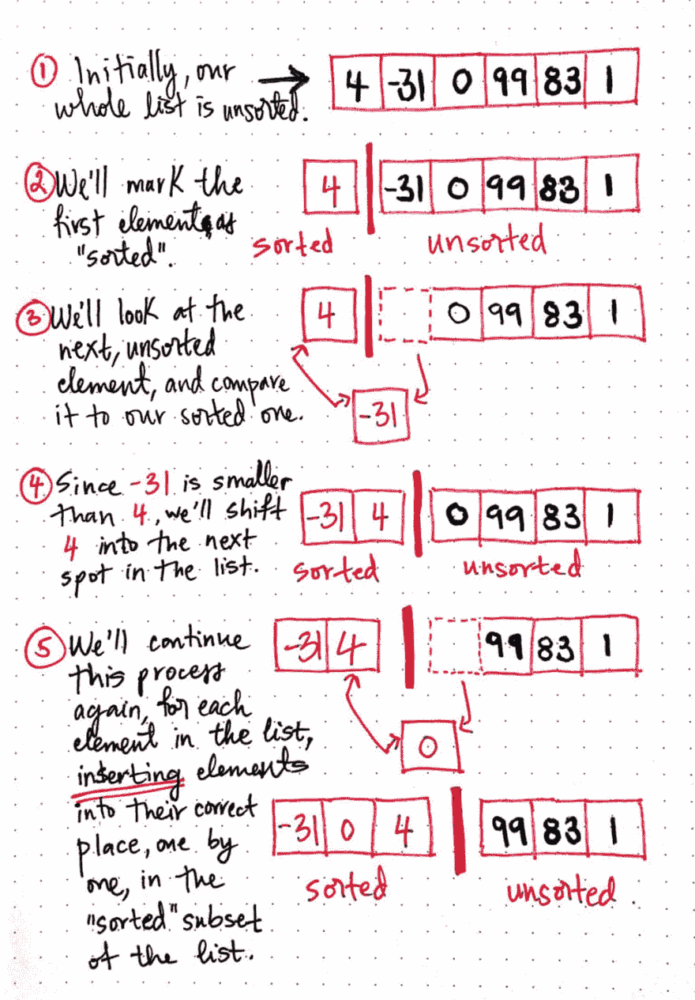
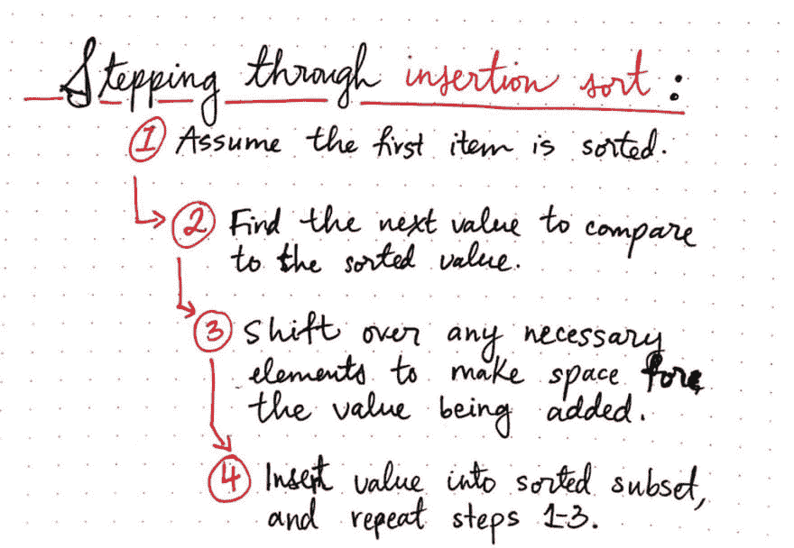
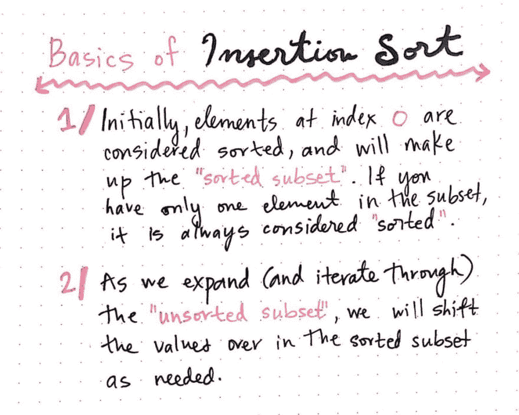
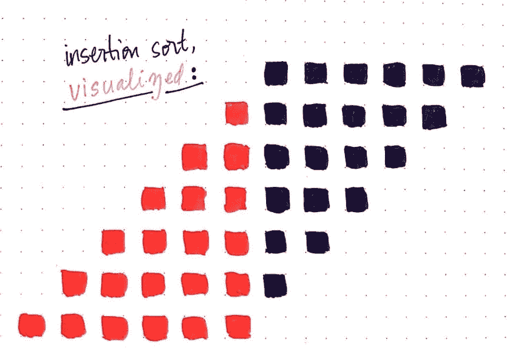
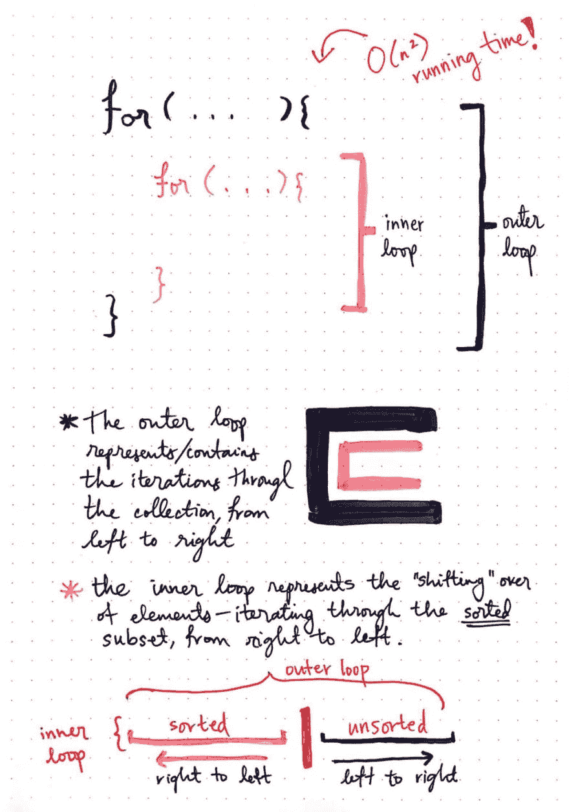
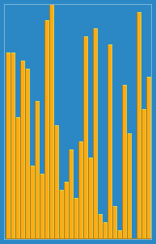
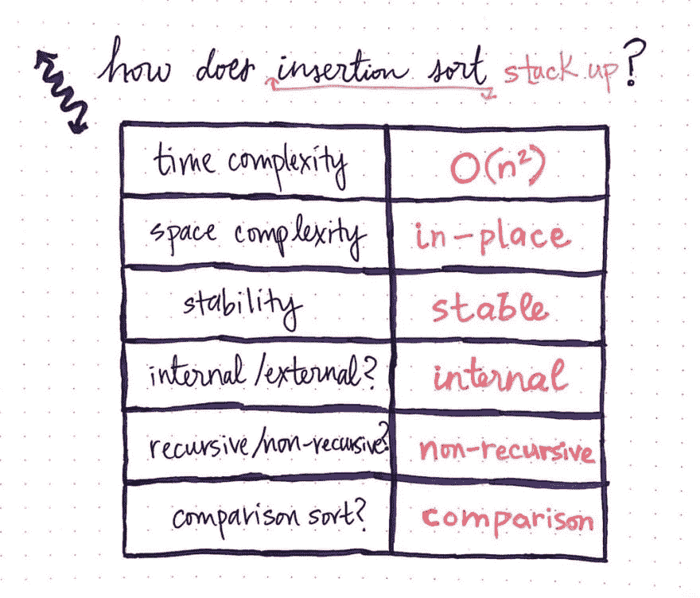

# 向插入排序缓慢移动

> 原文:[https://dev.to/vaidehijoshi/inching-towards-insertion-sort](https://dev.to/vaidehijoshi/inching-towards-insertion-sort)

我们一直在处理的大多数算法都相当慢，似乎效率很低。然而，它们往往在计算机科学课程和理论解释中出现很多，因为它们经常被用作天真的方法，或者对集合进行排序的最简单的实现。

今天的排序算法也没有什么不同。事实上，有些人认为这种排序方法是最直观的方法之一。我们将看一看*插入排序*，你可能已经很熟悉了，并且可能已经在你生活中的某个时刻使用过了。关于插入排序有趣的事情是，虽然它不是最有效的，但它总是在 CS 教科书和讲座中介绍。

那么这是为什么呢？

嗯，这源于插入排序是比较容易理解的排序算法之一。事实上，经常出现的例子是对一手牌进行排序——您可能甚至没有意识到这一点，但上次您手中有一堆扑克牌时，很有可能您正在实现某种版本的插入排序算法来对手中的牌进行排序！

让我们更接近这个算法，弄清楚它到底是怎么回事。

### 检查插入排序

在一个非常基本的层面上， ***插入排序算法*** 包含移动和插入元素的逻辑，以便对任意大小的无序列表进行排序。然而，插入元素的方式使得插入排序非常有趣！

<figure>[](https://res.cloudinary.com/practicaldev/image/fetch/s--7IyAWnw4--/c_limit%2Cf_auto%2Cfl_progressive%2Cq_auto%2Cw_880/https://cdn-images-1.medium.com/max/1024/1%2A_W4xVv1FM3wEDZg16kvb1w.jpeg) 

<figcaption>插入排序:一个定义</figcaption>

</figure>

插入排序算法有两个主要方面。它的第一个重要方面与它的结构有关。

> 插入排序算法维护两个子集(通常称为子部分或子列表)——一个*排序的*子集和一个*未排序的*子集。

第二个方面与它如何迭代和排序给定的元素集合有关。插入排序将遍历未排序的子集，有效地将它从未排序的子集中“移除”,然后将其“插入”到已排序的子集中正确的、已排序的位置。

让我们来看看这实际上是如何工作的:

<figure>[](https://res.cloudinary.com/practicaldev/image/fetch/s--ygm1nWSv--/c_limit%2Cf_auto%2Cfl_progressive%2Cq_auto%2Cw_880/https://cdn-images-1.medium.com/max/1024/1%2AmXEGtEIzXTOeqS9Gjb--fA.jpeg) 

<figcaption>单次迭代:插入排序是如何工作的</figcaption>

</figure>

在上面的例子中，我们从一个未排序的集合开始。我们可以认为这是我们的一手牌，目前处于一个巨大的、混乱的混乱状态，需要进行排序。我们将获取第一个元素，并开始基于该元素进行排序。换句话说，我们的第一个项目是我们“排序”的第一个项目。这现在给了我们两个不同的集合:一个已排序的集合和一个未排序的集合。

然后，我们将删除第一个未排序的元素，并将其添加到排序后的集合中。为了找出将这个新元素放在哪里，我们需要将它与我们排序的集合中的单个项目进行比较；如果我们添加的项目大于我们的单个排序元素，我们将把它放在当前的位置，并标记为排序。然而，在本例中，新元素比我们的单个排序元素小，我们将把该项移回集合中的第一个位置，并在集合中向前移动排序元素，为它腾出空间。

这构成了插入排序的一次迭代。显然，列表仍然没有排序！我们需要对每个剩余的未排序元素继续这个过程，并在遍历完列表后重复相同的步骤。

在某些方面，插入排序类似于我们已经探索过的另一种算法:[选择排序](https://dev.to/vaidehijoshi/exponentially-easy-selection-sort)。这两种算法有一个共同点:它们都维护一个“已排序”元素和“未排序”元素的概念。然而，它们各自以非常不同的方式做到这一点。通过一个例子，这一点更加清楚。

让我们尝试使用插入排序对一个包含 6 个数字的列表进行排序:4，-31，0，99，83，1。

<figure>[](https://res.cloudinary.com/practicaldev/image/fetch/s--BFxzMAm_--/c_limit%2Cf_auto%2Cfl_progressive%2Cq_auto%2Cw_880/https://cdn-images-1.medium.com/max/1024/1%2ANDDPPmfZx-l4dzHZw-bTmg.jpeg) 

<figcaption>插入排序动作</figcaption>

</figure>

首先，我们的列表是无序的。我们已经知道，第一个项目将被移到我们的“排序”子集，这意味着，最初，只有数字 4 被排序。

为了更容易看到，我们将在这个例子中使用一条红色的分界线来表示已排序和未排序集合之间的边界。

接下来，我们将拉出第一个*未排序的*元素:-31。我们希望将它添加到我们的排序子集，所以我们需要将它与所有排序项目进行比较(尽管我们现在只有一个项目！).由于-31 小于 4，我们将把 4 移到列表中的下一个位置，并将-31 移到数字 4 原来所在的位置。

我们的排序列表现在包含了-31 和 4，按照我们所期望的正确的排序顺序。我们将对下一个未排序的元素 0 再次做同样的事情。我们将它从排序列表中移除，与每个排序值进行比较，并将任何较大的元素向右移动，以便为添加的新元素腾出空间。

<figure>[](https://res.cloudinary.com/practicaldev/image/fetch/s--6WEwd8yW--/c_limit%2Cf_auto%2Cfl_progressive%2Cq_auto%2Cw_880/https://cdn-images-1.medium.com/max/1024/1%2AjJQGkPmE2R8NGWAfm0UGtg.jpeg) 

<figcaption>遍历插入排序算法的步骤</figcaption>

</figure>

实际上，一旦我们的第一个项目被提取到“已排序”的子集中，我们就对“未排序”的子集中的每一个未排序的项目继续同样的过程，直到我们对整个集合进行了排序。

### 较深的插入排序检查

在我们开始实现插入排序之前，尝试对它进行一点简化，使它更容易用代码编写，这将是很有帮助的。我们可以把这个算法归结为基本规则。

<figure>[](https://res.cloudinary.com/practicaldev/image/fetch/s--K8rkaZwl--/c_limit%2Cf_auto%2Cfl_progressive%2Cq_auto%2Cw_880/https://cdn-images-1.medium.com/max/1024/1%2As1mEzcn720Sd4wCrdv6W0Q.jpeg) 

<figcaption>插入排序基础知识</figcaption>

</figure>

首先，我们必须记住，无论从索引 0 开始的元素是什么，都将是我们的“排序”子集——至少在最初是这样。需要记住的一个有用的经验法则是，如果我们只有一个元素，根据定义，该元素被认为是*排序的*；如果你仔细想想，这开始变得更有意义了。如果你只有一个元素，没有机会比它更大或更小，所以它是默认排序的！

第二，当我们迭代和扩展我们的“未排序”子集时，我们在每次迭代中慢慢地将元素转移到我们的排序子集。这意味着一次迭代通过删除 and 元素并将其添加到“已排序”子集来缩小“未排序”子集。

> 换句话说，插入排序的每次迭代都会导致已排序子集增长，而未排序子集收缩。

这可能还没什么意义，但没关系。事实上，我认为，如果我们看一下 insertion sort 的快速可视化，将会更容易识别它是如何工作的，并看到它的实际应用:

<figure>[](https://res.cloudinary.com/practicaldev/image/fetch/s--Tfwb_FIp--/c_limit%2Cf_auto%2Cfl_progressive%2Cq_auto%2Cw_880/https://cdn-images-1.medium.com/max/1024/1%2A--a2ANJIbtEBVGevPv3PjQ.jpeg) 

<figcaption>插入排序，可视化</figcaption>

</figure>

在上面的例子中，对于排序算法的每次迭代，一行代表输入集合的状态。希望这里发生的事情能更清楚一点。在每次迭代中，还有一个元素被认为是“已排序的”，用红色方块表示。我们可以看到，随着每一次迭代，红色的“已排序”元素越来越多，而紫色的“未排序”元素越来越少。当然，项目的数量不会改变——我们只是在每次迭代中移动一个未排序的元素，并将其添加到“排序”子集。也要注意这种流动的方向。我们将在下一节回到这个问题，但是您可能已经能够看到这里出现的一种模式了！

好了，现在我们已经有了两条重要的规则，让我们开始写好的东西，实际上写一些代码！下面是 JavaScript 中插入排序的改编版本，基于 Rosetta Stone 的 [JS 实现](https://rosettacode.org/wiki/Sorting_algorithms/Insertion_sort#JavaScript)。下面是我们的 insertionSort 算法的样子:

```
function insertionSort(array) {
    // Traverse through length of array, starting with the element at index 0.
    for (var i = 0; i < array.length; i++) {
        // Our current place in the unsorted portion of the array.
        // currentUnsortedItem is the item we will be moving into the "sorted" subset of our array.
        var currentUnsortedItem = array[i];
        console.log('currentUnsortedItem is currently ' + currentUnsortedItem);

        // Iterate through sorted items.
        // If the current unsorted item is smaller than the item to its left,
        // move the current item back one position in the array.
        // This loop will never run for the very first unsorted item at index 0.
        for (var j = i; j > 0 && currentUnsortedItem < array[j - 1]; j--) {
          console.log(currentUnsortedItem + ' < ' + array[j-1] + ' is ' + (currentUnsortedItem < array[j - 1]));

          // Shift item left in the sorted subset of the array.
          array[j] = array[j - 1];
          console.log('** inserting ' + array[j - 1] + ' at index ' + j);
        }

        // Shift item to the right in the sorted subset fo the array.
        array[j] = currentUnsortedItem;
        console.log('** inserting ' + currentUnsortedItem + ' at index ' + j);

        console.log('array is now: ' + array);
    }

    return array;
} 
```

我们几乎会立即注意到这里有两个循环，这是我们之前见过几次的[。但是在我们检查之前…这里还发生了什么*？*](https://dev.to/vaidehijoshi/exponentially-easy-selection-sort)

 *我们首先遍历数组输入，将索引 0 处的第一项添加到列表的“已排序”部分；这发生在第 6 行，当我们设置 var currentUnsortedItem = array[I]时；。这实际上并没有改变数组*的外观*，它只是创建了我们的“已排序”部分和一个“未排序”部分。另一件要注意的事情是，对于第一个元素/迭代，我们从来没有真正执行第 13 行的嵌套循环。

但是在未来的迭代中呢？查看嵌套循环如何工作(以及何时执行)的最简单方法是运行代码。所以让我们就这么做吧！下面是我们的 insertionSort 算法在输入为[4，-31，0，99，83，1]时的样子:

```
> var a = [4, -31, 0, 99, 83, 1];
> insertionSort(a);

> currentUnsortedItem is currently 4
> ** inserting 4 at index 0
> array is now: 4,-31,0,99,83,1
> currentUnsortedItem is currently -31
> -31 < 4 is true
> ** inserting 4 at index 1
> ** inserting -31 at index 0
> array is now: -31,4,0,99,83,1
> currentUnsortedItem is currently 0
> 0 < 4 is true
> ** inserting 4 at index 2
> ** inserting 0 at index 1
> array is now: -31,0,4,99,83,1
> currentUnsortedItem is currently 99
> ** inserting 99 at index 3
> array is now: -31,0,4,99,83,1
> currentUnsortedItem is currently 83
> 83 < 99 is true
> ** inserting 99 at index 4
> ** inserting 83 at index 3
> array is now: -31,0,4,83,99,1
> currentUnsortedItem is currently 1
> 1 < 99 is true
> ** inserting 99 at index 5
> 1 < 83 is true
> ** inserting 83 at index 4
> 1 < 4 is true
> ** inserting 4 at index 3
> ** inserting 1 at index 2
> array is now: -31,0,1,4,83,99

>> (6) [-31, 0, 1, 4, 83, 99] 
```

酷！我们甚至可以看到所有这些 console.log 打印出算法中发生的事情，这非常有帮助。看到这样的代码实现，我们很有希望强调我们仍然在采取与之前完全相同的步骤，那时我们只有伪代码插入排序:

1.  我们遍历未排序的项目。
2.  在每次迭代中，我们将第一个未排序的项目与其左侧的每个排序项目进行比较，排序后的项目在大小上比第一个大。
3.  如果项目较大，我们将较大的已排序项目转移到数组中的下一个索引位置，我们 ***将未排序的项目*** 插入到已转移项目的前一个索引中。

我们还可以明显地看到，对于数组中的第一项——在本例中是数字 4——我们从未遍历过排序后的项，并且没有来自内部 for 循环的 console.log(正如我们所预期的！).

不过，我的问题是:与我们最近的代码实现[冒泡排序](https://dev.to/vaidehijoshi/bubbling-up-with-bubble-sorts)相比，这里执行插入排序的代码看起来没有*那么糟糕。当然，这里做了很多比较，但似乎没有冒泡排序那么糟糕。那么是什么让这个算法变慢了呢？确切地说，为什么效率低？*

是时候找出答案了！

### 解决插入低效问题

因为这不是我们的第一次算法竞赛，希望当你看到这两个嵌套循环时，你马上就知道这对我们算法的运行时间是个坏消息。根据我们上周对[冒泡排序](https://dev.to/vaidehijoshi/bubbling-up-with-bubble-sorts)和前一周选择排序的经验，我们已经知道这导致了*二次运行时间，或者用大 O 符号表示为***O(n \)***。*

 *二次运行时间通常是一个坏主意，因为这意味着当我们的输入加倍时，我们的插入算法对输入进行排序所花费的时间将*翻两番*。如果我们有一个很大的数据集需要排序，这对我们来说不是一个好兆头。

然而，仍然值得看看为什么这两个嵌套循环是必要的。说到插入排序，这两个循环特别有趣，因为它们以一种非常独特的方式运行。

<figure>[](https://res.cloudinary.com/practicaldev/image/fetch/s--n6QNC0cH--/c_limit%2Cf_auto%2Cfl_progressive%2Cq_auto%2Cw_880/https://cdn-images-1.medium.com/max/1024/1%2AT7k0v8ZuhRlearTh5pCCLA.jpeg) 

<figcaption>嵌套循环，反方向迭代</figcaption>

</figure>

如果我们看看这里展示的例子，我们可以看到有两个循环被可视化:一个外部循环和一个内部循环。

外部循环是我们迭代未排序列表的地方——每个元素都将在此循环中迭代，我们将从左到右迭代，从左边的第一个未排序元素开始，最终成为第一个排序元素。

内部循环表示元素的“移位”。这是我们迭代经过排序的*元素的地方；在这里，我们将未排序的元素与排序的元素进行比较，以决定它应该位于“排序”子集中的哪个位置。然而，与外部循环不同，内部循环将仅对 *n-1* 个元素运行——其中 *n* 是数组中元素的总数——因为它不会对列表中的第一个元素执行。另一个让内循环不同于外循环的地方是我们从右向左迭代，而不是从左向右。*

如果我们多考虑一下，这是有意义的——当我们实现并执行 JavaScript insertionSort 时，我们将第一个未排序的元素与最右边排序的元素进行了比较。如果它变小了，我们将元素移动，然后继续做同样的事情:我们将未排序的元素与下一个最右边排序的元素进行比较。实际上，我们所做的是*再次迭代*，通过排序的子集。

这种双重迭代正是使插入排序成为低效算法的原因。然而，这也是这个排序算法如此独特的原因！

<figure>[](https://res.cloudinary.com/practicaldev/image/fetch/s--HItAEOqE--/c_limit%2Cf_auto%2Cfl_progressive%2Cq_66%2Cw_880/https://cdn-images-1.medium.com/max/193/1%2A4cdf0E2yyIbAhu3RVrpf8g.gif) 

<figcaption>插入排序可视化，[维基共享](https://upload.wikimedia.org/wikipedia/commons/4/42/Insertion_sort.gif)</figcaption>

</figure>

这个算法的另一个非常有趣的特性是，如果它是*大部分是*排序的，它就不再需要在嵌套的内部循环中进行那么多的迭代或比较。这意味着，即使插入排序的最坏情况运行时间是 O(n ),给定一个数组，其中的项几乎都被排序，算法的时间复杂度也有很大的变化。事实上，运行时间实际上大幅提高。

> 在接近排序的列表上运行插入排序算法的最佳运行时间是线性的——或 O(n)——因为内循环需要进行的比较要少得多。

当然，我们通常不会根据算法的最佳情况进行分类或考虑，而是根据最坏情况进行分类或考虑。因此，尽管有这个有趣的事实，我们最终还是把插入排序作为一个二次运行时间的算法。

使用我们已经熟悉的术语,我们还能以什么方式对插入排序算法进行分类？

<figure>[](https://res.cloudinary.com/practicaldev/image/fetch/s--ttsQnKWM--/c_limit%2Cf_auto%2Cfl_progressive%2Cq_auto%2Cw_880/https://cdn-images-1.medium.com/max/1024/1%2A7fLrgRmyYRkEKQ1C4YRKqw.jpeg) 

<figcaption>插入排序如何堆积？</figcaption>

</figure>

我们已经知道插入排序的时间复杂度是 ***二次*** ，或者 O(n)。我们还知道，它实际上不需要那么多额外的空间——它在两个嵌套循环中需要的空间量是常数，即 O(1 ),最终用于对数组中某个索引处的元素进行临时变量引用。由于插入排序直接对输入的数据进行操作(而不是复制数据)，并且只需要恒定数量的内存来运行，因此可以将其归类为 ***就地*** 排序算法。

当算法遍历未排序的元素并将它们插入到“已排序”子集中的正确位置时，它是通过从右向左迭代来完成的。这意味着，对于具有多个相同值的集合，它们在排序子集中的排列顺序与在未排序子集中的排列顺序完全相同。如果我们再次查看代码，这一点会变得更加明显。因为我们使用了比较操作符(比如< and >)，如果两个元素是相同的，那么一个不会移动到另一个的前面。相反，第二个重复元素将被简单地插入到第一个元素之后的右侧。这使得插入排序成为一种 ***稳定的*** 排序算法。由于我们也重申了这个算法使用比较运算符的事实，我们可以将其归类为 ***比较*** 算法。

由于我们知道这个算法迭代(两次！)我们知道本质上是*迭代*，因而 ***非递归*** 。最后，由于插入排序在主存储器中维护其所有数据，并且不需要任何外部存储器，因此它可以被归类为一种 ***内部排序算法*** 。

<figure>[](https://res.cloudinary.com/practicaldev/image/fetch/s--FRSTcfbK--/c_limit%2Cf_auto%2Cfl_progressive%2Cq_auto%2Cw_880/https://cdn-images-1.medium.com/max/1024/1%2ANpksQL9TH4APhTkYOdRwpA.jpeg) 

<figcaption>不溅相，[千里佩龙](https://unsplash.com/@emilep)</figcaption>

</figure>

所以，下次当你和朋友玩钓鱼游戏，发现自己输得很惨，手里拿着一大堆牌时——记住插入排序的力量。也许你可以通过教他们这种排序算法来分散大家的注意力，然后出现真正的赢家！

### 资源

插入排序在大多数计算机科学课程中相当常见，这意味着很容易找到大量解释其工作原理的例子和教程。如果您想更深入地研究，浏览一些其他的例子，或者浏览更多的代码，这些链接是一个很好的起点。

1.  [插入排序](http://interactivepython.org/runestone/static/pythonds/SortSearch/TheInsertionSort.html)，交互式 Python
2.  [数据结构&算法:插入排序](https://www.tutorialspoint.com/data_structures_algorithms/insertion_sort_algorithm.htm)，教程点
3.  [排序算法/插入排序](https://rosettacode.org/wiki/Sorting_algorithms/Insertion_sort)，罗塞塔代码
4.  [插入排序](https://www.khanacademy.org/computing/computer-science/algorithms/insertion-sort/a/insertion-sort)，可汗学院
5.  [插入排序](http://www.personal.kent.edu/~rmuhamma/Algorithms/MyAlgorithms/Sorting/insertionSort.htm)，拉希德·本·穆罕默德教授
6.  [插入排序](https://www.youtube.com/watch?v=DFG-XuyPYUQ)，哈佛 CS50

* * *

*本帖最初发表于[medium.com](https://medium.com/basecs/inching-towards-insertion-sort-9799274430da)T3】***