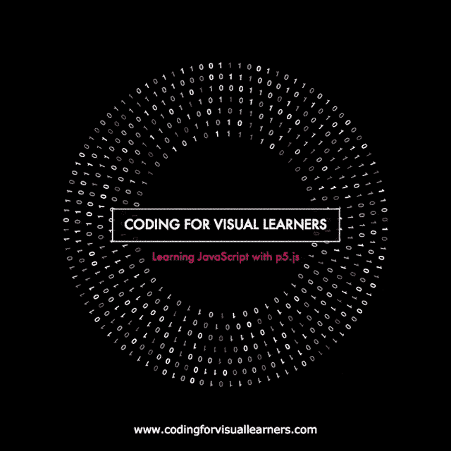

# 使用 JavaScript 和 p5.js 创建图书封面

> 原文：<https://dev.to/inspiratory/creating-a-book-cover-using-javascript-and-p5js>

[T2】](https://res.cloudinary.com/practicaldev/image/fetch/s--DFZWaXhD--/c_limit%2Cf_auto%2Cfl_progressive%2Cq_66%2Cw_880/http://i.imgur.com/bippZ2M.gif)

*注:这篇文章最初发表在 [CSS-Tricks](https://css-tricks.com/creating-book-cover-using-javascript-p5-js/) 上。*

我最近出版了一本书和一个名为[视觉学习者编码](http://www.codingforvisuallearners.com)的互动课程。它使用广泛流行的 JavaScript 编程语言和 p5.js 编程库向初学者从头开始教授编码。因为 p5.js 是一个很棒且容易使用的绘图库，我想利用它来制作我的[书](http://i.imgur.com/9EJuFze.jpg)和课程的封面。这是一个关于如何使用 JavaScript 和 p5.js 创建这种特殊视觉效果的教程。

p5.js 是一个绘图和创意编码库，它基于草图的思想。就像素描可以被认为是一种快速原型化想法的最简单的绘图方法一样，p5.js 的概念是编写最少的代码来将您的视觉、交互或动画想法转化到屏幕上。p5.js 是基于 **Java** 编程语言的流行库 **Processing** 的 JavaScript 实现。

p5.js 的简洁本质使它成为一个非常容易学习的库。但是不要让这种简单性欺骗你，让你相信 p5.js 的能力有限。p5.js 背后有大量令人印象深刻的功能、历史和社区，如果你想用代码创作艺术、设计、运动或互动作品，这是一项有价值的学习投资。一个 p5.js 程序可以有几行到几千行代码。

您可以使用 p5.js 构建复杂的数据可视化:

请看 [CodePen](https://codepen.io) 上 Engin 阿尔斯兰( [@enginarslan](https://codepen.io/enginarslan) )的 Pen [p5.js 数据可视化](https://codepen.io/enginarslan/pen/aJJmZP/)。

或者说生成艺术。

参见 [CodePen](https://codepen.io) 上 Engin 阿尔斯兰( [@enginarslan](https://codepen.io/enginarslan) )的 Pen [p5.js 生成艺术](https://codepen.io/enginarslan/pen/XMMjjP/)。

在本教程中，我将假设对 JavaScript 有一点了解，比如熟悉 if-else 结构、数组等。如果你想重温你的 JavaScript 知识，或者想从头开始学习这种强大的语言，我强烈推荐你看看我的书和为视觉学习者编写的课程。它是为绝对的初学者量身定做的。

我还会假设你对计算机图形学有一定程度的了解，这样像坐标系统或颜色模式这样的概念就不需要太多的解释了。但是如果有任何不清楚的地方，请随时联系我，我会尽力澄清。

您可以使用操作系统上的 [p5.js 编辑器](https://p5js.org/download/)或者使用在线代码编辑器来完成这篇文章。这里有一支[笔](http://codepen.io/enginarslan/pen/xqqEqB)，可以作为你 p5.js 项目的模板。

我们开始吧！

## 第一部分:p5.js 基础

### 设置&绘制功能

大多数 p5.js 脚本包含两个名为 **setup** 和 **draw** 的函数声明。您将在这两个函数中编写所有与 p5.js 相关的代码，p5.js 将以特定的方式为您执行这些函数。理解 p5.js 如何执行这些函数很重要，因为它们构成了任何 p5.js 程序的主干。

**setup** 函数是你编写与程序初始化相关的代码的地方。写在**设置**函数中的任何东西都被执行一次，并且在程序开始时被执行。

**draw** function 是你将要编写大部分绘图相关功能的地方。**绘制**功能在**设置**功能之后执行，并且连续执行(接近 60 次，帧，默认为一秒)，这让你可以使用这个库创建各种交互式和动画视觉效果。

考虑到 **draw** 和 **setup** 函数对 p5.js 的工作非常重要，这是你需要为你编写的几乎每一个 p5.js 代码使用的样板代码。

参见 [CodePen](https://codepen.io) 上 Engin 阿尔斯兰( [@enginarslan](https://codepen.io/enginarslan) )的笔 [book-cover-step-01](https://codepen.io/enginarslan/pen/EWZbmQ/) 。

如果您没有明确地指示它，p5.js 会使用默认大小创建一个画布(您将使用的 web 页面内的绘图区域),这个默认大小对于您的目的来说可能太小了。这就是为什么您要调用 **createCanvas** 函数，该函数使用给定的 x 和 y 维度显式创建画布。您还可以调用 **draw** 函数中的**背景**函数来为画布设置颜色。对于样板文件来说，这可能不是必需的，但是它有助于查看创建的画布。

### p5.js 中的  颜色&形状

p5.js 中的颜色设置函数，就像你在这里使用的**背景**函数一样，支持一个、两个、三个或四个参数。单个参数使用 R、G 和 B(红、绿、蓝)分量的给定值创建纯色。用单个值调用颜色设置函数等同于用三个独立的参数调用相同的值。下面这两个声明会产生相同的结果:

```
background(150);
background(150, 150, 150); 
```

第四个参数(如果提供)设置颜色的 alpha(透明度)。当用作最后一个参数时，第二个参数也控制颜色的 alpha，从而控制在它之后绘制的形状的 alpha。谈到形状，让我们创建一个形状。这里是一个矩形，使用 **rect** 函数绘制。

参见 [CodePen](https://codepen.io) 上 Engin 阿尔斯兰( [@enginarslan](https://codepen.io/enginarslan) )的笔 [book-cover-step-02](https://codepen.io/enginarslan/pen/PpWOjY/) 。

**rect** 函数的前两个参数设置矩形的位置，后两个参数用于设置大小。注意当与参数`0`和`0`一起使用时，矩形是如何被绘制到屏幕的左上角的。`0, 0`是画布的原点，位于左上角。在 p5.js 中，默认情况下矩形从左上角开始绘制。如果您想要更改这种行为，可以使用 p5.js 变量 **CENTER** 声明一个名为 **rectMode** 的函数来更改矩形绘制模式。将这个声明放在 **setup** 函数中是有意义的，因为在程序的生命周期中你只需要做一次。

参见 [CodePen](https://codepen.io) 上 Engin 阿尔斯兰( [@enginarslan](https://codepen.io/enginarslan) )的笔 [book-cover-step-03](https://codepen.io/enginarslan/pen/vxgWZP/) 。

如果你想在屏幕的正中央画这个矩形，你有几个选择。你可以给它提供值`700/2`,这样它将使用一半的宽度和一半的高度。但是像这样硬编码值不是一个好的编程实践。你可以尝试在**矩形**函数和**设置**和**绘制**函数之间共享变量。但幸运的是，由于相对于画布的宽度和高度放置东西是一种常见的操作，p5.js 为您提供了一种快捷方式。您可以使用 p5.js 变量 **width** 和 **height** 来获取画布的当前宽度和高度。将这些变量除以 2，用它们来放置矩形。

参见 [CodePen](https://codepen.io) 上 Engin 阿尔斯兰( [@enginarslan](https://codepen.io/enginarslan) )的笔 [book-cover-step-04](https://codepen.io/enginarslan/pen/VpPrzg/) 。

到目前为止，你已经知道如何设置背景的颜色，但是还没有看到如何设置形状的颜色。有两个函数允许您这样做。其中一个是 **fill** 函数，它为这个函数声明之后的形状设置填充颜色，还有一个是 **stroke** 函数，它为笔画设置颜色。

颜色函数的工作原理可能有点不直观，因为它们影响的是声明之后的形状，而不是声明之前的形状。为了理解它们是如何操作的，您可以将调用这些函数看作是为连续的绘图操作设置活动颜色。

另一个相关的功能是 **strokeWidth** ，它设置形状的笔画宽度。你将使用这三个函数来创建一个带有白色边框的透明矩形。

参见 [CodePen](https://codepen.io) 上 Engin 阿尔斯兰( [@enginarslan](https://codepen.io/enginarslan) )的笔 [book-cover-step-05](https://codepen.io/enginarslan/pen/GWrOMV/) 。

您还将在屏幕中间创建一个文本。为此，您将使用**文本**功能。**文本**功能有 3 个输入，要绘制到屏幕上的文本以及文本放置的 x 和 y 位置。您也可以使用 **textFont** 功能为文本设置所需的字体。

参见 [CodePen](https://codepen.io) 上 Engin 阿尔斯兰( [@enginarslan](https://codepen.io/enginarslan) )的笔 [book-cover-step-06](https://codepen.io/enginarslan/pen/KWayya/) 。

这里有几个问题需要解决。首先，注意文本没有居中对齐。正如你现在已经猜到的，有一个函数可以设置文本如何对齐，叫做 **textAlign** 函数。您将在**设置**功能中使用**文本对齐**功能，因为您不会再次更改该属性。您将为它提供两个参数；`CENTER, CENTER`。这将使文字绘图水平和垂直对齐。

第二件要注意的事情是，文本形状受到上面矩形的填充和描边值的影响，但是你可能不希望在绘制文本时使用这些值。让我们在绘制文本之前设置新的值，以去掉以前的值。

参见 [CodePen](https://codepen.io) 上 Engin 阿尔斯兰( [@enginarslan](https://codepen.io/enginarslan) )的笔 [book-cover-step-07](https://codepen.io/enginarslan/pen/bqgYaE/) 。

为了能够调整笔划，您可以使笔划颜色透明或将 strokeWeight 设置为 0。这里还使用了一个 **noStroke** 函数，它可以完全消除笔画。在我看来，你选择哪一个并不重要，在这个用例中它们都有相同的效果。

现在，您将调整矩形的形状，以便更好地包含该文本。此外，出于易读性的目的，您将使背景为黑色。

参见 [CodePen](https://codepen.io) 上 Engin 阿尔斯兰( [@enginarslan](https://codepen.io/enginarslan) )的笔 [book-cover-step-08](https://codepen.io/enginarslan/pen/ZeLavX/) 。

目前，文本和矩形太小。你已经知道如何放大矩形。为了能够改变文本的大小，你可以使用一个名为 **textSize** 的函数。但是您将使用 p5.js 转换函数 **scale** 来处理缩放，因为它将允许您以更直接的方式控制矩形和文本的缩放。不幸的是，当使用 p5.js 时，转换不是很直观，所以需要进一步的解释。

### p5.js 转换函数

p5.js 中的变换相对于原点发生。有一个 **scale** 函数，你可以用它来按给定的量缩放后面的形状，但是物体会从原点开始缩放；屏幕的左上角。这很少是可取的。处理形状时，您通常希望相对于它们的中心点来缩放它们。

请注意调用 **scale** 函数是如何使所有的东西变大的，但也是如何移动它们的，因为缩放是相对于左上角发生的。

参见 [CodePen](https://codepen.io) 上 Engin 阿尔斯兰( [@enginarslan](https://codepen.io/enginarslan) )的笔 [book-cover-step-09](https://codepen.io/enginarslan/pen/YZNEeM/) 。

如果形状在原点，那么这个缩放操作就能达到我们的目的。幸运的是，有一种方法可以实现这一点。为此，你应该同时使用**缩放**功能和**平移**功能。它是这样工作的:

参见 [CodePen](https://codepen.io) 上 Engin 阿尔斯兰( [@enginarslan](https://codepen.io/enginarslan) )的笔 [book-cover-step-10](https://codepen.io/enginarslan/pen/OpWOZV/) 。

您已经将矩形和文本的 x 和 y 位置都设置为 0。这会将形状移动到原点。然后你调用**转换**转换函数将形状移动到它们在`width/2`和`height/2`的初始位置。这是因为**平移**功能实际上并不移动图形，而是移动整个坐标系。现在坐标系的原点在屏幕的中间，你可以调用 **scale** 函数，从这个期望的点开始缩放。

现在，如果这对你来说听起来有点复杂，让我向你保证，你并不孤单。移动整个坐标系来变换一个形状不仅对你要实现的目标来说是多余的，而且也是不切实际的，因为这意味着在这些形状之后出现的任何东西都需要使用这个新变换的坐标系，这给过程增加了许多复杂性。让我们通过画一个新的形状来看看这个例子。

参见 [CodePen](https://codepen.io) 上 Engin 阿尔斯兰( [@enginarslan](https://codepen.io/enginarslan) )的笔 [book-cover-step-10-B](https://codepen.io/enginarslan/pen/ryyMdo/) 。

如您所见，您现在正在使用椭圆函数在 x 和 y 坐标 120 和 0 处绘制一个圆。但问题是，即使提供的 y 值为 0，您也可以清楚地看到这个圆不在屏幕的顶部，而是在中间，这恰好是 y 轴的新 0 值。这在大多数情况下是非常不可取的，但幸运的是 p5.js 中有一种方法可以处理它。进入**按压**和**弹出**功能！

### 推动&流行

p5.js **push** 功能允许您创建一个新的状态， **pop** 功能将状态恢复到以前的状态。这允许你将完全不同的设置应用到单独的对象，而不用担心这些设置会影响后面的形状，只要你在**按压**和**弹出**调用之间做所有的事情。它是这样工作的:

参见 [CodePen](https://codepen.io) 上 Engin 阿尔斯兰( [@enginarslan](https://codepen.io/enginarslan) )的笔 [book-cover-step-11](https://codepen.io/enginarslan/pen/evgery/) 。

完美！您现在所做的所有转换更改仍然局限在 **push** 和 **pop** 函数调用之间。需要注意的是，你应该总是一起调用**按压**和**弹出**功能。使用一个而不使用另一个没有任何意义。既然你已经解决了关于变换的问题，你可以去掉圆形了。在最终确定屏幕上的文本之前，你要添加的最后一件事是给它添加一点动画。让我们把动画的前 200 帧放大一点，给视觉效果增加一点活力。为此，您可以使用 **frameCount** p5.js 变量。 **frameCount** p5.js 变量跟踪在 p5.js 程序的生命周期中调用 **draw** 函数的次数。

参见 [CodePen](https://codepen.io) 上 Engin 阿尔斯兰( [@enginarslan](https://codepen.io/enginarslan) )的笔 [book-cover-step-12](https://codepen.io/enginarslan/pen/GWrOBR/) 。

下面的代码片段被添加到程序中。如果**帧数**小于 200，它将当前**帧数**值的`1/400`加到当前比例上。您使用数字 400 的原因是，当帧数为 200 时，您希望总比例增加 0.5。但是这不是解决这个问题最优雅或可伸缩的方式。

```
if (frameCount < 200) {
    scale(1.5 + frameCount/400);
} else {
    scale(2);
} 
```

一个 p5.js 函数是 **map** 函数，您可以使用它来导出这个增量缩放值。**映射**功能将预期在给定最小和最大范围之间的给定值映射到所需最小和最大范围内的一个数字。以下声明:

```
map(frameCount, 0, 200, 0, 0.5); 
```

会将 0 到 200 之间的 **frameCount** 变量映射到 0 到 0.5 之间的值。让我们在代码中使用它:

参见 [CodePen](https://codepen.io) 上 Engin 阿尔斯兰( [@enginarslan](https://codepen.io/enginarslan) )的笔 [book-cover-step-13](https://codepen.io/enginarslan/pen/JWEOee/) 。

这样好多了。代码也是非常可伸缩的。你可以改变**比例因子**和**最大限制**变量来调整文本增长的多少和多快。在本演练的下一部分，您将构建最终视觉效果的背景效果，这可能是该视觉效果中更令人兴奋的部分。但是到目前为止您已经看到的部分应该足以让您熟悉 p5.js 的基础。

## 第二部分:创建戒指形状

在本教程的第二部分，您将学习如何在背景中创建动画环形形状。但首先，让我们将文本绘制代码移到它自己的函数中，这样它就不会占用 **draw** 函数内部那么多空间。

参见 [CodePen](https://codepen.io) 上 Engin 阿尔斯兰( [@enginarslan](https://codepen.io/enginarslan) )的笔 [book-cover-step-14](https://codepen.io/enginarslan/pen/Nppraq/) 。

这次更新没有引入任何功能上的变化，只是对代码进行了结构上的更新，使其更加清晰易读。你现在不需要 **drawTitleText** 函数，所以你可以把它注释掉，这样就可以专注于背景形状。

您将使用一个 JavaScript 对象来表示屏幕上最终视觉效果的数字。使用对象创建形状可以更容易地将形状视为具有特定属性和行为集的实体。它还有助于将与形状相关的功能封装在形状本身之下，这有利于代码组织。

这里，您创建了一个名为`Num`的 JavaScript 构造函数来表示在环中使用的数字。这需要几个论据？要显示的形状消息、形状的 x、y 位置、旋转和颜色值。你以前没有见过**旋转**功能，但它非常类似于**缩放**或**平移**功能。顾名思义，它通过旋转来变换形状。

```
function Num(msg, x, y, rot, clr) {
    this.x = x;
    this.y = y;
    this.rot = rot;
    this.msg = msg;
    this.color = clr;

    this.render = function() {
        push();
        fill(this.color);
        translate(this.x, this.y);
        rotate(this.rot);
        text(this.msg, 0, 0);
        pop();
    }
} 
```

构造函数有一个 **render** 方法，用于将形状绘制到屏幕上。现在，您可以使用此构造函数来初始化此 shape 对象的一个实例，并将其绘制在屏幕上。

参见 [CodePen](https://codepen.io) 上 Engin 阿尔斯兰( [@enginarslan](https://codepen.io/enginarslan) )的笔 [book-cover-step-15](https://codepen.io/enginarslan/pen/aJJZqq/) 。

有几件事值得一提。

首先，注意`Num`函数是多么的通用。它可以用来以灵活的方式将任何文本呈现到屏幕上。它也很容易使用，因为您可以通过定义所需的旋转值来简单地控制旋转，而不是从外部使用**推动**和**弹出**功能。

其次，看看在声明函数时如何避免使用某些词。你可以调用构造函数`Number`而不是`Num`，但是`Number`是 JavaScript 中已经存在的函数，所以你应该尽量避免。如果你使用`Number`，事情不一定会爆发，但是一般来说，不引起名称冲突是个好主意。同样对于参数，您没有使用`rotate`或`color`作为参数名，因为这些是内置 p5.js 函数的名称。如果您要将这些名称用于参数，那么您将无法在此函数的上下文中使用使用相同名称的函数。学习如何避免这些名字来自实践。

最后，请注意您是如何为 number 对象提供 90°的旋转值的，但是该数字似乎没有旋转 90 度。这是因为 p5.js 在执行旋转时默认使用*弧度*，而不是*度*。通过调用 p5.js **angleMode** 函数，使用 **setup** 函数中的 **DEGREES** 变量，可以设置使用度数作为默认旋转单位。

```
angleMode(DEGREES); 
```

现在屏幕上只有一个数字，这很好，但我们的目标是让几个数字组成一个环形。让我们弄清楚如何对单个数字进行这种操作，然后您可以缩放操作，对任意数量的数字进行放置。

参见 [CodePen](https://codepen.io) 上 Engin 阿尔斯兰( [@enginarslan](https://codepen.io/enginarslan) )的笔 [book-cover-step-16](https://codepen.io/enginarslan/pen/QppErE/) 。

代码越来越大！这是为创建环形布局而添加的代码。

```
var radius = 100;
var amount = 15;

push();
translate(width / 2, height / 2);

for (var i = 0; i < amount; i++) {
    rotate(i);
    var num = new Num(1, 0 + radius, 0, 90, 255);
    num.render();
}

pop(); 
```

这里我们有一个 for 循环，它根据给定的**半径**创建了给定数量的 **Num** 个远离当前原点的对象。目前只创建了 15 个对象。这是为了说明一点。看看形状周围的间距是如何不均匀的。发生这种情况是因为 p5.js 中的变换调用(像**平移**、**旋转**、**缩放**)具有累积效应。例如，下面列出的这两个调用将导致 x 轴总共平移 20 个像素。

```
translate(10, 0);
translate(10, 0); 
```

要纠正这一点，您可以使用**推动**和**弹出**，以便变换效果保持局部化，不会累积。这应该可以解决形状间距不均匀的问题。你也应该使它的形状均匀分布在假想的圆上。要做到这一点，你可以用 360 度(一个圆的总角度)除以你所拥有的形状数，得出你应该将每个形状旋转多少，以达到均匀分布。

参见 [CodePen](https://codepen.io) 上 Engin 阿尔斯兰( [@enginarslan](https://codepen.io/enginarslan) )的笔 [book-cover-step-17](https://codepen.io/enginarslan/pen/RppRJO/) 。

很好，在下一步中，您将从这个环形绘制操作中创建一个函数。您将使该函数接受**半径**和**数量**作为参数。同样在函数内部，您将生成一个随机数数组，并将其输入到 **Num** 对象中，这样您就可以向该对象传递一个 0 或 1 的随机值，而不是总是使用数字 1。

为此，您将使用 p5.js **random** 函数。下面是一个代码片段，它生成一个介于 0 和 2(不包括 2)之间的随机浮点数，使用 JavaScript **parseInt** 函数将其转换为一个整数，并将其推入一个数组。

```
var randomNumbers = [];
for (var i = 0; i <= amount; i++) {
    randomNumbers.push(parseInt(random(2), 10));
} 
```

现在，您可以将这个 **randomNumbers** 集合中的一个项目传递给 **Num** 对象，而不是总是使用数字 1。以下是完整的代码:

参见 [CodePen](https://codepen.io) 上 Engin 阿尔斯兰( [@enginarslan](https://codepen.io/enginarslan) )的笔 [book-cover-step-18](https://codepen.io/enginarslan/pen/MppeBo/) 。

现在的问题是 p5.js **random** 函数正在为每个 **draw** 函数调用生成一个随机值，但是出于我们的目的，我们希望这些随机值在程序的整个执行过程中保持不变。要做到这一点，你应该使用 p5.js **randomSeed** 函数。 **randomSeed** 确保你为给定的种子值获得相同的“随机”值。您将使种子可以从函数外部进行配置。

参见 [CodePen](https://codepen.io) 上 Engin 阿尔斯兰( [@enginarslan](https://codepen.io/enginarslan) )的笔 [book-cover-step-19](https://codepen.io/enginarslan/pen/JWWKVm/) 。

数字不再闪烁了。既然您已经创建了绘制单个环的函数，那么现在使用一个循环来绘制具有不同数量的 **Num** 对象的多个环一点也不困难。为了使例子简单，我们使用一个数字常数来保持环的密度彼此相似。

参见 [CodePen](https://codepen.io) 上 Engin 阿尔斯兰( [@enginarslan](https://codepen.io/enginarslan) )的笔 [book-cover-step-19-B](https://codepen.io/enginarslan/pen/gmmwqW/) 。

您几乎完成了！事实上，此时我将只展示最终的代码，因为它不包含任何您不了解的内容。

这里有一些在这个版本中更新的东西。

*   更新了可视学习者文本编码的背景，使其半透明。
*   引入了环的旋转。
*   也给 Num 对象的颜色引入了随机性。

参见 [CodePen](https://codepen.io) 上 Engin 阿尔斯兰( [@enginarslan](https://codepen.io/enginarslan) )的 Pen [为视觉学习者编码-封面](https://codepen.io/enginarslan/pen/WppxBo/)。

如果你不想动画化这个形状，你可以在**设置**函数中调用一个名为 **noLoop** 的函数，只显示动画的第一帧。如果你想调整形状，你可以通过调整**数量**、**间距**、**半径**和**旋转速度**参数开始。

我用静态图像作为我的书的封面，但是用动画形状来制作课程的动画。公平地说，我也用了一点 Photoshop 来放置一些元素，但基本形状是用 JavaScript 和 p5.js 创建的，这让我作为一名程序员感到高兴。

我希望您喜欢这个关于 p5.js 的简短介绍！如果您有任何问题，请随时联系我！你可以在[enginarslan.com](http://enginarslan.com/)找到我的网站，我在推特[@吸气](https://twitter.com/inspiratory)上。你可以在这里找到更多关于我的书/在线课程[的信息](http://www.codingforvisuallearners.com/)。