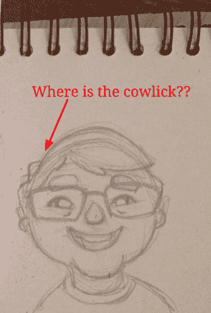

# 准确性与清晰度

> 原文：<https://dev.to/pbeekums/accuracy-vs-clarity>

在传达信息时，经常感觉准确性应该是最重要的。为什么不会呢？解释假的东西有什么意义？不管我们是在写博客、文档、书，还是其他人会读的任何东西，我们都想确保我们所说的是真实的。

[T2】](https://res.cloudinary.com/practicaldev/image/fetch/s--iY7hIftS--/c_limit%2Cf_auto%2Cfl_progressive%2Cq_auto%2Cw_880/https://blog.professorbeekums.com/img/2017/5/accuracy.png)

但是 100%准确并不总是最重要的。我认为，满足于 80-90%的准确率是可以的，如果这有助于让事情更清晰的话。让我们以维基百科为例。多项研究表明，维基百科上科学/技术文章的准确率约为 97%。听起来很棒，对吧？

你曾经从维基百科上学习过没有相关知识的技术知识吗？

看一下数据库的条目:

> 数据库是有组织的数据集合。[1]它是模式、表、查询、报告、视图和其他对象的集合。数据通常被组织成以支持需要信息的过程的方式来模拟现实的各个方面，例如以支持找到有空房的酒店的方式来模拟酒店中的房间可用性。
> 
> 数据库管理系统(DBMS)是一种计算机软件应用程序，它与用户、其他应用程序以及数据库本身进行交互，以捕获和分析数据。通用 DBMS 被设计成允许数据库的定义、创建、查询、更新和管理。比较知名的 DBMSs 有 MySQL、PostgreSQL、MongoDB、MariaDB、微软 SQL Server、Oracle、Sybase、SAP HANA、MemSQL、IBM DB2 等。数据库通常不能跨不同的 DBMS 移植，但是不同的 DBMS 可以通过使用诸如 SQL 和 ODBC 或 JDBC 之类的标准进行互操作，以允许单个应用程序与多个 DBMS 一起工作。数据库管理系统通常根据它们支持的数据库模型进行分类；自 20 世纪 80 年代以来，最流行的数据库系统都支持以 SQL 语言为代表的关系模型。[有争议–讨论]有时 DBMS 被笼统地称为“数据库”。

###### *数据库，[en.wikipedia.org/w/index.php?title=Database&oldid = 782511180](https://en.wikipedia.org/w/index.php?title=Database&oldid=782511180)(2017 年 5 月 27 日最后一次访问)。*

这是准确的，对于具有软件开发背景的人来说是有意义的。对于没有这种背景的人来说也是没用的。尽管它很准确，但它实际上没有向这些人提供任何信息，因为他们无法获得这些信息。

维基百科是一个很好的参考，所以他们的目标是尽可能准确是有道理的。然而，更具介绍性的东西应该有清晰的目标，即使这意味着它不太准确。

我倾向于将数据库描述为巨大的电子表格。准确吗？不完全是。这个类比没有考虑到 SQL 和 NoSQL。它不考虑索引。它不考虑连接查询。它不能解释很多其他的事情。

[T2】](https://res.cloudinary.com/practicaldev/image/fetch/s--TD1TyctD--/c_limit%2Cf_auto%2Cfl_progressive%2Cq_auto%2Cw_880/https://professorbeekums.com/asseimg/v4/softwareOverview/spreadsheet.png)

但是大多数人在生活中的某个时候都和电子表格打过交道。这为他们提供了数据库中数据的可视化表示。能够将某件事形象化会让理解某件事变得容易得多。它作为进一步学习的基础，即使包括对最初视觉化的不准确性的纠正。

让我们用一个不同的例子。让我们看一幅画。  艺术家通常不会从上往下开始画，一个像素一个像素地画。

[T2】](https://res.cloudinary.com/practicaldev/image/fetch/s--ozfwnJQf--/c_limit%2Cf_auto%2Cfl_progressive%2Cq_auto%2Cw_880/https://blog.professorbeekums.com/img/2017/5/confusing.png)

他们从草图开始。这张草图提供了整个事情应该是什么样子的想法。它作为基础。这只是一个草图，所以有一些不准确的地方，即使你忽略了颜色的缺乏。这些可以在草图完成后进行修改。

[T2】](https://res.cloudinary.com/practicaldev/image/fetch/s--P58__84u--/c_limit%2Cf_auto%2Cfl_progressive%2Cq_auto%2Cw_880/https://blog.professorbeekums.com/img/2017/5/sketch.png)

这并不是说准确性无关紧要。为了清晰起见，我提到了牺牲一些准确性。试图用松鼠的形象来描述一个数据库是完全没有价值的。

[T2】](https://res.cloudinary.com/practicaldev/image/fetch/s--xsqanmHJ--/c_limit%2Cf_auto%2Cfl_progressive%2Cq_auto%2Cw_880/https://professorbeekums.com/asseimg/programming/image12.png)

图像是清晰的，但是它没有传达理解什么是数据库所需的任何信息。

像许多事情一样，需要达到一种平衡。我们想传达有用的信息。这意味着它确实需要一定程度的准确，但也意味着抓住机会让事情变得更清楚。用一点点的准确性换取大量的清晰性，可以让信息对人们的用处成倍增加。这笔交易非常值得。

*本帖最初发表于[blog.professorbeekums.com](https://blog.professorbeekums.com/accuracy-vs-clarity/)T3】*