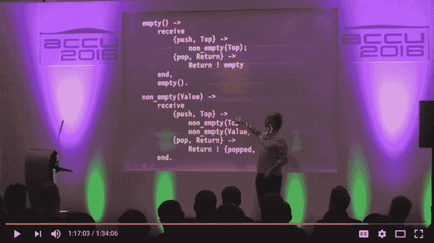

# C++中的函数式状态机

> 原文:[https://dev.to/tmr232/a-functional-style-state-machine-in-c](https://dev.to/tmr232/a-functional-style-state-machine-in-c)

如果你现在去找你的任何一个同事，问他们，*“c++中的函数能返回自身吗？”他们很可能会给你错误的答案。
现在问他们函数的返回类型是什么。来，我来帮你:* 

```
using SelfReturning = SelfReturning (*)();

SelfReturning A() { return A; } 
```

<svg width="20px" height="20px" viewBox="0 0 24 24" class="highlight-action crayons-icon highlight-action--fullscreen-on"><title>Enter fullscreen mode</title></svg> <svg width="20px" height="20px" viewBox="0 0 24 24" class="highlight-action crayons-icon highlight-action--fullscreen-off"><title>Exit fullscreen mode</title></svg>

太好了！
但是不编译。
也没有

```
auto A() { return A; } 
```

<svg width="20px" height="20px" viewBox="0 0 24 24" class="highlight-action crayons-icon highlight-action--fullscreen-on"><title>Enter fullscreen mode</title></svg> <svg width="20px" height="20px" viewBox="0 0 24 24" class="highlight-action crayons-icon highlight-action--fullscreen-off"><title>Exit fullscreen mode</title></svg>

原来 C++的类型系统不允许递归类型。这很烦人。函数没有理由不能返回自身。更令人讨厌的是，对象方法可以返回持有它们的对象:

```
struct A {
    A operator()() { return A(); }
}; 
```

<svg width="20px" height="20px" viewBox="0 0 24 24" class="highlight-action crayons-icon highlight-action--fullscreen-on"><title>Enter fullscreen mode</title></svg> <svg width="20px" height="20px" viewBox="0 0 24 24" class="highlight-action crayons-icon highlight-action--fullscreen-off"><title>Exit fullscreen mode</title></svg>

这个代码是有效的。原因很明显。对象方法不是对象的一部分。它们不影响对象大小或其构造。它们只是一个语法工具。这里没有类型系统递归。

函数有明显的类型递归。但是如果你看看编译器实际要做的工作——这似乎很荒谬。函数永远不会被构造，它只是被构造。它没有被分配。函数的签名不会改变类型。

```
void* A() {
    return reinterpret_cast<void*>(A);  // Same as C's `(void*)A`
}

int main() { 
    auto a = A;

    while (true) {
        // Cast back to function pointer
        a = reinterpret_cast<void*(*)()>(A());
    }

    return 0;
} 
```

<svg width="20px" height="20px" viewBox="0 0 24 24" class="highlight-action crayons-icon highlight-action--fullscreen-on"><title>Enter fullscreen mode</title></svg> <svg width="20px" height="20px" viewBox="0 0 24 24" class="highlight-action crayons-icon highlight-action--fullscreen-off"><title>Exit fullscreen mode</title></svg>

看到了吗？没有遗漏信息。编译器拥有它需要的所有知识，但是类型系统仍然阻止我们编写代码(或者，在这种情况下，阻止我们以类型安全的方式编写代码)。我们可以做得更好。

我们已经知道对象可以用来打破类型递归。让我们看看是否可以在这里使用它们，而不用创建这么多锅炉板代码:

```
struct SelfReturning {
    using FuncType = SelfReturning(*)(); // (1)

    SelfReturning(FuncType func) : _func{func} {} // (2)
    SelfReturning operator() () { return _func(); } // (3)

    private:
        FuncType _func;
}; 
```

<svg width="20px" height="20px" viewBox="0 0 24 24" class="highlight-action crayons-icon highlight-action--fullscreen-on"><title>Enter fullscreen mode</title></svg> <svg width="20px" height="20px" viewBox="0 0 24 24" class="highlight-action crayons-icon highlight-action--fullscreen-off"><title>Exit fullscreen mode</title></svg>

答案是肯定的。我们*可以*。只要用这个类代替第一个例子中失败的类型定义，一切都会像宣传的那样工作。但是它是如何工作的呢？为了打破类型递归，我们创建了一个代理对象。它唯一的目的是保存一个函数指针并调用它。
行 **(1)** 定义了我们期望持有的函数类型。注意这里没有直接的递归。 **(2)** 是构造函数，取函数指针并存储。 **(3)** 是我们将调用转发给函数指针的地方。注意，这里也没有类型递归，因为类的类型不同于它的`operator()`函数的类型。
作为奖励，当使用`-O3`时，它在 Clang 和 GCC 中编译与`reinterpret_cast<void*>`版本相同(参见这里的和这里的),同时保持类型安全。工作中的零成本抽象。

但是为什么会有意思呢？有哪些用例？

嗯，在过去的几个月里，我每天例行公事地进行一次与编程相关的谈话。我发现这是扩展知识的好方法，比每天读一篇文章要容易得多。

上周，在研究一些小型状态机时，我偶然发现了[的](https://twitter.com/KevlinHenney)[陈述性思维和陈述性实践](https://youtu.be/nrVIlhtoE3Y)。看到[这张幻灯片](https://youtu.be/nrVIlhtoE3Y?t=1h17m3s):

[T2】](https://res.cloudinary.com/practicaldev/image/fetch/s--7JP6WiFF--/c_limit%2Cf_auto%2Cfl_progressive%2Cq_auto%2Cw_880/https://thepracticaldev.s3.amazonaws.com/i/6103sjmjyeq7bpp7aiz8.png)

我想-裸功能而不是状态设计模式？我一定要试试！所以我继续写我的代码，重复上面描述的步骤。乍看之下，仿函数解决方案似乎令人满意。但实际上，函子与函数不同，有不同的类型，不能赋给同一个变量。为了弥合这一差距，我们使用了抽象基类和多态。一旦我们这样做了，我们就被迫使用指针来保存状态。我使用`std::unique_ptr`是因为我不想自己管理内存。

```
#include <memory>  
struct IState {
    virtual std::unique_ptr<IState> operator()() = 0;
    virtual ~IState() {};
};

struct A : public IState { std::unique_ptr<IState> operator()(); };
struct B : public IState { std::unique_ptr<IState> operator()(); };

std::unique_ptr<IState> A::operator()() { return std::make_unique<B>(); }
std::unique_ptr<IState> B::operator()() { return std::make_unique<A>(); }

int main() {
    std::unique_ptr<IState> state = std::make_unique<A>();

    while (true) { state = (*state)(); }

    return 0;
} 
```

<svg width="20px" height="20px" viewBox="0 0 24 24" class="highlight-action crayons-icon highlight-action--fullscreen-on"><title>Enter fullscreen mode</title></svg> <svg width="20px" height="20px" viewBox="0 0 24 24" class="highlight-action crayons-icon highlight-action--fullscreen-off"><title>Exit fullscreen mode</title></svg>

然而，代理对象技巧没有这样的开销。我们知道我们正在使用对象，但是代码没有显示出来。编译后的版本也简单得多(见这里的和这里的)。

```
struct State {
    using FuncType = State(*)();
    State(FuncType func) : _func{func} {};
    State operator()() { return _func(); }
    FuncType _func;
};

State A();
State B();

State A() { return B; }
State B() { return A; }

int main() {
    State state = A;

    while (true) { state = state(); }

    return 0;
} 
```

<svg width="20px" height="20px" viewBox="0 0 24 24" class="highlight-action crayons-icon highlight-action--fullscreen-on"><title>Enter fullscreen mode</title></svg> <svg width="20px" height="20px" viewBox="0 0 24 24" class="highlight-action crayons-icon highlight-action--fullscreen-off"><title>Exit fullscreen mode</title></svg>

稍微改进一下，为了处理事件和在上下文中操作，我们仍然保持非常简单、直接的代码。出于这个例子的目的，使用`abort()`和`printf()`而不是`throw std::runtime_error`和`std::cout`，因为编译后的输出更容易阅读。此处见编译[，此处](https://godbolt.org/g/LcAsfU)见执行[。](http://coliru.stacked-crooked.com/a/64b54b8c5282ac23) 

```
#include <cstdio> #include <cstdlib>  
enum class Event{ A, B, };

struct Context {
    int counter = 0;
};

struct State {
    using FuncType = State(*)(Context&, Event);
    State(FuncType func) : _func{func} {};
    State operator()(Context& ctx, Event evt) { return _func(ctx, evt); }
    FuncType _func;
};

State A(Context&, Event);
State B(Context&, Event);

State A(Context& ctx, Event evt) {
    printf("State A, counter = %d\n", ctx.counter);
    ++ctx.counter;
    switch (evt) {
        case Event::A :
            return A;
        case Event::B :
            return B;
        default:
            abort();
    }
}

State B(Context& ctx, Event evt) {
    printf("State B, counter = %d\n", ctx.counter);
    ++ctx.counter;
    switch (evt) {
        case Event::A :
            return A;
        case Event::B :
            return B;
        default:
            abort();
    }
}

int main() {
    State state = A;
    Context ctx{};
    Event events[] = {Event::B, Event::A, Event::B, Event::A, };

    for (auto evt : events) {
        state = state(ctx, evt);
    }

    return 0;
} 
```

<svg width="20px" height="20px" viewBox="0 0 24 24" class="highlight-action crayons-icon highlight-action--fullscreen-on"><title>Enter fullscreen mode</title></svg> <svg width="20px" height="20px" viewBox="0 0 24 24" class="highlight-action crayons-icon highlight-action--fullscreen-off"><title>Exit fullscreen mode</title></svg>

对于那些热衷于函数式编程的人，我们甚至可以传入一个对上下文的常量引用，并返回一个新的上下文和新的状态。[编译](https://godbolt.org/g/Dd1XKr)，[执行](http://coliru.stacked-crooked.com/a/e7ef3a7ab08e0e88)。

```
#include <tuple> #include <cstdio> #include <cstdlib>  
enum class Event{ A, B, };

struct Context {
    Context Inc() const {
        return Context{counter + 1};
    }
    int counter = 0;
};

struct State {
    using RetType = std::pair<State, const Context>;
    using FuncType = RetType(*)(const Context&, Event);
    State(FuncType func) : _func{func} {};
    RetType operator()(Context& ctx, Event evt) { return _func(ctx, evt); }
    FuncType _func;
};

State::RetType A(const Context&, Event);
State::RetType B(const Context&, Event);

State::RetType A(const Context& ctx, Event evt) {
    printf("State A, counter = %d\n", ctx.counter);
    switch (evt) {
        case Event::A :
            return {A, ctx};
        case Event::B :
            return {B, ctx.Inc()};
        default:
            abort();
    }
}

State::RetType B(const Context& ctx, Event evt) {
    printf("State B, counter = %d\n", ctx.counter);
    switch (evt) {
        case Event::A :
            return {A, ctx.Inc()};
        case Event::B :
            return {B, ctx};
        default:
            abort();
    }
}

int main() {
    State state = A;
    Context ctx{};
    Event events[] = {Event::B, Event::A, Event::B, Event::A, };

    for (auto evt : events) {
        std::tie(state, ctx) = state(ctx, evt);
    }

    return 0;
} 
```

<svg width="20px" height="20px" viewBox="0 0 24 24" class="highlight-action crayons-icon highlight-action--fullscreen-on"><title>Enter fullscreen mode</title></svg> <svg width="20px" height="20px" viewBox="0 0 24 24" class="highlight-action crayons-icon highlight-action--fullscreen-off"><title>Exit fullscreen mode</title></svg>

仅此而已。在 C++中，我们有一个基于纯功能的状态机。它有一个漂亮、简单的外观，正如我们所看到的，编译成的代码比其他的要简单得多。在路上，我们还学习了一些关于 C++的类型系统，以及如何使用对象来克服它的局限性。
在[下一个帖子](https://dev.to/tmr232/a-functional-style-state-machine-in-c-part-2) ( ~~*即将被填充*~~ *现已上线！*)我将展示一些令人兴奋的(请注意:不要在产品中使用)黑暗模板魔术，以通用化`State`对象并获得一些编译时保证。敬请期待！