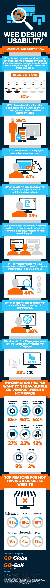

# 十大网页设计可用性统计[信息图]

> 原文:[https://dev . to/asadali/top-10-web-design-usability-statistics-infograph](https://dev.to/asadali/top-10-web-design-usability-statistics-infographic)

迪拜是阿联酋的第二大酋长国，也是该国的一个重要大都市，是一个繁荣的商业和旅游中心。以前，迪拜在利用电子商务的好处方面行动迟缓；但在过去几年中，迪拜对电子商务世界表现出浓厚的兴趣，使阿联酋成为网上购物最繁荣的市场之一。一个好的网页设计对于一个公司通过互联网做广告和销售产品/服务来说是至关重要的。网站的每个功能都很重要——从内容、美学和速度到网站的移动可用性。

统计数据显示，70%的小企业网站经常忽略以简讯、演示或专题等形式添加行动号召。这使得用户与内容的交互最小化。三分之二的用户被网站有趣的内容和视觉上吸引人的设计美感所吸引。然而，速度是网页设计有效性的最终测试，因为研究表明 47%的用户希望他们的页面在 2 秒或更短的时间内加载。结果发现，如果图片无法显示或加载时间过长，39%的用户会放弃该网站。

在这个智能手机占主导地位的技术世界里，85%的网站访问者希望移动网站与桌面网站相当或更好。当涉及到产生流量时，内容的长度也是必要的。结果发现，拥有大约 51-100 个页面的网站比拥有 1-50 个页面的网站多产生 48%的流量。为了使网页对用户友好并具有交互性，在网页上包含联系信息是非常重要的。研究显示，如果没有它，44%的访问者会离开网站。下面由 Go-Gulf 团队设计的[信息图](http://www.go-gulf.ae/blog/web-design-usability/)将帮助您了解更多信息。

[T2】](https://res.cloudinary.com/practicaldev/image/fetch/s--fUwWw9L5--/c_limit%2Cf_auto%2Cfl_progressive%2Cq_auto%2Cw_880/http://www.go-gulf.ae/wp-content/uploads/2016/06/web-design-usability.png)