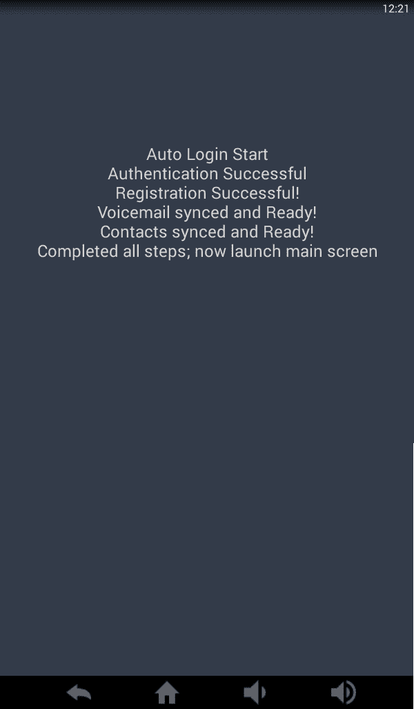

# 使用 MVP 的简洁设计

> 原文:[https://dev.to/subbramanil/clean-design-using-mvp](https://dev.to/subbramanil/clean-design-using-mvp)

# MVP

### 什么是 MVP？

**线索:**它不是 ~~`Most Valuable Player.`~~ 或 [~~`Most Valuable Primate`~~](http://www.imdb.com/title/tt0196106/)

[模型-视图-展示者](https://en.wikipedia.org/wiki/Model%E2%80%93view%E2%80%93presenter)是一种架构设计模式，在 android 应用程序开发社区得到了广泛的关注。

### 为什么要用 MVP？

我不会复制和粘贴 android 的 MVP 设计模式的精彩之处，而是让你跳转到我认为最有用的链接。

> 1.  [MVP understanding](http://engineering.remind.com/android-code-that-scales/)
> 2.  [MVP Guide](https://medium.com/@cervonefrancesco/model-view-presenter-android-guidelines-94970b430ddf)
> 3.  [MVP 第一部分](http://www.tinmegali.com/en/model-view-presenter-android-part-1/)
> 4.  [MVP 第二部分](http://www.tinmegali.com/en/model-view-presenter-mvp-in-android-part-2/)
> 5.  [MVP 第三部分](http://www.tinmegali.com/en/model-view-presenter-mvp-in-android-part-3/)

### 我是怎么入门的？

正如我前面提到的，除了上面提到的链接之外，还有几篇关于 MVP 的文章。在通读了其中几个之后，我意识到 MVP 提供了更干净的实现，因为它通过将 UI 与实际实现分离，包含了**单一责任原则**。此外，我一直面临着为我们的应用程序中与 UI 紧密耦合的一些功能编写单元测试用例的困难。他们不断破坏单元测试用例，我很难调试测试用例。我决定尝试 MVP 设计模式和 sweet，它提供了我所寻找的一切。

> **注:**这只是我在 MVP 设计中的第二次实现。可能有一些概念上的错误或误解。

在我看来，在实施 MVP 之前，你应该问自己的问题是，

1.  我应该使用进度条还是进度轮？
2.  ~~有哪些颜色？~~
3.  对于长时间运行的流程，我应该使用异步任务还是处理程序？
4.  我该怎么办..

不不不不！

相信我！我知道人们很容易思考和沉迷于实现的技术细节。然而，我们必须改变思维。

*   `Think only about purpose of the screen.`
*   `Forget every techincal details involved.`

我选择在我们的应用中重构的功能是**登录和初始启动屏幕**。屏幕的职责是，

1.  用认证微服务登录用户
2.  将设备注册到~~服务器~~，
3.  使用同步服务同步联系人
4.  通过语音邮件同步服务同步用户语音邮件

### 设计模型

当你开始设计*模型*界面时，不要担心技术细节，只关注你想要实现的功能。

这是我开始时的界面草图。

```
interface LoginModel {

    void initLogin();

    void completeLogin();

    void initRegistrationProcess();

    void completeRegistrationProcess();

    void initContactsSync();

    void initVoicemailSync();
} 
```

<svg width="20px" height="20px" viewBox="0 0 24 24" class="highlight-action crayons-icon highlight-action--fullscreen-on"><title>Enter fullscreen mode</title></svg> <svg width="20px" height="20px" viewBox="0 0 24 24" class="highlight-action crayons-icon highlight-action--fullscreen-off"><title>Exit fullscreen mode</title></svg>

由于这些操作可能需要更长的时间来完成，也为了减少依赖性，*模型*接口定义了一个*监听器*接口来传递结果。

```
interface LoginModel {

    interface LoginModelListener {

        void onConfigurationFailure();

        void onLoginSuccess();

        void onLoginFailure();

        void onSyncFailure();
    }

    void initLogin();

    void completeLogin();

    void initRegistrationProcess();

    void completeRegistrationProcess();

    void initContactsSync();

    void initVoicemailSync();
} 
```

<svg width="20px" height="20px" viewBox="0 0 24 24" class="highlight-action crayons-icon highlight-action--fullscreen-on"><title>Enter fullscreen mode</title></svg> <svg width="20px" height="20px" viewBox="0 0 24 24" class="highlight-action crayons-icon highlight-action--fullscreen-off"><title>Exit fullscreen mode</title></svg>

> **注意:**理想情况下，您可以设计*监听器*接口方法，将结果作为参数传递，但是我们在这里只关心操作的结果。

由于模型类只包含功能，不依赖于用户界面，所以很容易编写 *Android 单元测试用例*来验证功能，如下所示，

```
public class LoginModelImplTest implements LoginModel.LoginModelListener {

    private LoginModelImpl mLoginModel;

    @Before
    public void setUp() throws Exception {
        mLoginModel = new LoginModelImpl(this);
    }

    @Test
    public void testLogin() throws Exception {
        // TODO: 5/24/17 Add implementation
    }

    @After
    public void tearDown() throws Exception {

    }

    @Override
    public void onLoginSuccess() {
        // TODO: 5/24/17 Add implementation
    }

    @Override
    public void onLoginFailure() {
        fail();

    }

    @Override
    public void onSyncFailure() {
        // TODO: 5/24/17 Add implementation
    }
} 
```

<svg width="20px" height="20px" viewBox="0 0 24 24" class="highlight-action crayons-icon highlight-action--fullscreen-on"><title>Enter fullscreen mode</title></svg> <svg width="20px" height="20px" viewBox="0 0 24 24" class="highlight-action crayons-icon highlight-action--fullscreen-off"><title>Exit fullscreen mode</title></svg>

现在您有了定义功能的' *Model* '接口和验证功能的单元测试用例类。

### 设计视图

设计视图时，要考虑显示什么信息，而不是如何显示。例如，这里用户感兴趣的信息是，

*   过程中每一步的结果。
*   以防出错的错误。

这些信息可以在任何 UI 元素中显示。

```
interface LoginView {

    void updateStatus(int step, boolean status);

    void showProgress();

    void hideProgress();

    void showError(String errorCode);
} 
```

<svg width="20px" height="20px" viewBox="0 0 24 24" class="highlight-action crayons-icon highlight-action--fullscreen-on"><title>Enter fullscreen mode</title></svg> <svg width="20px" height="20px" viewBox="0 0 24 24" class="highlight-action crayons-icon highlight-action--fullscreen-off"><title>Exit fullscreen mode</title></svg>

注意，这些方法实际上并不关心可以使用的 UI 元素。根据需求，您可以拥有任何不同类型的用户界面。例如，下面是 *LoginView* 的简单实现

[T2】](https://res.cloudinary.com/practicaldev/image/fetch/s--OkFVMT3W--/c_limit%2Cf_auto%2Cfl_progressive%2Cq_auto%2Cw_880/https://s3-us-west-2.amazonaws.com/my-blogresources/r2d22.3.8subbu05262017002156.png)

最简单的实现需要大约 100 行代码，因为实现可以使用任何 UI 视图组件。

### 设计演示者

演示者界面充当视图和模型之间的桥梁。因此，它将拥有调用由模型定义的功能的方法，以及在 UI 生命周期变化时处理数据的方法。

```
interface LoginPresenter {

    // To invoke Model functionalities
    void initLogin();

    void initRegistration();

    void initContactsSync();

    void initVoicemailSync();

    // To track UI lifecycles
    void onCreate();

    void onResume();

    void onPause();

    void onDestroy();
} 
```

<svg width="20px" height="20px" viewBox="0 0 24 24" class="highlight-action crayons-icon highlight-action--fullscreen-on"><title>Enter fullscreen mode</title></svg> <svg width="20px" height="20px" viewBox="0 0 24 24" class="highlight-action crayons-icon highlight-action--fullscreen-off"><title>Exit fullscreen mode</title></svg>

```
class LoginPresenterImpl implements LoginPresenter, LoginModel.LoginModelListener {

    private final LoginView mLoginView;
    private final LoginModel mLoginModel;

    LoginPresenterImpl(LoginView loginView) {
        this.mLoginView = loginView;
        this.mLoginModel = new LoginModelImpl(this);
    }

    ...
} 
```

<svg width="20px" height="20px" viewBox="0 0 24 24" class="highlight-action crayons-icon highlight-action--fullscreen-on"><title>Enter fullscreen mode</title></svg> <svg width="20px" height="20px" viewBox="0 0 24 24" class="highlight-action crayons-icon highlight-action--fullscreen-off"><title>Exit fullscreen mode</title></svg>

请注意，'*演示者*'实现具有，

1.  对模型的引用:用于调用模型中定义的方法
2.  对视图的引用:用于更新 UI
3.  实现监听器接口:从模型获取结果

现在' *Presenter* '的实现变得非常简单。

1.  调用“模型”方法，
2.  使用“监听器”取回结果，
3.  更新“视图”。

```
class LoginPresenterImpl implements LoginPresenter, LoginModel.LoginModelListener {
    ...

    @Override
    public void initLogin() {
        mLoginModel.initLogin();
    }

    @Override
    public void onLoginSuccess() {
        mLoginView.updateStatus(0, true);

        mLoginModel.completeLogin();

        initRegistration();
    }

    @Override
    public void onLoginFailure() {
        mLoginView.updateStatus(0, false);
        mLoginView.showError(ErrorCodes.LOGIN_FAILED);
    }

    @Override
    public void initRegistration() {
        mLoginModel.initRegistrationProcess();
    }

    ...
} 
```

<svg width="20px" height="20px" viewBox="0 0 24 24" class="highlight-action crayons-icon highlight-action--fullscreen-on"><title>Enter fullscreen mode</title></svg> <svg width="20px" height="20px" viewBox="0 0 24 24" class="highlight-action crayons-icon highlight-action--fullscreen-off"><title>Exit fullscreen mode</title></svg>

现在你可以实现功能性的'*模型*'接口，用单元测试用例进行测试。一旦您验证了功能，您就可以绑定演示者并查看。“视图”实现可以像控制台输出一样简单，也可以是复杂的 UI 组件。

我发现这种方法的主要优点是，

1.  当用户界面需求发生变化时，您所要做的就是改变 UI 组件。
2.  当另一个地方需要该功能时，可以通过创建一个实现视图接口的新片段/活动来实现。
3.  如果一个功能从一个改变到另一个，例如。，Couchbase 到 Websockets，只是实现细节的变化；功能保持不变。
4.  进行测试驱动开发是非常容易的。我将写下另一篇关于我使用 MVP 设计模式的 TDD 尝试的博客。简单的步骤是，
    1.  从带有方法的“模型”接口框架开始。
    2.  为这些方法编写单元测试用例。
    3.  实现“模型”接口，一次实现一个方法，并对功能进行单元测试。
    4.  模型课程完成后，连接演示者并观看。

我计划使用 MVP 设计来开发新功能和重构现有功能，并希望更好地理解 MVP 设计模式。如果需要，我会再写一篇后续文章。

> **已知错误** :
> 这篇文章的[中提到的一个指导方针是，不要为*展示者*界面创建生命周期方法。然而，我在其他地方看到的例子使用了某种生命周期方法，在这里使用它们是有意义的。](https://medium.com/@cervonefrancesco/model-view-presenter-android-guidelines-94970b430ddf)