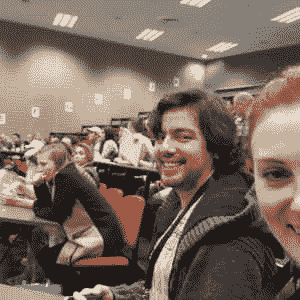

# 创业周末

> 原文:[https://dev.to/darraghor/startup-weekend-17l5](https://dev.to/darraghor/startup-weekend-17l5)

哇，这是奥克兰创业周末后的一周。我有时间理清对整个经历的想法。我学到了很多积极的经验，关于想法验证，关于我自己，关于团队工作。

## 周五晚上

我们在周五晚上开始了这次活动，首先简单介绍了活动的形式和一些主要的组织者。紧接着是 30 个热情的 60 秒推销。有 B2B 服务、锦标赛平台、脸书货币化、食谱和购物的想法。

[T2】](///static/9f8f21b18f9fea1c37a5d559d508bf18/1e164/ab.jpg)

安德烈斯和比利周五晚上

这个问题引起了比利、安德烈斯和我的共鸣，是由斯蒂菲提出的，她谈到了不孕不育以及如何通过简单的教育来减少不孕不育。我很感兴趣，因为我知道一个家庭受到不孕症的影响，这是唯一一个没有立即商业化的想法。

推销结束后，我们去见了 Steffi，问她是否愿意让我们加入她的团队。我们的团队很快就有了从事房地产工作的安迪和营销工作的艾丽。投票结束时，我们有了一个非常全面的团队。

我们在活动中一直呆到周五晚上 1 点，研究这个想法。我们了解了现有的解决方案，并试图找出我们将努力瞄准的庞大人群中的哪一部分。了解这个问题是一个富有成效的夜晚。

## 星期六

我们到了第二天，立即着手设计一个信息网站。导师们强烈质疑我们没有考虑更大的问题。

我们在第一次推销中得到了一些很好的反馈。一位导师警告说，说“进进出出”可能会引起笑声问题——我们会在最后一次推销时把这变成积极的。

关于融资——“如果你第一年只能众筹到 3000 美元，没人会在乎”。在周末之前我没有这样想过，但这是真的。如今 3000 美元根本不算多。

另一位导师说我们应该更加乐观——“除了网站，还有什么能帮助这些人？”。这真的引起了我的共鸣，让我想到一个信息网站不是一个好主意。

我们组开始出现一些问题。桌子周围有消极的攻击性评论，这是一个可怕的环境。我发现很难面对陌生人。这让我意识到在 Trade me 这样一个诚实、直接的工作场所工作是多么的棒。

> 第一课——没时间废话了，要诚实和坦率

周六下午 3 点左右，我对这个信息网站失去了热情。我觉得对它的任何批评都没有被听取，所以我决定利用这段时间学习一些技术，并开始编写 Billie 设计的模板。

> 第二课——提出想法的人不再拥有这个想法，放弃你的计划，让这个想法发展

我们的第二次推销进行得不太顺利，因为我们已经耗尽了精力和热情。评委们叫我们出来，我们都感到很痛苦。我们在晚上 11 点离开，身心俱疲。

周六有一些非常积极的结果。我了解了一般的生育问题，并且我知道我可以和比利一起很好地工作。

## 星期天

我在最后一天开始的时候对整个周末感到有点担心，但是 Steffi 真的愿意改变计划，车队的其他人也很热心。

我们回到基础，在其中一个演讲厅开始了构思会议。我有一些想法，但大多数情况下，我只是坚持那些流传的不太好的想法。我们提出了一系列的想法，但没有为上午的推介确定一个。撕毁每个人的想法真的很难，但我很高兴我做到了，让我们最终到达了目的地。

安迪对我们整个上午所做的事情以及我们的想法进行了精彩的介绍。导师们看到我们的能量回来了，并通过给我们逻辑模型来帮助我们。

我们使用了这种模式，并意识到我们将重点放在年轻人身上会产生更好的影响。我们在外面围着一张桌子，就实际上应该建造什么来回争论。有精子 iOS 游戏和卵子电子鸡创意。经过反复思考，我们想到了一个克隆的十一月——一个没有性生活的月份，并将其命名为无性九月。

我认为这是一个很棒的想法，我觉得我整个早上都很消极，所以在与 Steffi 最后一次争论之后，我没有在 Movember 类型的网站上提供太多信息，我检查了一下，吃了点午餐。

团队再次活跃起来，我很快在 square space 建立了一个 Billie 设计的网站。我很惊讶 squarespace 是如此的棒和简单。

> 第三课——坚持不懈，最终会走到一起的

我们最后还是一起完成了。我们在脸书页面上宣布了这个新网站，到周末时，我们的电子邮件列表中已经有 60 个左右的注册用户了。

Steffi 和 Andy 做了一个令人难以置信的演讲。开始时很沉闷，然后安迪带来了幽默的一面。真正打动我的是观众是我们的目标观众，他们喜欢它。比莉的 t 恤创意很受欢迎。

[T2】](///static/b645386c5c701c30eebddd3b67ca41e2/1e164/finalpitch.jpg)

进行最后一次投球

所以总的来说，这个周末就像过山车一样。它以一个令人惊讶的非盈利项目开始，周六下降很低，周日早上随着我们改变产出的能力而攀升，再次下降，因为我不得不消极地关注产出，最终以一个超级高的价格结束，因为我们到达了那里。

我强烈建议去参加创业周末。它让我看到了产品开发中更多的因素。导师们棒极了。我们的团队很棒，我们要解决的问题也很棒。它组织得非常好。这是一个高压锅，但我走了出来更好。