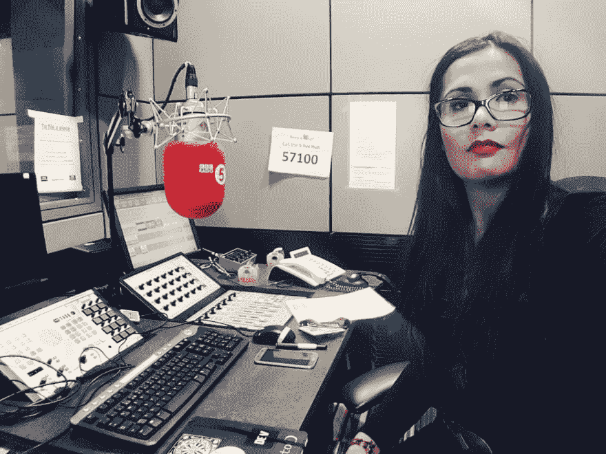
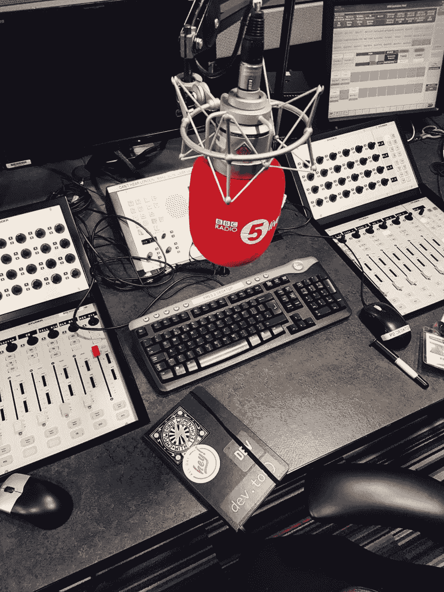

# 我是电视上的技术人员！救我！

> 原文:[https://dev.to/grappleshark/interviews 媒体技术亮相](https://dev.to/grappleshark/interviews--media-appearances-for-techies)

[T2】](https://res.cloudinary.com/practicaldev/image/fetch/s--eaPUgZpD--/c_limit%2Cf_auto%2Cfl_progressive%2Cq_auto%2Cw_880/http://grappleshark.github.io/radio.jpg)

对技术人员的过度刻板印象是相当内向的人，他们宁愿不出现在观众面前，也积极避开聚光灯。上电视或电台的想法就等于用一把钝勺子慢慢剥掉他们的皮。

但是当你真的有足够的勇气与媒体接触时，还是有好处的。如果你想向全世界传达一个信息，你可以站在这个盒子上让别人看到。

当你被媒体联系时，这里有一些提示可以帮助你:

1.  记者们很忙，生活在一个不断变化的世界里，追逐着一个又一个突发新闻。如果你能够理解他们在工作中面临的挑战并适应他们的时间，他们更有可能和你一起工作。你越快回复他们的信息并保持你的时间表的灵活性，你就越有可能成为他们在某些问题上的联系人。

2.  礼貌并不像有些人想的那样昂贵，否则，在媒体工作的人也是人，和每个人一样，欣赏小事。总是问候他们，并以一句谢谢结束面试。你的举止不仅会被记者理解，也会被观众理解。

3.  乐于助人
    在面试之前，尽快提供以下信息，帮助他们准备工作。

    *   你的名字
    *   你的职位
    *   你的公司还是你工作的公司
    *   视频/照片，如果视觉辅助工具有助于解释你想表达的意思
    *   关于主题的事实和你可能感兴趣的任何其他材料。他们可能不会使用它，但你已经帮助他们深入研究了通常超出他们舒适区的话题。
4.  将行话保持在最低限度
    这是显而易见的，在科技行业工作时，你确实会经常听到这种说法。你需要能够与不精通专业术语的人交谈。你在小众领域工作，但是如果你的信息需要传播给更广泛的受众，你需要会说他们的语言。

5.  保持有趣！向你的目标受众适当地提取信息。他们在找什么？兴趣不一定在于所有的具体细节，这些细节可能超出了大多数听众的理解范围。意识到这一点，他们就不太可能忽视你。

6.  建立融洽的关系
    与媒体合作对你来说可能很少见，但对记者来说，这是他们的工作。如果你能找到一种方法帮助他们享受工作，那就更好了！他们将期待与你再次合作。

7.  避免死气沉沉的广播对记者来说，最糟糕的事情莫过于在直播时你用尴尬的沉默来回答他们的问题。不惜一切代价避免这种情况。事先准备好你的答案，准备好回答你认为他们可能会问的问题。在摄像机开始拍摄之前，有必要问一下，他们的第一个问题是什么，以帮助你开始拍摄。如果你被困在可怕的亲爱的空气中，他们也会试图帮助你走出这个洞，所以抓住这只援助之手，不要放手。

8.  F***假新闻
    核对你的事实。避免传播不正确的信息，只是因为它听起来很有趣。它会像野火一样蔓延，你会受到那些知情人的批评。这只会损害你的声誉和你试图传达的信息。

9.  不要说谎
    这真的不应该说，但就像最后一点，人们是好奇的动物。你会被发现的。

10.  不是很多人有机会在媒体面前谈论他们的激情。保持谦逊。心存感激。享受这一刻！

[T2】](https://res.cloudinary.com/practicaldev/image/fetch/s--3wAY9_OH--/c_limit%2Cf_auto%2Cfl_progressive%2Cq_auto%2Cw_880/http://grappleshark.github.io/devtostickers.jpg)