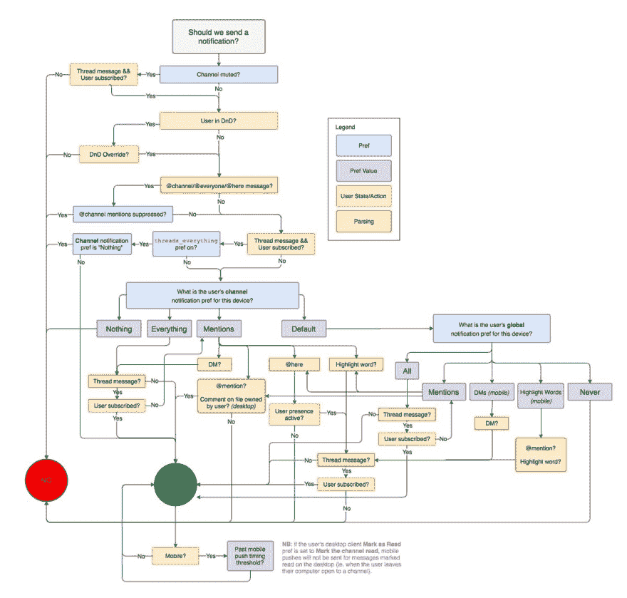

# 创建流程图和其他可视化工具来记录应用程序逻辑的最佳软件是什么？

> 原文：<https://dev.to/walker/whats-the-best-software-for-creating-flowcharts-and-other-visuals-to-document-application-logic>

我希望创建一些流程图，但我只知道像 PowerPoint 或 Keynote 显而易见的解决方案。有人有什么建议吗？

下面是一个相当复杂的流程图示例，通过 Slack:

[T2】](https://res.cloudinary.com/practicaldev/image/fetch/s--v2_IFj6---/c_limit%2Cf_auto%2Cfl_progressive%2Cq_auto%2Cw_880/https://pbs.twimg.com/media/C6A7smLUsAAzJeS.jpg)