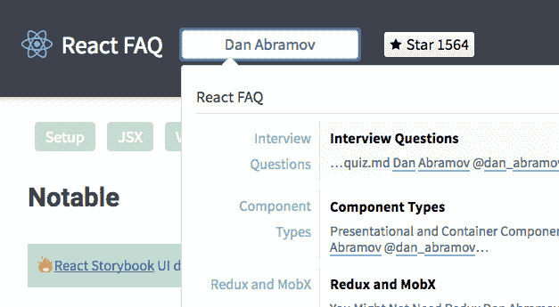

# 建筑反应常见问题

> 原文:[https://dev.to/timarney_80/react-faq](https://dev.to/timarney_80/react-faq)

如果你像我一样，很难跟踪你读过的关于 React 的所有视频和帖子。外面有很多信息，但是到处都是。

有人会问一个关于反应的问题，我会想。

> 我记得在ðÿ的某个地方看到过一个帖子“或者是在推特上？

Git repo 中最初的几个链接已经成为一个完全可搜索的静态网站 [React FAQ](https://reactfaq.site) 下面是它是如何发生的。

## 这是从一个问题开始的

这是从 [@wesbos](https://dev.to/wesbos) 开始的问题

> 将我的 React 字符串引用移到函数中，尽管我不明白为什么这样更好。有人吗？[pic.twitter.com/KoXJOvOniL](https://t.co/KoXJOvOniL)
> 
> — Wes Bos ([@wesbos](https://dev.to/wesbos) ) [August 23, 2016](https://twitter.com/wesbos/status/768094572144631808)

在这种情况下，我想起了一个资源并做出了响应。

> [@维斯博斯](https://twitter.com/wesbos)[@ _ develop it](https://twitter.com/_developit)[@ Dan _ abra mov](https://twitter.com/dan_abramov)前阵子发了这个[https://t.co/8g449GgE2A](https://t.co/8g449GgE2A)
> 
> — tim arney ([@timarney](https://dev.to/timarney) ) [August 23, 2016](https://twitter.com/timarney/status/768097947334606848)

我经常将这些推文作为一种方式来标记它们以供以后参考。这看起来是个好主意，但是要梳理成千上万的*【喜欢】*等等...并不好。

我必须找到一种更好的方法来跟踪资源，这种方法需要很少的维护工作并且易于跟踪。

> 也许带有一些链接的旧的可信赖的自述文件可以解决这个问题...也许其他人也会发现它很有帮助。

## 我们来验证一下

> [@timarney](https://twitter.com/timarney) 哦请吧！你不知道我收到多少关于这类事情的邮件和问题。严肃-会非常有帮助
> 
> — Wes Bos ([@wesbos](https://dev.to/wesbos) ) [August 23, 2016](https://twitter.com/wesbos/status/768104881467035648)

这就是我需要的所有证明。

所以我启动了一个[链接 repo](https://github.com/timarney/react-faq/commit/92503d37097ca85e737f77ea2ed0a9ed2ef2a0d6) 来收集一个简单的 Readme.md 文件中的资源。**三通总**到了那个点。

随着时间的推移，这个列表变得越来越难以管理。我把回购分成几页。这是一个不错的下一步，但仍然不理想(很难搜索)。

## 使其静止

听 JAMstack 电台让我对静态网站感兴趣。React FAQ 似乎是一个使用静态站点生成器的好地方。我最终选择了[盖茨比](https://github.com/gatsbyjs/gatsby)。鉴于我已经把回购协议分成几页，把东西移植到盖茨比身上是非常容易的。这个网站大部分是用 Markdown 写的。Gatsby 支持 Markdown、HTML 和 React.js 开箱即用。

## 托管

对于托管来说，Netlify 是一个简单的选择，它对开源软件是免费的。当我推送到 repo 时，Netlify 自动部署，所以更新是不痛不痒的(就像更新原始自述文件一样容易)。

> 收到来自 [@Netlify](https://twitter.com/Netlify) 的邮件...“奇怪我没有推动任何变化”。我后来注意到回购有一个公关，这是预览ðÿ"—
> ðÿ˜[pic.twitter.com/uLUuNsiwHm](https://t.co/uLUuNsiwHm)
> 
> — tim arney ([@timarney](https://dev.to/timarney) ) [March 30, 2017](https://twitter.com/timarney/status/847519263707533312)

## 搜索

最后一部分，对我来说最重要的是让它可以被搜索到。我开始尝试连接一个自定义的 Algolia 搜索。我可能会回头考虑这个想法，但鉴于我只有有限的时间投入到这个项目中，这个想法没有实现。

> 有人试过把 [@gatsbyjs](https://twitter.com/gatsbyjs) 和 [@algolia](https://twitter.com/algolia) 勾搭上吗？【https://t.co/oz6sCZ2KXB】的
> 可能会重新利用这个[的](https://t.co/oz6sCZ2KXB)降价文件。[https://t.co/UKEGXvO1t1](https://t.co/UKEGXvO1t1)T10】pic.twitter.com/JfOXLJsH32
> 
> — tim arney ([@timarney](https://dev.to/timarney) ) [February 28, 2017](https://twitter.com/timarney/status/836576908720635904)

结局好的一切都好。原来有一个很棒的服务叫做 Algolia 的 [DocSearch](https://community.algolia.com/docsearch) 。支持 React Docs 的相同搜索。只需添加几个脚本标签，完成ðÿž‰.

[T2】](https://res.cloudinary.com/practicaldev/image/fetch/s--mwb0Zkon--/c_limit%2Cf_auto%2Cfl_progressive%2Cq_auto%2Cw_880/https://thepracticaldev.s3.amazonaws.com/i/yxxwybf3ygm1w0s6zv0t.png)

## 任务完成

不再到处搜寻资源。从 Readme.md 到有趣的小项目[看看吧](https://reactfaq.site)让我知道你的想法。

有什么要补充的吗？选择一个[合适的页面](https://github.com/timarney/react-faq/tree/master/pages)添加资源并提交 PR...会喜欢更多的贡献者。