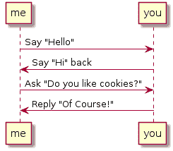

# plantuml -绘制带文本的图片

> 原文:[https://dev.to/gabeguz/plantuml-图文并茂的图画](https://dev.to/gabeguz/plantuml---drawing-pictures-with-text)

最近工作中有人向我推荐了 [PlantUML](http://plantuml.com/) ，这是一个非常简洁的工具，它提供了一个简单的文本描述:

```
me -> you: Say "Hello"
you ->me: Say "Hi" back
me -> you: Ask "Do you like cookies?"
you -> me: Reply "Of Course!" 
```

<svg width="20px" height="20px" viewBox="0 0 24 24" class="highlight-action crayons-icon highlight-action--fullscreen-on"><title>Enter fullscreen mode</title></svg> <svg width="20px" height="20px" viewBox="0 0 24 24" class="highlight-action crayons-icon highlight-action--fullscreen-off"><title>Exit fullscreen mode</title></svg>

并把它变成一个好看的图，像这样:
[](https://res.cloudinary.com/practicaldev/image/fetch/s--XVk68k3R--/c_limit%2Cf_auto%2Cfl_progressive%2Cq_auto%2Cw_880/https://i.imgbox.com/WpOXbv2m.png)

它支持广泛的 UML 和非 UML 图(顺序、类、状态、对象等),并且以文本形式非常容易阅读。

这比进入 google draw，制作盒子，然后画箭头，把所有东西排起来要容易得多。只要改变你的文本文件，然后重新渲染你的图像，你就可以了。我一直用这个来建模工作中的各种东西，我想我再也不会回去了！

PlantUML 是开源的，它集成了很多你可能已经使用过的工具(见:[plantuml.com/running](http://plantuml.com/running))。