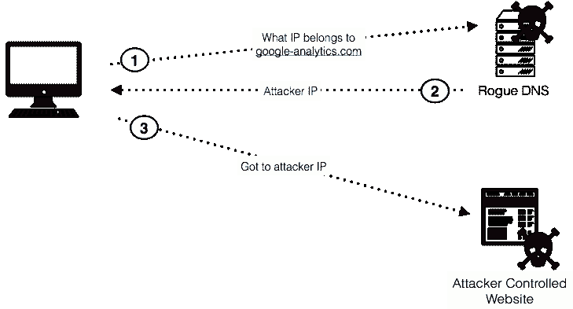

# 永远不要忘记更改您的默认路由器密码

> 原文:[https://dev . to/svijaykousik/never-forget-to-change-your-default-router-password-6e 6](https://dev.to/svijaykoushik/never-forget-to-change-your-default-router-password-6e6)

两年前的一个晴朗的早晨，我打开电脑查看电子邮件。我开始在谷歌上搜索工作机会，并打开谷歌带来的每个结果。现在，一件奇怪的事情发生了！每当我试图与从结果页面打开的网站互动时，就会有一个弹出广告打开。我以为我禁用了广告拦截器插件，但它是启用的。我开始想知道发生了什么事。然后我访问了我曾经访问过的每个网页，同样的事情发生了。每次我点击一个元素，就会弹出一个广告。这让我很沮丧，所以我关闭了浏览器，开始对我的电脑进行全面的病毒扫描，然后开始在我的手机上浏览。但是唉！同样的事情也发生了。这一次，每当我试图在手机上滚动一页，它就开始重定向到一个广告。我觉得有些不对劲，于是我开始检查我网络上的所有设备，结果都一样。这时候我可以猜到我的调制解调器出了问题。在这个问题中，谷歌和脸书表现良好。没有恼人的弹出窗口(感谢上帝！).我摆弄着我电脑上的网络配置。我打开命令提示符，键入命令 *ipconfig* ，我注意到屏幕上显示的结果有些不寻常。

> 以太网适配器以太网:
> 
> 特定于连接的 DNS 后缀。:
> 
> IPv4 地址。。。。。。。。。。。:192.168.1.5
> 子网掩码。。。。。。。。。。。:255.255.255.0
> 默认网关。。。。。。。。。: 213.109.79.255

默认网关地址不是调制解调器的 IP 地址。我在谷歌上对这个不寻常的 IP 进行了快速搜索，我发现这是一个“rouge dns”服务器的地址，我是 *DNS 劫持*的受害者。在进一步研究了 dns 劫持后，我非常努力地忽略弹出广告，我知道这是由一个叫做 *DNS 改变者*的恶意软件做的。那一刻，我后悔了，每次当我的电脑警告我安装来自未知发行商的软件时，我都会点击忽略按钮。

## DNS 被劫持

 广告如何嵌入网站的一个例子

在进一步阅读关于 DNS 改变恶意软件，我了解了它的工作程序。恶意软件利用了我的调制解调器的漏洞。它使用默认的访问凭证进入我的调制解调器设置，并将 dns 地址更改为一个假冒的 dns。我从来没有更改过盒子里的用户名:admin 和密码:admin 的通用凭证，因为这很容易记住。另一个我忽略的警告。现在，恶意软件改变了 dns 设置，我所有的互联网流量都被发送到一个恶意的 dns，而不是我的 ISP 的 DNS。rouge dns 监控着我访问的所有网站，我的电子邮件账户和密码。

维基百科说

> DNS 劫持或 DNS 重定向是指破坏域名系统(DNS)查询解析的行为。这可以通过恶意软件来实现，该恶意软件覆盖计算机的 TCP/IP 配置，指向攻击者控制下的流氓 DNS 服务器，或者通过修改受信任的 DNS 服务器的行为，使其不符合互联网标准。在我的例子中，rouge 服务器读取了我的所有查询，并在响应中附加了一个*脚本*，每当我与我想访问的任何网站进行交互时，它都会打开一个广告弹出窗口。很残忍吧？这样黑客就可以为我被迫访问的广告赚钱。我花了几乎半天时间试图理解这个问题，现在我急切地想找到解决问题的办法。

## Opendns 来拯救

在网上冲浪大约半小时后，有人建议我做两件事:

1.  要更改我的调制解调器的访问凭证，工厂提供了一个。
2.  要将我调制解调器中的 dns 设置从自动更改为安全的静态 dns，请使用[谷歌公共 DNS](https://developers.google.com/speed/public-dns/) 或 [Opendns](https://www.opendns.com/) 。前者是强烈推荐的，后者是可选的。谷歌公共域名系统提供了更快的网页访问速度和抵御各种攻击的安全性(更多关于这个[在这里](https://developers.google.com/speed/public-dns/docs/intro))。但是，Opendns 以及看似更快的互联网接入和安全性也提供了网页过滤选项(更多信息请点击[这里](https://www.opendns.com/home-internet-security/))，这让我选择了 Opendns 作为我的网络。

然后，我更改了调制解调器的密码，这引发了我所有的问题(我建议您在密码中包含数字和符号以增加安全性)。现在，一切都很好，我永远不会忘记他的事故。如果您认为您仍在使用调制解调器/路由器的默认用户名和密码，请立即更改。

随机引用

> 你不能对人性失去信心。人性是海洋；如果海洋的几滴水是脏的，海洋不会变脏。——<cite>圣雄甘地</cite>

由[Sentrant.com](https://sentrant.com/)拍摄的照片和由[维基共享资源](https://commons.wikimedia.org/)拍摄的标题照片。