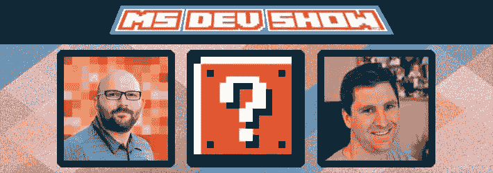
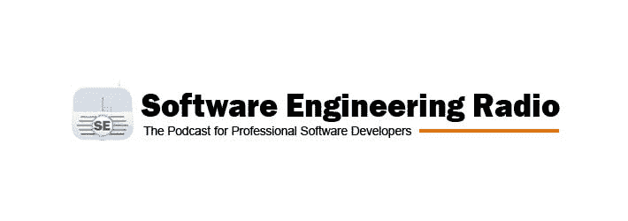
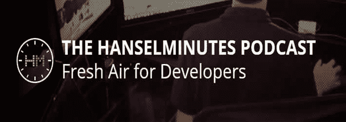

# 伟大的开发者播客为您的通勤

> 原文:[https://dev . to/rion monster/great-developer-podcast-for-your-commute](https://dev.to/rionmonster/great-developer-podcasts-for-your-commute)

*这篇文章最初发表在[我的博客](http://rion.io)上。*

我很幸运地生活在一个相对较小的城市，通勤时间一般不会超过 15-20 分钟。然而，几年前我开始听播客来更积极地填补交通堵塞时的噪音空白。我发现他们经常能让你对不同的方法敞开心扉，或者教你一些新的东西(而且用现在收音机里播放的垃圾音乐，他们甚至可能听起来更好)。

播客虽然不能取代与开发者的实际互动，但如果你离得太远而无法参加会议或用户组会议，它可以成为学习新事物的好方法。

这些播客只是我(作为一个. NET 人)喜欢听的一些开发播客，并且通常推荐给其他人。你的口味可能会有所不同。

[T2】](https://res.cloudinary.com/practicaldev/image/fetch/s--yXAsuB6h--/c_limit%2Cf_auto%2Cfl_progressive%2Cq_auto%2Cw_880/http://i.imgur.com/R1nVtAv.jpg)

## 编码块

如果有单个开发播客可以听的话，[编码块](https://dev.to/codingblocks)就是它了。标语可能会提到。NET，这涵盖了广泛的主题，实际上是在谈论代码，而不是像其他许多人那样简单地回避问题，偏离主题。

艾伦、[乔](https://twitter.com/THEjoezack)和[迈克尔](https://twitter.com/iamwaltuo)之间有着很强的化学反应，他们的对话可能经常与你想象中与自己同事的对话相似。他们制作的一些流行系列包括:

*   对四人帮设计模式一书的深入评论，包括现代用例及例子。
*   作为一名开发人员提高自己(从初级到高级)，以及如何准备技术面试以获得理想的工作。
*   一章一章的讨论干净的代码以及它如何应用于当今世界。

如果谈话还不够，他们在 Slack 上有一个令人难以置信的社区，有超过 1000 名成员，你可以成为其中的一员。此外，如果你不在车里，只需[浏览他们的 YouTube 频道](https://www.youtube.com/user/codingblocks)，那里有他们以前的所有剧集。

说真的，看看这个。

[T2】](https://res.cloudinary.com/practicaldev/image/fetch/s--53hjsGO7--/c_limit%2Cf_auto%2Cfl_progressive%2Cq_auto%2Cw_880/http://i.imgur.com/sOuk7C8.jpg)

## MS 开发显示

另一个很棒的开发者播客。NET /微软生态系统被恰当地命名为[微软开发秀](https://dev.to/msdevshow)。话题范围从。NET、Visual Studio、Azure、Windows 等等。

主持人[卡尔](https://twitter.com/carlschweitzer)和[杰森](https://twitter.com/ytechie)都是精力充沛、知识渊博的家伙，总能与各种嘉宾主持人引发引人入胜的对话。YouTube 上有超过 130 集的，一定会有你感兴趣的东西。

[T2】](https://res.cloudinary.com/practicaldev/image/fetch/s--icY7w2AT--/c_limit%2Cf_auto%2Cfl_progressive%2Cq_auto%2Cw_880/http://i.imgur.com/EBwMQJ1.jpg)

## [T1。网状岩石](#net-rocks)

变化是生活的调味品。里奇和卡尔在[。网石](https://www.dotnetrocks.com/)似乎知道这是他们的长跑。NET Rocks 播客有近 1，400 集，涵盖了广泛的开发(和非开发主题)。

该节目从来没有真正深入到任何特定的主题，而是提供了一个“调查课程”式的介绍。客人们总是很有趣，虽然谈话经常会偏离轨道，但这仍然是一次娱乐性的、经常是知识性的倾听。

特别有趣的是“Geek Out”系列节目，Rich 在其中深入研究了一个给定的主题(如太空旅行、钍反应堆、威士忌，你能想到的)，并就此发表了演讲。它们从严格的开发谈话中提供了一个有趣的突破口，可能会给你一些聚会上的话题。

[T2】](https://res.cloudinary.com/practicaldev/image/fetch/s--zbLarILB--/c_limit%2Cf_auto%2Cfl_progressive%2Cq_auto%2Cw_880/http://i.imgur.com/12coLr9.jpg)

## 软件工程无线电

软件工程广播虽然信息丰富，但可能并不适合所有人，因为它通常具有很强的学术性。但我鼓励人们尝试一下，因为它经常包含有价值和有趣的讨论。

它更侧重于作为一个教育资源，而不是一个有趣的新闻广播，它的目标是通知和教育专业软件开发人员。有近 300 集，你可能想搜索他们的档案，看看你是否能找到一个让你感兴趣的话题，并听一听。

[T2】](https://res.cloudinary.com/practicaldev/image/fetch/s--VyPfkyp5--/c_limit%2Cf_auto%2Cfl_progressive%2Cq_auto%2Cw_880/http://i.imgur.com/qXFWknP.jpg)

## 分钟

几乎每个人都知道斯科特·汉瑟曼。NET 开发者。如果你是这些人中的一员，那么你可能想听听他的 [Hanselminutes](https://dev.to/hanselminutes) 播客。

播客通常非常简短(30-45m)，由 Scott 和一位客人就开发领域的特定技术或问题进行聊天组成。Scott 总是一个有趣的家伙，他总是带着经常导致比代码更深入的讨论的问题而来。

[T2】](https://res.cloudinary.com/practicaldev/image/fetch/s--c3kcHtoq--/c_limit%2Cf_auto%2Cfl_progressive%2Cq_auto%2Cw_880/http://i.imgur.com/PdO72eB.jpg)

## 合并冲突

[合并冲突](http://www.mergeconflict.fm/)是关于技术、网络开发和其他各种好处的讨论。它由微软的 Xamarin 超级英雄、[詹姆士·蒙特马格诺](https://twitter.com/JamesMontemagno)和[弗兰克·克鲁格](https://twitter.com/praeclarum)主持，经常像早晨的一杯咖啡一样充满活力。

虽然这些话题通常集中在 web 开发的所有方面，但他们的“闪电谈话”非常有趣，因为 James 和 Frank 试图在 30 分钟内解决 5 个不同的话题。