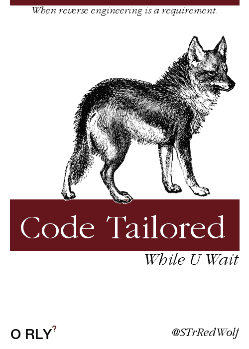

# 一团混乱的介绍。

> 原文：<https://dev.to/strredwolf/a-fuzzball-of-an-introduction>

[T2】](https://res.cloudinary.com/practicaldev/image/fetch/s--NM91tUrW--/c_limit%2Cf_auto%2Cfl_progressive%2Cq_auto%2Cw_880/https://thepracticaldev.s3.amazonaws.com/i/9v4lu0pavjlr83gkna6d.png)

我能说什么呢...良好的...我已经用各种语言(C，Basic 的多种方言，C++，Perl，PHP，Python，Informix 4GL，bash)编程超过 30 年了。慢慢地，我在我的 GitHub repo 上抛出一些代码。

不过，主要是，我是一个多面手程序员。把某个项目交给我，我会研究并完成它。我喜欢我的编程语言将整数 0 解析为假，并且我的代码格式良好而紧凑。

我在 [Edge Hosting，LLC](http://edgehosting.com) 工作，每天乘坐[马克列车](http://mta.maryland.gov)进入巴尔的摩。在那里，我主要写 C#和 Python。

很多事我都不知道，但是戴夫。To 对这里和家里的一些编码非常有用。另外,“书”也很有用。YA RLY！).

为了名字和头像 pog？嗯，这是一段历史，以后可能会被披露...