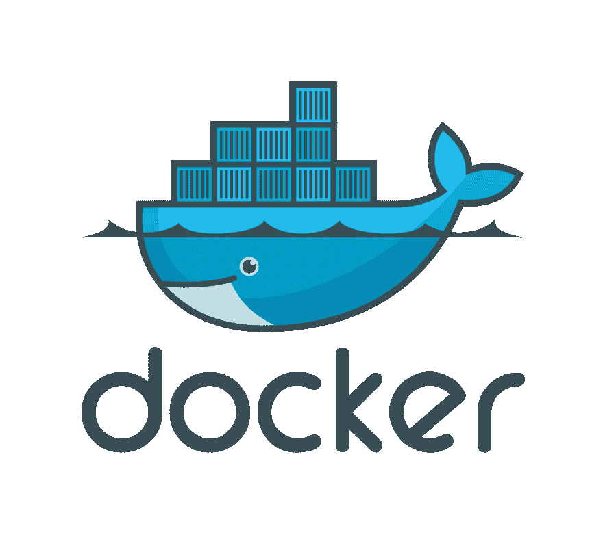

# 高效 Docker 开发环境的简短指南

> 原文:[https://dev . to/nbrempel/a-short-guide-to-a-super-productive-docker-development-environment-4275](https://dev.to/nbrempel/a-short-guide-to-a-super-productive-docker-development-environment-4275)

如果你曾经做过大型软件，我敢肯定你已经忍受了建立复杂开发环境的痛苦。安装和配置数据库、消息代理、web 服务器、工作进程、本地 smtp 服务器(谁知道还有什么！)对于每个开始一个项目的开发人员来说都是非常耗时的。本指南将向您展示如何建立一个 docker 开发环境，这将使您和新开发人员能够在几分钟内开始使用甚至是最复杂的系统。从长远来看，这将使您的生活更加轻松，并让新的开发人员更快地开始并运行项目。

在本指南中，我们将使用 [Docker 社区版](https://www.docker.com/community-edition)和 [Docker 撰写](https://docs.docker.com/compose/)。在继续之前，您可能需要对这些工具有所了解。

指南的代码可在[这里](https://github.com/nrempel/docker-development-environment)获得。

[T2】](https://res.cloudinary.com/practicaldev/image/fetch/s--nzzqowlu--/c_limit%2Cf_auto%2Cfl_progressive%2Cq_auto%2Cw_880/https://nrempel.com/docker.png)

## 安装对接器

点击获取你的操作系统的 Docker[。Docker 适用于所有现代操作系统。对于大多数用户来说，这也包括 Docker Compose。一旦安装，保持 Docker 运行在后台使用 Docker 命令！](https://store.docker.com/search?type=edition&offering=community)

## Dockerfile 示例

您的 [Dockerfile](https://docs.docker.com/engine/reference/builder/) 是您的容器的蓝图。您将需要使用 docker 文件来创建您想要的环境。这包括安装您可能需要的任何语言运行时，以及安装您的项目所依赖的任何依赖项。幸运的是，大多数语言都有一个可以继承的[基础映像](https://docs.docker.com/engine/reference/builder/#from)。我们将通过下面的 Dockerfile 示例对此进行深入探讨。

您的 other 文件不需要包含任何安装数据库、缓存服务器或其他工具的说明。每个容器都应该围绕一个单一流程来构建。其他进程通常会在其他 docker 文件中定义，但您甚至不需要担心这一点；在这个例子中，我们为数据库和消息代理使用了 3 个现成的容器。

### Dockerfile

```
# Inherit from node base image
FROM node

# This is an alternative to mounting our source code as a volume.
# ADD . /app

# Install Yarn repository
RUN curl -sS http://dl.yarnpkg.com/debian/pubkey.gpg | apt-key add -
RUN echo "deb http://dl.yarnpkg.com/debian/ stable main" | tee /etc/apt/sources.list.d/yarn.list

# Install OS dependencies
RUN apt-get update
RUN apt-get install yarn

# Install Node dependencies
RUN yarn install 
```

<svg width="20px" height="20px" viewBox="0 0 24 24" class="highlight-action crayons-icon highlight-action--fullscreen-on"><title>Enter fullscreen mode</title></svg> <svg width="20px" height="20px" viewBox="0 0 24 24" class="highlight-action crayons-icon highlight-action--fullscreen-off"><title>Exit fullscreen mode</title></svg>

上面的 Dockerfile 做了几件事:首先，我们从[节点](https://store.docker.cimg/node)基础映像继承。这意味着它包括来自那个映像的 Dockerfile 的[指令(包括它继承的任何基础映像)。其次，我安装了](https://github.com/nodejs/docker-node/blob/581eebd097343c9f1c1ceb5260cd2ec770410e29/7.10/Dockerfile) [Yarn](https://yarnpkg.com) 包管理器，因为我更喜欢它而不是默认的 NodeJs 包管理器。注意，虽然我在这里首选的语言是 NodeJs，但本指南是独立于语言的。为您喜欢使用的任何语言运行时设置容器。

试一试，运行`docker-compose build`看看会发生什么。

## Docker 撰写示例

前几节，我提到了 Docker Compose，它是一个声明式定义容器结构的工具。这意味着您可以定义多个不同的流程类型，它们都在不同的容器中并发运行，并通过 http 相互通信。Docker 通过使用他们所谓的[链接](https://docs.docker.com/docker-cloud/apps/service-links/)，使得容器之间的接口公开变得更加容易。这里的美妙之处在于，它就像在一台机器上处理多个进程一样简单，但是您可以确保没有任何紧密耦合的组件可能无法在生产环境中工作！

### 码头工-化合物. yml

```
version: '3'
services:
  ###############################
  # Built from local Dockerfile #
  ###############################
  web:
    # Build the Dockerfile in this directory.
    build: .
    # Mount this directory as a volume at /app
    volumes:
      - '.:/app'
    # Make all commands relative to our application directory
    working_dir: /app
    # The process that runs in the container.
    # Remeber, a container runs only ONE process.
    command: 'node  server.js'
    # Set some environment variables to be used in the application
    environment:
      PORT: 8080
      # Notice the hostname postgres.
      # This is made available via container links.
      DATABASE_URL: 'postgres://postgres:@postgres:5432/postgres'
      REDIS_URL: 'redis://redis:6379'
      RABBIT_URL: 'amqp://rabbitmq'
    # Make the port available on the host machine
    # so that we can navigate there with our web browser.
    ports:
      - '8080:8080'
    # Link this container to other containers to create
    # a network interface.
    links:
      - postgres
      - redis
      - rabbitmq

  clock:
    build: .
    volumes:
      - '.:/app'
    working_dir: /app
    command: 'node  clock.js'
    environment:
      DATABASE_URL: 'postgres://postgres:@postgres:5432/postgres'
      REDIS_URL: 'redis://redis:6379'
      RABBIT_URL: 'amqp://rabbitmq'
    links:
      - postgres
      - redis
      - rabbitmq

  worker:
    build: .
    volumes:
      - '.:/app'
    working_dir: /app
    command: 'node  worker.js'
    environment:
      DATABASE_URL: 'postgres://postgres:@postgres:5432/postgres'
      REDIS_URL: 'redis://redis:6379'
      RABBIT_URL: 'amqp://rabbitmq'
    links:
      - postgres
      - redis
      - rabbitmq

  shell:
    build: .
    volumes:
      - '.:/app'
    working_dir: /app
    command: bash
    environment:
      DATABASE_URL: 'postgres://postgres:@postgres:5432/postgres'
      REDIS_URL: 'redis://redis:6379'
    ports:
      - '8080:8080'
    links:
      - postgres
      - redis
      - rabbitmq

  ############################
  # Built from remote images #
  ############################
  postgres:
    # Image name
    image: postgres
    # Expose the port on your local machine.
    # This is not needed to link containers.
    # BUT, it is handy for connecting to your
    # database with something like DataGrip from
    # you local host machine.
    ports:
      - '5432:5432'

  rabbitmq:
    image: rabbitmq
    ports:
      - '5672:5672'

  redis:
    image: redis
    ports:
      - '6379:6379' 
```

<svg width="20px" height="20px" viewBox="0 0 24 24" class="highlight-action crayons-icon highlight-action--fullscreen-on"><title>Enter fullscreen mode</title></svg> <svg width="20px" height="20px" viewBox="0 0 24 24" class="highlight-action crayons-icon highlight-action--fullscreen-off"><title>Exit fullscreen mode</title></svg>

让我们看一下这个例子:

我们的编队中有 7 个不同的容器: *web* 、 *clock* 、 *worker* 、 *shell* 、 *postgres* 、 *rabbitmq* 和 *redis* 。太多了！在生产环境中，这些流程可能分别运行在不同的物理服务器上；或者，这些进程都可以在一台机器上运行。

注意 web、clock、worker 和 shell 容器都是如何从当前目录构建的。所以这 4 个进程都运行在 docker 文件中定义的容器上。另一方面，postgres、rabbitmq 和 redis 容器是从预构建的映像构建的，这些映像可以在 [Docker Store](https://store.docker.com/) 上找到。从映像为这些工具构建容器比在本地机器上安装每个工具要快得多。

看一下`volumes`键。在这里，我们在`/app`挂载了当前目录。然后`working_dir`键表示所有命令都相对于这个目录运行。

好的。现在，看一看本地制造的集装箱上的`links`键。这暴露了该容器和列出的容器之间的网络接口。注意我们如何在环境变量中使用链接的名称作为主机名。在本例中，我们链接容器，然后将每个链接服务的 uri 作为环境变量公开。

尝试运行其中一个服务:运行命令`docker-compose up web`。

## 编写你的应用程序代码

好的，我们的服务器架构包括 3 种运行应用程序代码的进程类型；我们有自己的 web 进程，负责处理 web 请求并将工作推送到作业队列；我们有工人进程，负责将作业从队列中拉出并完成工作；我们的时钟进程实际上是一个 cron runner，它将工作推到我们的作业队列中。

我们的架构还包括 web 服务器架构中常见的 3 个其他服务:Postgres 数据库、Redis 数据存储和 RabbitMQ 消息代理。

下面是上述 3 个流程的最小实现，它也展示了我们 3 个数据后端的使用情况:

### clock.js

```
const SimpleCron = require("simple-cron");
const cron = new SimpleCron();
const amqp = require("amqplib/callback_api");

cron.schedule("* * * * *", () => {
  amqp.connect(process.env.RABBIT_URL, (err, conn) => {
    conn.createChannel((err, ch) => {
      const q = "clock";
      ch.assertQueue(q, { durable: false });
      ch.sendToQueue(q, Buffer.from("hi."));
    });
    console.log("Queuing new job!");
  });
});

cron.run(); 
```

<svg width="20px" height="20px" viewBox="0 0 24 24" class="highlight-action crayons-icon highlight-action--fullscreen-on"><title>Enter fullscreen mode</title></svg> <svg width="20px" height="20px" viewBox="0 0 24 24" class="highlight-action crayons-icon highlight-action--fullscreen-off"><title>Exit fullscreen mode</title></svg>

### server.js

```
const express = require("express");
const pg = require("pg");
const redis = require("redis");
const amqp = require("amqplib/callback_api");
const app = express();

app.get("/", (req, res) => {
  res.send("Hello World!");
});

// Test Postgres connection
app.get("/postgres/:blurb", (req, res) => {
  const ip = req.connection.remoteAddress;
  const db = new pg.Pool({ connectionString: process.env.DATABASE_URL });
  db.connect((err, client, done) => {
    client.query(
      'create table if not exists "blurbs" ("id" serial primary key, "text" varchar(255))',
      (err, result) => {
        client.query(
          'insert into "blurbs" ("text") values ($1)',
          [req.params.blurb],
          (err, result) => {
            client.query('select * from "blurbs"', (err, result) => {
              const blurbs = result.rows.map(o => o.text);
              res.send(`List of blurbs:\n${blurbs.join("  ")}`);
              client.end();
              done();
            });
          }
        );
      }
    );
  });
});

// Test Redis connection
app.get("/redis", (req, res) => {
  const client = redis.createClient(process.env.REDIS_URL);
  client.incr("count", (err, reply) => {
    res.send(`Request count: ${reply}`);
  });
});

// Test RabbitMQ connection
app.get("/rabbit/:msg", (req, res) => {
  amqp.connect(process.env.RABBIT_URL, (err, conn) => {
    conn.createChannel((err, ch) => {
      const q = "web";
      ch.assertQueue(q, { durable: false });
      ch.sendToQueue(q, Buffer.from(req.params.msg));
    });
    res.send("Message sent to worker process; check your terminal!");
  });
});

app.listen(process.env.PORT, () => {
  console.log(`Example app listening on port ${process.env.PORT}!`);
}); 
```

<svg width="20px" height="20px" viewBox="0 0 24 24" class="highlight-action crayons-icon highlight-action--fullscreen-on"><title>Enter fullscreen mode</title></svg> <svg width="20px" height="20px" viewBox="0 0 24 24" class="highlight-action crayons-icon highlight-action--fullscreen-off"><title>Exit fullscreen mode</title></svg>

### worker.js

```
const amqp = require("amqplib/callback_api");

amqp.connect(process.env.RABBIT_URL, (err, conn) => {
  conn.createChannel((err, ch) => {
    // Consume messages from web queue
    var q1 = "web";
    ch.assertQueue(q1, { durable: false });
    ch.consume(
      q1,
      msg => {
        console.info(
          "Message received from web process:",
          msg.content.toString()
        );
      },
      { noAck: true }
    );

    // Consume messages from clock queue
    var q2 = "clock";
    ch.assertQueue(q2, { durable: false });
    ch.consume(
      q2,
      msg => {
        console.info(
          "Message received from clock process:",
          msg.content.toString()
        );
      },
      { noAck: true }
    );
  });
}); 
```

<svg width="20px" height="20px" viewBox="0 0 24 24" class="highlight-action crayons-icon highlight-action--fullscreen-on"><title>Enter fullscreen mode</title></svg> <svg width="20px" height="20px" viewBox="0 0 24 24" class="highlight-action crayons-icon highlight-action--fullscreen-off"><title>Exit fullscreen mode</title></svg>

我们架构的每个不同组件都有示例端点。访问`/postgres/:something`将向 postgres 数据库中插入一些内容，并呈现一个包含所有内容的视图。访问`/redis`将计算该页面的访问次数并显示计数。访问`/rabbit/:msg`将向工作进程发送一条消息，您可以查看终端日志来查看这条消息。时钟进程也将持续运行，每分钟向工作进程发送一次消息。对于 1 分钟的设置来说还不错！

## 使用 bash 脚本将所有内容整合在一起

我喜欢写一个简单的脚本，这样我就不必记住那么多命令:

### manage.sh

```
#!/bin/bash

set -e

SCRIPT_HOME="$( cd "$( dirname "$0" )" && pwd )"
cd $SCRIPT_HOME

case "$1" in start)
      docker-compose up web worker clock
    ;;
  stop)
      docker-compose stop
    ;;
  build)
      docker-compose build
    ;;
  rebuild)
      docker-compose build --no-cache
    ;;
  run)
      if [ "$#" -lt  "2" ]
       then echo $"Usage: $0  $1 <command>"
        RETVAL=1
      else shift docker-compose run shell "$@"
      fi
    ;;
  shell)
      docker-compose run shell
    ;;
  *)
    echo $"Usage: $0 {start|stop|build|rebuild|run}"
    RETVAL=1
esac cd - > /dev/null 
```

<svg width="20px" height="20px" viewBox="0 0 24 24" class="highlight-action crayons-icon highlight-action--fullscreen-on"><title>Enter fullscreen mode</title></svg> <svg width="20px" height="20px" viewBox="0 0 24 24" class="highlight-action crayons-icon highlight-action--fullscreen-off"><title>Exit fullscreen mode</title></svg>

搞定了。现在，我们不需要担心记住 docker-compose 命令。为了运行我们的整个服务器堆栈，我们现在只需运行`./manage.sh start`。如果我们因为修改了 docker 文件或者需要安装新的依赖项而需要重新构建容器，我们可以运行`./manage.sh build`。

我们的外壳容器的存在是为了让我们可以外壳化到我们的容器中，或者在我们的容器的上下文中运行一次性命令。使用上面的脚本，您可以运行`./manage shell`在容器中启动一个终端会话。如果想在容器中运行一个命令，可以使用`./manage run <command>`。

如果您熟悉在本地机器上运行的复杂开发环境所带来的困难，那么研究 Docker 驱动的开发环境可以节省您的时间。这涉及到一些设置，但是从长远来看，使用 Docker 这样的工具所获得的生产力是值得的。

最初发表于[nrempel.com](https://nrempel.com/guides/docker-development-environment/)