# DockerCon 2017 年摘要

> 原文:[https://dev.to/hardword/dockercon-2017-recap](https://dev.to/hardword/dockercon-2017-recap)

**通用**
Docker 在线 Meetup: DockerCon 2017 精彩回顾！
[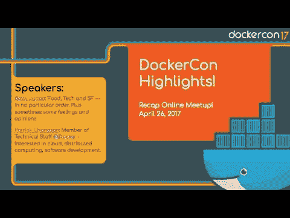T6】](https://www.youtube.com/watch?v=M2aL6IkcgPc)

集装箱性能分析
[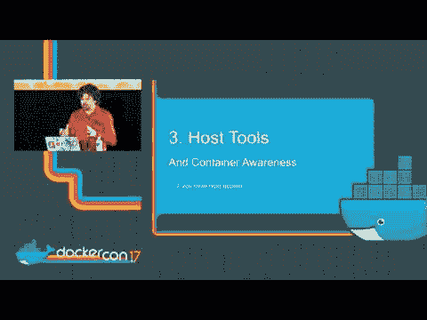](https://www.youtube.com/watch?v=bK9A5ODIgac)

来自 Docker 支持工程师的故障排除提示
[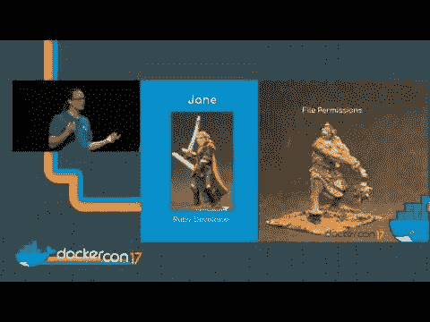](https://www.youtube.com/watch?v=DK1ew1HpmeY)

[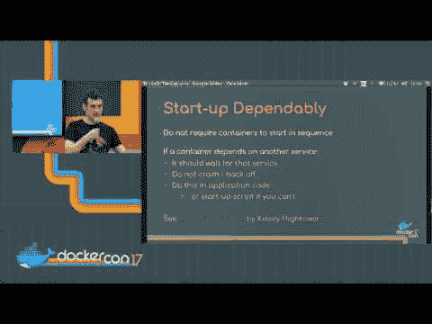](https://www.youtube.com/watch?v=stes90QH754) 军长的诡计

单核技术
[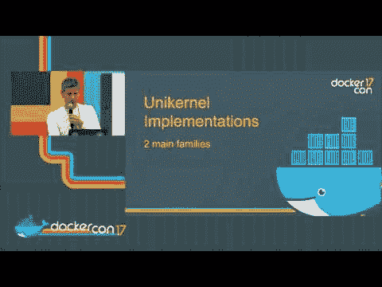](https://www.youtube.com/watch?v=24rvIB4_v4U)

**非技术性**
学会照顾自己
[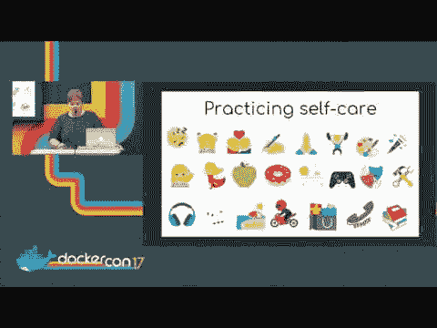](https://www.youtube.com/watch?v=1qthPiP4jEM)

倦怠
[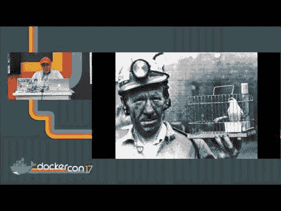](https://www.youtube.com/watch?v=fYkI40AhV7o)

**网络**

Docker 联网:从应用层到数据层
[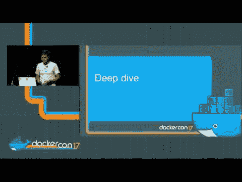](https://www.youtube.com/watch?v=EAQ-vr0XcPc)

深入 Docker 覆盖网络
[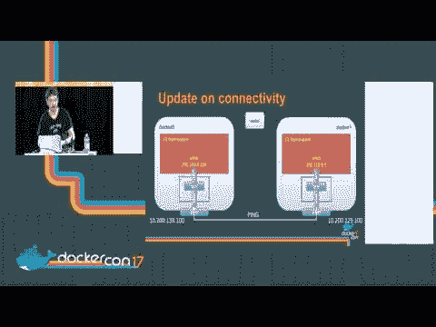](https://www.youtube.com/watch?v=b3XDl0YsVsg)

**安全**

cilium:BPF 和 XDP 的网络和应用安全
[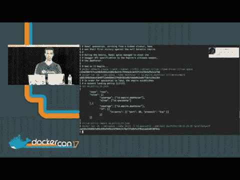](https://www.youtube.com/watch?v=ilKlmTDdFgk)

安全衬底:最低特权容器部署
[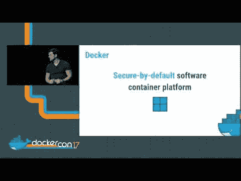](https://www.youtube.com/watch?v=iHQCVFMBdCA)

介绍 Linux 套件
[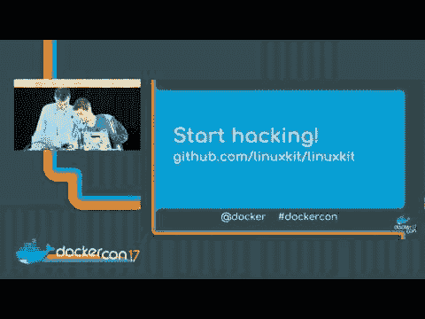](https://www.youtube.com/watch?v=FEtVxwsCUBY)

构建安全 Docker 应用
[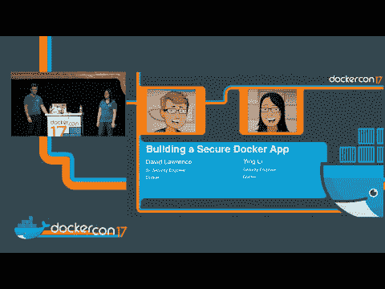](https://www.youtube.com/watch?v=tjxkxVI_PVU)

名称空间最近为您做了什么？
[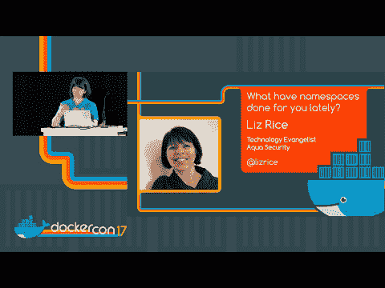T3】](https://www.youtube.com/watch?v=MHv6cWjvQjM)

保护容器，一次一个补丁
[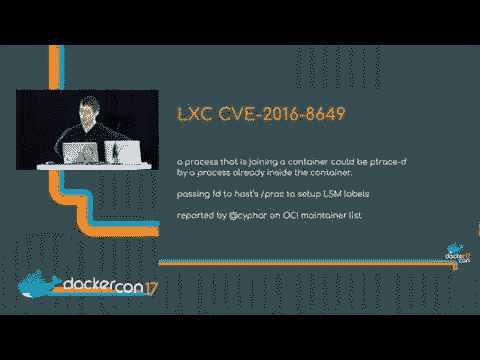](https://www.youtube.com/watch?v=jZSs1RHwcqo)

针对容器环境的扩展应用防御
[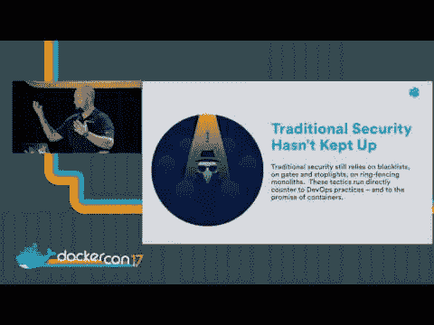](https://www.youtube.com/watch?v=mOXBJLFM65s)

Docker 企业版:为企业构建安全供应链
[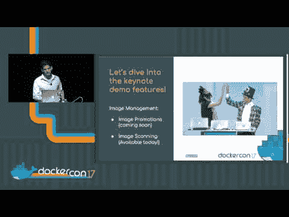](https://www.youtube.com/watch?v=snsO_KoVlIU)

与 TUF 和码头工人
[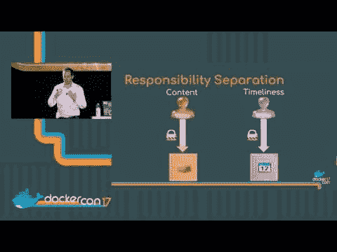](https://www.youtube.com/watch?v=SNge7-t4JRE) 一起保护软件供应链

**值得一读**

[https://blog . docker . com/2017/04/docker con-2017-day-1-highlights/](https://blog.docker.com/2017/04/dockercon-2017-day-1-highlights/)
T3】https://blog . docker . com/2017/04/docker con-2017-day-2-highlights/
[https://blog . docker . com/2017/05/docker con-2017-online-meetup-recap/](https://blog.docker.com/2017/05/dockercon-2017-online-meetup-recap/)