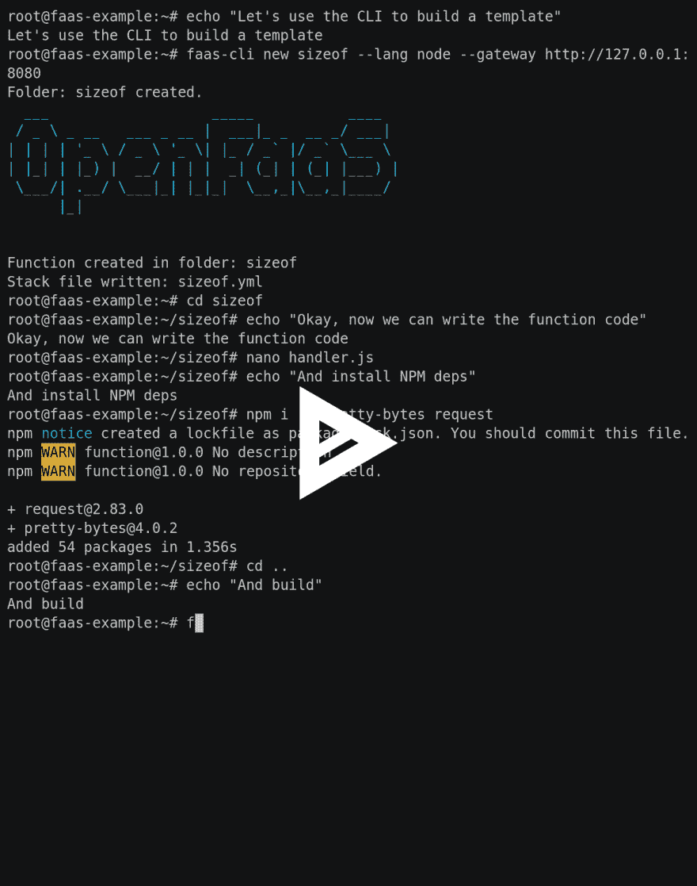
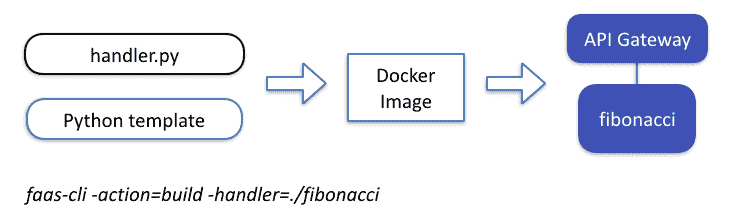
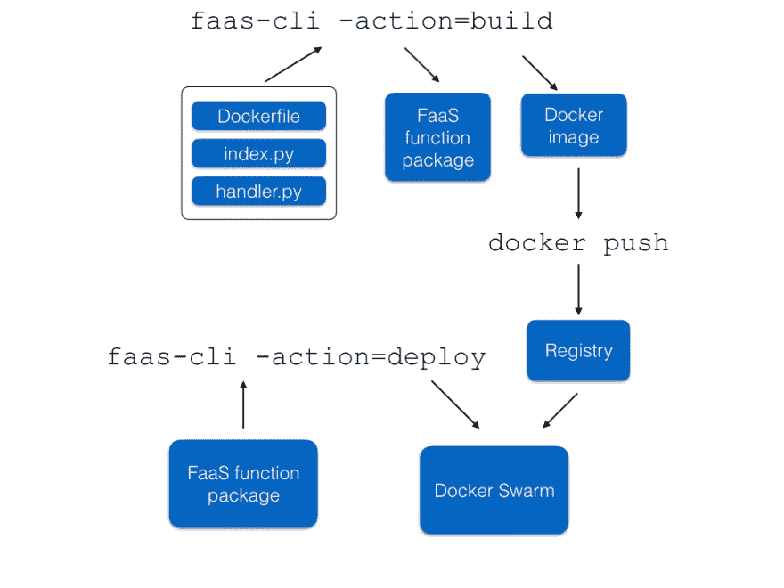
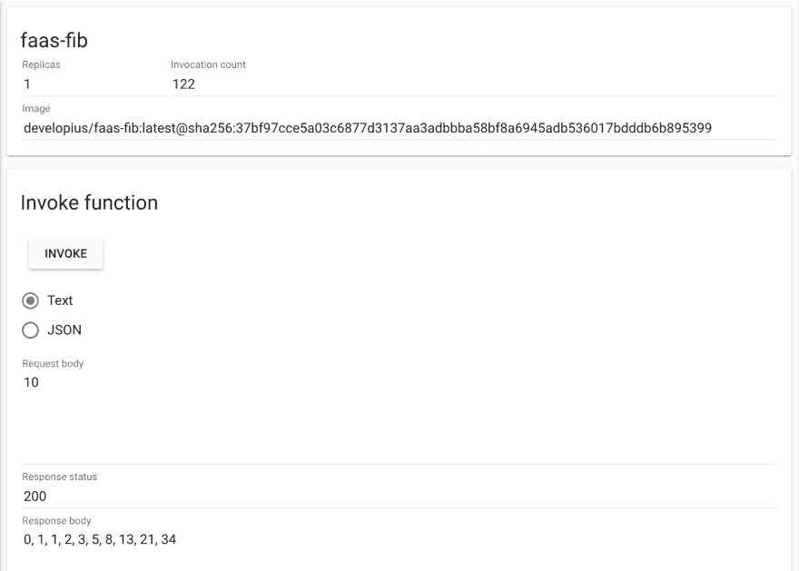
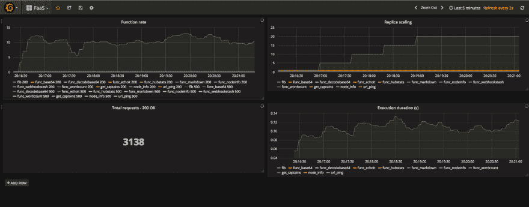

# open FAAS——通过 CLI 向 Docker Swarm 部署无服务器功能

> 原文:[https://dev.to/developius/functions-as-a-service 通过命令行界面将功能部署到码头群](https://dev.to/developius/functions-as-a-service---deploying-functions-to-docker-swarm-via-a-cli)

# OpenFaaS

功能即服务(Functions as a Service)或 OpenFaaS(由 T2 领导)是用 Docker 实现无服务器功能的一种非常好的方式。你可以用任何编程语言构建功能，然后将它们部署到你现有的 Docker Swarm 上。

在本帖中，我们将看看如何使用命令行界面来简化这个过程。

[T2】](https://res.cloudinary.com/practicaldev/image/fetch/s--bfuqUy7h--/c_limit%2Cf_auto%2Cfl_progressive%2Cq_auto%2Cw_880/https://asciinema.org/a/141284.png)

[演示](https://asciinema.org/a/141284)

## OpenFaaS 亮点

*   Docker Swarm 和 Kubernetes 的唯一无服务器框架
*   易于使用-60 秒内完成部署，内置 UI 和 CLI
*   支持 Windows 或 Linux 上任何语言的代码或二进制文件

# 起床跑步

要使用 OpenFaaS 运行功能，首先需要将 OpenFaaS 集群部署到 Docker 集群。这真的很简单，只需按照[部署指南](https://github.com/openfaas/faas/blob/master/guide/deployment_swarm.md)上的步骤操作即可。

# 工作原理

下图概述了 OpenFaaS 功能包、Docker 映像和`faas-cli deploy`命令是如何组合在一起的。

[T2】](https://res.cloudinary.com/practicaldev/image/fetch/s--WQLUYmLJ--/c_limit%2Cf_auto%2Cfl_progressive%2Cq_auto%2Cw_880/https://finnian.io/blog/conteimg/2017/05/Screen-Shot-2017-05-02-at-15.12.45.png)

要在 OpenFaaS 栈上部署一个函数，首先必须编写函数本身。这真的很简单，你可以用 Docker 中运行的任何语言来完成(比如所有语言)。目前，OpenFaaS CLI 支持 Python 和 Node，因此对于这个例子，我们将使用 Python。

我的非常简单的 fib 函数是用 Python 写的:

```
def fib(n):
    if n <= 1: return n
    else: return fib(n-1) + fib(n-2)

def handle(st):
    n = int(st)

    output = []
    for i in range(n):
        output.append(str(fib(i)))
    print(', '.join(output)) 
```

<svg width="20px" height="20px" viewBox="0 0 24 24" class="highlight-action crayons-icon highlight-action--fullscreen-on"><title>Enter fullscreen mode</title></svg> <svg width="20px" height="20px" viewBox="0 0 24 24" class="highlight-action crayons-icon highlight-action--fullscreen-off"><title>Exit fullscreen mode</title></svg>

该代码保存在`sample/fib/handler.py`中。在同一个目录中创建一个`requirements.txt`文件是很重要的(即使你的 Python 代码对 pip 没有要求),因为否则`pip install`会抛出一个错误。

## 构建功能包

[T2】](https://res.cloudinary.com/practicaldev/image/fetch/s--OfEqb4L6--/c_limit%2Cf_auto%2Cfl_progressive%2Cq_auto%2Cw_880/https://finnian.io/blog/conteimg/2017/05/FaaS-function-diagrams.001.jpeg)

FaaS 运行这个函数的方式是在 Python 内部运行这个:

```
from function import handler
handler.handle(stdin) 
```

<svg width="20px" height="20px" viewBox="0 0 24 24" class="highlight-action crayons-icon highlight-action--fullscreen-on"><title>Enter fullscreen mode</title></svg> <svg width="20px" height="20px" viewBox="0 0 24 24" class="highlight-action crayons-icon highlight-action--fullscreen-off"><title>Exit fullscreen mode</title></svg>

当您使用 OpenFaaS CLI 构建一个函数时，它所做的是打包您的函数(`handler.py`)并构建 Docker 运行容器的部分。

最后一步是编写 FaaS 将用来构建和部署函数的`stack.yml`文件。

```
provider:
  name: faas
  gateway: http://localhost:8080 # your faas stack url

functions:
  fib:
    lang: python
    handler: ./sample/fib
    image: developius/func_python-fib 
```

<svg width="20px" height="20px" viewBox="0 0 24 24" class="highlight-action crayons-icon highlight-action--fullscreen-on"><title>Enter fullscreen mode</title></svg> <svg width="20px" height="20px" viewBox="0 0 24 24" class="highlight-action crayons-icon highlight-action--fullscreen-off"><title>Exit fullscreen mode</title></svg>

要构建这个包，只需运行:

```
$ faas-cli  build -f ./stack.yml 
```

<svg width="20px" height="20px" viewBox="0 0 24 24" class="highlight-action crayons-icon highlight-action--fullscreen-on"><title>Enter fullscreen mode</title></svg> <svg width="20px" height="20px" viewBox="0 0 24 24" class="highlight-action crayons-icon highlight-action--fullscreen-off"><title>Exit fullscreen mode</title></svg>

这里是我们的`func_python-fib`函数的一个示例包，位于`faas-cli`的`build`目录中:

```
$ tree build/fib/
build/fib/
├── Dockerfile
├── function │   ├── handler.py         <-- called by index.py
│   └── requirements.txt
├── index.py               <-- Docker runs this
└── requirements.txt

1 directory, 5 files 
```

<svg width="20px" height="20px" viewBox="0 0 24 24" class="highlight-action crayons-icon highlight-action--fullscreen-on"><title>Enter fullscreen mode</title></svg> <svg width="20px" height="20px" viewBox="0 0 24 24" class="highlight-action crayons-icon highlight-action--fullscreen-off"><title>Exit fullscreen mode</title></svg>

这个包包含了让 Docker 运行我们的函数的所有东西- `Dockerfile`、`index.py`和`handler.py`

## 部署功能

现在我们的函数已经构建好了，我们需要部署它。然而，在我们这样做之前，我们必须将我们的功能推送到 hub，这样群中的所有节点都可以访问它。

```
$ docker push developius/func_python-fib 
```

<svg width="20px" height="20px" viewBox="0 0 24 24" class="highlight-action crayons-icon highlight-action--fullscreen-on"><title>Enter fullscreen mode</title></svg> <svg width="20px" height="20px" viewBox="0 0 24 24" class="highlight-action crayons-icon highlight-action--fullscreen-off"><title>Exit fullscreen mode</title></svg>

现在开始部署！这可以用一个命令来完成:

```
$ faas-cli deploy -f ./stack.yml 
```

<svg width="20px" height="20px" viewBox="0 0 24 24" class="highlight-action crayons-icon highlight-action--fullscreen-on"><title>Enter fullscreen mode</title></svg> <svg width="20px" height="20px" viewBox="0 0 24 24" class="highlight-action crayons-icon highlight-action--fullscreen-off"><title>Exit fullscreen mode</title></svg>

当您运行此命令时，该功能将被部署到远程 Docker Swarm。多酷啊。

## 测试

最后要做的是测试您的函数是否部署成功。你可以通过 OpenFaaS UI 或者通过`curl`来实现。

[T2】](https://res.cloudinary.com/practicaldev/image/fetch/s--oxWwWGyQ--/c_limit%2Cf_auto%2Cfl_progressive%2Cq_auto%2Cw_880/https://finnian.io/blog/conteimg/2017/05/Screen-Shot-2017-05-01-at-21.23.26.png)

或者，通过卷曲:

```
$ curl -d "10" http://localhost:8080/function/fib
0, 1, 1, 2, 3, 5, 8, 13, 21, 34 
```

<svg width="20px" height="20px" viewBox="0 0 24 24" class="highlight-action crayons-icon highlight-action--fullscreen-on"><title>Enter fullscreen mode</title></svg> <svg width="20px" height="20px" viewBox="0 0 24 24" class="highlight-action crayons-icon highlight-action--fullscreen-off"><title>Exit fullscreen mode</title></svg>

## 通过自动扩展实现高可用性

FaaS 支持 Docker Swarm 的复制功能，允许直接在 Docker 内部自动扩展功能。OpenFaaS 在内部利用这一点来确保有足够的函数副本来处理请求。它通过导出普罗米修斯的指标来工作，然后在达到阈值时生成警报。当 FaaS 网关收到这些警报时，它将扩展这些功能。

这一点在下面我的 Grafana 仪表盘截图中可以完美的看到。

[T2】](https://res.cloudinary.com/practicaldev/image/fetch/s--LMiIPxNG--/c_limit%2Cf_auto%2Cfl_progressive%2Cq_auto%2Cw_880/https://thepracticaldev.s3.amazonaws.com/i/2qnqpir8d6jc8dwe65zh.png)

## 重述

在这篇文章中，我们看到了如何使用 FaaS 框架来打包和部署一个函数。我们已经了解了如何编写一个函数，如何将它构建到一个函数包中，并将其部署到一个远程 Docker 群。相当不错的东西。

我已经构建了许多其他函数,希望很快能扩展到更多。我编写了一个函数来缩短 URL，使用的是我构建的服务[，它从](https://finnian.io/blog/a-url-shortener-written-in-ten-minutes/) [Richard Gee](https://twitter.com/rgee0) 那里收到了一个 PR，合并到一个 armhf Dockerfile 文件中，用于覆盆子馅饼。这对我来说是一个重要的里程碑，因为我以前从来没有接受过我的项目的公关！

你可以在我的博客[finnian.io/blog](https://finnian.io/blog)上找到更多关于我和 Docker 一起做的项目的信息——包括[我的 DockerCon 2017 年文章](https://finnian.io/blog/dockercon-2017-highlights-and-experiences/)！请随时在推特 [@developius](https://twitter.com/developius) 上联系，我很想听听你下面的想法。

感谢 Alex Ellis 创造了这么棒的工具，我期待着在未来参与 FaaS 的开发。值得注意的是，FaaS 目前被认为是实验性的，但你可以期待更多的语言模板和其他一些简洁的功能。第一...学围棋。🙈