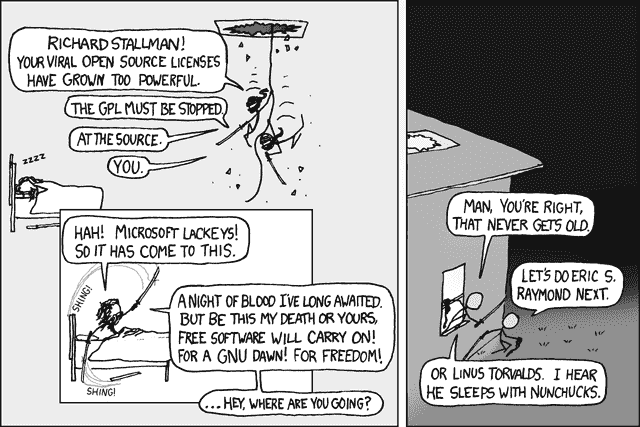
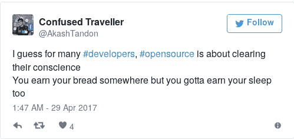
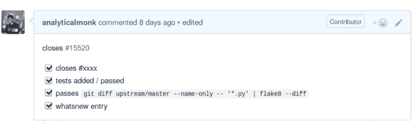
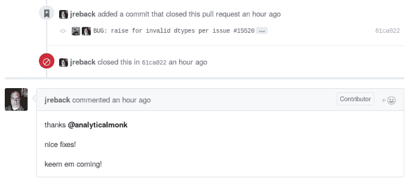

# 开源:痒、拥挤和融合

> 原文:[https://dev . to/analytic monk/open-source-the-itch-the-hustle-and-the-merge](https://dev.to/analyticalmonk/open-source-the-itch-the-hustle-and-the-merge)

*免责声明:在你开始之前，请注意这篇文章可能包含的任何虚构账户的主角都将是男性，并被称为“他”或有时简称为“编码者”。这并不是因为作者是一个性别歧视者(但愿如此)或者是一个懒惰的作家；这是因为作者是男性，被头脑简单的人认为是“编码者”。*

 
[XKCD](https://xkcd.com/225/) :开源

## 背景

在我们真正深入研究之前，有两件事可能是有用的:谁是写这个的疯子，他为什么这么做？

如果你愿意，可以完全跳过这一部分。我不会因此而恨你。或许我会。反正也无所谓，对吧？

 
*Dev 哲学*

在这篇文章中，他是那种[喜欢写代码](http://github.com/analyticalmonk)并且偶尔写[一篇博客](http://techandmortals.wordpress.com/)或者[两篇博客](https://believeinyou21.wordpress.com/)的人。他相信他写的东西，代码或信件，可以产生影响。谁没有呢？

**为什么**他写这个比较重要。直接原因是，他最近[向](https://github.com/pandas-dev/pandas/pull/16047)[一个令人惊叹的图书馆](https://github.com/pandas-dev)捐赠了，对此他感觉非常好，并希望他的同行能更经常地这样做。

一个更深层次的原因仍然是他对自由和开源软件哲学的信仰。这场运动中有不同的阵营。你可以自由地做你的研究并与他们中的一个结盟，或者保持中立。更深层次的哲学辩论不在这篇文章的范围之内。

以下是这场运动的两位代言人的语录。他们有时可能不在同一页上，但他们为这个世界所做的比大多数人所知道的还要多:

[T2】](https://res.cloudinary.com/practicaldev/image/fetch/s--Wx5D58M---/c_limit%2Cf_auto%2Cfl_progressive%2Cq_auto%2Cw_880/https://thepracticaldev.s3.amazonaws.com/i/o2lf0bqz173qpchys82m.jpg)

[T2】](https://res.cloudinary.com/practicaldev/image/fetch/s--TW5QmZLr--/c_limit%2Cf_auto%2Cfl_progressive%2Cq_auto%2Cw_880/https://thepracticaldev.s3.amazonaws.com/i/a09a0gx8duo52vqt44yp.jpg)

莱纳斯喜欢时不时到处乱搞。没有双关的意思。

## 贡献

[T2】](https://res.cloudinary.com/practicaldev/image/fetch/s--y3UDN5KW--/c_limit%2Cf_auto%2Cfl_progressive%2Cq_auto%2Cw_880/https://thepracticaldev.s3.amazonaws.com/i/vmevrqs1z1r5qmqtu0jv.jpg)

*仔细观察*

“每一个伟大的开源贡献都由三部分组成。第一部分叫做“痒”。也许有一个 bug 是在程序员使用一个库时突然出现的，或者也许有一些这个世界需要但还没有实现的特性。更好的是，他只是想“有所贡献”。

第二幕叫做“喧嚣”。程序员穿上袜子，穿上他的 hackathon t 恤，一头扎进源代码和文档中。现在，他正在寻找解决办法……但是他不会找到，至少不会很快找到，因为他当然已经不知所措了。最终，他将编写所需的代码，更新文档并发送一份 PR。世界将会看到他的贡献。嗯，还没有。因为在您的分支中编写代码是不够的。

这就是为什么每一个贡献都有第三步，关键的一步，我们称之为“合并”。"

## 痒

为什么会突然出现瘙痒的原因已经在前面的章节中详细说明了。它可能会在一周或一个月的积累后出现。然而，它也可能在一个阳光明媚的下午，当你蜷缩在装有空调的办公室里，试图为公司“改变世界”的产品实现一个闪亮的新功能时，或者在午夜，当你正在处理第二天早上到期的大学作业时，突然袭击你。

它可能会打击你，因为你想产生影响，或者因为有人告诉你开源可以帮助你获得梦想中的工作。更简单的原因可能是参加会议或者想要让你的 Github 磁贴变绿。

无论你是一个高尚的技术专家还是一个简单的傻瓜，[承诺和推动](http://stackoverflow.com/questions/2745076/what-are-the-differences-between-git-commit-and-git-push)不要评判。[拉请求](https://help.github.com/articles/about-pull-requests/)帮忙。

如果你知道你想要使用的库，你想要修复的 bug 以及你需要的新特性，那就太好了！在本地系统上获取库的源代码和文档。也许[打开一个问题](https://help.github.com/articles/about-issues/)，[提交一个 bug](http://www.softwaretestinghelp.com/how-to-write-good-bug-report/) 或者特性请求。

如果你是一个只想“贡献”却不知道从何开始的人，为自己迈出的第一步感到欣慰。简而言之，你需要关注源代码(库/包)以及你想用它做什么。也许你想[帮助 Mozilla](https://developer.mozilla.org/en-US/docs/Mozilla/Developer_guide/Introduction) 的人们，或者也许你想为谷歌的热门[机器学习库做贡献。](https://github.com/tensorflow/tensorflow/blob/master/CONTRIBUTING.md)

这些链接将帮助你开始挠痒痒:

*   [如何开始使用开源|黑客地球](https://www.hackerearth.com/getstarted-opensource/)
*   我如何开始为开源项目做贡献？| Quora
*   [如何开始为开源| Developer.com 做出贡献](http://www.developer.com/open/how-to-start-contributing-to-open-source.html)

#### 作者之痒

至于作者最近与开源的摩擦，他想为 [Pandas](http://pandas.pydata.org/) 做贡献，这是一个令人惊叹的用于数据分析的 Python 库，他已经使用了一段时间。

他去了熊猫的 GitHub 库，过滤了标签为“难度新手”的未决问题，并在[发现了一个似乎很有趣的 bug](https://github.com/pandas-dev/pandas/issues/15520) 。

## 奔忙

您已经完成了对更高层次细节的搜索和决策。你知道该为哪个项目做贡献，该解决什么 bug 实现什么特性。

系好安全带，因为你才刚刚开始。在操作系统项目中，大量的代码或大量的文档往往不是你的第一个障碍。不过，建立项目或构建项目并运行测试可能是一件非常痛苦的事情。在基于 UNIX 的系统(Linux 或 Mac-OS)上，熟练使用命令行将会非常方便。抱歉，Windows 用户，事情就是这样！

你在开发开源软件时会用到的最重要的工具是 [git](https://git-scm.com/) ，一个用于[版本控制](https://en.wikipedia.org/wiki/Version_control)的工具。版本控制使多个开发人员，有时是数百或数千人，能够在同一个代码库上一起工作。如果你还没有，[学习 git](https://try.github.io/levels/1/challenges/1) 。

既然已经提到了测试，你必须知道这一点:它们很重要！事实上，测试是任何规模合理的软件项目的最重要的组成部分之一。这么想吧。在缺乏可靠测试的情况下，无论何时我们做出改变，都可能会破坏旧的特性。开发人员会继续修复本来可以很容易避免的错误，最终会彻底放弃。许多流行的操作系统项目使用一种[测试驱动开发(TDD)](https://en.wikipedia.org/wiki/Test-driven_development) 风格和[持续集成(CI)](https://www.thoughtworks.com/continuous-integration) 。阅读关于你选择的语言的 CI 和测试框架。

艰苦的工作已经完成，项目已经在你的机器上建立。确保你通读了项目的开发者文档([例子](http://docs.python-requests.org/en/master/dev/contributing/))。一旦完成，我们就可以开始写代码了！

编码可能需要时间，但原则上很简单。如果需要，编写测试和所需的代码。

至此，代码已经写好了。是时候打开一个拉动请求，并开始朝着第三幕努力了。

#### 作者的奔忙

在识别出错误后，他[分叉](https://help.github.com/articles/fork-a-repo/)熊猫回购，[在他的本地机器上克隆了](https://help.github.com/articles/cloning-a-repository/)。他浏览了[“为熊猫做贡献”](http://pandas.pydata.org/pandas-docs/stable/contributing.html)文档，这些文档详细说明了如何处理代码库，安装了依赖项，[创建了一个新的分支](https://www.atlassian.com/git/tutorials/using-branches)，编写了所需的测试和代码，推送到 Github 上的分支，打开了一个 Pull 请求，等待维护人员审查他的 PR。

## 合并

有时，这将是一个平稳的旅程。你会正确地做好每一件事，你的公关会毫不费力地被合并。很多时候，情况并非如此；尤其是当你开始的时候。

如果项目使用 CI，您将必须确保所需的测试和检查通过。如果你所做的改变没有达到标准，那些审查 PR 的人会告诉你要做什么改变。这可能会发生多次，但一旦必要的工作完成，你的努力就会得到回报，你的公关也会得到批准。

这将是你们一直期待的时刻。你的贡献将被合并到项目中。万岁！

#### 作者的合并

打开后，必须对他的 PR 进行多次更改。通过所有的检查需要重复前面描述的过程。然后他被维护者要求增加一些测试以确保安全，因为涉及到一个棘手的案例。在公开公关一周后，它得到了批准，修改得到了合并，作者那天晚上睡得很安稳。

[T2】](https://res.cloudinary.com/practicaldev/image/fetch/s--ksaqebur--/c_limit%2Cf_auto%2Cfl_progressive%2Cq_auto%2Cw_880/https://thepracticaldev.s3.amazonaws.com/i/buhusnf3u7cxhv2g6lxc.png)

*合并:发起*

[T2】](https://res.cloudinary.com/practicaldev/image/fetch/s--6zg7nwoP--/c_limit%2Cf_auto%2Cfl_progressive%2Cq_auto%2Cw_880/https://thepracticaldev.s3.amazonaws.com/i/pzl35u0kqc4pz69idn6y.png)

*合并:结论*

#### 后记

此时你可能会感到不知所措，但没关系。有大量的信息需要处理，开源可能看起来工作量很大。但是伟大的软件就是这样构建的。此外，这是一个通过你的代码产生影响并在这个过程中结识优秀的人的好方法。坚持住，你会过得很开心的，伙计。

可以在 [Github](https://github.com/analyticalmonk) 上关注我的作品。

如果你阅读并喜欢这篇文章，分享它将是一个很好的下一步。

给我发一封邮件，或者在 T2 的推特或 T4 的 Quora 上联系我，如果你想联系我的话。