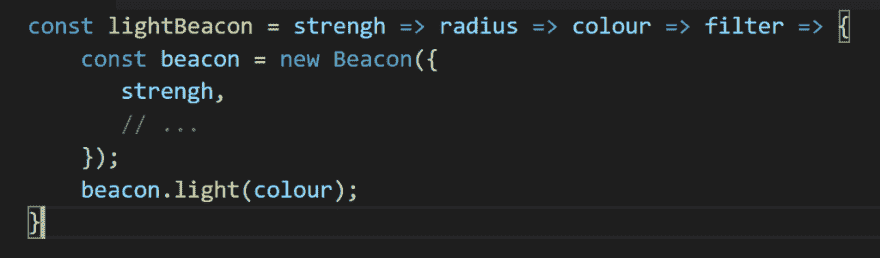

# Javascript 中的 Currying 箭头函数序列

> 原文:[https://dev . to/haro uni/currying-in-JavaScript-arrow-function-sequence-142 c](https://dev.to/harouny/currying-in-javascript-arrow-function-sequence-142c)

### 逢迎

> 在数学和计算机科学中，currying 是一种将带有多个参数(或一组参数)的函数的求值转化为一系列函数的求值的技术，每个函数只有一个参数。
> 
> (来源[维基百科](https://en.wikipedia.org/wiki/Currying)

### 开场白

下一次当您阅读包含如下代码片段中的箭头函数序列的代码时，不要惊慌。你并不孤单！

[T2】](https://res.cloudinary.com/practicaldev/image/fetch/s--7F18Q1KC--/c_limit%2Cf_auto%2Cfl_progressive%2Cq_auto%2Cw_880/https://cdn-images-1.medium.com/max/1024/1%2AGmrfdnPto-sfkpUQWL_BRQ.png)

是的，拥有一系列或一串箭头函数起初很难读懂，但它变得越来越流行是有原因的(例如 check out[Redux applyMiddleware](http://redux.js.org/docs/api/applyMiddleware.html)),因为它允许函数风格的优点，比如将简化的函数传递给 map/reduce 函数。让我们来看看这个意思，以及我们可以如何阅读它。

### 什么叫阿谀奉承

以下面简单的 *sum* 函数为例。它接受三个数字参数并返回总和。