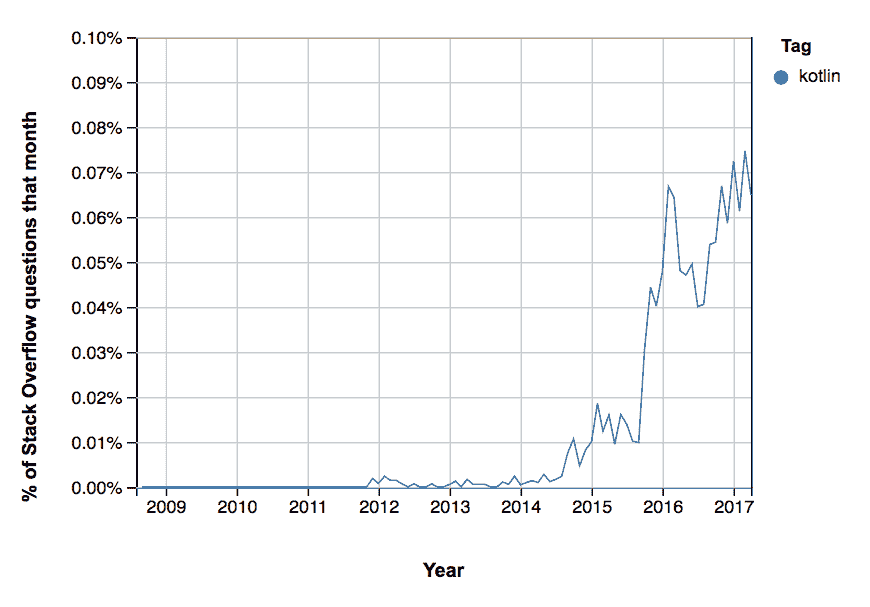
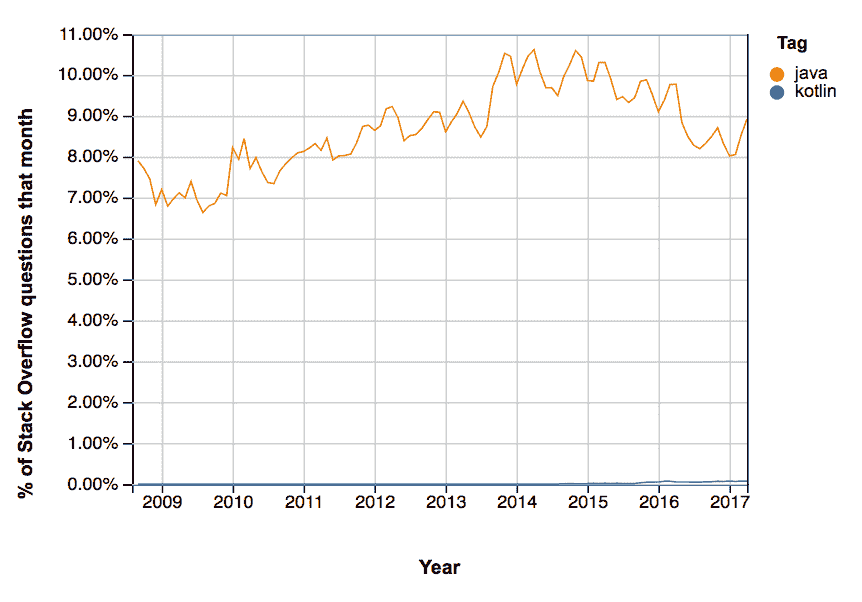

# 谷歌宣布在 Android 上支持 Kotlin，现在怎么办？

> 原文:[https://dev . to/walker/Google-announces-support-for-kotlin-on-Android-now-what](https://dev.to/walker/google-announces-support-for-kotlin-on-android-now-what)

在湾区举行的年度 I/O 会议上，谷歌今天下午宣布，Android 现在将支持科特林语言。软件公司 JetBrains 在 2011 年发布的 Kotlin 是一种相对较新的语言，在开发人员中越来越受欢迎。

液体错误:内部

科技领域的许多人认为，支持科特林是谷歌合乎逻辑的下一步。该语言可与 Java 互操作，允许开发人员在编写代码时混合使用这两种语言，并且已经拥有大批忠实用户，他们欣赏它的现代特性和简洁的语法。栈溢出中“Kotlin”标记出现率的快速上升提供了该语言发展的进一步证据:

[T2】](https://res.cloudinary.com/practicaldev/image/fetch/s--Pl1XPCcA--/c_limit%2Cf_auto%2Cfl_progressive%2Cq_auto%2Cw_880/https://thepracticaldev.s3.amazonaws.com/i/xyf0igj1fn4r40fap73a.png)

当然，Java 在绝对受欢迎程度上仍然让 Kotlin 相形见绌。

[T2】](https://res.cloudinary.com/practicaldev/image/fetch/s--etJBaEla--/c_limit%2Cf_auto%2Cfl_progressive%2Cq_auto%2Cw_880/https://thepracticaldev.s3.amazonaws.com/i/gwbmf5vf7lc5sz5rpj6c.png)

JetBrains 在他们自己的博客上宣布了这一消息，称这是“一个使用现代强大语言的机会，有助于解决常见的头痛问题，如运行时异常和源代码冗长。”

到目前为止，这份公告反应良好。黑客新闻帖子中的评论者预计“良好的 Kotlin 原生体验”帖子表达了对使用“Java 生态系统而不必实际编写 Java”的机会的兴奋

原生支持 Kotlin 的举动与苹果发布 Swift 编程语言有很多相似之处，以提升苹果的开发体验。虽然这一举动有不同的反响，因为 Kotlin 不是由谷歌开发的，但它应该给他们的开发人员社区带来一股新鲜空气。

人们不得不怀疑谷歌与甲骨文在使用某些 Java APIs 上的法律纠纷。

> K👓@ k4y1s[@ ThePracticalDev](https://twitter.com/ThePracticalDev)lol，这是因为 oft 与甲骨文的牛肉吗？:D2017 年 5 月 17 日下午 18:40

## 那么现在呢？

有很多很好的理由让 Kotlin 成为你学习的下一门编程语言，但是从哪里开始呢？自然，这不是第一个 [dev.to](https://dev.to/) 听说 Kotlin 的人。格雷厄姆·考克斯在年初为这种语言做了担保:

 [## 为什么我更喜欢科特林

### 格雷厄姆考克斯 1 月 2 日 172 分钟阅读

#100daysofcode #kotlin #java](/grahamcox82/why-i-prefer-kotlin)

后来，Daniele Botillo 带我们看了一些基本的例子:

 [## Kotlin 示例:类和属性

### 丹尼尔·博蒂洛 2 月 21 日 173 分钟阅读

#android #kotlin #java](/dbottillo/kotlin-by-examples-class-and-properties)

哈迪·哈里(Hadi Hari)出现在《软件工程日报》的一个很棒的剧集中，讨论科特林。我强烈推荐它深入探究 Kotlin 的起源，以及为什么一个公司会首先开发一种新语言。

 [# 科特林与哈迪·哈里里](/sedaily/kotlin-with-hadi-hariri)  [## 软件工程日报](/sedaily)   

<audio id="audio" data-episode="kotlin-with-hadi-hariri" data-podcast="sedaily"><source src="https://traffic.libsyn.com/sedaily/kotlin_edited.mp3" type="audio/mpeg"> Your browser does not support the audio element.</audio>

           <input type="range" name="points" id="volumeslider" value="50" min="0" max="100" data-show-value="true">      1x  initializing... × 

有没有在科特林有经验的开发人员？在评论里留下你的想法吧！